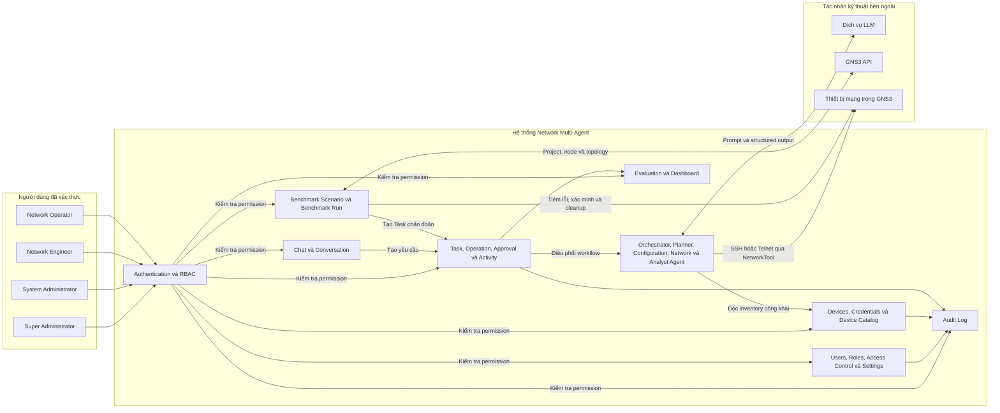
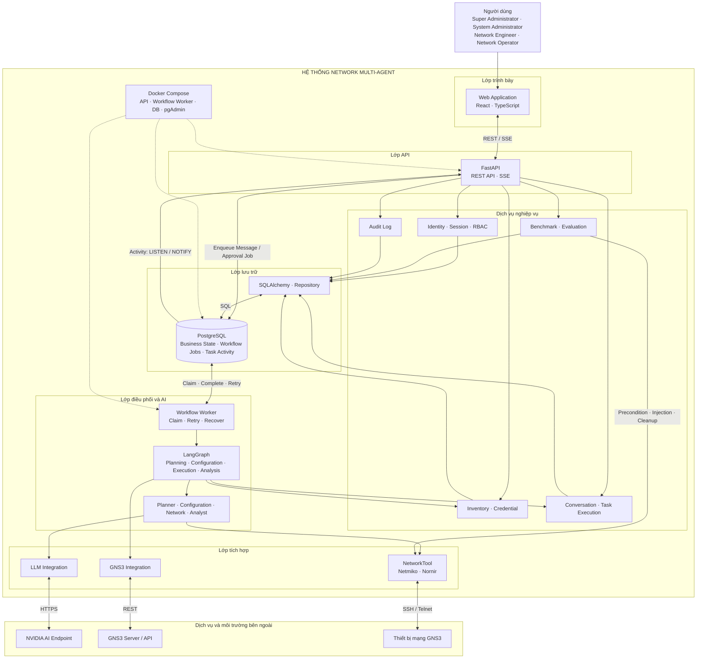
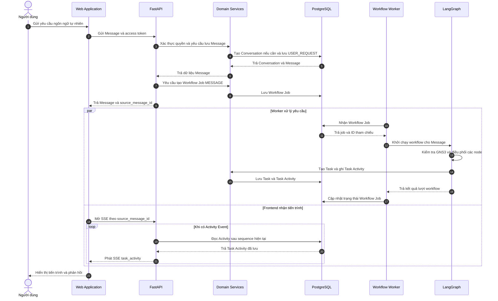
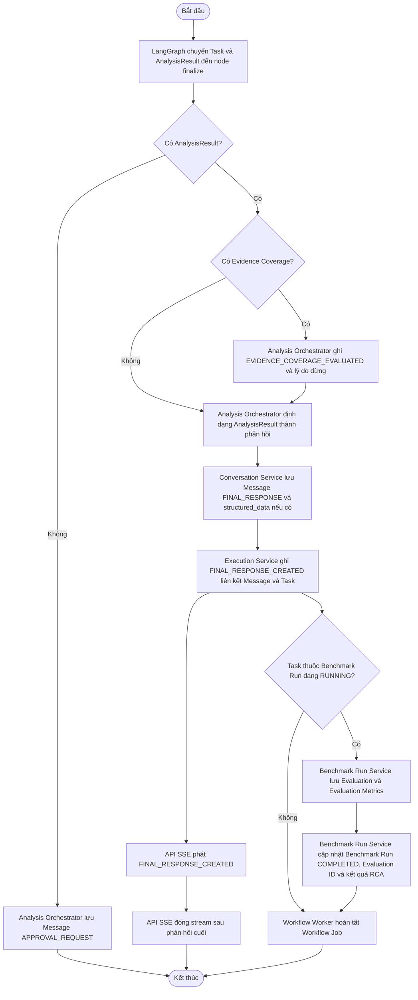
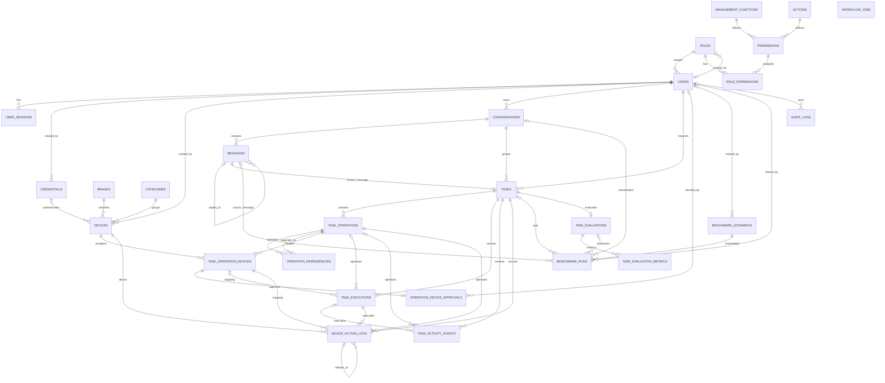
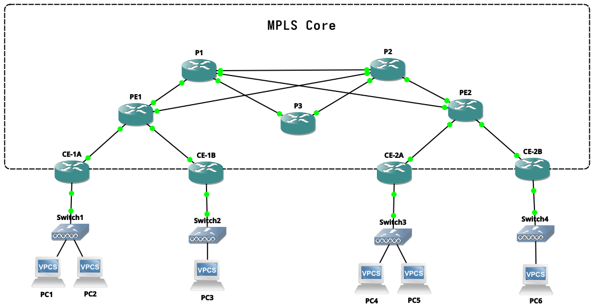

# BÁO CÁO MÔN HỌC – ĐỒ ÁN CHUYÊN NGÀNH

## NGHIÊN CỨU VÀ XÂY DỰNG HỆ THỐNG MULTI-AGENT HỖ TRỢ CẤU HÌNH VÀ XỬ LÝ SỰ CỐ MẠNG

**Trường:** Đại học Sài Gòn — Chuyên ngành Kỹ thuật máy tính  
**Nhóm sinh viên:** Phạm Đăng Minh Khang; Phạm Đình Duy Thái; Triệu Phú Quân  
**Phạm vi đối chiếu:** mã nguồn nhánh `develop` của backend (commit `5e9f0815a0`, 18/11/2026) và frontend (commit `d96e94f197`, 19/11/2026). Dữ liệu benchmark lịch sử trong Chương 4 chưa được chạy lại trên các commit này.

### TÓM TẮT ĐỀ TÀI

Đề tài “Nghiên cứu và xây dựng hệ thống Multi-Agent hỗ trợ cấu hình và xử lý sự cố mạng” nhằm nghiên cứu và ứng dụng mô hình ngôn ngữ lớn (Large Language Model) kết hợp kiến trúc đa tác nhân (Multi-Agent System) trong tự động hóa quản trị mạng.

Hệ thống được thiết kế với bốn tác nhân chuyên trách: Planner Agent phân tích yêu cầu và lập kế hoạch nghiệp vụ; Configuration Agent chuyển yêu cầu thay đổi thành câu lệnh CLI; Network Agent thực thi các tác vụ đã được kiểm soát trên thiết bị mạng; Analyst Agent phân tích bằng chứng và hỗ trợ xác định nguyên nhân sự cố. Quá trình phối hợp được điều phối thông qua LangGraph, kết hợp Netmiko và Nornir để tương tác với thiết bị trong môi trường giả lập GNS3. Đồng thời, cơ chế phê duyệt Human-in-the-loop được tích hợp nhằm kiểm soát các thao tác thay đổi cấu hình.

Đề tài xây dựng bộ kịch bản thực nghiệm để đánh giá tỷ lệ hoàn thành nhiệm vụ, khả năng xác định nguyên nhân gốc và thời gian thực thi. Kết quả nghiên cứu góp phần làm rõ khả năng ứng dụng kiến trúc Multi-Agent trong hỗ trợ quản trị mạng, đồng thời tạo cơ sở cho việc tiếp tục hoàn thiện hệ thống.

# MỞ ĐẦU

## Lý do chọn đề tài

Trong những năm gần đây, sự phát triển của các hệ thống mạng về quy mô, số lượng thiết bị, giao thức và dịch vụ đã làm gia tăng mức độ phức tạp của công tác quản trị và vận hành mạng. Bên cạnh các thiết bị mạng truyền thống, việc ứng dụng công nghệ ảo hóa và các kiến trúc mạng hiện đại đặt ra yêu cầu ngày càng cao đối với khả năng cấu hình, giám sát và xử lý sự cố. Trong thực tế, quản trị viên thường phải thực hiện nhiều công việc liên tiếp như kiểm tra trạng thái thiết bị, thu thập thông tin vận hành, phân tích nguyên nhân sự cố, lựa chọn phương án khắc phục và xác minh kết quả. Những công việc này đòi hỏi kiến thức chuyên môn, kinh nghiệm và có thể tiêu tốn nhiều thời gian, đặc biệt trong các môi trường mạng có nhiều thiết bị và cấu hình phức tạp [1], [8].

Trước những thách thức đó, các phương pháp ứng dụng trí tuệ nhân tạo trong quản lý và vận hành mạng đã nhận được nhiều sự quan tâm. Đặc biệt, sự phát triển của mô hình Large Language Model (LLM) mở ra khả năng hỗ trợ quản trị mạng thông qua giao tiếp bằng ngôn ngữ tự nhiên. Khác với nhiều phương pháp Machine Learning truyền thống được phát triển cho các nhiệm vụ cụ thể, LLM có khả năng xử lý và kết hợp các nguồn thông tin dạng văn bản như tài liệu kỹ thuật, tệp cấu hình, nhật ký hệ thống và kết quả thực thi lệnh. Theo khảo sát của Hong và cộng sự [1], LLM có thể được ứng dụng trong nhiều nhiệm vụ quản lý mạng, bao gồm thiết kế mạng, cấu hình, quản lý sự cố, bảo mật và điều phối hoạt động mạng.

Tuy nhiên, việc ứng dụng LLM vào các tác vụ cấu hình và xử lý sự cố mạng vẫn tồn tại những thách thức về độ tin cậy và an toàn. Một trong những hạn chế đáng chú ý là hiện tượng hallucination, khi mô hình có thể đưa ra thông tin hoặc đề xuất cấu hình không chính xác. Trong môi trường mạng, việc thực thi những thay đổi không phù hợp có thể ảnh hưởng đến khả năng kết nối và hoạt động của các thiết bị. Vì vậy, các hệ thống tự động hóa dựa trên LLM cần có cơ chế kiểm tra tính hợp lệ của hành động, xác minh trạng thái mạng và kiểm soát quá trình thực thi [1], [2].

Các nghiên cứu gần đây đã tiếp cận vấn đề này theo những hướng khác nhau. LLM-NetCFG [2] nghiên cứu khả năng chuyển yêu cầu bằng ngôn ngữ tự nhiên thành cấu hình mạng và thực hiện xác minh cấu hình. NetConfArena [5] đề xuất môi trường đánh giá cho AI Agent trong bài toán cấu hình mạng theo cơ chế tương tác vòng kín, trong đó agent có thể quan sát trạng thái, thực hiện hành động và kiểm tra kết quả. Trong lĩnh vực xử lý sự cố mạng, NIKA [3] cung cấp môi trường đánh giá khả năng phát hiện, định vị và xác định nguyên nhân gốc của sự cố. Bên cạnh đó, NETARENA [4] nhấn mạnh sự cần thiết của việc đánh giá AI Agent dựa trên tính đúng đắn, độ an toàn và thời gian thực thi.

Một hướng tiếp cận khác là kiến trúc hệ thống đa tác tử (Multi-Agent System), trong đó các nhiệm vụ phức tạp được phân chia cho những agent có vai trò chuyên biệt. OpsAgent [6] là một ví dụ về việc ứng dụng Multi-Agent trong quản lý sự cố của hệ thống microservice, sử dụng cơ chế điều phối và kiểm tra chéo giữa các agent nhằm hỗ trợ quá trình phân tích nguyên nhân sự cố. Cách tiếp cận này cung cấp cơ sở tham khảo cho việc phân chia trách nhiệm và tổ chức phối hợp giữa các thành phần trong hệ thống quản trị mạng.

Trên cơ sở các nghiên cứu đã khảo sát, đề tài lựa chọn nghiên cứu khả năng tổ chức và phối hợp nhiều AI Agent trong một hệ thống hỗ trợ cấu hình, chẩn đoán và khắc phục sự cố mạng. Trọng tâm của đề tài là thiết kế kiến trúc Multi-Agent với các chức năng chuyên biệt, xây dựng cơ chế điều phối và tích hợp các công cụ cho phép hệ thống tương tác với thiết bị mạng trong môi trường mô phỏng.

Xuất phát từ những vấn đề trên, đề tài “Nghiên cứu và xây dựng hệ thống Multi-Agent hỗ trợ cấu hình và xử lý sự cố mạng” được lựa chọn nhằm nghiên cứu, thiết kế và xây dựng một hệ thống hỗ trợ quản trị viên thực hiện các tác vụ cấu hình, chẩn đoán và khắc phục sự cố mạng thông qua giao tiếp ngôn ngữ tự nhiên. Hệ thống được triển khai và đánh giá trong môi trường mạng mô phỏng, tập trung vào khả năng thực hiện nhiệm vụ, độ chính xác trong chẩn đoán, hiệu quả khắc phục sự cố và tính an toàn của các hành động cấu hình.

## Mục đích và nhiệm vụ nghiên cứu

### Mục đích nghiên cứu

Mục đích của đề tài là nghiên cứu, thiết kế và xây dựng một hệ thống đa tác tử (Multi-Agent System) ứng dụng mô hình ngôn ngữ lớn nhằm hỗ trợ quản trị viên mạng thực hiện các tác vụ cấu hình thiết bị, chẩn đoán và khắc phục sự cố thông qua giao tiếp bằng ngôn ngữ tự nhiên.

Hệ thống tập trung vào việc phân chia các chức năng quản trị mạng thành những agent chuyên trách, xây dựng cơ chế điều phối và phối hợp giữa các agent, đồng thời tích hợp các công cụ tự động hóa nhằm cho phép hệ thống tương tác với thiết bị mạng trong môi trường mô phỏng.

Bên cạnh đó, đề tài nghiên cứu các phương pháp kiểm tra và kiểm soát hành động cấu hình do hệ thống đề xuất, kết hợp cơ chế Human-in-the-loop để quản trị viên có thể xem xét và xác nhận trước khi thực hiện thay đổi trên thiết bị.

### Nhiệm vụ nghiên cứu

Khảo sát và phân tích các nghiên cứu liên quan đến ứng dụng Large Language Models, AI Agent, Multi-Agent System, Network Configuration Automation và Network Troubleshooting nhằm xác định hướng tiếp cận phù hợp.

Thiết kế kiến trúc Multi-Agent bao gồm các thành phần đảm nhiệm các chức năng chuyên biệt gồm tiếp nhận và điều phối yêu cầu, thu thập thông tin mạng, chẩn đoán sự cố, cấu hình và khắc phục, kiểm chứng kết quả.

Xây dựng cơ chế tương tác với các thiết bị mạng trong môi trường ảo hóa GNS3 thông qua giao diện dòng lệnh và các công cụ tự động hóa.

Áp dụng cơ chế Human-in-the-loop kết hợp với các bước kiểm tra tính hợp lệ của đề xuất cấu hình nhằm hỗ trợ kiểm soát những thay đổi được thực hiện.

Xây dựng tập kịch bản thực nghiệm có trạng thái ban đầu, yêu cầu nhiệm vụ, nguyên nhân sự cố, trạng thái cấu hình mục tiêu và các điều kiện kiểm chứng được xác định trước, nhằm phục vụ quá trình đánh giá hiệu quả của hệ thống.

Đánh giá thực nghiệm bằng các chỉ số đã triển khai gồm Task Success Rate, Detection Score, các chỉ số Precision/Recall/F1 cho Localization, Fault Type và RCA, Active Workflow Latency và Interaction Turns; đồng thời xác định Remediation Success Rate và Safety là các tiêu chí cần hoàn thiện bộ chấm trong giai đoạn tiếp theo.

## Đối tượng và phạm vi nghiên cứu

### Khách thể nghiên cứu

Khách thể nghiên cứu là các quy trình quản trị và vận hành hệ thống mạng quy mô nhỏ và vừa, bao gồm việc cấu hình thiết bị, kiểm tra trạng thái mạng, chẩn đoán nguyên nhân sự cố và thực hiện các biện pháp khắc phục.

### Đối tượng nghiên cứu

Đối tượng nghiên cứu của đề tài là kiến trúc hệ thống Multi-Agent ứng dụng mô hình ngôn ngữ lớn trong các tác vụ cấu hình, chẩn đoán và khắc phục sự cố mạng. Nghiên cứu tập trung vào phương pháp phân chia chức năng giữa các agent, cơ chế điều phối và trao đổi thông tin, phương pháp tương tác với thiết bị mạng và các cơ chế kiểm soát hành động cấu hình nhằm hỗ trợ quá trình quản trị mạng.

### Phạm vi nghiên cứu

Về không gian: Đề tài được triển khai và thử nghiệm trong môi trường mô phỏng mạng, sử dụng các thiết bị ảo hóa. Việc thực nghiệm không được thực hiện trực tiếp trên hệ thống mạng production nhằm đảm bảo tính kiểm soát và khả năng tái lập các kịch bản.

Về nội dung: đề tài giới hạn ở các sự cố mạng phổ biến tại tầng Data Link và Network trong mô hình OSI. Các tác vụ được triển khai gồm cấu hình địa chỉ IP, thay đổi trạng thái interface, cấu hình định tuyến và một số chức năng giao thức mạng trong môi trường thực nghiệm. Bộ kịch bản bao gồm interface bị shutdown, sai địa chỉ IP hoặc subnet mask, thiếu hoặc sai thông tin OSPF, OSPF area mismatch, MPLS bị vô hiệu hóa trên interface, eBGP neighbor bị shutdown, ACL chặn kết nối và một số trường hợp mất kết nối do cấu hình không phù hợp.

Về công nghệ AI: Đề tài sử dụng mô hình LLM đã được phát triển sẵn để xây dựng các AI Agent. Trọng tâm là thiết kế kiến trúc hệ thống, cơ chế phối hợp và khả năng sử dụng các công cụ tương tác với thiết bị mạng, không nghiên cứu huấn luyện một LLM mới.

## Ý nghĩa khoa học và ý nghĩa thực tiễn

### Ý nghĩa khoa học

Đề tài góp phần nghiên cứu và làm rõ khả năng ứng dụng kiến trúc Multi-Agent trong lĩnh vực quản trị mạng, đặc biệt đối với các nhiệm vụ cấu hình thiết bị, chẩn đoán nguyên nhân và hỗ trợ xử lý sự cố mạng. Thông qua việc xây dựng và đánh giá một hệ thống thực nghiệm, đề tài cung cấp thêm cơ sở tham khảo về cách tổ chức và vận hành các AI Agent trong môi trường mạng có những yêu cầu kỹ thuật và điều kiện kiểm soát cụ thể.

Thông qua quá trình phân tích, thiết kế và triển khai hệ thống, đề tài khảo sát phương pháp phân chia các chức năng quản trị mạng thành những nhiệm vụ chuyên biệt do từng AI Agent đảm nhiệm. Đồng thời, nghiên cứu xem xét cơ chế điều phối, trao đổi thông tin và phối hợp thực hiện nhiệm vụ giữa các Agent, cũng như phương pháp tích hợp mô hình ngôn ngữ lớn với những công cụ quản trị mạng nhằm hình thành một quy trình xử lý thống nhất.

Bên cạnh đó, đề tài nghiên cứu việc kết hợp các phương pháp kiểm tra tính hợp lệ, kiểm chứng kết quả và cơ chế Human-in-the-loop trong quá trình thực thi những đề xuất cấu hình do LLM tạo ra. Việc tích hợp các cơ chế này nhằm làm rõ vai trò của hoạt động kiểm soát và phê duyệt trong hệ thống tự động hóa mạng có sử dụng AI, đặc biệt đối với những thao tác có khả năng ảnh hưởng đến trạng thái hoạt động của thiết bị.

Kết quả thực nghiệm của đề tài được kỳ vọng cung cấp thêm thông tin về khả năng thực hiện nhiệm vụ, độ chính xác trong chẩn đoán, hiệu quả xử lý sự cố và mức độ tuân thủ các điều kiện an toàn của hệ thống Multi-Agent. Những kết quả này có thể được sử dụng làm cơ sở tham khảo cho các nghiên cứu tiếp theo về ứng dụng AI Agent trong tự động hóa quản trị và vận hành hệ thống mạng.

### Ý nghĩa thực tiễn

Về mặt thực tiễn, hệ thống được xây dựng hướng đến việc hỗ trợ quản trị viên mạng trong quá trình thực hiện các tác vụ cấu hình, giám sát trạng thái và xử lý sự cố thông qua giao tiếp bằng ngôn ngữ tự nhiên. Thay vì phải trực tiếp thực hiện toàn bộ các thao tác bằng dòng lệnh, người quản trị có thể mô tả yêu cầu để hệ thống phân tích, đề xuất phương án và hỗ trợ thực hiện theo quy trình được kiểm soát.

Việc tổ chức các chức năng thành những AI Agent chuyên trách tạo điều kiện phân tách nhiệm vụ và quản lý từng giai đoạn xử lý một cách rõ ràng. Cách tiếp cận này có thể hỗ trợ quá trình bảo trì, mở rộng và tích hợp thêm các chức năng quản trị mạng trong tương lai, đồng thời tạo thuận lợi cho việc theo dõi kết quả thực hiện và xác định trách nhiệm của từng thành phần trong hệ thống.

Thông qua việc tích hợp các công cụ tự động hóa với cơ chế xác nhận trước khi thực thi, hệ thống hướng đến giảm bớt những thao tác cấu hình thủ công có tính lặp lại và hỗ trợ kiểm soát các thay đổi trên thiết bị mạng. Các bước kiểm tra và phê duyệt được thiết kế nhằm giúp quản trị viên xem xét phương án xử lý trước khi áp dụng, qua đó góp phần hạn chế những rủi ro phát sinh từ cấu hình không phù hợp.

Kết quả nghiên cứu và triển khai có thể được sử dụng làm tài liệu tham khảo cho việc phát triển các hệ thống hỗ trợ quản trị mạng trong môi trường phòng thí nghiệm, phục vụ hoạt động đào tạo và nghiên cứu về AI Agent, Multi-Agent System và Network Automation. Đồng thời, hệ thống thực nghiệm có thể làm nền tảng để tiếp tục nghiên cứu khả năng mở rộng và ứng dụng trong những môi trường mạng có yêu cầu vận hành phức tạp hơn.

---

# CHƯƠNG 1. GIỚI THIỆU VÀ TỔNG QUAN TÌNH HÌNH NGHIÊN CỨU

## 1.1. Bài toán quản trị và tự động hóa mạng hiện nay

Hạ tầng mạng máy tính hiện nay ngày càng phát triển về quy mô và mức độ phức tạp, với sự kết hợp của nhiều loại thiết bị, giao thức truyền thông và công nghệ mạng khác nhau. Trong quá trình vận hành, quản trị viên phải thực hiện nhiều nhiệm vụ như cấu hình địa chỉ IP, thiết lập giao thức định tuyến, quản lý VLAN, giám sát trạng thái thiết bị và xử lý các sự cố kết nối. Những nhiệm vụ này thường có mối quan hệ phụ thuộc lẫn nhau, khiến một thay đổi cấu hình trên thiết bị có thể ảnh hưởng đến hoạt động của nhiều thành phần trong hệ thống. Theo Sidhu và Sharma [17], các phương pháp quản trị mạng truyền thống đang dần bộc lộ những hạn chế về khả năng mở rộng, tính linh hoạt và hiệu quả vận hành trước sự gia tăng về quy mô và độ phức tạp của hạ tầng mạng hiện đại.

Trong phương pháp quản trị thủ công, người vận hành thường phải truy cập trực tiếp vào từng thiết bị thông qua giao diện dòng lệnh để kiểm tra trạng thái, xác định nguyên nhân sự cố và thực hiện các thao tác cấu hình tương ứng. Quá trình này đòi hỏi kiến thức chuyên môn, khả năng phân tích và kinh nghiệm xử lý các tình huống phát sinh. Khi số lượng thiết bị tăng lên, việc thực hiện nhiều thao tác lặp lại không chỉ làm gia tăng khối lượng công việc mà còn tiềm ẩn nguy cơ sai sót, đặc biệt khi các thiết bị sử dụng những cú pháp cấu hình hoặc cơ chế quản lý khác nhau. Những hạn chế này đặt ra yêu cầu về các phương pháp quản trị có khả năng giảm sự phụ thuộc vào thao tác thủ công và nâng cao tính nhất quán trong quá trình vận hành hệ thống mạng.

Để giải quyết những khó khăn trên, tự động hóa mạng được nghiên cứu và ứng dụng nhằm hỗ trợ triển khai cấu hình, thu thập thông tin trạng thái và kiểm tra hoạt động của thiết bị thông qua các công cụ phần mềm. Nghiên cứu của Abdellatif và cộng sự [18] đã đánh giá các phương pháp tự động hóa trong những nhiệm vụ như xây dựng cấu trúc mạng, tạo cấu hình và kiểm thử, qua đó làm rõ khả năng tiết kiệm thời gian và công sức so với các phương pháp thực hiện truyền thống. Tuy nhiên, tự động hóa mạng không chỉ đơn thuần là gửi một tập lệnh đến nhiều thiết bị mà còn đòi hỏi cơ chế quản lý thông tin thiết bị, xác thực quyền truy cập, xác định thứ tự thực hiện các thao tác và kiểm chứng trạng thái hệ thống sau khi áp dụng cấu hình.

Đối với các nhiệm vụ chẩn đoán và xử lý sự cố, hệ thống cần có khả năng thu thập dữ liệu từ nhiều thiết bị, phân tích những dấu hiệu bất thường và xác định phương án khắc phục phù hợp với trạng thái mạng hiện tại. Bên cạnh đó, các thao tác thay đổi cấu hình cần được kiểm tra và kiểm soát nhằm hạn chế nguy cơ gây gián đoạn hoạt động của những thành phần khác. Vì vậy, bài toán đặt ra không chỉ là tự động hóa quá trình thực thi lệnh mà còn là xây dựng một quy trình có khả năng kết hợp giữa phân tích yêu cầu, chẩn đoán sự cố, đề xuất phương án xử lý và kiểm chứng kết quả. Đây cũng là cơ sở để nghiên cứu các hướng tiếp cận sử dụng trí tuệ nhân tạo nhằm hỗ trợ quản trị và tự động hóa mạng một cách linh hoạt, có kiểm soát và phù hợp với yêu cầu vận hành thực tế.

## 1.2. Lịch sử nghiên cứu vấn đề

### 1.2.1. Ứng dụng AI và LLM trong quản trị mạng

Việc ứng dụng trí tuệ nhân tạo trong quản lý và vận hành mạng đã được nghiên cứu nhằm hỗ trợ tự động hóa các nhiệm vụ như cấu hình thiết bị, giám sát trạng thái, phát hiện bất thường và xử lý sự cố. Các phương pháp dựa trên Machine Learning (ML), Deep Learning (DL) và Reinforcement Learning (RL) đã được áp dụng cho nhiều bài toán quản trị mạng. Tuy nhiên, các phương pháp này thường cần dữ liệu huấn luyện và cơ chế xử lý được thiết kế phù hợp với từng loại nhiệm vụ hoặc môi trường cụ thể.

Hong và cộng sự [1] thực hiện một khảo sát toàn diện về việc ứng dụng mô hình Large Language Model (LLM) trong quản lý và vận hành mạng. Các tác giả phân loại những nhiệm vụ quản trị mạng thành các nhóm chính, bao gồm thiết kế mạng, cấu hình mạng, quản lý sự cố, bảo mật và điều phối hoạt động mạng. Nghiên cứu cho thấy LLM có khả năng tiếp nhận yêu cầu bằng ngôn ngữ tự nhiên, xử lý các nguồn dữ liệu phi cấu trúc như tài liệu kỹ thuật, tệp cấu hình và nhật ký hệ thống, từ đó hỗ trợ quản trị viên trong quá trình phân tích và thực hiện các tác vụ mạng.

Bên cạnh những khả năng trên, nghiên cứu của Hong và cộng sự cũng chỉ ra các thách thức khi triển khai LLM trong môi trường mạng, bao gồm hiện tượng hallucination, hạn chế về kiến thức chuyên ngành, chi phí tính toán và các vấn đề bảo mật thông tin. Những hạn chế này đặc biệt đáng chú ý đối với các hệ thống cho phép LLM đề xuất hoặc thực hiện thay đổi cấu hình thiết bị, bởi kết quả không chính xác có thể ảnh hưởng đến hoạt động của mạng.

Ở góc độ quản lý vận hành hệ thống, Zhang và cộng sự [7] về ứng dụng LLM trong Artificial Intelligence for IT Operations (AIOps). Nghiên cứu tổng hợp và phân tích 183 công trình được công bố trong giai đoạn 2020–2024, tập trung vào các nguồn dữ liệu vận hành, nhiệm vụ quản lý sự cố, phương pháp ứng dụng LLM và cách thức đánh giá. Các nhiệm vụ được khảo sát bao gồm phát hiện bất thường, phân tích nguyên nhân gốc và hỗ trợ khắc phục sự cố.

Nhìn chung, các nghiên cứu khảo sát trên cung cấp cơ sở lý thuyết về khả năng ứng dụng LLM trong quản trị và vận hành hệ thống và cũng cho thấy nhu cầu kết hợp LLM với các công cụ tương tác môi trường và cơ chế kiểm soát phù hợp khi triển khai những tác vụ quản trị mạng có ảnh hưởng trực tiếp đến trạng thái thiết bị.

### 1.2.2. Các nghiên cứu về cấu hình mạng tự động

Cấu hình mạng là một trong những nhiệm vụ quan trọng của quá trình quản trị hệ thống. Các yêu cầu cấu hình thường được quản trị viên mô tả dưới dạng mục tiêu hoặc chính sách, trong khi việc triển khai đòi hỏi chuyển đổi những yêu cầu này thành các tham số và câu lệnh phù hợp với từng thiết bị. Do đó, việc ứng dụng LLM vào quá trình chuyển đổi yêu cầu ngôn ngữ tự nhiên thành cấu hình mạng là một hướng nghiên cứu đáng chú ý.

Lira và cộng sự [2] đã đề xuất LLM-NetCFG, một hệ thống hướng đến Zero-Touch Network Configuration Management. Hệ thống sử dụng LLM để chuyển các intent bằng ngôn ngữ tự nhiên thành cấu hình cụ thể. Kiến trúc bao gồm các thành phần chịu trách nhiệm sinh cấu hình, kiểm tra cấu hình và điều phối quá trình thực hiện. Nếu cấu hình không vượt qua quá trình xác minh, thông tin lỗi có thể được sử dụng để điều chỉnh kết quả trước khi triển khai. Cách tiếp cận này cho thấy việc sinh câu lệnh cấu hình bằng LLM chưa đủ để đảm bảo một hệ thống network automation đáng tin cậy. Kết quả do mô hình tạo ra cần được xác minh trước hoặc sau khi áp dụng trên thiết bị.

NetConfArena [5] phát triển cách tiếp cận này theo hướng tương tác vòng kín. Thay vì chỉ yêu cầu LLM sinh ra một tập lệnh cấu hình và so sánh với câu trả lời mẫu, AI Agent được đặt trong một môi trường mạng có thể thực thi. Agent quan sát trạng thái hiện tại, thực hiện cấu hình, sử dụng các lệnh kiểm tra để thu thập phản hồi và tiếp tục sửa đổi khi cần thiết. Một điểm quan trọng của NetConfArena là kết quả cuối cùng được đánh giá dựa trên hành vi của mạng thay vì chỉ dựa trên việc câu lệnh có được thiết bị chấp nhận hay không. Điều này phù hợp với thực tế rằng nhiều tập lệnh khác nhau có thể cùng tạo ra một trạng thái mạng đúng.

Từ hai nghiên cứu trên, có thể nhận thấy LLM có khả năng hỗ trợ chuyển đổi yêu cầu ngôn ngữ tự nhiên thành cấu hình thiết bị mạng. Tuy nhiên, để áp dụng trong một hệ thống quản trị mạng, quá trình cấu hình cần được kết hợp với khả năng thu thập thông tin trạng thái, kiểm tra hành động và đánh giá kết quả thực hiện. Đây là cơ sở tham khảo cho việc xây dựng chức năng lập kế hoạch và tương tác thiết bị mạng trong đề tài.

### 1.2.3. Các nghiên cứu về chẩn đoán và khắc phục sự cố mạng

Bên cạnh cấu hình thiết bị, chẩn đoán và xử lý sự cố là những nhiệm vụ quan trọng trong quá trình vận hành mạng. Khi xảy ra sự cố, quản trị viên thường phải thu thập thông tin từ nhiều thiết bị, kiểm tra trạng thái kết nối, phân tích kết quả và xác định nguyên nhân trước khi lựa chọn phương án khắc phục. Quá trình này đòi hỏi kinh nghiệm, khả năng kết hợp thông tin từ nhiều nguồn và thực hiện các bước kiểm tra phù hợp với từng tình huống.

Wang và cộng sự [3] đề xuất NIKA, một framework dùng để đánh giá AI Agent trong bài toán rong bài toán Network Troubleshooting. NIKA cung cấp các kịch bản sự cố mạng được xây dựng trên nhiều loại topology, đồng thời cho phép AI Agent tương tác với môi trường thông qua những công cụ giám sát và chẩn đoán. Nghiên cứu phân chia việc đánh giá khả năng troubleshooting thành ba nhiệm vụ chính, bao gồm: phát hiện sự cố, xác định vị trí sự cố và xác định nguyên nhân gốc.

Kết quả thực nghiệm của NIKA cho thấy các mô hình lớn có thể đạt kết quả tương đối tốt hơn ở bước phát hiện sự cố, nhưng vẫn gặp khó khăn ở bước xác định chính xác vị trí lỗi và nguyên nhân gốc. Điều này cho thấy Network Troubleshooting đòi hỏi nhiều hơn khả năng hiểu ngôn ngữ. Agent cần liên tục thu thập bằng chứng từ môi trường, lựa chọn công cụ kiểm tra thích hợp và kết hợp nhiều thông tin trước khi đưa ra kết luận.

Ở hướng nghiên cứu về đánh giá AI Agent trong tự động hóa mạng, Zhou và cộng sự [4] đề xuất NETARENA, một framework tạo benchmark động cho các nhiệm vụ quản lý và vận hành hệ thống mạng. NETARENA sử dụng mô hình trừu tượng dựa trên trạng thái và hành động để biểu diễn nhiệm vụ, trong đó agent thực hiện các thao tác trên môi trường nhằm đạt được trạng thái mục tiêu.

Khác với phương pháp đánh giá chỉ dựa trên kết quả đầu ra, NETARENA tích hợp với các môi trường thực thi để đánh giá hành vi của agent thông qua ba tiêu chí chính: tính đúng đắn, độ an toàn và thời gian thực hiện . Nghiên cứu chỉ ra rằng một hành động có thể đạt được mục tiêu nhưng vẫn gây ra những ảnh hưởng không mong muốn đối với hệ thống. Vì vậy, hiệu quả của AI Agent cần được xem xét trên nhiều khía cạnh thay vì chỉ dựa vào tỷ lệ hoàn thành nhiệm vụ.

Bajpai [8] nghiên cứu việc ứng dụng AIOps và ML vào tự động hóa quá trình xử lý sự cố mạng. Công trình trình bày một kiến trúc tổng quan gồm các giai đoạn thu thập dữ liệu, tiền xử lý, phát hiện bất thường, phân tích nguyên nhân gốc, dự đoán sự cố và tự động khắc phục. Cách tiếp cận này cho thấy hoạt động troubleshooting có thể được tổ chức thành nhiều bước xử lý liên quan đến dữ liệu và hành động vận hành. Tuy nhiên, nghiên cứu chủ yếu trình bày kiến trúc AIOps ở mức tổng quan, chưa tập trung vào cơ chế phối hợp giữa các LLM Agent chuyên trách.

Nhìn chung, NIKA cung cấp cơ sở cho việc phân chia và đánh giá các nhiệm vụ chẩn đoán sự cố, NETARENA đưa ra phương pháp đánh giá hành vi của agent trong môi trường có thể thực thi, trong khi nghiên cứu của Bajpai mô tả các giai đoạn xử lý trong một hệ thống AIOps. Những công trình này cung cấp cơ sở tham khảo cho việc thiết kế các chức năng thu thập thông tin, phân tích trạng thái, xác định nguyên nhân và hỗ trợ khắc phục sự cố trong hệ thống đề xuất.

### 1.2.4. Multi-Agent trong quản lý sự cố

Các nhiệm vụ quản lý và xử lý sự cố hệ thống thường bao gồm nhiều hoạt động có mối liên hệ với nhau, từ tiếp nhận yêu cầu, thu thập dữ liệu, phân tích trạng thái đến xác định nguyên nhân và lựa chọn phương án xử lý. Việc tổ chức những hoạt động này trong một hệ thống AI đặt ra yêu cầu về phân chia trách nhiệm, quản lý luồng thông tin và phối hợp giữa các thành phần.

Luo và cộng sự [6] đề xuất OpsAgent, một hệ thống Multi-Agent phục vụ quản lý sự cố (Incident Management) trong môi trường microservice. Hệ thống hướng đến các nhiệm vụ như phát hiện bất thường, phân loại sự cố và xác định thành phần gây ra lỗi. OpsAgent được xây dựng trên ba thành phần chính: bộ xử lý dữ liệu vận hành, cơ chế phối hợp giữa nhiều agent và cơ chế tích lũy, cải thiện năng lực xử lý qua quá trình sử dụng. Trong kiến trúc OpsAgent, dữ liệu quan sát từ hệ thống, bao gồm metrics, logs và traces, được xử lý và chuyển đổi thành các mô tả có cấu trúc để phục vụ quá trình phân tích. Các agent chuyên trách thực hiện những nhiệm vụ khác nhau dưới sự điều phối của Orchestrator. Hệ thống còn sử dụng cơ chế kiểm tra chéo (Cross-review), trong đó các agent xem xét kết quả và bằng chứng do những agent khác đưa ra nhằm phát hiện thông tin còn thiếu hoặc các nhận định cần được điều chỉnh.

Mặc dù OpsAgent không trực tiếp nghiên cứu cấu hình thiết bị mạng, nhưng nghiên cứu cung cấp cơ sở tham khảo cho việc thiết kế kiến trúc Multi-Agent với các thành phần có trách nhiệm chuyên biệt.

## 1.3. Nhận xét và khoảng trống nghiên cứu

Qua các công trình đã khảo sát, có thể nhận thấy LLM và AI Agent đang được ứng dụng trong nhiều nhiệm vụ quản lý và vận hành mạng. Các nghiên cứu tổng quan của Hong và cộng sự [1] và Zhang và cộng sự [7] cho thấy tiềm năng của LLM trong tự động hóa vận hành, đồng thời chỉ ra những thách thức về độ tin cậy, kiến thức chuyên ngành và tính an toàn.

Trong lĩnh vực cấu hình mạng, LLM-NetCFG [2] nghiên cứu việc chuyển đổi yêu cầu ngôn ngữ tự nhiên thành cấu hình thiết bị, trong khi NetConfArena [5] tập trung đánh giá khả năng thực hiện các tác vụ cấu hình của AI Agent trong môi trường có thể thực thi. Đối với xử lý sự cố, NIKA [3] đánh giá khả năng phát hiện, định vị và xác định nguyên nhân gốc; NETARENA [4] cung cấp phương pháp đánh giá AI Agent dựa trên tính đúng đắn, độ an toàn và thời gian thực thi. Bên cạnh đó, Bajpai [8] trình bày hướng tiếp cận sử dụng AIOps và Machine Learning để tự động hóa quy trình xử lý sự cố mạng.

Về kiến trúc hệ thống, OpsAgent [6] đề xuất phương pháp tổ chức các agent chuyên trách và phối hợp thực hiện nhiệm vụ quản lý sự cố trong môi trường microservice. Công trình cung cấp cơ sở tham khảo cho việc thiết kế hệ thống Multi-Agent, nhưng không trực tiếp tập trung vào cấu hình và xử lý sự cố trên thiết bị mạng.

Nhìn chung, các nghiên cứu đã cung cấp những phương pháp và công cụ cho từng nhóm nhiệm vụ. Trong phạm vi các tài liệu khảo sát, việc thiết kế và tích hợp các chức năng lập kế hoạch, tương tác thiết bị, phân tích trạng thái và hỗ trợ khắc phục sự cố trong một kiến trúc Multi-Agent thống nhất vẫn là vấn đề cần tiếp tục nghiên cứu và đánh giá.

**Bảng 1.1. Tổng hợp đóng góp và khoảng trống của các nghiên cứu liên quan**

| Tài liệu | Hướng nghiên cứu                                                 | Đóng góp đối với đề tài                                                                                                                                        | Hạn chế và khoảng trống liên quan                                                                                                                             |
| -------- | ---------------------------------------------------------------- | -------------------------------------------------------------------------------------------------------------------------------------------------------------- | ------------------------------------------------------------------------------------------------------------------------------------------------------------- |
| [1]      | Khảo sát ứng dụng LLM trong quản lý và vận hành mạng             | Cung cấp cơ sở tổng quan để xác định các nhóm nhiệm vụ mà LLM có thể hỗ trợ, gồm cấu hình, quản lý sự cố, bảo mật và điều phối hoạt động mạng.                 | Là nghiên cứu khảo sát, chưa đề xuất một quy trình Multi-Agent hoàn chỉnh có khả năng kiểm soát việc thực thi trên thiết bị mạng.                             |
| [2]      | Quản lý cấu hình mạng Zero-Touch bằng LLM                        | Làm cơ sở cho việc chuyển đổi yêu cầu ngôn ngữ tự nhiên thành cấu hình, đồng thời cho thấy sự cần thiết của bước xác minh trước khi triển khai.                | Chủ yếu tập trung vào sinh và kiểm tra cấu hình; chưa đánh giá toàn diện quá trình troubleshooting, Human-in-the-loop và truy vết thực thi.                   |
| [3]      | Benchmark AI Agent trong Network Troubleshooting                 | Cung cấp cách phân tách nhiệm vụ thành phát hiện, định vị và xác định nguyên nhân gốc; là cơ sở tham khảo cho mô hình Ground Truth và các chỉ số đánh giá RCA. | Tập trung vào đánh giá Agent; không cung cấp đầy đủ một hệ thống quản trị tích hợp gồm quản lý người dùng, thiết bị, phê duyệt cấu hình và nhật ký kiểm toán. |
| [4]      | Benchmark động cho AI Agent trong Network Automation             | Gợi ý cách đánh giá hành vi Agent dựa trên tính đúng đắn, độ an toàn và thời gian thực thi trong môi trường có thể tương tác.                                  | Mục tiêu chính là xây dựng benchmark tổng quát; chưa tập trung vào quy trình điều phối Multi-Agent và Human-in-the-loop trên GNS3.                            |
| [5]      | Benchmark cấu hình mạng theo vòng kín                            | Khẳng định kết quả cấu hình cần được đánh giá theo trạng thái và hành vi thực tế của mạng thay vì chỉ so sánh chuỗi lệnh.                                      | Chưa bao quát đầy đủ bài toán quản trị thiết bị, phân quyền, audit và chẩn đoán nguyên nhân sự cố trong một ứng dụng quản trị thống nhất.                     |
| [6]      | Multi-Agent cho quản lý sự cố trong hệ thống microservice        | Cung cấp cơ sở thiết kế các Agent chuyên trách, Orchestrator và cơ chế kiểm tra chéo dựa trên bằng chứng.                                                      | Đối tượng nghiên cứu là microservice với metrics, logs và traces; không trực tiếp xử lý cấu hình hoặc giao thức trên thiết bị mạng.                           |
| [7]      | Khảo sát AIOps trong kỷ nguyên LLM                               | Hệ thống hóa các nguồn dữ liệu, nhiệm vụ quản lý sự cố và phương pháp ứng dụng LLM trong vận hành hệ thống.                                                    | Phạm vi nghiên cứu rộng và chủ yếu mang tính khảo sát; chưa cụ thể hóa quy trình tương tác, phê duyệt và kiểm chứng trên thiết bị mạng.                       |
| [8]      | Ứng dụng AIOps và Machine Learning trong Network Troubleshooting | Cung cấp mô hình tham khảo cho chuỗi thu thập dữ liệu, phát hiện bất thường, RCA, dự đoán và khắc phục sự cố.                                                  | Kiến trúc được trình bày ở mức tổng quan; chưa tích hợp LLM, các Agent chuyên trách và cơ chế điều phối thực thi có kiểm soát.                                |

Bảng 1.1 cho thấy các công trình đã cung cấp cơ sở quan trọng cho từng khía cạnh riêng lẻ của bài toán, bao gồm ứng dụng LLM, sinh cấu hình, Network Troubleshooting, kiến trúc Multi-Agent và phương pháp benchmark. Tuy nhiên, trong phạm vi các tài liệu khảo sát, chưa có công trình nào đồng thời tích hợp việc tiếp nhận yêu cầu bằng ngôn ngữ tự nhiên, lập kế hoạch, tương tác trực tiếp với thiết bị, thu thập bằng chứng, phân tích nguyên nhân gốc, phê duyệt thay đổi cấu hình và đánh giá kết quả trong một quy trình Multi-Agent thống nhất trên môi trường GNS3. Khoảng trống này là cơ sở để đề tài xác lập hướng tiếp cận được trình bày tại mục 1.4.

## 1.4. Hướng tiếp cận của đề tài

Trên cơ sở phân tích các công trình liên quan và xác định những vấn đề cần tiếp tục nghiên cứu, đề tài lựa chọn hướng tiếp cận xây dựng hệ thống Multi-Agent hỗ trợ cấu hình và xử lý sự cố mạng thông qua giao tiếp bằng ngôn ngữ tự nhiên. Hệ thống được thiết kế theo kiến trúc phân chia nhiệm vụ, trong đó mô hình ngôn ngữ lớn đảm nhiệm vai trò phân tích yêu cầu và hỗ trợ ra quyết định, còn các thành phần điều phối và xử lý nghiệp vụ chịu trách nhiệm kiểm soát quá trình thực hiện. Cách tiếp cận này nhằm khai thác khả năng xử lý ngôn ngữ của LLM, đồng thời hạn chế việc để mô hình trực tiếp quyết định và thực thi những thao tác có thể làm thay đổi trạng thái thiết bị mạng.

Về tổ chức kiến trúc, hệ thống sử dụng các Agent chuyên trách, bao gồm Planner Agent, Configuration Agent, Network Agent và Analyst Agent. Planner Agent phân tích yêu cầu và xây dựng kế hoạch ở mức nghiệp vụ; Configuration Agent chuyển yêu cầu thay đổi đã lập kế hoạch thành câu lệnh CLI phù hợp; Network Agent tương tác với thiết bị thông qua công cụ quản trị mạng; Analyst Agent phân tích thông tin và đánh giá kết quả xử lý. Thành phần điều phối trung tâm kiểm soát thứ tự thực hiện, trạng thái nhiệm vụ và các điều kiện nghiệp vụ trong từng giai đoạn.

Đối với quá trình thực thi, đề tài tổ chức các nhiệm vụ thành những thao tác có cấu trúc, xác định rõ thiết bị liên quan, thứ tự thực hiện, quan hệ phụ thuộc và phạm vi truy cập. Thông tin thiết bị được quản lý tập trung nhằm giới hạn đối tượng mà hệ thống có thể tương tác, đồng thời các thao tác đọc thông tin và thay đổi cấu hình được phân biệt để áp dụng cơ chế kiểm soát phù hợp. Đặc biệt, những thao tác làm thay đổi cấu hình thiết bị phải trải qua bước phê duyệt của người dùng trước khi thực thi. Hệ thống cũng thực hiện kiểm tra tính nhất quán của nội dung đã được phê duyệt nhằm hạn chế nguy cơ thực thi những thay đổi ngoài phạm vi cho phép.

Bên cạnh đó, đề tài chú trọng khả năng theo dõi và truy vết quá trình xử lý thông qua việc quản lý trạng thái nhiệm vụ, ghi nhận các thao tác thực thi và lưu trữ lịch sử hoạt động. Mỗi yêu cầu của người dùng được liên kết với một nhiệm vụ cụ thể, cho phép theo dõi tiến trình từ giai đoạn tiếp nhận, lập kế hoạch đến thực hiện và đánh giá kết quả. Những thông tin này hỗ trợ việc kiểm tra, phân tích các tình huống phát sinh và xác định nguyên nhân khi nhiệm vụ không đạt kết quả mong đợi. Đồng thời, hệ thống áp dụng các cơ chế bảo vệ thông tin xác thực thiết bị nhằm hạn chế việc truy cập và sử dụng thông tin nhạy cảm không cần thiết.

Về thực nghiệm, đề tài triển khai hệ thống trong môi trường mô phỏng GNS3 với các thiết bị mạng ảo hóa và những kịch bản cấu hình, xử lý sự cố được xác định trước. Các kịch bản thực nghiệm được xây dựng dựa trên trạng thái ban đầu, yêu cầu nhiệm vụ, nguyên nhân sự cố và kết quả mong đợi, tạo điều kiện đánh giá hoạt động của hệ thống theo những tiêu chí có thể kiểm chứng. Quá trình đánh giá tập trung vào khả năng hoàn thành nhiệm vụ, độ chính xác trong xác định nguyên nhân sự cố, hiệu quả khắc phục, mức độ tuân thủ các điều kiện an toàn và thời gian thực hiện. Kết quả được ghi nhận và tổng hợp nhằm phục vụ việc phân tích hiệu quả của hệ thống trong những điều kiện thử nghiệm khác nhau.

Phạm vi nghiên cứu của đề tài tập trung vào việc thiết kế, xây dựng và đánh giá hệ thống Multi-Agent trong môi trường mạng mô phỏng. Các nội dung như kiểm chứng trên hạ tầng mạng thực tế, giám sát telemetry liên tục, tự động khôi phục cấu hình và bảo đảm chính sách mạng trong toàn bộ vòng đời vận hành chưa được xem xét trong phạm vi triển khai. Thông qua hướng tiếp cận này, đề tài hướng đến việc đánh giá tính khả thi của việc kết hợp LLM, kiến trúc Multi-Agent và các cơ chế kiểm soát thực thi trong một hệ thống hỗ trợ quản trị mạng có khả năng theo dõi, kiểm chứng và đánh giá kết quả.

---

# CHƯƠNG 2. CƠ SỞ LÝ THUYẾT

## 2.1. Tổng quan về mô hình ngôn ngữ lớn (Large Language Models)

### 2.1.1. Khái niệm mô hình ngôn ngữ lớn

Mô hình ngôn ngữ lớn (Large Language Model – LLM) là một lớp mô hình học sâu được huấn luyện trên tập dữ liệu văn bản quy mô lớn nhằm học các quy luật và mối quan hệ trong ngôn ngữ tự nhiên. Theo Zhao và cộng sự [9], LLM có khả năng thực hiện nhiều nhiệm vụ xử lý ngôn ngữ tự nhiên như sinh văn bản, trả lời câu hỏi, dịch máy, tóm tắt và phân tích nội dung. Sự phát triển của các mô hình này gắn liền với việc mở rộng quy mô tham số, dữ liệu huấn luyện và tài nguyên tính toán, kết hợp với những cải tiến về kiến trúc và phương pháp huấn luyện.

Về nguyên lý hoạt động, nhiều mô hình ngôn ngữ sinh văn bản sử dụng phương pháp dự đoán xác suất xuất hiện của token tiếp theo dựa trên các token đã có trong ngữ cảnh. Thông qua quá trình huấn luyện, mô hình học được những đặc trưng ngôn ngữ và có thể tạo ra phản hồi phù hợp với dữ liệu đầu vào. Tuy nhiên, khả năng tạo ra văn bản mạch lạc không đồng nghĩa với việc mọi thông tin được sinh ra đều chính xác.

### 2.1.2. Kiến trúc Transformer

Theo Vaswani và cộng sự [10], Transformer là kiến trúc mạng nơ-ron được xây dựng dựa trên cơ chế Attention nhằm mô hình hóa mối quan hệ giữa các thành phần trong chuỗi dữ liệu. Khác với những kiến trúc mạng hồi quy truyền thống, Transformer không phụ thuộc vào cơ chế hồi quy để xử lý toàn bộ chuỗi, qua đó tạo điều kiện thuận lợi cho việc xử lý song song trong quá trình huấn luyện và nâng cao khả năng học các quan hệ phụ thuộc giữa những vị trí trong chuỗi.

Một thành phần quan trọng của Transformer là Self-Attention, cho phép mô hình tổng hợp thông tin từ những vị trí khác nhau trong chuỗi. Cơ chế Scaled Dot-Product Attention được biểu diễn như sau:

$$
\operatorname{Attention}(Q,K,V)=\operatorname{softmax}\left(\frac{QK^T}{\sqrt{d_k}}\right)V
$$

Trong đó, $Q$, $K$ và $V$ lần lượt là các ma trận truy vấn, khóa và giá trị; $d_k$ là số chiều của vector khóa. Phép toán softmax chuẩn hóa các điểm Attention thành trọng số, từ đó xác định mức độ đóng góp của các vector giá trị vào biểu diễn đầu ra.

### 2.1.3. Hạn chế của mô hình ngôn ngữ lớn

Mặc dù đạt được nhiều tiến bộ trong xử lý và sinh ngôn ngữ tự nhiên, các mô hình ngôn ngữ lớn vẫn tồn tại những hạn chế về độ chính xác, tính nhất quán và khả năng kiểm chứng thông tin. Những vấn đề này đặc biệt đáng lưu ý khi LLM được tích hợp vào các hệ thống yêu cầu độ tin cậy cao hoặc có khả năng tác động đến môi trường bên ngoài.

Một trong những hạn chế đáng chú ý là hiện tượng hallucination, khi mô hình tạo ra nội dung có vẻ hợp lý nhưng không được hỗ trợ bởi nguồn thông tin hoặc không phản ánh đúng thực tế. Theo Ji và cộng sự (2023) [11], hiện tượng này có thể biểu hiện qua việc tạo ra thông tin không nhất quán với dữ liệu nguồn hoặc sai lệch so với tri thức thực tế, làm giảm độ tin cậy của kết quả trong các nhiệm vụ đòi hỏi tính chính xác.

Bên cạnh đó, chất lượng phản hồi của LLM phụ thuộc vào cách diễn đạt yêu cầu, ngữ cảnh và dữ liệu đầu vào. Những thay đổi trong cách cung cấp thông tin có thể dẫn đến kết quả khác nhau, ngay cả với các yêu cầu tương tự. Ngoài ra, mô hình có thể đưa ra lập luận thiếu chính xác hoặc không tuân thủ đầy đủ các ràng buộc kỹ thuật, đặc biệt trong những nhiệm vụ yêu cầu xử lý nhiều bước.

Trong lĩnh vực quản trị và tự động hóa mạng, các hạn chế này có thể dẫn đến việc phân tích sai trạng thái thiết bị, xác định không chính xác nguyên nhân sự cố hoặc đề xuất cấu hình không phù hợp. Nếu được thực thi mà không qua kiểm tra, những kết quả này có nguy cơ gây ra thay đổi ngoài mong muốn và ảnh hưởng đến hoạt động của hệ thống mạng.

Do đó, việc ứng dụng LLM trong quản trị mạng cần kết hợp với các cơ chế kiểm tra tính hợp lệ, xác minh kết quả và kiểm soát thực thi. Những biện pháp như đối chiếu trạng thái thiết bị, kiểm tra cấu hình và yêu cầu phê duyệt trước khi thực hiện thay đổi góp phần hạn chế rủi ro. Đây là cơ sở cho việc phát triển các hệ thống AI Agent vừa khai thác khả năng của LLM, vừa duy trì sự kiểm soát đối với những thao tác trên hạ tầng mạng.

## 2.2. AI Agent và Multi-Agent System

### 2.2.1. Khái niệm AI Agent

AI Agent là một thực thể có khả năng nhận thông tin từ môi trường, đưa ra quyết định và thực hiện hành động nhằm đạt được mục tiêu xác định. Theo Wooldridge và Jennings (1995) [12], các đặc tính quan trọng của agent bao gồm tính tự chủ (autonomy), khả năng phản ứng với môi trường (reactivity), tính chủ động (pro-activeness) và khả năng tương tác xã hội (social ability).

Trong các hệ thống trí tuệ nhân tạo hiện đại, LLM có thể được sử dụng làm thành phần hỗ trợ ra quyết định cho agent. Theo Xi và cộng sự (2025) [13], các LLM-based Agent có thể kết hợp khả năng xử lý ngôn ngữ tự nhiên với các cơ chế lập kế hoạch, ghi nhớ, sử dụng công cụ và tương tác với môi trường, qua đó hỗ trợ thực hiện những nhiệm vụ phức tạp đòi hỏi nhiều bước xử lý liên tiếp.

Khác với chatbot chỉ tạo phản hồi văn bản, AI Agent có thể tham gia vào quy trình thực hiện nhiệm vụ thông qua việc lựa chọn hành động và tiếp nhận kết quả từ những công cụ bên ngoài. Tuy nhiên, không phải mọi agent đều bắt buộc sử dụng LLM; một số agent có thể hoạt động dựa trên quy tắc hoặc các cơ chế xử lý xác định trước, tùy thuộc vào mục tiêu và yêu cầu hệ thống.

### 2.2.2. Khái niệm Multi-Agent System

Multi-Agent System (MAS) là hệ thống gồm nhiều agent hoạt động trong một môi trường và có khả năng tương tác để thực hiện những nhiệm vụ hoặc đạt được các mục tiêu xác định. Các agent có thể phối hợp, trao đổi thông tin và phân chia trách nhiệm trong quá trình thực hiện nhiệm vụ chung.

Trong những hệ thống ứng dụng LLM, kiến trúc Multi-Agent cho phép phân chia nhiệm vụ thành các chức năng chuyên biệt. Theo Wu và cộng sự (2024) [14], framework AutoGen được đề xuất nhằm hỗ trợ xây dựng các ứng dụng LLM thông qua sự tương tác giữa nhiều agent, trong đó các agent có thể được cấu hình với vai trò, công cụ và phương thức phối hợp khác nhau.

Cách tiếp cận Multi-Agent tạo điều kiện tổ chức các nhiệm vụ phức tạp thành nhiều bước xử lý có trách nhiệm rõ ràng, đồng thời hỗ trợ phân công và theo dõi tiến trình thực hiện của từng agent trong hệ thống. Tuy nhiên, hiệu quả của hệ thống phụ thuộc vào cách thiết kế cơ chế phối hợp và kiểm soát thông tin giữa các thành phần.

### 2.2.3. Cơ chế phối hợp và những thách thức của Multi-Agent System

Quá trình phối hợp giữa các agent có thể được tổ chức theo cơ chế tập trung, phân tán hoặc phân cấp. Trong mô hình tập trung, một thành phần điều phối chịu trách nhiệm quản lý luồng thực thi và phân công nhiệm vụ. Trong mô hình phân tán, các agent có thể trao đổi thông tin và phối hợp trực tiếp với nhau. Đối với mô hình phân cấp, các agent được tổ chức theo các cấp quản lý và thực thi khác nhau.

Theo Wu và cộng sự (2024) [14], sự phối hợp giữa nhiều agent có thể được sử dụng để xây dựng những quy trình xử lý linh hoạt, trong đó các agent trao đổi thông tin, gọi công cụ và kết hợp kết quả để thực hiện nhiệm vụ.

Tuy nhiên, việc sử dụng nhiều agent cũng làm gia tăng độ phức tạp trong điều phối, quản lý trạng thái, giao tiếp và kiểm soát quá trình thực thi. Vì vậy, việc xây dựng hệ thống Multi-Agent cần xác định rõ vai trò, phạm vi trách nhiệm và phương thức trao đổi dữ liệu giữa các agent, đồng thời bảo đảm tính nhất quán và khả năng kiểm soát trong toàn bộ quy trình xử lý.

## 2.3. Network Automation

### 2.3.1. Khái niệm Network Automation

Network Automation (tự động hóa mạng) là việc ứng dụng phần mềm và các cơ chế điều khiển tự động nhằm thực hiện những tác vụ liên quan đến cấu hình, giám sát và quản lý hệ thống mạng. Phương pháp này giúp giảm thao tác thủ công, nâng cao hiệu quả và bảo đảm tính nhất quán trong quản lý thiết bị mạng.

Các nghiên cứu về tự động hóa mạng hướng đến việc giảm sự phụ thuộc vào thao tác thủ công và tăng khả năng vận hành nhất quán trong những môi trường mạng có cấu trúc phức tạp. Đặc biệt, các phương pháp Zero-Touch Management hướng đến khả năng tự động hóa các hoạt động quản lý và vận hành với sự giám sát phù hợp của con người [15].

Trong thực tế, Network Automation có thể bao gồm những thành phần như hệ thống quản lý thiết bị, mô hình dữ liệu, cơ chế kết nối, bộ thực thi tác vụ và thành phần điều phối. Những thành phần này hỗ trợ tổ chức các thao tác trên nhiều thiết bị thành các quy trình có thể kiểm tra và thực hiện lại.

### 2.3.2. Nguyên lý hoạt động và yêu cầu của Network Automation

Tự động hóa mạng có thể được thực hiện ở mức tác vụ hoặc mức quy trình, tùy thuộc vào phạm vi và yêu cầu vận hành của hệ thống. Tự động hóa tác vụ tập trung vào một thao tác cụ thể như thu thập thông tin thiết bị, kiểm tra trạng thái hoặc thay đổi cấu hình. Trong khi đó, tự động hóa quy trình kết hợp nhiều tác vụ theo trình tự xác định, có thể bao gồm điều kiện thực thi, quan hệ phụ thuộc và xử lý ngoại lệ nhằm bảo đảm tính nhất quán trong quá trình vận hành mạng.

Theo nghiên cứu tổng quan về Zero-Touch Management [15], các hệ thống tự động hóa có thể sử dụng dữ liệu giám sát, thông tin trạng thái và các cơ chế ra quyết định nhằm hỗ trợ điều chỉnh hoạt động mạng. Trong những hệ thống có cơ chế phản hồi, kết quả quan sát được sử dụng để đánh giá và lựa chọn những hành động tiếp theo, qua đó hình thành quy trình điều khiển có khả năng thích ứng với sự thay đổi của môi trường mạng.

Để bảo đảm độ tin cậy, một hệ thống Network Automation cần chú trọng khả năng kiểm soát thao tác, xử lý lỗi, ghi nhận kết quả và xác minh trạng thái sau thực thi. Ngoài ra, tính idempotent là một đặc tính quan trọng đối với các thao tác có thể thực hiện lặp lại mà không gây ra những thay đổi ngoài mong muốn sau lần thực hiện đầu tiên. Đặc tính này góp phần duy trì tính nhất quán của cấu hình và hạn chế rủi ro khi thực hiện lại các tác vụ tự động hóa.

## 2.4. Network Troubleshooting và Root Cause Analysis

### 2.4.1. Khái niệm Network Troubleshooting

Network Troubleshooting là quá trình phát hiện, phân tích và xử lý những sự cố ảnh hưởng đến hoạt động của hệ thống mạng. Quá trình này thường bao gồm nhận diện triệu chứng, thu thập thông tin, xây dựng giả thuyết, xác định vị trí lỗi, kiểm tra nguyên nhân và xác minh trạng thái sau xử lý.

Trong nghiên cứu về ứng dụng LLM vào quản lý và vận hành mạng, Hong và cộng sự (2025) [1] khảo sát các hướng ứng dụng mô hình ngôn ngữ lớn nhằm hỗ trợ những nhiệm vụ vận hành, bao gồm phân tích và xử lý sự cố mạng.

Các nguồn thông tin phục vụ quá trình chẩn đoán có thể bao gồm trạng thái giao diện mạng, bảng định tuyến, cấu hình thiết bị, nhật ký hệ thống và kết quả kiểm tra kết nối. Việc tổng hợp những dữ liệu này giúp xác định các biểu hiện bất thường và hỗ trợ khoanh vùng sự cố.

### 2.4.2. Root Cause Analysis

Root Cause Analysis (RCA) là quá trình phân tích nhằm xác định nguyên nhân gốc gây ra sự cố thay vì chỉ xử lý các triệu chứng quan sát được. Trong hệ thống mạng, một nguyên nhân có thể tạo ra nhiều biểu hiện khác nhau tại các thiết bị và dịch vụ có quan hệ phụ thuộc. Vì vậy, quá trình RCA cần phân biệt giữa triệu chứng, vị trí lỗi và nguyên nhân dẫn đến sự cố.

Theo Wang và cộng sự (2025) [3], NIKA đề xuất môi trường đánh giá AI Agent cho bài toán Network Troubleshooting, trong đó phân chia hoạt động chẩn đoán thành ba nhiệm vụ gồm phát hiện sự cố (Detection), xác định vị trí lỗi (Localization) và xác định nguyên nhân gốc (Root Cause Identification).

Đối với hệ thống sử dụng AI Agent, kết quả phân tích nguyên nhân cần được liên kết với bằng chứng thu thập từ môi trường. Việc đưa ra kết luận khi chưa có đủ thông tin có thể dẫn đến đề xuất biện pháp khắc phục không phù hợp. Do đó, cần đối chiếu kết quả phân tích với trạng thái thiết bị trước khi kết luận.

## 2.5. Các phương pháp kiểm tra và kiểm soát thực thi cấu hình

### 2.5.1. Kiểm tra cấu hình trước và sau thực thi

Trong các hệ thống tự động hóa mạng, việc thay đổi cấu hình cần được kiểm soát nhằm hạn chế nguy cơ gián đoạn dịch vụ hoặc làm thay đổi trạng thái mạng ngoài mong muốn. Quá trình kiểm soát có thể bao gồm xác thực yêu cầu, phân quyền thực thi, kiểm tra tính hợp lệ của kế hoạch, xác định phạm vi tác động và đánh giá trạng thái mạng trước khi thay đổi cấu hình, nhằm bảo đảm các thao tác được thực hiện đúng mục tiêu và yêu cầu kỹ thuật.

Trong nghiên cứu của Lira và cộng sự (2024) [2], việc ứng dụng LLM để hỗ trợ quản lý cấu hình mạng được kết hợp với quá trình xác minh nhằm kiểm tra tính phù hợp của cấu hình được tạo ra, qua đó góp phần hạn chế những sai lệch giữa yêu cầu ban đầu và kết quả cấu hình.

Bên cạnh đó, NetConfArena của Liu và cộng sự (2026) [5] nhấn mạnh việc đánh giá kết quả cấu hình thông qua môi trường mạng có thể thực thi. Cách tiếp cận này cho phép kiểm tra kết quả dựa trên trạng thái mạng đạt được, thay vì chỉ đánh giá tính hợp lệ về cú pháp của các câu lệnh, đồng thời hỗ trợ phát hiện những vấn đề có thể phát sinh trong quá trình vận hành hệ thống.

Sau khi thực thi, hệ thống cần thu thập trạng thái thiết bị và đối chiếu với kết quả mong muốn. Trong trường hợp không đáp ứng điều kiện kiểm chứng, hệ thống cần ghi nhận lỗi và thực hiện quy trình xử lý phù hợp, đồng thời lưu lại thông tin thực thi để phục vụ việc phân tích và khắc phục sự cố.

### 2.5.2. Human-in-the-loop và cơ chế phê duyệt

Human-in-the-loop là cơ chế tích hợp sự tham gia của con người vào một hoặc nhiều bước ra quyết định trong quy trình xử lý tự động.

Trong lĩnh vực quản trị mạng, cơ chế này phù hợp với các thao tác có khả năng thay đổi trạng thái thiết bị hoặc ảnh hưởng đến hoạt động của dịch vụ. Thay vì cho phép hệ thống thực hiện mọi hành động được đề xuất, người quản trị có thể xem xét và phê duyệt những thay đổi trước khi thực thi.

Quy trình phê duyệt cần gắn với nội dung thay đổi cụ thể, phạm vi tác động và danh tính người phê duyệt. Bên cạnh đó, việc ghi nhận nhật ký hoạt động giúp hỗ trợ truy vết các quyết định và những thao tác đã được thực hiện.

Cơ chế Human-in-the-loop góp phần hạn chế quyền tự quyết trực tiếp của AI Agent đối với các hành động có rủi ro, nhưng bản thân việc phê duyệt không bảo đảm cấu hình được chấp thuận luôn chính xác hoặc an toàn.

## 2.6. Mô hình Pregel và nguyên lý điều phối đồ thị

### 2.6.1. Mô hình Pregel và Bulk Synchronous Parallel

Theo Malewicz và cộng sự (2010) [16], Pregel là một hệ thống được đề xuất nhằm xử lý đồ thị quy mô lớn trên môi trường tính toán song song. Pregel sử dụng mô hình lập trình hướng đỉnh (vertex-centric), trong đó các đỉnh thực hiện tính toán cục bộ và trao đổi thông tin thông qua cơ chế truyền thông điệp.

Mô hình Pregel được xây dựng dựa trên nguyên lý Bulk Synchronous Parallel (BSP). Theo đó, quá trình tính toán được chia thành các vòng xử lý gọi là superstep, với những điểm đồng bộ giữa các vòng liên tiếp.

Trong mỗi superstep, các đỉnh đang hoạt động có thể nhận những thông điệp từ vòng trước, thực hiện tính toán, cập nhật trạng thái cục bộ và gửi thông điệp cho các đỉnh khác. Những thông điệp được gửi sẽ được xử lý ở superstep tiếp theo.

Quá trình tính toán kết thúc khi các đỉnh đều ngừng hoạt động và không còn thông điệp đang chờ xử lý.

### 2.6.2. Nguyên lý thực thi theo Superstep

Dựa trên nguyên lý Pregel, quá trình thực thi có thể được mô tả thông qua các vòng xử lý có đồng bộ trạng thái. Mỗi vòng sử dụng dữ liệu đã có từ vòng trước để xác định hoạt động tính toán và tạo ra các kết quả phục vụ vòng tiếp theo.

Ở mức khái quát, một chu trình thực thi dựa trên superstep có thể được chia thành ba giai đoạn:

1. Xác định các thành phần cần thực thi dựa trên trạng thái hiện tại và thông tin được cập nhật từ vòng trước.
2. Thực hiện tính toán tại những thành phần đã được lựa chọn, đồng thời tạo ra các cập nhật hoặc thông điệp.
3. Đồng bộ các cập nhật để hình thành trạng thái sử dụng cho superstep kế tiếp.

Cách tổ chức này cho phép biểu diễn các quá trình xử lý có quan hệ phụ thuộc, trong đó kết quả của một vòng được sử dụng làm dữ liệu đầu vào cho những vòng tiếp theo.

Nguyên lý superstep cũng cung cấp cơ sở tham khảo cho các hệ thống điều phối workflow dạng đồ thị. Tuy nhiên, việc vận dụng Pregel vào điều phối AI Agent không đồng nghĩa với việc triển khai một hệ thống xử lý đồ thị phân tán tương đương Pregel gốc.

## 2.7. Cơ sở đánh giá hệ thống AI Agent trong quản trị mạng

### 2.7.1. Phương pháp đánh giá AI Agent trong môi trường mạng

Việc đánh giá hệ thống AI Agent trong quản trị mạng cần xem xét không chỉ khả năng tạo phản hồi phù hợp mà còn tính chính xác của các hành động và trạng thái mạng sau thực thi. Khác với các nhiệm vụ xử lý ngôn ngữ tự nhiên thông thường, kết quả của một tác vụ cấu hình hoặc xử lý sự cố mạng cần được kiểm chứng thông qua trạng thái thực tế của thiết bị và các điều kiện kỹ thuật xác định trước.

Theo Wang và cộng sự (2025) [3], NIKA cung cấp môi trường đánh giá AI Agent trong bài toán Network Troubleshooting, tập trung vào ba nhiệm vụ có mức độ phức tạp tăng dần: phát hiện sự cố (Detection), xác định vị trí lỗi (Localization) và phân tích nguyên nhân gốc (Root Cause Analysis). Phương pháp này cho phép đánh giá riêng từng khả năng chẩn đoán, thay vì chỉ dựa trên kết luận tổng thể của agent.

Bên cạnh đó, Zhou và cộng sự (2026) [4] đề xuất NETARENA, một framework đánh giá AI Agent trong các nhiệm vụ tự động hóa mạng thông qua môi trường có thể thực thi. Nghiên cứu xem xét đồng thời tính đúng đắn (Correctness), tính an toàn (Safety) và thời gian thực hiện (Latency). Tương tự, Liu và cộng sự (2026) [5] đề xuất NetConfArena, trong đó kết quả cấu hình được kiểm chứng bằng các phép kiểm tra thực thi trên môi trường mạng giả lập, thay vì chỉ so sánh những câu lệnh do mô hình tạo ra với đáp án tham chiếu.

Từ các nghiên cứu trên, việc đánh giá hệ thống Multi-Agent có thể được tổ chức dựa trên những kịch bản thực nghiệm xác định trước, bao gồm trạng thái ban đầu của mạng, yêu cầu nhiệm vụ, kết quả mong đợi và các điều kiện kiểm chứng. Kết quả thực thi được đối chiếu với dữ liệu chuẩn (Ground Truth) hoặc trạng thái mạng mục tiêu để xác định mức độ hoàn thành nhiệm vụ và những hạn chế của hệ thống.

### 2.7.2. Các tiêu chí đánh giá

Các tiêu chí đánh giá được lựa chọn nhằm phản ánh khả năng hoàn thành nhiệm vụ, chất lượng chẩn đoán, hiệu quả khắc phục sự cố, mức độ an toàn và chi phí thực thi của hệ thống Multi-Agent. Việc đánh giá được thực hiện dựa trên các kịch bản thực nghiệm có điều kiện kiểm chứng và kết quả mong đợi được xác định trước.

**Tỷ lệ hoàn thành nhiệm vụ (Task Success Rate – TSR).** Chỉ số này phản ánh tỷ lệ lượt thực nghiệm mà hệ thống hoàn thành nhiệm vụ và đáp ứng các điều kiện kiểm chứng đã xác định:

$$
TSR = \frac{N_{\mathrm{success}}}{N_{\mathrm{total}}} \times 100\%
$$

Trong đó, $N_{\mathrm{success}}$ là số lượt thực nghiệm hoàn thành nhiệm vụ thành công và $N_{\mathrm{total}}$ là tổng số lượt thực nghiệm hợp lệ được đưa vào đánh giá.

**Độ chính xác trong chẩn đoán sự cố (Diagnostic Accuracy).** Dựa trên cách phân chia nhiệm vụ trong nghiên cứu NIKA [3], khả năng chẩn đoán về mặt lý thuyết được xem xét theo ba cấp độphát hiện sự cố (Detection), xác định vị trí lỗi (Localization) và xác định nguyên nhân gốc (Root Cause Identification):

- **Detection Accuracy:** phản ánh tỷ lệ trường hợp hệ thống xác định chính xác trạng thái có hoặc không có sự cố.
- **Localization Accuracy:** phản ánh tỷ lệ trường hợp hệ thống xác định đúng thiết bị hoặc thành phần gây lỗi theo tiêu chí định vị đã xác định.
- **Root Cause Accuracy:** phản ánh tỷ lệ trường hợp hệ thống xác định đúng nguyên nhân gốc của sự cố so với dữ liệu chuẩn (Ground Truth).

Đối với từng tiêu chí, độ chính xác được xác định bằng tỷ lệ số trường hợp dự đoán đúng trên tổng số trường hợp hợp lệ thuộc phạm vi đánh giá tương ứng:

$$
Accuracy = \frac{N_{\mathrm{correct}}}{N_{\mathrm{evaluated}}} \times 100\%
$$

Trong đó, $N_{\mathrm{correct}}$ là số trường hợp được xác định chính xác và $N_{\mathrm{evaluated}}$ là tổng số trường hợp được đánh giá. Kết quả được xem là chính xác khi đáp ứng quy tắc đối chiếu với Ground Truth đã được xác định trước. Trong triển khai hiện tại, kết quả có cấu trúc được chuẩn hóa thành tập cặp `(resource_id, fault_type)` và được chấm bằng Precision, Recall và F1 cho định vị, loại lỗi và RCA tổng hợp. Vì các Benchmark Scenario hiện đều chủ động tiêm lỗi, Detection được ghi nhận dưới dạng `Detection Score` khi Analyst xác định `is_anomaly=true`; giá trị này chưa phải Detection Accuracy trên một tập dữ liệu có đồng thời trường hợp mạng lỗi và mạng khỏe.

**Tỷ lệ khắc phục sự cố thành công (Remediation Success Rate – RSR).** Chỉ số này phản ánh tỷ lệ trường hợp hệ thống thực hiện biện pháp khắc phục và đạt được trạng thái mạng mục tiêu sau khi kiểm chứng. Chỉ số được tính trên các trường hợp hợp lệ thuộc phạm vi đánh giá khắc phục sự cố:

$$
RSR = \frac{N_{\mathrm{remediated}}}{N_{\mathrm{remediation}}} \times 100\%
$$

Trong đó, $N_{\mathrm{remediated}}$ là số trường hợp khắc phục sự cố thành công và $N_{\mathrm{remediation}}$ là tổng số trường hợp được đưa vào đánh giá khắc phục. Việc xác định thành công phải dựa trên trạng thái thực tế của thiết bị và các điều kiện kiểm chứng đã quy định. Đây là tiêu chí được đề xuất về mặt lý thuyết; phiên bản evaluator hiện tại chưa có bộ chấm độc lập cho kết quả khắc phục của Agent nên metric `REMEDIATION` được lưu ở trạng thái `NOT_APPLICABLE`.

**Tính an toàn (Safety).** Tiêu chí này phản ánh khả năng hệ thống tuân thủ các chính sách và ràng buộc trong quá trình thực thi, bao gồm quyền truy cập, phạm vi thiết bị được phép thao tác, yêu cầu phê duyệt và điều kiện an toàn của cấu hình. Một phương pháp đánh giá là xác định tỷ lệ lượt thực nghiệm không phát sinh hành động vi phạm chính sách:

$$
SafetyRate = \frac{N_{\mathrm{safe}}}{N_{\mathrm{safety}}} \times 100\%
$$

Trong đó, $N_{\mathrm{safe}}$ là số lượt thực nghiệm không xảy ra hành động vi phạm chính sách và $N_{\mathrm{safety}}$ là tổng số lượt thực nghiệm hợp lệ được đánh giá về an toàn. Chỉ số này chỉ được sử dụng khi hệ thống có bộ quy tắc và cơ chế ghi nhận hành vi vi phạm độc lập. Phiên bản evaluator hiện tại chưa triển khai Safety Scorer đầy đủ nên metric `SAFETY` được lưu ở trạng thái `NOT_APPLICABLE`; trạng thái này không được diễn giải thành hệ thống an toàn tuyệt đối hoặc điểm an toàn bằng 0%.

**Thời gian thực thi (Latency).** Chỉ số này phản ánh khoảng thời gian hệ thống cần để xử lý một nhiệm vụ, tính từ thời điểm bắt đầu đến khi hoàn thành hoặc đạt trạng thái kết thúc được quy định:

$$
Latency = t_{\mathrm{end}} - t_{\mathrm{start}}
$$

Trong đó, $t_{\mathrm{start}}$ là thời điểm bắt đầu xử lý và $t_{\mathrm{end}}$ là thời điểm kết thúc. Trong triển khai hiện tại, `Active workflow latency` được tính từ thời điểm tạo Task đến khi tạo `FINAL_RESPONSE`, sau khi loại trừ thời gian chờ phê duyệt của con người. Chỉ số bao gồm thời gian của Planner, Configuration, Network, Analyst và phần điều phối, không bao gồm bước chuẩn bị GNS3 và không được xem là thời gian suy luận LLM thuần túy.

**Số lượt tương tác (Interaction Turns).** Trong triển khai hiện tại, chỉ số này được định nghĩa là số lượt Agent gọi công cụ mạng có bản ghi `TaskExecution` và `tool_name` hợp lệ. Chỉ số không đếm số Message, số lượt gọi LLM, số node LangGraph, thao tác tiêm lỗi hoặc cleanup của Benchmark Engine:

$$
T_{\mathrm{interaction}} = \sum_{i=1}^{n} 1 = n
$$

Trong đó, $T_{\mathrm{interaction}}$ là tổng số lượt gọi công cụ được ghi nhận và $n$ là số bản ghi đáp ứng quy tắc đếm. Chỉ số này hỗ trợ phân tích mức độ tương tác giữa Agent và công cụ mạng trong quá trình xử lý nhiệm vụ.

Việc kết hợp các tiêu chí trên cho phép đánh giá hệ thống Multi-Agent trên nhiều phương diện, bao gồm khả năng hoàn thành nhiệm vụ, độ chính xác của kết quả chẩn đoán, hiệu quả khắc phục sự cố, mức độ an toàn và hiệu năng thực thi. Các tiêu chí này là cơ sở để xây dựng phương pháp thực nghiệm, tổng hợp số liệu và phân tích kết quả đánh giá hệ thống trong các chương tiếp theo.

---

# CHƯƠNG 3. PHÂN TÍCH, THIẾT KẾ VÀ XÂY DỰNG HỆ THỐNG

## 3.1. Phương pháp nghiên cứu

### 3.1.1. Phương pháp nghiên cứu tài liệu

**Mục đích.** Xây dựng cơ sở lý thuyết cho đề tài, tìm hiểu các phương pháp đã được nghiên cứu và xác định hướng tiếp cận phù hợp để xây dựng hệ thống Multi-Agent hỗ trợ cấu hình và xử lý sự cố mạng.

**Nội dung thực hiện.** Thu thập, khảo sát và phân tích các công trình khoa học liên quan đến Large Language Model, AI Agent, Multi-Agent System, Network Automation và Network Troubleshooting. Quá trình phân tích tập trung vào kiến trúc hệ thống, phương pháp tương tác với thiết bị mạng, cơ chế phối hợp giữa các agent, kết quả đạt được và hạn chế của các nghiên cứu trước đó.

**Kết quả.** Cơ sở lý thuyết và tổng quan nghiên cứu được tổng hợp tại Chương 1 và Chương 2. Kết quả khảo sát là căn cứ lựa chọn kiến trúc điều phối tập trung, phân chia vai trò giữa các agent, sử dụng công cụ mạng để tương tác với môi trường và áp dụng cơ chế kiểm soát đối với hành động cấu hình.

### 3.1.2. Phương pháp phân tích và thiết kế hệ thống

**Mục đích.** Xác định các yêu cầu của hệ thống, phân chia trách nhiệm giữa các thành phần và xây dựng kiến trúc Multi-Agent phù hợp với các tác vụ cấu hình, chẩn đoán và khắc phục sự cố mạng.

**Nội dung thực hiện.** Phân tích quy trình quản trị mạng, xác định các chức năng chính và phân bổ nhiệm vụ cho các agent chuyên trách. Thiết kế cơ chế điều phối, phương thức trao đổi thông tin và luồng xử lý yêu cầu giữa các thành phần. UML được sử dụng để mô tả tác nhân, chức năng và hoạt động của hệ thống thông qua use-case diagram và activity diagram.

**Kết quả.** Kiến trúc tổng thể, đặc tả chức năng của từng agent, sơ đồ tương tác và quy trình xử lý các nhiệm vụ quản trị mạng được trình bày trong các mục tiếp theo của Chương 3.

### 3.1.3. Phương pháp xây dựng hệ thống

**Mục đích.** Hiện thực hóa kiến trúc Multi-Agent đã thiết kế, xây dựng hệ thống có khả năng tiếp nhận yêu cầu bằng ngôn ngữ tự nhiên và hỗ trợ quản trị viên thực hiện các tác vụ trên thiết bị mạng trong môi trường mô phỏng.

**Nội dung thực hiện.** Sử dụng Python và LangGraph để phát triển các agent và tổ chức quy trình phối hợp giữa chúng. Tích hợp LLM để phân tích yêu cầu và hỗ trợ đưa ra quyết định. Sử dụng Netmiko, Nornir và SSH/Telnet để thu thập thông tin, thực thi các lệnh kiểm tra và cấu hình trên thiết bị mạng.

Các thành phần chức năng gồm Planning Orchestrator, Configuration Orchestrator, Execution Orchestrator, Analysis Orchestrator cùng Planner Agent, Configuration Agent, Network Agent và Analyst Agent. Hệ thống còn sử dụng diagnostic playbook, bộ phân tích evidence, Evidence Coverage Gate và Causal Evidence Gate để hỗ trợ quá trình chẩn đoán. Cơ chế Human-in-the-loop được tích hợp để quản trị viên xem xét và phê duyệt các thay đổi cấu hình trước khi thực thi. Backend sử dụng FastAPI và PostgreSQL; frontend sử dụng React và TypeScript để cung cấp giao diện quản trị, hội thoại, theo dõi tác vụ, phê duyệt và đánh giá benchmark.

**Kết quả.** Hệ thống Multi-Agent có khả năng tương tác với môi trường mạng GNS3 và thực hiện các chức năng cấu hình, chẩn đoán và hỗ trợ khắc phục sự cố.

### 3.1.4. Phương pháp thực nghiệm

**Mục đích.** Kiểm tra khả năng hoạt động của hệ thống Multi-Agent trong các tình huống quản trị mạng cụ thể, xác định mức độ đáp ứng yêu cầu chức năng và thu thập dữ liệu phục vụ đánh giá.

**Nội dung thực hiện.** Xây dựng topology mạng trong GNS3 và thiết lập các kịch bản kiểm thử với trạng thái ban đầu, thao tác tiêm lỗi, Ground Truth, điều kiện xác minh và thao tác cleanup được xác định trước. Các kịch bản được thực hiện trong điều kiện tương đương; hệ thống ghi nhận kết quả chẩn đoán, thời gian thực thi, số lượt tương tác và dấu vết hoạt động của các agent.

**Kết quả.** Bộ dữ liệu thực nghiệm gồm Benchmark Scenario, Benchmark Run, Task, Execution, Evaluation và các chỉ số quan sát. Kết quả tổng hợp được trình bày tại Chương 4.

### 3.1.5. Phương pháp đánh giá

**Mục đích.** Đánh giá mức độ hoàn thành các mục tiêu nghiên cứu, xác định khả năng, hiệu quả và những hạn chế của hệ thống Multi-Agent trong các nhiệm vụ cấu hình và xử lý sự cố mạng.

**Nội dung thực hiện.** Kết hợp đánh giá định lượng và phân tích định tính. Các chỉ số đã được triển khai gồm Task Success Rate, Detection Score, Localization Precision/Recall/F1, Fault Type Precision/Recall/F1, RCA Precision/Recall/F1, Active Workflow Latency và Interaction Turns. Remediation Success Rate và Safety được giữ trong mô hình đánh giá nhưng chưa có scorer độc lập nên được phân loại `NOT_APPLICABLE`. Cách lựa chọn tiêu chí tham khảo phương pháp đánh giá AI Agent trong NIKA [3], NETARENA [4] và NetConfArena [5]. Phân tích định tính tập trung vào bằng chứng thu thập được, nguyên nhân của trường hợp thất bại, khả năng kiểm soát thao tác ghi và giới hạn của môi trường thực nghiệm.

**Kết quả.** Các bảng số liệu, biểu đồ và nhận xét đánh giá phản ánh khả năng hoàn thành nhiệm vụ, độ chính xác, tính an toàn, hiệu năng và hạn chế của hệ thống.

## 3.2. Phân tích yêu cầu hệ thống

### 3.2.1. Các tác nhân và phạm vi sử dụng

Hệ thống được xây dựng nhằm hỗ trợ người quản trị thực hiện các nhiệm vụ quản lý tài nguyên, cấu hình, kiểm tra và xử lý sự cố trên thiết bị mạng. Các chức năng đã triển khai được tổ chức thành các nhóm: tổng quan và thống kê; hội thoại với hệ thống Multi-Agent; theo dõi Task và phê duyệt thao tác cấu hình; quản lý thiết bị, credential và danh mục thiết bị; quản lý Benchmark Scenario, Benchmark Run và Evaluation; quản lý Audit Log; quản lý người dùng, vai trò và quyền truy cập; tùy chọn giao diện và ngôn ngữ phía người dùng.

Tác nhân con người của hệ thống là **người dùng đã được xác thực**. Phạm vi thao tác của từng người dùng không được gắn cứng tại giao diện mà được xác định bằng cơ chế Role-Based Access Control (RBAC), dựa trên vai trò, chức năng quản lý và hành động được cấp. Dữ liệu seed hiện định nghĩa bốn vai trò gồm **Super Administrator**, **System Administrator**, **Network Engineer** và **Network Operator**. Trong đó, Super Administrator phục vụ quản trị toàn bộ nền tảng; các vai trò còn lại được cấp quyền theo ma trận permission và có thể được điều chỉnh tại chức năng Access Control. Vì quyền của vai trò có thể thay đổi, tên vai trò chỉ biểu thị nhóm trách nhiệm, còn quyền truy cập thực tế phải được xác định từ dữ liệu phân quyền tại thời điểm xử lý yêu cầu.

Ngoài người dùng, hệ thống tương tác với ba nhóm tác nhân kỹ thuật bên ngoài. **Dịch vụ LLM** tiếp nhận prompt có kiểm soát và trả về kế hoạch nghiệp vụ, CLI cấu hình hoặc kết quả phân tích có cấu trúc tùy theo Agent gọi mô hình. **GNS3 API** cung cấp thông tin project, node và môi trường topology phục vụ thực nghiệm. **Thiết bị mạng trong GNS3** tiếp nhận kết nối SSH/Telnet từ NetworkTool để thực thi lệnh kiểm tra hoặc cấu hình. Thông tin xác thực thiết bị được lấy từ Credential Service và chỉ được chuyển đến lớp công cụ mạng khi thực thi; credential không được cung cấp trực tiếp cho LLM.

Planner Agent, Configuration Agent, Network Agent, Analyst Agent, các Orchestrator và Benchmark Engine là các thành phần xử lý **nội bộ**, không phải người dùng độc lập của hệ thống. Planner Agent sử dụng yêu cầu, inventory công khai, topology và diagnostic playbook để tạo kế hoạch nghiệp vụ. Configuration Agent chuyển `configuration_requirements` của Operation WRITE thành CLI nhưng không kết nối thiết bị. Network Agent thực thi Operation thông qua NetworkTool sau khi vượt qua các điều kiện phụ thuộc và Approval Gate. Analyst Agent phân tích kết quả thực thi và bằng chứng thu thập được. Các Orchestrator điều phối trạng thái workflow, còn Benchmark Engine quản lý việc tiêm lỗi, xác minh, đánh giá và cleanup theo Scenario. Việc phân tách này ngăn Agent tự do truy cập cơ sở dữ liệu, credential hoặc thiết bị ngoài phạm vi đã được service kiểm soát.

Phạm vi triển khai của đề tài được giới hạn trong môi trường mạng mô phỏng GNS3 có kiểm soát. Các thao tác WRITE phải được người dùng có quyền phê duyệt trước khi thực thi. Hoạt động điều tra bổ sung chỉ sử dụng thao tác READ; hoạt động tiêm lỗi và cleanup chỉ được thực hiện trong quy trình benchmark. Hệ thống chưa được thiết kế để tự động vận hành mạng production hoặc tự quyết định mọi thay đổi cấu hình mà không có sự giám sát của con người.

```mermaid
flowchart LR
    subgraph ACTORS[Người dùng đã xác thực]
        SA[Super Administrator]
        SYSA[System Administrator]
        NE[Network Engineer]
        NO[Network Operator]
    end

    subgraph SYSTEM[Hệ thống Network Multi-Agent]
        RBAC[Authentication và RBAC]
        ADMIN[Users, Roles, Access Control và Settings]
        INVENTORY[Devices, Credentials và Device Catalog]
        CHAT[Chat và Conversation]
        TASK[Task, Operation, Approval và Activity]
        MAS[Orchestrator, Planner, Configuration, Network và Analyst Agent]
        BENCH[Benchmark Scenario và Benchmark Run]
        EVAL[Evaluation và Dashboard]
        AUDIT[Audit Log]
    end

    subgraph EXTERNAL[Tác nhân kỹ thuật bên ngoài]
        LLM[Dịch vụ LLM]
        GNS3[GNS3 API]
        DEV[Thiết bị mạng trong GNS3]
    end

    SA --> RBAC
    SYSA --> RBAC
    NE --> RBAC
    NO --> RBAC

    RBAC -->|Kiểm tra permission| ADMIN
    RBAC -->|Kiểm tra permission| INVENTORY
    RBAC -->|Kiểm tra permission| CHAT
    RBAC -->|Kiểm tra permission| TASK
    RBAC -->|Kiểm tra permission| BENCH
    RBAC -->|Kiểm tra permission| EVAL
    RBAC -->|Kiểm tra permission| AUDIT

    CHAT -->|Tạo yêu cầu| TASK
    TASK -->|Điều phối workflow| MAS
    MAS <-->|Prompt và structured output| LLM
    MAS -->|Đọc inventory công khai| INVENTORY
    MAS -->|SSH hoặc Telnet qua NetworkTool| DEV
    BENCH <-->|Project, node và topology| GNS3
    BENCH -->|Tiêm lỗi, xác minh và cleanup| DEV
    BENCH -->|Tạo Task chẩn đoán| TASK
    TASK --> EVAL
    ADMIN --> AUDIT
    INVENTORY --> AUDIT
    TASK --> AUDIT
```

_Hình 3.1. Sơ đồ tác nhân, phạm vi chức năng và các hệ thống bên ngoài theo triển khai thực tế._

### 3.2.2. Yêu cầu chức năng

Yêu cầu chức năng xác định những khả năng hệ thống cung cấp cho người dùng trong phạm vi quyền được cấp. Các yêu cầu được tổ chức theo các nhóm nghiệp vụ đã triển khai trên frontend và backend.

1. **Quản lý danh tính và quyền truy cập (Identity and Access Management)**   Hệ thống hỗ trợ đăng nhập, làm mới token, đăng xuất, quản lý session, người dùng, vai trò và ma trận permission. Mỗi permission được xác định theo cặp chức năng–hành động và được gán cho vai trò. Identity Service xác thực access token, kiểm tra session, trạng thái tài khoản và quyền trước khi cho phép thực hiện nghiệp vụ được bảo vệ.

2. **Quản lý thiết bị và thông tin kết nối (Device Inventory and Credential Management)**   Hệ thống cho phép quản lý thiết bị, brand, category, Netmiko driver và credential. Credential được lưu ở dạng mã hóa và chỉ được giải mã trong quá trình chuẩn bị kết nối. Inventory cung cấp thông tin thiết bị công khai cho Planner và thông tin kết nối cần thiết cho NetworkTool.

3. **Tương tác với AI Agent (Natural Language Interaction)**   Người dùng có thể gửi yêu cầu bằng ngôn ngữ tự nhiên, xem và đổi tên hội thoại, theo dõi Activity Timeline, yêu cầu phê duyệt và phản hồi cuối. Mỗi USER_REQUEST hợp lệ có thể tạo một Task gồm nhiều Operation; frontend nhận Task Activity gần thời gian thực qua Server-Sent Events (SSE), sử dụng REST API để tải dữ liệu chi tiết và chuyển sang polling dự phòng khi stream không khả dụng.

4. **Lập kế hoạch và điều phối tác vụ (Task Planning and Orchestration)**   Agent chuyển yêu cầu thành Execution Plan có cấu trúc, gồm các Operation, thông tin thiết bị và quan hệ phụ thuộc. Các quan hệ được tổ chức theo Directed Acyclic Graph (DAG). Kế hoạch phải được kiểm tra tính hợp lệ trước khi lưu trữ và thực thi.

5. **Thực thi tác vụ mạng (Network Task Execution)**   Network Agent thực thi các Operation thông qua NetworkTool sử dụng backend Netmiko hoặc Nornir theo cấu hình. Hệ thống phân biệt thao tác READ để thu thập thông tin và WRITE để thay đổi cấu hình. Quá trình thực thi tuân thủ dependency, lưu Execution và Device Action Log, đồng thời cập nhật trạng thái Task, Operation và mapping thiết bị.

6. **Phê duyệt và kiểm soát cấu hình (Approval and Execution Control)**   Các thao tác ghi phải được phê duyệt trước khi thực thi. Hệ thống sử dụng Approval Gate để kiểm tra trạng thái phê duyệt, Commands Snapshot và SHA-256 Request Hash nhằm bảo đảm nội dung lệnh không bị thay đổi sau khi được chấp thuận. Hệ thống hỗ trợ xử lý yêu cầu bị từ chối, hết hạn và tiếp tục Task sau khi có quyết định hợp lệ.

7. **Phân tích và chẩn đoán sự cố mạng (Network Diagnosis and Root Cause Analysis)**   Analyst Agent phân tích output thực thi, nhận diện bất thường và trả kết luận có cấu trúc gồm trạng thái sự cố, vị trí và loại nguyên nhân. Khi bằng chứng chưa đầy đủ, workflow thực hiện Evidence-Guided Investigation bằng các Operation READ-only trong giới hạn số vòng cấu hình. Evidence Coverage và Causal Evidence Gate được sử dụng để phân biệt root cause đã được xác nhận với suspected cause hoặc trường hợp chưa đủ dữ liệu.

8. **Quản lý lịch sử và nhật ký (Task Tracking and Audit Logging)**   Hệ thống lưu trữ thông tin Task, Operation, Execution, Device Action Log và Task Activity Event nhằm theo dõi toàn bộ quá trình xử lý. Bên cạnh đó, Audit Log ghi nhận những hoạt động nghiệp vụ quan trọng để hỗ trợ kiểm tra, tìm kiếm và truy vết.

9. **Quản lý thực nghiệm và đánh giá (Benchmark and Evaluation)**   Hệ thống hỗ trợ tạo và cập nhật Benchmark Scenario, chạy Benchmark Run, đóng băng scenario snapshot, kiểm tra precondition, tiêm lỗi, xác minh, liên kết Task, chấm Evaluation và cleanup môi trường. Ground Truth được tách khỏi dữ liệu cung cấp cho Agent. Kết quả được đánh giá bằng Detection, Localization, Fault Type, Structured RCA, Task Success Rate, Latency và Interaction Turns.

10. **Thống kê và trình bày kết quả (Dashboard and Reporting)**   Hệ thống tổng hợp dữ liệu thiết bị, Task, trạng thái thực thi và Benchmark Evaluation để hiển thị các chỉ số và biểu đồ trên Dashboard. Người dùng có thể lọc dữ liệu đánh giá theo thời gian, theo dõi Task Outcome và xu hướng thời gian thực thi.

### 3.2.3. Yêu cầu phi chức năng

Yêu cầu phi chức năng xác định các đặc tính chất lượng cần đáp ứng trong quá trình xây dựng và vận hành hệ thống. Đối với hệ thống Multi-Agent hỗ trợ quản trị mạng, các yêu cầu này tập trung vào bảo mật, tính an toàn, độ tin cậy, hiệu năng và khả năng bảo trì.

1. **Bảo mật và kiểm soát truy cập (Security and Access Control)**   Hệ thống phải xác thực access token, kiểm tra session và quyền RBAC trước khi thực hiện thao tác được bảo vệ. Mật khẩu người dùng được băm; refresh token được lưu dưới dạng hash và được xoay khi làm mới phiên. Credential thiết bị được mã hóa, còn khóa API và các bí mật cấu hình chỉ được quản lý tại backend, không chuyển xuống frontend hoặc cung cấp trực tiếp cho LLM.

2. **Tính toàn vẹn và nhất quán dữ liệu (Data Integrity and Consistency)**   PostgreSQL là nguồn dữ liệu chuẩn cho vòng đời Conversation, Task, Operation, Approval, Execution, Benchmark và Evaluation. Những cập nhật liên quan phải sử dụng transaction và khóa dữ liệu khi cần thiết. Commands Snapshot và Request Hash được kiểm tra để bảo đảm nội dung thực thi không khác nội dung đã được phê duyệt; LangGraph state không thay thế dữ liệu nghiệp vụ đã lưu.

3. **Tính an toàn trong thực thi (Execution Safety)**   Hệ thống phải phân biệt rõ thao tác READ và WRITE. Các lệnh WRITE chỉ được thực hiện sau khi vượt qua Approval Gate, trong khi những yêu cầu chưa được duyệt, bị từ chối hoặc hết hạn phải được ngăn thực thi. Các thao tác điều tra bổ sung được giới hạn ở chế độ READ nhằm hạn chế thay đổi ngoài ý muốn.

4. **Độ tin cậy và xử lý lỗi (Reliability and Fault Handling)**   Hệ thống phải phát hiện và ghi nhận lỗi gọi LLM, structured output không hợp lệ, lỗi kết nối thiết bị và lỗi CLI. Timeout, retry và schema validation được áp dụng tại các vị trí phù hợp. Khi một Operation thất bại, dependency được xử lý theo điều kiện đã xác định. Benchmark cleanup có retry và bước xác minh để tránh ghi nhận môi trường đã khôi phục khi trạng thái thiết bị chưa đúng.

5. **Hiệu năng (Performance)**   Hệ thống cần kiểm soát timeout của LLM và thiết bị, đồng thời tách những thao tác mạng đồng bộ khỏi luồng xử lý bất đồng bộ khi cần thiết. Thời gian hoạt động của AI workflow được ghi nhận riêng với thời gian chờ phê duyệt của người dùng. Backend hỗ trợ API phân trang và summary phía server, nhưng Dashboard hiện còn tải toàn bộ các trang Task/Evaluation/Run phục vụ một số biểu đồ. Server-side aggregation cho các biểu đồ này là mục tiêu tối ưu khi dữ liệu tăng.

6. **Khả năng quan sát và truy vết (Observability and Traceability)**   Các sự kiện quan trọng trong vòng đời Task phải được ghi nhận thông qua Activity Event, Execution, Device Action Log và Audit Log. Benchmark Run phải liên kết được với Scenario snapshot, Conversation, Task và Evaluation. Dữ liệu cần hỗ trợ truy xuất quá trình lập kế hoạch, thực thi, phê duyệt, phân tích và cleanup.

7. **Khả năng bảo trì và mở rộng (Maintainability and Extensibility)**   Hệ thống được tổ chức theo các lớp trình bày, API, Core Domain Services, AI và điều phối, tích hợp và lưu trữ. Backend phân chia domain theo module; NetworkTool trừu tượng hóa Netmiko/Nornir; các lớp tích hợp cô lập LLM và GNS3. Cấu trúc này hạn chế phụ thuộc trực tiếp và hỗ trợ thay đổi công nghệ hoặc bổ sung chức năng.

8. **Khả năng sử dụng (Usability)**   Giao diện phải được tổ chức thống nhất, hỗ trợ tiếng Việt và tiếng Anh, hiển thị rõ trạng thái Task, tiến trình Agent, yêu cầu phê duyệt và kết quả benchmark. Các biểu mẫu, bộ lọc, phân trang và thông báo lỗi cần giúp người dùng nhận biết trạng thái hiện tại và hành động tiếp theo.

9. **Khả năng kiểm thử và tái lập (Testability and Reproducibility)**   Mỗi Benchmark Scenario phải xác định precondition, thao tác tiêm lỗi, điều kiện xác minh, Ground Truth và cleanup. Benchmark Run lưu snapshot của phiên bản Scenario tại thời điểm bắt đầu để tránh thay đổi dữ liệu đánh giá giữa chừng. Mỗi lượt chạy được lưu độc lập và chỉ kết thúc cleanup sau khi trạng thái khôi phục đã được kiểm chứng.

## 3.3. Công nghệ và môi trường triển khai

### 3.3.1. LangGraph

LangGraph được sử dụng làm framework điều phối quy trình xử lý của hệ thống Multi-Agent, hỗ trợ tổ chức và quản lý sự phối hợp giữa các AI Agent. Framework này cung cấp mô hình đồ thị trạng thái (State Graph), trong đó các nút (node) biểu diễn những bước xử lý, còn các cạnh (edge) xác định luồng chuyển tiếp. Cơ chế này cho phép tổ chức quy trình nhiều giai đoạn, hỗ trợ rẽ nhánh có điều kiện và duy trì thông tin trạng thái trong suốt quá trình thực thi.

Trong hệ thống, LangGraph tổ chức các bước xử lý chính, bao gồm kiểm tra môi trường GNS3, phân tích yêu cầu, lập kế hoạch, sinh cấu hình cho Operation WRITE, tương tác với thiết bị mạng và phân tích kết quả thực thi. Các thành phần trao đổi thông tin thông qua trạng thái dùng chung, đồng thời lựa chọn hướng xử lý dựa trên kết quả của những bước trước đó. Đối với nhiệm vụ chẩn đoán sự cố, quy trình có thể chuyển sang bước điều tra bổ sung khi thông tin ban đầu chưa đủ để xác định nguyên nhân. Việc sử dụng LangGraph giúp quản lý luồng xử lý rõ ràng và tạo điều kiện mở rộng các chức năng của hệ thống.

### 3.3.2. Netmiko và Nornir

Netmiko và Nornir được sử dụng để hỗ trợ tương tác và tự động hóa thao tác trên thiết bị mạng. Trong đó, Netmiko đảm nhiệm việc thiết lập kết nối SSH, gửi lệnh và thu thập kết quả thông qua giao diện dòng lệnh (Command-Line Interface – CLI). Nornir cung cấp các thành phần quản lý danh sách thiết bị (Inventory), tổ chức tác vụ và hỗ trợ thực thi trên nhiều thiết bị theo quy trình thống nhất.

Trong kiến trúc backend, hệ thống xây dựng lớp `NetworkTool` nhằm trừu tượng hóa quá trình tương tác với thiết bị mạng. Tùy theo cấu hình, lớp này có thể sử dụng Netmiko trực tiếp hoặc kết hợp Nornir với plugin Netmiko để thực hiện các tác vụ kiểm tra trạng thái và thay đổi cấu hình. `NetworkTool` cung cấp giao diện thực thi thống nhất cho các thành phần xử lý nghiệp vụ và AI Agent, giúp hạn chế sự phụ thuộc vào chi tiết triển khai của từng thư viện.

Việc tách biệt lớp tương tác thiết bị khỏi logic điều phối giúp nâng cao tính mô-đun, thuận tiện cho quá trình bảo trì và mở rộng hệ thống. Đồng thời, cách tổ chức này cho phép thay đổi hoặc bổ sung phương thức kết nối thiết bị mà không cần điều chỉnh đáng kể các thành phần Multi-Agent.

### 3.3.3. GNS3 và môi trường giả lập mạng

GNS3 (Graphical Network Simulator 3) được sử dụng để xây dựng môi trường mạng phục vụ phát triển, kiểm thử và đánh giá hệ thống. Nền tảng này cho phép thiết lập các topology gồm thiết bị định tuyến, chuyển mạch và những liên kết mạng thông qua môi trường ảo hóa, giúp thực hiện các thao tác cấu hình và chẩn đoán mà không ảnh hưởng đến hạ tầng mạng thực tế.

Trong phạm vi đề tài, các topology được thiết kế để mô phỏng những tình huống vận hành và sự cố như sai cấu hình địa chỉ IP, giao diện bị vô hiệu hóa hoặc thông tin định tuyến không chính xác. Mỗi kịch bản thực nghiệm được xác định dựa trên trạng thái ban đầu, nguyên nhân sự cố và kết quả mong đợi. Môi trường GNS3 cho phép tái tạo các điều kiện thử nghiệm, hỗ trợ kiểm tra và đánh giá kết quả xử lý theo những tiêu chí được thiết lập trước.

Backend tích hợp GNS3 Provider để giao tiếp với GNS3 Server, kiểm tra khả năng truy cập và khai thác thông tin topology phục vụ quá trình chẩn đoán. Trong khi GNS3 Provider đảm nhiệm tương tác với môi trường mô phỏng, các thao tác kiểm tra trạng thái và thay đổi cấu hình bên trong thiết bị được thực hiện thông qua lớp `NetworkTool`. Sự phân tách này giúp xác định rõ trách nhiệm của từng thành phần và bảo đảm tính độc lập giữa quản lý môi trường mạng và thực thi lệnh trên thiết bị.

### 3.3.4. Các công nghệ phát triển ứng dụng

Hệ thống được phát triển theo kiến trúc phân tách frontend và backend, kết hợp với cơ sở dữ liệu quan hệ và dịch vụ cung cấp mô hình ngôn ngữ lớn. Các công nghệ được lựa chọn nhằm bảo đảm tính mô-đun, thuận tiện cho quá trình phát triển, kiểm thử, bảo trì và mở rộng hệ thống.

Về phía frontend, ứng dụng sử dụng React kết hợp TypeScript để xây dựng giao diện theo hướng thành phần và hỗ trợ kiểm tra kiểu dữ liệu. Vite được sử dụng để thiết lập môi trường phát triển, React Router đảm nhiệm điều hướng giữa các trang, trong khi Tailwind CSS và shadcn/ui hỗ trợ xây dựng giao diện nhất quán, có khả năng tái sử dụng. Thư viện Axios được tích hợp để thực hiện các yêu cầu HTTP và trao đổi dữ liệu với backend.

Về phía backend, hệ thống được xây dựng bằng Python với framework FastAPI, cung cấp các REST API nghiệp vụ thông qua tiền tố /api/v1. FastAPI đảm nhiệm tiếp nhận yêu cầu, điều phối đến các thành phần xử lý nghiệp vụ và trả về kết quả tương ứng. Thư viện Pydantic được sử dụng để định nghĩa cấu trúc dữ liệu và kiểm tra tính hợp lệ của dữ liệu đầu vào, đầu ra, bảo đảm tính nhất quán trong quá trình giao tiếp giữa các thành phần.

Về cơ sở dữ liệu, PostgreSQL được sử dụng để lưu trữ thông tin thiết bị mạng, nhiệm vụ, trạng thái thực thi, lịch sử hoạt động và kết quả thực nghiệm. Backend tích hợp SQLAlchemy để ánh xạ các mô hình dữ liệu với bảng quan hệ, đồng thời hỗ trợ truy vấn và cập nhật dữ liệu. Cách tổ chức này giúp tách biệt lớp truy cập dữ liệu khỏi logic nghiệp vụ và thuận tiện cho việc bảo trì hệ thống.
Về tích hợp mô hình ngôn ngữ lớn, backend sử dụng LangChain kết hợp NVIDIA AI Endpoint để tương tác với các mô hình LLM đã được huấn luyện sẵn. LangChain hỗ trợ tổ chức thông điệp, gửi yêu cầu và xử lý phản hồi từ mô hình, phục vụ Planner Agent trong lập kế hoạch, Configuration Agent trong sinh CLI WRITE và Analyst Agent trong phân tích kết quả thực thi. Việc sử dụng API cho phép hệ thống khai thác khả năng của LLM mà không cần triển khai mô hình trực tiếp trên hạ tầng cục bộ.

Về môi trường triển khai, Docker Compose được sử dụng để tổ chức các dịch vụ backend, PostgreSQL và pgAdmin trong quá trình phát triển và kiểm thử. Công cụ này hỗ trợ quản lý cấu hình, kết nối và các thành phần phụ thuộc giữa những container. Trong đó, pgAdmin phục vụ việc quản lý và kiểm tra dữ liệu PostgreSQL. Cách triển khai này giúp đơn giản hóa quá trình khởi tạo và bảo đảm tính nhất quán của môi trường kiểm thử.

## 3.4. Thiết kế kiến trúc tổng thể hệ thống

### 3.4.1. Kiến trúc tổng thể

Hệ thống Multi-Agent hỗ trợ cấu hình và xử lý sự cố mạng được xây dựng theo kiến trúc phân lớp. Kiến trúc tổng thể gồm lớp trình bày, lớp API, các dịch vụ nghiệp vụ cốt lõi, thành phần điều phối Multi-Agent, lớp tích hợp và lớp lưu trữ. Cách tổ chức này phân tách trách nhiệm giữa giao diện người dùng, xử lý nghiệp vụ, suy luận bằng LLM, tương tác thiết bị và quản lý dữ liệu.

Người dùng truy cập hệ thống thông qua ứng dụng web React/TypeScript. Phạm vi chức năng của Super Administrator, System Administrator, Network Engineer và Network Operator được xác định bằng RBAC. Frontend giao tiếp với FastAPI qua REST API và SSE trên nền HTTP, không truy cập trực tiếp cơ sở dữ liệu, LLM hoặc thiết bị mạng.

Backend FastAPI cung cấp API cho các dịch vụ cốt lõi đã triển khai, gồm Identity và Access Control, Inventory và Credential, Conversation và Task Execution, Benchmark và Evaluation, Audit Log. Identity Service thực hiện xác thực, quản lý session và kiểm tra quyền. Các dịch vụ nghiệp vụ sử dụng Persistence Layer dựa trên SQLAlchemy để đọc và ghi PostgreSQL.

Thành phần Multi-Agent sử dụng LangGraph và Orchestrator để phối hợp Planner Agent, Configuration Agent, Network Agent và Analyst Agent. Planner, Configuration và Analyst tương tác với NVIDIA AI Endpoint thông qua lớp tích hợp LLM. Workflow kiểm tra GNS3 Server thông qua lớp tích hợp GNS3, trong khi Network Agent sử dụng lớp tích hợp thiết bị dựa trên Netmiko hoặc Nornir để thực thi lệnh. Benchmark Service cũng sử dụng lớp tích hợp thiết bị để kiểm tra baseline, tiêm lỗi, xác minh và cleanup. Các kết nối đến thiết bị được thực hiện qua SSH hoặc Telnet trong phạm vi inventory và credential đã quản lý.

FastAPI API, Workflow Worker riêng, PostgreSQL và pgAdmin được triển khai bằng Docker Compose trong môi trường phát triển và thực nghiệm. API lưu yêu cầu và đưa Workflow Job vào hàng đợi bền vững trên PostgreSQL; Worker nhận job và chạy LangGraph ngoài vòng đời request HTTP. Frontend chạy riêng và kết nối qua REST API và SSE. Phiên bản hiện tại không sử dụng Redis, message broker ngoài PostgreSQL hoặc WebSocket.

```mermaid
flowchart TB
    ACTOR["Người dùng<br/>Super Administrator · System Administrator<br/>Network Engineer · Network Operator"]
    subgraph SYSTEM["HỆ THỐNG NETWORK MULTI-AGENT"]
        subgraph PRESENTATION["Lớp trình bày"]
            FE["Web Application<br/>React · TypeScript"]
        end
        subgraph API_LAYER["Lớp API"]
            API["FastAPI<br/>REST API · SSE"]
        end
        subgraph CORE["Dịch vụ nghiệp vụ"]
            IDENTITY["Identity · Session · RBAC"]
            INVENTORY["Inventory · Credential"]
            EXEC_DOMAIN["Conversation · Task Execution"]
            BENCHMARK["Benchmark · Evaluation"]
            AUDIT["Audit Log"]
        end
        subgraph AI["Lớp điều phối và AI"]
            WORKER["Workflow Worker<br/>Claim · Retry · Recover"]
            GRAPH["LangGraph<br/>Planning · Configuration · Execution · Analysis"]
            AGENTS["Planner · Configuration · Network · Analyst"]
        end
        subgraph INTEGRATION["Lớp tích hợp"]
            LLMINT["LLM Integration"]
            GNS3INT["GNS3 Integration"]
            NETINT["NetworkTool<br/>Netmiko · Nornir"]
        end
        subgraph DATA["Lớp lưu trữ"]
            PERSISTENCE["SQLAlchemy · Repository"]
            DB[("PostgreSQL<br/>Business State · Workflow Jobs · Task Activity")]
        end
        DEPLOY["Docker Compose<br/>API · Workflow Worker · DB · pgAdmin"]
    end
    subgraph EXTERNAL["Dịch vụ và môi trường bên ngoài"]
        LLM["NVIDIA AI Endpoint"]
        GNS3["GNS3 Server / API"]
        DEV["Thiết bị mạng GNS3"]
    end
    ACTOR --> FE
    FE <-->|REST / SSE| API
    API --> IDENTITY
    API --> INVENTORY
    API --> EXEC_DOMAIN
    API --> BENCHMARK
    API --> AUDIT
    API -->|"Enqueue Message / Approval Job"| DB
    DB <-->|"Claim · Complete · Retry"| WORKER
    WORKER --> GRAPH
    GRAPH --> AGENTS
    GRAPH --> EXEC_DOMAIN
    GRAPH --> INVENTORY
    GRAPH --> GNS3INT
    AGENTS --> LLMINT
    AGENTS --> NETINT
    BENCHMARK -->|"Precondition · Injection · Cleanup"| NETINT
    IDENTITY --> PERSISTENCE
    INVENTORY --> PERSISTENCE
    EXEC_DOMAIN --> PERSISTENCE
    BENCHMARK --> PERSISTENCE
    AUDIT --> PERSISTENCE
    PERSISTENCE <-->|SQL| DB
    DB -->|"Activity: LISTEN / NOTIFY"| API
    DEPLOY -.-> API
    DEPLOY -.-> WORKER
    DEPLOY -.-> DB
    LLMINT <-->|HTTPS| LLM
    GNS3INT <-->|REST| GNS3
    NETINT <-->|SSH / Telnet| DEV
```

_Hình 3.2. Sơ đồ kiến trúc tổng thể của hệ thống Network Multi-Agent theo các thành phần đã triển khai._

### 3.4.2. Các thành phần chức năng và mối quan hệ

Kiến trúc hệ thống gồm các thành phần chức năng được tổ chức theo từng lớp như Hình 3.2.

**Lớp trình bày (Presentation Layer).** Web Application được xây dựng bằng React và TypeScript, cung cấp giao diện đăng nhập, Dashboard, hội thoại với AI, theo dõi Task, phê duyệt thay đổi cấu hình, quản lý thiết bị và credential, quản lý Benchmark Scenario và Benchmark Run, xem Evaluation, Audit Log, người dùng và quyền truy cập. Frontend chịu trách nhiệm hiển thị dữ liệu và tiếp nhận thao tác của người dùng, nhưng không trực tiếp thực hiện nghiệp vụ, truy vấn PostgreSQL hoặc kết nối thiết bị mạng.

**Lớp API (API Layer).** FastAPI cung cấp các REST API và endpoint SSE dưới tiền tố `/api/v1`, tiếp nhận yêu cầu HTTP từ frontend, kiểm tra cấu trúc dữ liệu đầu vào và chuyển yêu cầu đến thành phần xử lý phù hợp. API Layer không chứa nghiệp vụ xác thực hoặc phân quyền; các router sử dụng Identity Service để xác thực phiên và kiểm tra permission trước khi gọi Core Domain Services. Đối với yêu cầu hội thoại hoặc tiếp tục Task sau phê duyệt, API Layer ghi Workflow Job vào PostgreSQL; Workflow Worker thực thi Multi-Agent Workflow bất đồng bộ. Endpoint SSE phát lại Task Activity đã lưu và truyền sự kiện mới cho frontend.

**Các dịch vụ nghiệp vụ cốt lõi (Core Domain Services).** Các nghiệp vụ của hệ thống được phân chia theo domain:

- **Identity & Access** quản lý người dùng, vai trò, permission, mật khẩu, access token, refresh token và vòng đời session; thực hiện Authentication và RBAC.
- **Inventory & Credential** quản lý thiết bị, brand, category, thông tin kết nối và credential đã mã hóa; cung cấp ngữ cảnh thiết bị cho quá trình lập kế hoạch và thực thi.
- **Conversation & Task Execution** quản lý hội thoại, message, Task, Operation, dependency, ánh xạ thiết bị, Approval, Execution, Activity và Device Action Log.
- **Benchmark & Evaluation** quản lý Scenario, Run, Ground Truth, quá trình tiêm lỗi, xác minh, cleanup và kết quả đánh giá có cấu trúc.
- **Audit Log** cung cấp dữ liệu truy vết các hành động nghiệp vụ quan trọng phục vụ giám sát và kiểm toán.

Domain Service chịu trách nhiệm thực hiện quy tắc nghiệp vụ và phối hợp các Repository trong phạm vi domain. Đây là lớp trung gian giữa API, Multi-Agent Core, lớp tích hợp và cơ sở dữ liệu; frontend và Agent không truy cập Repository trực tiếp.

**Lõi Multi-Agent (Multi-Agent Core).** Thành phần này sử dụng LangGraph và bốn Orchestrator chuyên trách để phối hợp bốn Agent. Planning Orchestrator điều phối việc tạo và lưu kế hoạch; Configuration Orchestrator điều phối quá trình sinh và kiểm tra CLI cho Operation WRITE; Execution Orchestrator kiểm tra dependency, Approval Gate và thực thi; Analysis Orchestrator tổng hợp evidence và quản lý kết luận phân tích. Ở tầng Agent, Planner Agent tạo kế hoạch nghiệp vụ, Configuration Agent chuyển yêu cầu WRITE thành CLI phù hợp, Network Agent thực thi Operation đã được kiểm soát và Analyst Agent tạo kết luận chẩn đoán. LangGraph quản lý thứ tự và nhánh xử lý của workflow, nhưng không thay thế Domain Service trong việc quản lý dữ liệu nghiệp vụ dài hạn.

**Lớp tích hợp (Integration Layer).** Lớp này cô lập hệ thống khỏi chi tiết của những công nghệ và dịch vụ bên ngoài:

- **LLM Integration** sử dụng LangChain và `ChatNVIDIA` để gửi prompt đến NVIDIA AI Endpoint, nhận phản hồi và chuyển kết quả cho Planner, Configuration hoặc Analyst Agent.
- **GNS3 Integration** sử dụng GNS3 Provider để kiểm tra khả năng truy cập GNS3 Server trước khi hệ thống lập kế hoạch hoặc phân tích tác vụ mạng.
- **Network Device Integration** cung cấp `NetworkTool` với backend Netmiko hoặc Nornir, chuẩn bị kết nối từ inventory và credential, thực thi lệnh qua SSH/Telnet và chuẩn hóa kết quả trả về. Thành phần này được Network Agent sử dụng trong workflow; Benchmark Run Service cũng sử dụng nó để kiểm tra baseline, tiêm lỗi, xác minh và cleanup.

**Lớp lưu trữ (Persistence Layer).** Repository và SQLAlchemy đảm nhiệm ánh xạ, truy vấn và cập nhật dữ liệu trong PostgreSQL. Cơ sở dữ liệu lưu người dùng, session, quyền truy cập, inventory, credential, conversation, task, operation, approval, execution, benchmark, evaluation và audit. PostgreSQL là nguồn dữ liệu chuẩn đối với trạng thái nghiệp vụ của hệ thống.

**Hạ tầng triển khai.** Docker Compose vận hành FastAPI API, Workflow Worker, PostgreSQL, dịch vụ migration và pgAdmin. Worker lấy job, retry và phục hồi job bị gián đoạn bằng trạng thái PostgreSQL, thay cho việc chạy workflow trong request HTTP. Frontend chạy riêng qua REST/SSE; NVIDIA AI Endpoint và GNS3 Server nằm ngoài ranh giới ứng dụng.

Mối quan hệ giữa các thành phần được thiết kế theo nguyên tắc giới hạn trách nhiệm. Planner Agent không nhận credential và không chạy CLI; Network Agent không dùng LLM để tự lựa chọn mục tiêu hoặc diễn giải kết quả; Analyst Agent không kết nối và không thay đổi cấu hình thiết bị. Các thao tác WRITE phải được kiểm soát bởi Execution Service và Approval Gate trước khi Network Agent thực thi. Sự phân tách này làm giảm phạm vi ảnh hưởng khi một thành phần tạo kết quả không hợp lệ và hỗ trợ kiểm tra toàn bộ quá trình xử lý.

### 3.4.3. Cơ chế trao đổi và quản lý dữ liệu

Frontend và backend trao đổi dữ liệu bằng REST API và SSE trên nền HTTP. Sau khi đăng nhập, frontend gửi access token trong các yêu cầu đến API, bao gồm yêu cầu mở SSE bằng `fetch` để sử dụng được Bearer token. Router sử dụng Identity Service để kiểm tra tính hợp lệ của access token, trạng thái session, trạng thái tài khoản và permission tương ứng với chức năng được yêu cầu. Chỉ khi các điều kiện này được thỏa mãn, yêu cầu mới được chuyển đến Domain Service. Giao diện nhận Task Activity theo sequence qua SSE, tải lại dữ liệu hội thoại chi tiết sau các sự kiện cần thiết và sử dụng polling làm cơ chế dự phòng khi stream lỗi liên tiếp. Phiên bản hiện tại không sử dụng WebSocket hoặc Message Queue.

Đối với yêu cầu xử lý bằng AI, Conversation Service lưu Conversation và Message, sau đó API enqueue Workflow Job trong PostgreSQL; Worker claim job và gọi LangGraph ngoài request HTTP. Node `plan` sử dụng Planning Orchestrator để lấy tối đa năm Message ngay trước yêu cầu hiện tại từ PostgreSQL, sắp xếp theo thời gian và chuyển chúng cùng yêu cầu mới, inventory công khai và topology context cho Planner Agent. Lịch sử gần chỉ dùng để phân giải các tham chiếu như “thiết bị đó” hoặc “tiếp tục bước trước”; message hiện tại vẫn là yêu cầu điều khiển chính. Structured output được kiểm tra bằng schema rồi lưu tạm trong LangGraph state dưới dạng `PlanningDraft`, chưa tạo Operation. Nếu kế hoạch chỉ có READ, Planning Orchestrator lưu kế hoạch và workflow đi thẳng đến `execute`. Nếu có WRITE, conditional edge chuyển state sang node `configure`; Configuration Orchestrator gọi Configuration Agent, chuẩn hóa CLI và đối chiếu interface với inventory GNS3. Kế hoạch hoàn chỉnh chỉ được chuyển thành Task Operation, Operation Dependency và Operation Device sau khi node phù hợp hoàn tất validation.

Trong quá trình thực thi, Execution Orchestrator đọc lại Task, Operation, dependency, mapping thiết bị và Approval từ Execution Service. Với Operation READ, Network Agent có thể gọi NetworkTool để thu thập trạng thái. Với Operation WRITE, workflow chỉ tiếp tục khi Approval Gate xác nhận nội dung đã được phê duyệt và vẫn khớp với command snapshot. NetworkTool lấy thông tin kết nối thông qua Inventory Service và Device Connection Provider, sau đó gửi lệnh đến thiết bị bằng SSH hoặc Telnet. Output của thiết bị được chuẩn hóa, lưu thành Execution và Device Action Log, rồi chuyển cho Analyst Agent làm bằng chứng phân tích.

Planner Agent, Configuration Agent và Analyst Agent trao đổi với NVIDIA AI Endpoint thông qua lớp tích hợp LLM; API key và cấu hình model được quản lý tại backend, không được gửi xuống frontend. Network Agent không gọi LLM. Analyst nhận output thực thi, thông tin thiết bị và evidence đã thu thập để tạo `AnalysisResult`. Khi evidence chưa đầy đủ, workflow có thể tạo các bước điều tra READ-only bổ sung trong giới hạn số vòng đã cấu hình; kết quả cuối cùng được lưu thành Message và dữ liệu đánh giá có cấu trúc.

GNS3 Provider giao tiếp với GNS3 Server qua HTTP/REST để kiểm tra khả năng truy cập môi trường. Topology và trạng thái các node được quản lý tại GNS3; phiên bản hiện tại chưa đồng bộ toàn bộ graph node–link vào cơ sở dữ liệu của hệ thống. Hoạt động CLI bên trong thiết bị được thực hiện qua NetworkTool dựa trên thông tin kết nối trong Inventory. Đối với benchmark, Benchmark Service đọc Scenario đã lưu, kiểm tra precondition, sử dụng NetworkTool để tiêm lỗi và xác minh trạng thái, tạo yêu cầu chẩn đoán qua workflow, lưu Evaluation, sau đó thực hiện cleanup và kiểm chứng trạng thái khôi phục.

PostgreSQL được sử dụng làm nguồn dữ liệu chuẩn đối với vòng đời Conversation, Task, Operation, Approval, Execution, Benchmark Run và Evaluation. Mọi thay đổi nghiệp vụ dài hạn được thực hiện thông qua Domain Service và Repository. Các cập nhật cần bảo đảm tính nhất quán, chẳng hạn xoay session hoặc xử lý phê duyệt hết hạn, sử dụng transaction và cơ chế khóa dữ liệu phù hợp tại tầng lưu trữ.

LangGraph state chỉ chứa dữ liệu chuyển tiếp cần thiết giữa các node trong một lượt xử lý, chẳng hạn Conversation, Message, `PlanningDraft`, Task, Execution Result, Analysis Result, vòng điều tra và mức độ bao phủ evidence. State này không được sử dụng như nguồn dữ liệu cạnh tranh với PostgreSQL. Trước mỗi giai đoạn quan trọng, Orchestrator đọc lại trạng thái nghiệp vụ đã lưu để hạn chế việc thực thi dựa trên dữ liệu cũ.

Khi một Task WRITE dừng để chờ phê duyệt, hệ thống lưu Task, Operation, Approval và command snapshot trong PostgreSQL rồi kết thúc lượt workflow hiện tại. Sau khi người dùng đưa ra quyết định, API enqueue job `APPROVAL`; Workflow Worker tải lại Task từ PostgreSQL và tiếp tục từ nhánh `approval → execute`, không lập kế hoạch hoặc sinh CLI lại. Nhờ đó, hệ thống không phải duy trì một tiến trình LangGraph hoặc kết nối HTTP liên tục trong toàn bộ thời gian chờ phê duyệt, đồng thời vẫn bảo đảm tính tuần tự, khả năng truy vết và tính nhất quán của nội dung đã được chấp thuận.

## 3.5. Thiết kế kiến trúc Multi-Agent

| Tác tử/thành phần      | Đầu vào                                                       | Chức năng                                                                         | Đầu ra và giới hạn                                              |
| ---------------------- | ------------------------------------------------------------- | --------------------------------------------------------------------------------- | --------------------------------------------------------------- |
| Planner Agent          | Yêu cầu người dùng, inventory công khai, topology neighbor, diagnostic playbook và JSON Schema | Phân tích ý định; tạo Operation, device mapping, READ/WRITE, dependency và yêu cầu cấu hình | ExecutionPlanCreate; không sinh CLI WRITE, không kết nối thiết bị |
| Configuration Agent    | Kế hoạch, yêu cầu cấu hình, thiết bị và interface hợp lệ       | Chuyển yêu cầu của từng Operation WRITE thành CLI và chuẩn hóa lệnh                 | Kế hoạch có commands WRITE; không kết nối hoặc thực thi trên thiết bị |
| Network Agent          | Operation và danh sách command cho mapping                    | Kiểm tra input và gọi NetworkTool qua adapter                                     | NetworkExecutionResult; không dùng LLM, không tự chọn mạng đích |
| Analyst Agent          | Command outputs, hostname, trạng thái thực thi                | Tóm tắt phát hiện, giả thuyết, khuyến nghị; tạo kết luận RCA dạng JSON            | AnalysisResult; không kết nối hay sửa thiết bị                  |
| Planning Orchestrator  | Message, Conversation, inventory và topology                  | Tạo Task gốc, gọi Planner, kiểm tra device/interface, tạo PlanningDraft và lưu kế hoạch hoàn chỉnh | PlanningDraft hoặc Task/plan đã xác thực |
| Configuration Orchestrator | ExecutionPlanCreate, inventory và interface GNS3          | Xác định WRITE operation, gọi Configuration Agent, kiểm tra command/interface và ghi activity | Kế hoạch có CLI WRITE đã xác thực |
| Execution Orchestrator | Task và graph operation                                       | Kiểm tra dependency, Approval Gate, thực thi và cập nhật trạng thái               | Execution/result/action logs                                    |
| Analysis Orchestrator  | Task, kết quả thực thi, playbook, Evidence Coverage, inventory và topology | Chuẩn hóa evidence, áp dụng Causal Evidence Gate, điều phối vòng điều tra và tạo FINAL_RESPONSE | Message cuối cùng, structured diagnosis và dấu vết evidence |

### 3.5.1. Planner Agent

Planner Agent chịu trách nhiệm **phân tích ý định và đề xuất kế hoạch thực hiện ở mức nghiệp vụ**. Agent chuyển yêu cầu ngôn ngữ tự nhiên thành `ExecutionPlanCreate`, xác định Operation, thiết bị, chế độ READ/WRITE và dependency. Planner tạo lệnh cho bước READ thu thập dữ liệu; với bước WRITE, Planner chỉ mô tả `configuration_requirements` và không tự sinh CLI cấu hình.

Đầu vào của Planner gồm nội dung yêu cầu, danh sách thiết bị được phép sử dụng, thông tin inventory công khai, danh sách interface đã biết, quan hệ topology neighbor, diagnostic playbook phù hợp và JSON Schema của `ExecutionPlanCreate`. Thông tin inventory cung cấp `device_id`, hostname, brand, category, device type, location và interface cần thiết cho quá trình lập kế hoạch, nhưng không chứa username, password, secret hoặc khóa mã hóa credential. Planner chỉ được tham chiếu những thiết bị và interface có trong ngữ cảnh đầu vào, không được tự tạo thiết bị hoặc suy đoán cổng vật lý không tồn tại.

Đối với mỗi yêu cầu, Planner thực hiện các nhiệm vụ sau:

1. Xác định loại Task, chẳng hạn cấu hình, chẩn đoán hoặc tác vụ tổng hợp.
2. Phân rã mục tiêu thành danh sách Operation có thứ tự và `operation_intent` rõ ràng.
3. Tạo `operation_parameters`: Operation READ chứa `command` hoặc `commands`; Operation WRITE chứa `configuration_requirements` mô tả mục tiêu cấu hình.
4. Gán Operation cho thiết bị bằng `device_id`, xác định vai trò SOURCE, TARGET hoặc CONTEXT và lựa chọn `access_mode` READ/WRITE.
5. Thiết lập dependency giữa các Operation bằng `ON_SUCCESS` hoặc `ON_COMPLETION`, chỉ tham chiếu đến bước đứng trước để giữ kế hoạch ở dạng DAG.
6. Tách bước thu thập dữ liệu, thay đổi cấu hình và xác minh kết quả thành các Operation phù hợp.

Với yêu cầu cấu hình, Planner mô tả mục tiêu, tham số và ràng buộc của thay đổi trong `configuration_requirements`. Operation WRITE phải phụ thuộc vào các bước kiểm tra cần thiết và sau khi được Configuration Agent bổ sung CLI, kế hoạch phải vượt qua Approval Gate trước khi Network Agent thực thi.

Với yêu cầu chẩn đoán, Planner ưu tiên tạo các Operation READ nhằm thu thập evidence theo diagnostic playbook. Khi cần quan sát thiết bị lân cận, Agent sử dụng topology neighbor và ánh xạ interface đã được cung cấp, không tự suy đoán quan hệ mạng. Những Operation do vòng điều tra bổ sung tạo ra cũng bị giới hạn ở lệnh READ-only để tránh thay đổi cấu hình trong quá trình thu thập bằng chứng.

Kết quả từ LLM phải là một JSON object phù hợp với `ExecutionPlanCreate`. Planner kiểm tra dữ liệu bằng Pydantic. Nếu phản hồi sai JSON, Operation READ thiếu command, Operation WRITE thiếu yêu cầu cấu hình hoặc vi phạm schema, Agent gửi lại lỗi validation để mô hình sửa trong giới hạn retry và timeout. Planning Orchestrator tiếp tục kiểm tra device ID, thứ tự và dependency rồi tạo `PlanningDraft`. Conditional edge của LangGraph quyết định chuyển draft sang node `configure` khi có WRITE hoặc lưu kế hoạch READ để đi thẳng đến `execute`.

Planner Agent không lưu trực tiếp dữ liệu nghiệp vụ, không giải mã credential, không sinh CLI WRITE, không mở kết nối SSH/Telnet, không phê duyệt cấu hình và không thực thi command. Việc tách lập kế hoạch khỏi sinh cấu hình giúp thu hẹp trách nhiệm của Planner và cho phép kiểm tra riêng từng đầu ra.

### 3.5.2. Configuration Agent

Configuration Agent là tác tử chuyên trách **chuyển yêu cầu cấu hình ở mức nghiệp vụ thành câu lệnh CLI**. Agent được tách khỏi Planner Agent để việc phân rã mục tiêu và việc sinh cú pháp cấu hình có thể được kiểm tra độc lập. Đầu vào của Agent gồm `ExecutionPlanCreate` đã được Planner tạo, inventory công khai của thiết bị và danh sách interface hợp lệ theo từng `device_id`. Inventory chỉ chứa định danh, hostname, `device_type` và interface cần thiết; username, password, secret hoặc dữ liệu giải mã credential không được đưa vào prompt.

Agent chỉ xử lý những Operation có ít nhất một ánh xạ thiết bị mang `access_mode=WRITE`. Các Operation READ được giữ nguyên và không được gửi đến mô hình. Đối với mỗi Operation WRITE, Agent nhận `operation_order`, `operation_intent`, `configuration_requirements`, loại thiết bị và các interface được phép sử dụng. Từ ngữ cảnh này, Agent tạo danh sách command phù hợp với hệ điều hành hoặc driver của thiết bị, nhưng không được thay đổi loại Task, thêm hoặc xóa Operation, sửa dependency, đổi thiết bị hay thay đổi thứ tự kế hoạch.

Quy trình sinh cấu hình của Configuration Agent gồm các bước sau:

1. Duyệt kế hoạch và xác định tập `operation_order` của các Operation WRITE.
2. Tạo inventory tối thiểu gồm `id`, `hostname`, `device_type` và danh sách interface hợp lệ của các thiết bị liên quan.
3. Chỉ đưa các Operation WRITE cùng hợp đồng JSON đầu ra vào prompt dành cho Configuration Agent.
4. Gọi LLM trong giới hạn `timeout_seconds` và nhận structured output dạng `GeneratedConfigurationSet`.
5. Bóc JSON object từ phản hồi, xác thực bằng Pydantic và yêu cầu mô hình tạo lại khi dữ liệu sai cấu trúc trong giới hạn `max_validation_retries`.
6. Ghép command vào đúng Operation WRITE theo `operation_order`, loại `configuration_requirements` đã được biên dịch và trả về một bản kế hoạch mới.

Structured output phải chứa đúng một `GeneratedConfiguration` cho mỗi Operation WRITE. Hệ thống từ chối kết quả có `operation_order` trùng lặp, thiếu cấu hình cho một Operation hoặc chứa cấu hình ngoài tập Operation dự kiến. Mỗi phần tử phải có ít nhất một command. Cơ chế đối chiếu này ngăn mô hình ghép nhầm cấu hình vào Operation khác hoặc âm thầm bỏ sót một thay đổi đã được Planner yêu cầu.

Trước khi được đưa vào kế hoạch, command được chuẩn hóa bằng `normalize_config_commands`. Các lệnh quản lý phiên như `configure terminal`, `end`, `write memory` được loại bỏ vì việc vào chế độ cấu hình, lưu cấu hình và đóng phiên thuộc trách nhiệm của NetworkTool. Sau khi Agent trả kết quả, Configuration Orchestrator tiếp tục đối chiếu các interface xuất hiện trong CLI với inventory GNS3. Kế hoạch tham chiếu interface vật lý không tồn tại bị từ chối trước khi được lưu. Orchestrator đồng thời ghi các activity `CONFIGURATION_STARTED` và `CONFIGURATION_COMPLETED` để giao diện thể hiện đúng trình tự xử lý.

Kết quả cuối của node `configure` vẫn là `ExecutionPlanCreate`, trong đó Operation READ không thay đổi và Operation WRITE đã có trường `commands`. Workflow yêu cầu Planning Orchestrator lưu kế hoạch hoàn chỉnh thành các bản ghi nghiệp vụ trước khi chuyển sang `execute`. Execution Orchestrator tiếp tục kiểm tra dependency; Approval Gate tạo và kiểm tra command snapshot trước khi Network Agent được gọi.

Configuration Agent không kết nối GNS3 hoặc thiết bị mạng, không đọc credential, không quan sát output thực tế, không phê duyệt thay đổi và không tự khắc phục lỗi sau thực thi. Nếu mô hình không trả JSON hợp lệ sau số lần thử cho phép hoặc vượt quá timeout, giai đoạn lập kế hoạch kết thúc với lỗi có cấu trúc thay vì chuyển một cấu hình không xác định xuống thiết bị.

### 3.5.3. Network Agent

Network Agent là tác tử chuyên trách **thực thi câu lệnh trên thiết bị mạng**. Khác với Planner Agent, Configuration Agent và Analyst Agent, thành phần này không sử dụng LLM để suy luận, không tự lựa chọn thiết bị, không xây dựng kế hoạch và không sinh thêm câu lệnh. Đầu vào của Agent phải là Operation cùng `TaskOperationDevice` đã được các Orchestrator kiểm soát và lưu trong cơ sở dữ liệu. Cách thiết kế này làm cho hành vi thực thi có tính xác định: Agent chỉ gửi đúng những command đã có trong Operation đến đúng `device_id` và theo đúng `access_mode` được chỉ định.

Trước khi kết nối thiết bị, Network Agent kiểm tra `operation_id` trong ánh xạ thiết bị có trùng với Operation đang xử lý hay không. Agent tiếp tục trích xuất command từ `operation_parameters`; hệ thống hỗ trợ cả một lệnh trong trường `command` và nhiều lệnh trong trường `commands`, đồng thời loại bỏ chuỗi rỗng. Operation không chứa command hợp lệ bị từ chối trước khi gọi công cụ mạng. Những kiểm tra này ngăn việc dùng nhầm ánh xạ thiết bị hoặc chuyển một kế hoạch chưa hoàn chỉnh xuống tầng thực thi.

Quy trình thực thi của Network Agent gồm các bước chính sau:

1. Nhận Operation và ánh xạ `TaskOperationDevice` từ Execution Orchestrator.
2. Kiểm tra quan hệ giữa Operation và thiết bị, sau đó chuẩn hóa danh sách command đầu vào.
3. Gọi `NetworkTool.execute(device_id, access_mode, commands)` trong một thread riêng để thao tác mạng đồng bộ không chặn event loop của backend.
4. Nhận danh sách `CommandResult` từ NetworkTool và đóng gói thành `NetworkExecutionResult` có trạng thái `SUCCESS`.
5. Khi xảy ra lỗi kết nối, timeout, lỗi công cụ hoặc thiết bị từ chối câu lệnh, chuyển exception thành kết quả `FAILED` có `error_message` thay vì làm gián đoạn toàn bộ workflow.

`NetworkTool` là giao diện trừu tượng giúp Network Agent không phụ thuộc trực tiếp vào Netmiko hoặc Nornir. Với backend Netmiko, công cụ lấy thông tin kết nối và credential thông qua `NetworkService`, mở một phiên riêng cho mỗi lần thực thi và luôn đóng phiên trong khối `finally`. Nhờ đó, credential không đi qua prompt của LLM và một phiên lỗi không bị tái sử dụng cho lần thực thi sau.

Hai chế độ truy cập được xử lý khác nhau. Với `READ`, NetworkTool lần lượt sử dụng `send_command` cho từng câu lệnh và giữ lại output riêng của từng command để làm evidence cho Analyst Agent. Với `WRITE`, công cụ chuẩn hóa danh sách cấu hình rồi sử dụng `send_config_set` để đưa thiết bị vào chế độ cấu hình. Hệ thống kiểm tra output để phát hiện các thông báo CLI như `% Invalid input`, `% Incomplete command`, `% Ambiguous command`, `% Unknown command` hoặc `% Error`. Cấu hình chỉ được lưu bằng `save_config` khi toàn bộ quá trình không phát hiện lỗi. Tuy nhiên, Network Agent không tự quyết định một Operation WRITE có được chạy hay không; Execution Orchestrator và Approval Gate phải xác nhận trạng thái phê duyệt và command snapshot trước khi gọi Agent.

Kết quả của mỗi lần gọi được chuẩn hóa thành `NetworkExecutionResult`, gồm `operation_id`, `operation_device_id`, `device_id`, `access_mode`, trạng thái, danh sách `CommandResult` và thông báo lỗi nếu có. Bao quanh Network Agent, `MappingExecutor` chịu trách nhiệm cập nhật trạng thái mapping, tạo `TaskExecution`, đo `duration_ms`, lưu output, ghi `DeviceActionLog` theo từng command và phát activity `COMMAND_EXECUTED`. Vì vậy, Network Agent chỉ đảm nhiệm ranh giới thực thi kỹ thuật, còn vòng đời nghiệp vụ, audit và khả năng truy vết vẫn thuộc Execution Orchestrator cùng Execution Service.

Phạm vi trách nhiệm trên bảo đảm Network Agent không vượt quyền: Agent không truy cập Ground Truth của benchmark, không phân tích nguyên nhân sự cố, không thay đổi kế hoạch, không bỏ qua dependency và không tự phê duyệt cấu hình. Output của Agent được chuyển cho Analysis Orchestrator và Analyst Agent làm dữ liệu đầu vào cho bước phân tích tiếp theo.

### 3.5.4. Analyst Agent

Analyst Agent là tác tử chuyên trách **diễn giải kết quả thực thi và hình thành kết luận chẩn đoán có cấu trúc**. Agent không kết nối thiết bị và không tự chạy command; đầu vào của nó được Analysis Orchestrator xây dựng từ các `NetworkExecutionResult` đã lưu. Mỗi phần tử đầu vào gồm tên thiết bị dễ đọc, chế độ truy cập, trạng thái thực thi, command, output, lỗi kỹ thuật và `structured_evidence` được parser của backend trích xuất. Khi có thể truy cập GNS3, Orchestrator còn bổ sung thông tin topology lân cận; đối với tác vụ chẩn đoán, trạng thái Evidence Coverage của playbook cũng được đưa vào ngữ cảnh phân tích.

Analyst Agent sử dụng LLM để tổng hợp dữ liệu thành `AnalysisResult`. Kết quả gồm `summary`, `findings`, `likely_causes`, `recommendations`, `requires_more_data`, `confidence`, `evidence_gaps`, `suggested_checks`, `is_anomaly`, `root_causes`, `suspected_causes` và `execution_issues`. Trong đó, `root_causes` sử dụng cấu trúc `PredictedRootCause` để biểu diễn thiết bị, interface có thể rỗng và loại sự cố; `confidence` nằm trong khoảng từ 0 đến 1. Trường `suspected_causes` do Causal Evidence Gate của backend bổ sung sau hậu kiểm, còn `execution_issues` được backend tạo từ các lỗi kết nối hoặc thực thi xác định; hai trường này không phải kết luận tự do do LLM thiết lập. Các danh sách và độ dài chuỗi được giới hạn nhằm giảm nguy cơ phản hồi dài, lặp lại hoặc bị cắt giữa chừng.

Quy trình phân tích của Analyst Agent gồm các bước sau:

1. Nhận danh sách output thực thi đã được Analysis Orchestrator chuẩn hóa và gắn hostname.
2. Tạo prompt gồm execution outputs và JSON Schema của `AnalysisResult`; trường `suspected_causes` không được cho LLM tự thiết lập vì đây là kết quả hậu kiểm của backend.
3. Gọi LLM trong giới hạn `timeout_seconds` áp dụng cho toàn bộ chu kỳ phân tích và retry.
4. Bóc JSON object từ `content`; chỉ sử dụng `reasoning_content` khi nội dung chính thực sự rỗng.
5. Xác thực các trường bắt buộc và toàn bộ payload bằng Pydantic. Khi phản hồi không hợp lệ, gửi lại lỗi cùng giới hạn độ dài để mô hình tạo một JSON mới trong giới hạn `max_validation_retries`.
6. Trả `AnalysisResult` cho Analysis Orchestrator để tiếp tục kiểm tra evidence và quyết định điều tra bổ sung hoặc kết thúc workflow.

Cơ chế parser ưu tiên JSON nghiêm ngặt, đồng thời hỗ trợ sửa một số lỗi hình thức giới hạn thường gặp ở mô hình, chẳng hạn key thuộc schema bị thiếu dấu ngoặc kép hoặc dấu phẩy thừa trước dấu đóng. Việc sửa chỉ tác động đến cấu trúc JSON đã biết, không thay đổi nội dung command hoặc tự tạo thêm kết luận. Payload bắt buộc phải khai báo rõ `is_anomaly`, `root_causes`, `confidence`, `evidence_gaps` và `suggested_checks`; nếu thiếu các trường này, kết quả bị xem là không hợp lệ và được yêu cầu tạo lại.

Các kiểm tra bổ sung trong `suggested_checks` phải là READ-only. Schema chỉ chấp nhận command bắt đầu bằng `show`, `ping` hoặc `traceroute`, mỗi đề xuất phải chỉ rõ thiết bị và lý do, đồng thời số lượng command được giới hạn. Analysis Orchestrator ánh xạ hostname với inventory, loại lệnh đã thực thi và ưu tiên các command còn thiếu từ diagnostic playbook trước khi tạo Operation điều tra mới. Vì vậy, đề xuất của LLM không được chuyển thẳng thành thao tác cấu hình và không thể mở rộng quyền sang WRITE.

Kết luận của Analyst Agent chưa mặc nhiên được coi là nguyên nhân gốc đã xác nhận. Backend parse output thiết bị thành `DiagnosticEvidence`, tính mức độ bao phủ so với `required_evidence` của playbook và sử dụng Causal Evidence Gate để đối chiếu từng candidate với thiết bị, interface và phạm vi topology. Khi evidence đã đầy đủ nhưng Agent chưa tạo `root_causes`, hệ thống cho phép một lần diễn giải lại có kiểm soát. Khi evidence còn thiếu, workflow có thể tạo vòng điều tra READ-only bổ sung; khi đạt `AGENT_MAX_INVESTIGATION_ROUNDS`, hệ thống dừng an toàn và ghi lại lý do cùng evidence còn thiếu.

Nếu LLM timeout hoặc không tạo được `AnalysisResult` hợp lệ sau các lần retry, Analysis Orchestrator tạo phản hồi dự phòng từ trạng thái và số command đã thực thi để cuộc hội thoại không bị treo. Phản hồi này chỉ thông báo rằng dữ liệu chưa thể được chuẩn hóa, đặt `requires_more_data=true` và không tạo `root_causes`; do đó evaluator không xem đây là một kết luận RCA hợp lệ.

Sau khi hoàn tất Evidence Gate, Analysis Orchestrator định dạng kết quả thành phản hồi tiếng Việt dễ đọc, lưu Message loại `FINAL_RESPONSE` và ghi activity tương ứng. Analyst Agent không truy cập Ground Truth của benchmark, không dùng nhãn kỳ vọng để tạo dự đoán, không sửa Task hoặc kế hoạch, không phê duyệt và không thực thi lệnh. Sự phân tách này giúp kết quả benchmark phản ánh năng lực phân tích từ bằng chứng quan sát thay vì rò rỉ đáp án từ bộ đánh giá.

### 3.5.5. Orchestrator và cơ chế điều phối

Hệ thống sử dụng **cơ chế điều phối tập trung** nhằm bảo đảm các Agent chỉ thực hiện đúng nhiệm vụ chuyên môn và không trực tiếp quyết định toàn bộ vòng đời của một yêu cầu. Lớp điều phối gồm Planning Orchestrator, Configuration Orchestrator, Execution Orchestrator và Analysis Orchestrator. Các thành phần này không thay thế Agent trong việc suy luận hoặc thực thi kỹ thuật; chúng chịu trách nhiệm chuẩn bị ngữ cảnh, gọi đúng Agent, kiểm tra đầu ra, áp dụng quy tắc nghiệp vụ, lưu trạng thái và quyết định giai đoạn tiếp theo của workflow.

**Planning Orchestrator** quản lý node `plan`. Thành phần này tạo Task gốc từ Message của người dùng, ghi các activity ban đầu, lấy danh sách thiết bị khả dụng, topology và diagnostic playbook phù hợp, sau đó gọi Planner Agent. Kế hoạch trả về được kiểm tra định danh thiết bị, thứ tự Operation, quan hệ phụ thuộc và interface được tham chiếu. Kết quả của giai đoạn này là `PlanningDraft` gồm Task gốc, `ExecutionPlanCreate`, inventory công khai và ánh xạ interface. Planning Orchestrator chưa lưu Operation WRITE tại thời điểm này. Khi draft chỉ chứa READ, thành phần này lưu ngay kế hoạch hoàn chỉnh; khi có WRITE, conditional edge chuyển draft sang node `configure`. Nếu Planner hoặc bước validation phát sinh lỗi, Task được chuyển sang trạng thái thất bại và nguyên nhân được ghi vào timeline thay vì tiếp tục với kế hoạch chưa hợp lệ.

**Configuration Orchestrator** quản lý nghiệp vụ chính bên trong node LangGraph `configure`, qua đó cô lập quá trình chuyển yêu cầu WRITE thành CLI khỏi node `plan`. Thành phần này nhận `PlanningDraft`, đếm số Operation WRITE, ghi activity `CONFIGURATION_STARTED`, gọi Configuration Agent với kế hoạch, inventory công khai và danh sách interface hợp lệ, sau đó kiểm tra lại CLI được sinh. Các interface vật lý xuất hiện trong command phải tồn tại trong inventory GNS3; command phải được ánh xạ đúng Operation và đã loại các lệnh quản lý phiên không thuộc trách nhiệm của Agent. Chỉ khi toàn bộ kiểm tra thành công, Orchestrator mới ghi `CONFIGURATION_COMPLETED`. Workflow sau đó yêu cầu Planning Orchestrator lưu kế hoạch đã bổ sung CLI thành các bản ghi nghiệp vụ rồi mới chuyển sang node `execute`. Nếu cấu hình hoặc validation thất bại, Task được đánh dấu `FAILED` tại giai đoạn `CONFIGURATION`.

**Execution Orchestrator** quản lý việc thực thi DAG đã được lưu. Trước khi chạy, thành phần này đọc lại Task từ PostgreSQL để ngăn callback phê duyệt đến muộn làm sống lại một Task đã kết thúc. Các Operation được duyệt theo `display_order`; điều kiện dependency được đánh giá trước khi thực thi. Dependency `ON_SUCCESS` yêu cầu Operation trước thành công, trong khi `ON_COMPLETION` chỉ yêu cầu Operation trước đã kết thúc. Operation không thỏa mãn dependency được đánh dấu `SKIPPED`, không được gửi xuống thiết bị.

Đối với mỗi Operation đủ điều kiện, Execution Orchestrator tải các `TaskOperationDevice` và chuyển chúng qua Approval Gate. Mapping READ có thể được thực hiện ngay; mapping WRITE chỉ được phép chạy khi quyết định phê duyệt còn hiệu lực và command hiện tại khớp với snapshot đã được phê duyệt. Nếu còn mapping chờ quyết định, Operation chuyển sang `WAITING_APPROVAL`, activity `APPROVAL_REQUESTED` được ghi lại và lượt workflow hiện tại tạm dừng an toàn. Khi người dùng phê duyệt hoặc từ chối, backend tải lại Task từ cơ sở dữ liệu và khởi chạy nhánh tiếp tục tại giai đoạn `execute`, thay vì giữ một tiến trình LangGraph hoạt động trong toàn bộ thời gian chờ.

Sau khi vượt Approval Gate, Execution Orchestrator sử dụng `MappingExecutor` để gọi Network Agent cho từng ánh xạ thiết bị. `MappingExecutor` tạo `TaskExecution` ở trạng thái `RUNNING`, đo thời gian, lưu output, cập nhật trạng thái mapping và ghi `DeviceActionLog` theo từng command. Trạng thái Operation được tính lại từ toàn bộ mapping; trạng thái Task được tổng hợp từ các Operation thành `SUCCESS`, `PARTIAL_SUCCESS`, `FAILED` hoặc trạng thái kết thúc tương ứng. Nếu một exception ngoài dự kiến xuất hiện, Execution Orchestrator ghi lỗi, kết thúc Task có kiểm soát và không âm thầm tiếp tục các bước phụ thuộc.

Execution Orchestrator còn hỗ trợ các vòng điều tra bổ sung. Kế hoạch điều tra được nối vào Task hiện có nhưng chỉ chứa Operation READ. Thành phần này chỉ thực thi những Operation vừa được bổ sung, tránh chạy lại các Operation trước đó đã hoàn tất. Cơ chế này cho phép Analyst yêu cầu thêm evidence mà vẫn duy trì một lịch sử Task thống nhất và không làm mất dấu mối quan hệ giữa kết quả ban đầu với dữ liệu thu thập sau đó.

**Analysis Orchestrator** quản lý giai đoạn diễn giải kết quả và kiểm soát bằng chứng. Thành phần này chỉ bắt đầu phân tích khi Task không còn ở trạng thái đang chạy hoặc chờ phê duyệt. Output kỹ thuật được gắn hostname, parse thành `DiagnosticEvidence` và kết hợp với topology cùng Evidence Coverage trước khi chuyển cho Analyst Agent. Kết quả `AnalysisResult` sau đó được đưa qua Causal Evidence Gate để phân loại nguyên nhân thành đã xác nhận hoặc còn nghi ngờ. Nếu evidence bắt buộc còn thiếu, Analysis Orchestrator ưu tiên command từ diagnostic playbook, kết hợp các `suggested_checks` hợp lệ của Analyst và tạo kế hoạch điều tra READ-only.

Khi evidence đã đầy đủ nhưng Analyst chưa tạo được root cause mặc dù đã nhận diện bất thường, Analysis Orchestrator có thể yêu cầu diễn giải lại đúng một lần. Khi LLM timeout hoặc trả structured output không hợp lệ, thành phần này tạo phản hồi dự phòng để workflow không bị treo, nhưng không xem phản hồi đó là một kết luận RCA hợp lệ. Sau khi đủ bằng chứng hoặc đạt giới hạn số vòng điều tra, Orchestrator định dạng nội dung dễ đọc, lưu Message `FINAL_RESPONSE` và ghi activity liên kết Message với Task.

Kế hoạch nghiệp vụ được biểu diễn bằng bốn thành phần chính: `Task` mô tả yêu cầu tổng thể; `TaskOperation` mô tả từng bước; `OperationDependency` biểu diễn quan hệ DAG; và `TaskOperationDevice` ánh xạ bước xử lý với thiết bị cùng quyền READ hoặc WRITE. Planner chỉ được tham chiếu Operation đứng trước để hạn chế chu trình. Bên cạnh đó, Approval, TaskExecution, DeviceActionLog và TaskActivityEvent lưu quyết định của người dùng, kết quả kỹ thuật và dấu vết thực thi.

PostgreSQL là nguồn dữ liệu chuẩn đối với toàn bộ trạng thái nghiệp vụ. LangGraph state chỉ vận chuyển dữ liệu cần thiết giữa các node trong một lượt chạy, chẳng hạn `PlanningDraft`, Task hiện tại, execution results, analysis, số vòng điều tra và mức bao phủ evidence. Draft chỉ tồn tại trong giai đoạn `plan → configure`; trước node `execute`, kế hoạch hoàn chỉnh phải được lưu vào PostgreSQL. Trước các giai đoạn quan trọng, Orchestrator đọc lại trạng thái đã lưu thay vì chỉ tin vào state trong bộ nhớ. Cách tổ chức này hỗ trợ tiếp tục sau phê duyệt, tránh thực thi lặp, xử lý callback muộn và phục hồi luồng dựa trên dữ liệu đã tồn tại.

Mọi Orchestrator đều ghi `TaskActivityEvent` để frontend hiển thị tiến trình theo trình tự. Activity chỉ phản ánh sự kiện đã xảy ra hoặc trạng thái đang chờ; dữ liệu thực thi chi tiết vẫn được lưu trong các bảng nghiệp vụ tương ứng. Nhờ đó, cơ chế điều phối vừa hỗ trợ người dùng theo dõi tiến trình xử lý, vừa duy trì khả năng truy vết cần thiết cho Audit Log và Benchmark Evaluation.

Sự phân tách giữa bốn Orchestrator tạo ra các ranh giới kiểm soát rõ ràng: Planning Orchestrator không trực tiếp thực thi CLI; Configuration Orchestrator không kết nối thiết bị; Execution Orchestrator không tự phân tích nguyên nhân sự cố; Analysis Orchestrator không được tạo thao tác WRITE. Các Agent cũng không truy cập Repository trực tiếp. Mọi thay đổi trạng thái dài hạn đều đi qua Domain Service, nhờ đó quy tắc nghiệp vụ, phân quyền, phê duyệt và audit không phụ thuộc vào phản hồi không xác định của LLM.

### 3.5.6. Quy trình thực thi Multi-Agent trên LangGraph

Trong mã nguồn, LangGraph biên dịch một graph thống nhất phục vụ hai chế độ kích hoạt: xử lý Message mới và tiếp tục Task sau phê duyệt. State chứa `entry_mode` với giá trị `message` hoặc `approval`; conditional edge tại `START` dùng giá trị này để chọn điểm xử lý tiếp theo. Các điều kiện được đặt trên cạnh và không được biểu diễn thành node nghiệp vụ riêng.

Khi `entry_mode=message`, yêu cầu đi qua `check_gns3` và `plan`. Khi `entry_mode=approval`, backend đã tải Task được lưu theo mapping phê duyệt và graph đi trực tiếp đến `execute`, không chạy lại bước kiểm tra GNS3, lập kế hoạch hoặc sinh cấu hình. Sau `plan`, conditional edge chuyển kế hoạch có WRITE qua `configure`; kế hoạch chỉ có READ đi thẳng đến `execute`. Node `analyze` tiếp tục sử dụng conditional edge để chọn `investigate` hoặc `finalize`.

Theo ký hiệu lý thuyết đồ thị, workflow được mô tả bởi `G = (V, E)`, trong đó `V = {START, check_gns3, plan, configure, execute, analyze, investigate, finalize, END}`. `START` và `END` là các đỉnh đặc biệt của LangGraph; tập node nghiệp vụ thực sự là `{check_gns3, plan, configure, execute, analyze, investigate, finalize}`. Tập cạnh `E` gồm các chuyển tiếp trực tiếp và có điều kiện được thể hiện trên Hình 3.3.

Các giới hạn vận hành được ngoại hóa qua biến môi trường: retry và timeout của Planner/Analyst, số vòng điều tra, ngưỡng confidence và giới hạn token Analyst. Cách này cho phép hiệu chỉnh thực nghiệm mà không thay đổi mã nguồn; các giới hạn bảo đảm hợp đồng như command READ-only và kích thước schema vẫn được cố định trong code.

Một approval có thể làm quy trình tạm dừng trong khoảng thời gian dài. Để tránh thực thi lại các lệnh đã xong, chế độ `approval` sử dụng Task và mapping đã lưu rồi đi từ `START` đến `execute`. Phần chờ quyết định của con người được ghi thành activity timeline và được loại trừ khỏi cách đo thời gian workflow AI. Cả hai chế độ gọi cùng `_graph`; việc chọn cạnh khởi đầu không làm thay đổi trạng thái nghiệp vụ đã lưu trong PostgreSQL.

```mermaid
flowchart TD
    START([START]) -->|entry_mode = message| CHECK[check_gns3]
    START -->|entry_mode = approval| EXEC[execute]
    CHECK --> PLAN[plan]
    PLAN -->|Có Operation WRITE| CONFIGURE[configure]
    PLAN -->|Chỉ có Operation READ| EXEC
    CONFIGURE --> EXEC
    EXEC --> ANALYZE[analyze]
    ANALYZE -->|Thiếu bằng chứng| INVESTIGATE[investigate / READ-only]
    INVESTIGATE --> ANALYZE
    ANALYZE -->|Đủ bằng chứng hoặc đạt giới hạn| FINAL[finalize]
    FINAL --> END([END])
```

_Hình 3.3. Đồ thị workflow thống nhất với conditional edge tại START._

| Node LangGraph | Thành phần xử lý chính | Kết quả |
| --- | --- | --- |
| `check_gns3` | GNS3 Provider | Xác nhận GNS3 Server có thể truy cập |
| `plan` | Planning Orchestrator và Planner Agent | `PlanningDraft`; kế hoạch READ đã lưu hoặc kế hoạch WRITE chờ cấu hình |
| `configure` | Configuration Orchestrator và Configuration Agent | Kế hoạch WRITE có CLI đã xác thực và được lưu |
| `execute` | Execution Orchestrator, Approval Gate và Network Agent | Kết quả thực thi hoặc trạng thái chờ phê duyệt |
| `analyze` | Analysis Orchestrator, Analyst Agent và Causal Evidence Gate | `AnalysisResult` cùng Evidence Coverage |
| `investigate` | Analysis Orchestrator và Execution Orchestrator | Operation READ bổ sung và evidence mới |
| `finalize` | Analysis Orchestrator | Message `FINAL_RESPONSE` hoặc phản hồi chờ phê duyệt |

## 3.6. Thiết kế các quy trình xử lý nghiệp vụ

Các sơ đồ hoạt động trong các mục 3.6.2–3.6.6 sử dụng hình chữ nhật để biểu diễn thao tác theo cấu trúc **thành phần thực hiện – động từ – đối tượng được tác động**; hình thoi biểu diễn câu hỏi điều kiện với hai nhánh **Có/Không**. Các thao tác lưu trữ được ghi rõ theo chức năng tạo mới, cập nhật hoặc ghi nhật ký. Ký hiệu bắt đầu/kết thúc chỉ giới hạn quy trình con tương ứng, không nhất thiết là trạng thái kết thúc của toàn bộ Task hoặc toàn bộ LangGraph.

### 3.6.1. Quy trình tiếp nhận và phân tích yêu cầu

Khi người dùng gửi yêu cầu từ Web Application, FastAPI kiểm tra thông tin xác thực và quyền truy cập, sau đó chuyển yêu cầu đến Conversation Service. Nếu chưa có hội thoại, hệ thống tạo `Conversation` và lưu `Message` loại `USER_REQUEST`; nếu hội thoại đã tồn tại, hệ thống kiểm tra hội thoại và lưu Message mới. Thông tin này được ghi vào PostgreSQL trước khi xử lý bằng AI để bảo toàn lịch sử và liên kết yêu cầu với Task phát sinh sau đó.

Sau khi lưu Message, API tạo một `Workflow Job` loại `MESSAGE` trong PostgreSQL rồi trả dữ liệu Message cho frontend mà không chờ LangGraph hoàn thành. Workflow Worker nhận job, đọc lại Conversation và Message để khởi chạy LangGraph. Với yêu cầu mới, workflow kiểm tra khả năng truy cập GNS3, sau đó chuyển sang lập kế hoạch. Planning Orchestrator tạo Task và ghi Task Activity thông qua Execution Service; các bước cấu hình, thực thi và phân tích tiếp theo được điều phối theo kết quả của kế hoạch. Khi workflow kết thúc, Worker cập nhật trạng thái job. Message không phải của người dùng không tạo job xử lý AI mới.

Song song với quá trình thực thi, frontend mở kết nối Server-Sent Events (SSE) theo `source_message_id`. API đọc các Task Activity đã lưu theo sequence và gửi sự kiện mới tới frontend; khi kết nối lại, frontend có thể cung cấp `Last-Event-ID` hoặc `after_sequence` để tiếp tục nhận sự kiện. Frontend tải lại dữ liệu hội thoại khi cần và sử dụng polling dự phòng khi SSE gặp lỗi liên tiếp. **Hình 3.4** minh họa tương tác tổng quát giữa giao diện, API, dịch vụ nghiệp vụ, PostgreSQL, Workflow Worker và LangGraph; nội dung chi tiết của từng giai đoạn được trình bày trong các mục tiếp theo.

```mermaid
sequenceDiagram
    autonumber
    actor U as Người dùng
    participant FE as Web Application
    participant API as FastAPI
    participant DS as Domain Services
    participant DB as PostgreSQL
    participant WK as Workflow Worker
    participant LG as LangGraph

    U->>FE: Gửi yêu cầu ngôn ngữ tự nhiên
    FE->>API: Gửi Message và access token
    API->>DS: Xác thực quyền và yêu cầu lưu Message
    DS->>DB: Tạo Conversation nếu cần và lưu USER_REQUEST
    DB-->>DS: Trả Conversation và Message
    DS-->>API: Trả dữ liệu Message
    API->>DS: Yêu cầu tạo Workflow Job MESSAGE
    DS->>DB: Lưu Workflow Job
    API-->>FE: Trả Message và source_message_id

    par Worker xử lý yêu cầu
        WK->>DB: Nhận Workflow Job
        DB-->>WK: Trả job và ID tham chiếu
        WK->>LG: Khởi chạy workflow cho Message
        LG->>LG: Kiểm tra GNS3 và điều phối các node
        LG->>DS: Tạo Task và ghi Task Activity
        DS->>DB: Lưu Task và Task Activity
        LG-->>WK: Trả kết quả lượt workflow
        WK->>DB: Cập nhật trạng thái Workflow Job
    and Frontend nhận tiến trình
        FE->>API: Mở SSE theo source_message_id
        loop Khi có Activity Event
            API->>DB: Đọc Activity sau sequence hiện tại
            DB-->>API: Trả Task Activity đã lưu
            API-->>FE: Phát SSE task_activity
        end
    end
    FE-->>U: Hiển thị tiến trình và phản hồi
```

_Hình 3.4. Sơ đồ tuần tự tổng quát tiếp nhận yêu cầu và cập nhật tiến trình xử lý._

### 3.6.2. Quy trình lập kế hoạch và sinh cấu hình mạng

Quy trình bắt đầu khi node `plan` nhận `Conversation` và `Message` của người dùng từ workflow state. Planning Orchestrator trước hết kiểm tra message có do người dùng gửi và có thuộc đúng cuộc hội thoại hay không. Sau đó, hệ thống tạo một bản ghi trong bảng `tasks`, liên kết bản ghi này với `conversation_id`, `source_message_id` và `user_id`. Task được tạo trước khi gọi mô hình ngôn ngữ nhằm bảo đảm mọi yêu cầu đều có dấu vết nghiệp vụ, kể cả khi Planner Agent timeout hoặc trả kết quả không hợp lệ. Hai activity `MESSAGE_RECEIVED` và `TASK_CREATED` cũng được ghi vào `task_activity_events` để frontend hiển thị tiến trình và hệ thống có thể kiểm toán quá trình xử lý.

Planning Orchestrator tiếp tục lấy danh sách thiết bị khả dụng từ Inventory Service, danh sách interface và quan hệ topology từ GNS3 Provider, cùng tối đa năm message trước đó trong cùng conversation. Các dữ liệu này chỉ được dùng làm ngữ cảnh đầu vào cho Planner Agent, không tạo thêm bản sao inventory hoặc topology trong domain Execution. Planner Agent nhận yêu cầu, inventory công khai, topology, lịch sử hội thoại, diagnostic playbook phù hợp và JSON Schema của `ExecutionPlanCreate`. Agent xác định `task_type`, phân rã mục tiêu thành các Operation, gán thiết bị, chỉ định `access_mode` và thiết lập dependency. Operation READ phải chứa `command` hoặc `commands`; Operation WRITE chỉ mô tả mục tiêu và ràng buộc trong `configuration_requirements`. Planner Agent không nhận credential và không trực tiếp sinh CLI WRITE.

Kết quả Planner trả về được kiểm tra theo structured schema, thứ tự Operation, dependency, `device_id` và tên interface. Sau khi Planner Agent sinh kế hoạch có cấu trúc, Planning Orchestrator ghi activity `PLAN_GENERATED` kèm số lượng Operation, rồi tiếp tục kiểm tra `device_id` và tên interface. Nếu kiểm tra sau đó thất bại, Task được đánh dấu `FAILED`; sự kiện `PLAN_GENERATED` chỉ phản ánh việc sinh kế hoạch, không chứng nhận toàn bộ kế hoạch đã hợp lệ. Tại thời điểm này hệ thống chưa tạo bản ghi Operation. Kế hoạch cùng Task, inventory và ánh xạ interface chỉ được đóng gói thành `PlanningDraft` trong workflow state. `PlanningDraft` là dữ liệu chuyển tiếp trong bộ nhớ giữa các node LangGraph, không phải bảng và không được lưu xuống PostgreSQL. Cách tổ chức này ngăn việc lưu một Operation WRITE chưa có CLI hoàn chỉnh.

Conditional edge sau node `plan` kiểm tra thuộc tính `requires_configuration` của `PlanningDraft`. Nếu toàn bộ ánh xạ thiết bị đều có quyền READ, workflow không đi qua Configuration Agent mà gọi ngay `persist_plan`. Tên gọi “lưu kế hoạch READ” ở đây không chỉ có nghĩa là lưu Task. Trong một lần vật hóa kế hoạch, hệ thống thực hiện các thay đổi sau:

- Cập nhật bản ghi `tasks` với `task_type`, trạng thái lập kế hoạch và thời điểm bắt đầu phù hợp.
- Tạo một bản ghi `task_operations` cho mỗi Operation, bao gồm intent, tham số lệnh, thứ tự hiển thị, mức rủi ro và trạng thái ban đầu.
- Tạo các bản ghi `operation_dependencies` biểu diễn quan hệ phụ thuộc giữa những Operation theo `ON_SUCCESS` hoặc `ON_COMPLETION`.
- Tạo các bản ghi `task_operation_devices` ánh xạ từng Operation tới thiết bị, `access_mode` READ và trạng thái thực thi ban đầu.
- Ghi ba activity `OPERATIONS_CREATED`, `DEPENDENCIES_CREATED` và `DEVICES_ASSIGNED` vào `task_activity_events`, kèm số lượng bản ghi logic tương ứng.

Các bản ghi `task_executions`, `device_action_logs` và `operation_device_approvals` chưa được tạo trong giai đoạn này. Chúng chỉ phát sinh ở node `execute`: `task_executions` và `device_action_logs` được tạo khi thực sự gửi lệnh đến thiết bị, còn approval chỉ được tạo cho ánh xạ WRITE cần người dùng phê duyệt.

Nếu kế hoạch có ít nhất một ánh xạ WRITE, node `plan` chưa gọi `persist_plan` mà chuyển `PlanningDraft` sang node `configure`. Configuration Orchestrator ghi activity `CONFIGURATION_STARTED` với trạng thái `RUNNING`, sau đó gọi Configuration Agent với kế hoạch WRITE, danh sách thiết bị cần thiết và ánh xạ interface. Configuration Agent phải trả đúng một cấu hình cho mỗi Operation WRITE theo `operation_order`; kết quả trùng, thiếu hoặc thừa Operation đều bị từ chối. Các lệnh quản lý phiên như `configure terminal`, `end` và `write memory` được loại khỏi payload vì NetworkTool chịu trách nhiệm quản lý chế độ cấu hình và lưu cấu hình.

Sau khi Configuration Agent trả kết quả, Configuration Orchestrator đối chiếu lại interface xuất hiện trong CLI với dữ liệu GNS3. Nếu hợp lệ, activity `CONFIGURATION_COMPLETED` được lưu và CLI được hợp nhất vào bản `ExecutionPlanCreate`. Planning Orchestrator sau đó mới gọi `persist_plan`; quá trình này cập nhật `tasks`, tạo `task_operations`, `operation_dependencies`, `task_operation_devices` và ghi các activity tạo kế hoạch giống nhánh READ. Điểm khác biệt là các Operation WRITE lúc này đã chứa danh sách lệnh CLI hoàn chỉnh, còn `task_operation_devices` mang `access_mode` WRITE để node `execute` áp dụng Approval Gate.

Nếu Planner Agent timeout, trả JSON sai schema, tham chiếu thiết bị hoặc interface không tồn tại, Task được cập nhật sang `FAILED` và activity `TASK_FAILED` được ghi với stage `PLANNING`. Nếu lỗi xảy ra trong quá trình sinh hoặc kiểm tra cấu hình, Task cũng được chuyển sang `FAILED`, nhưng activity lưu stage `CONFIGURATION`. Trong cả hai trường hợp, các Operation chưa được vật hóa, approval chưa được tạo và không có lệnh nào được gửi đến thiết bị. Nếu lỗi xảy ra khi ghi kế hoạch, stage được lưu là `PLAN_PERSISTENCE`, giúp phân biệt lỗi dữ liệu với lỗi của Planner hoặc Configuration Agent.

```mermaid
flowchart TD
    S([Bắt đầu]) --> A["Planning Orchestrator kiểm tra Conversation và Message"]
    A --> D1{"Conversation và Message hợp lệ?"}
    D1 -->|Không| A0["Planning Orchestrator từ chối yêu cầu không hợp lệ"]
    A0 --> E([Kết thúc])
    D1 -->|Có| B["Execution Service tạo Task PENDING"]
    B --> C["Planning Orchestrator ghi MESSAGE_RECEIVED và TASK_CREATED"]
    C --> D["Planning Orchestrator lấy Inventory, topology và lịch sử hội thoại"]
    D --> F["Planner Agent sinh ExecutionPlanCreate"]
    F --> G["Planning Orchestrator ghi PLAN_GENERATED"]
    G --> G1["Planning Orchestrator kiểm tra device ID và interface"]
    G1 --> D2{"Kế hoạch hợp lệ?"}
    D2 -->|Không| H["Planning Orchestrator cập nhật Task FAILED tại PLANNING"]
    H --> H1["Planning Orchestrator ghi TASK_FAILED tại PLANNING"]
    H1 --> E
    D2 -->|Có| I["Planning Orchestrator tạo PlanningDraft trong LangGraph State"]
    I --> D3{"Kế hoạch có Mapping WRITE?"}
    D3 -->|Không| M["Execution Service cập nhật Task theo ExecutionPlan"]
    D3 -->|Có| J["Configuration Orchestrator ghi CONFIGURATION_STARTED"]
    J --> K["Configuration Agent sinh CLI cho Operation WRITE"]
    K --> L["Configuration Orchestrator kiểm tra CLI và interface hợp lệ"]
    L --> D4{"CLI hợp lệ?"}
    D4 -->|Không| N["Planning Orchestrator cập nhật Task FAILED tại CONFIGURATION"]
    N --> N1["Planning Orchestrator ghi TASK_FAILED tại CONFIGURATION"]
    N1 --> E
    D4 -->|Có| O["Configuration Orchestrator ghi CONFIGURATION_COMPLETED"]
    O --> M
    M --> M1["Execution Service lưu Operation, Dependency và Device Mapping"]
    M1 --> D5{"Lưu kế hoạch thành công?"}
    D5 -->|Không| P["Planning Orchestrator cập nhật Task FAILED tại PLAN_PERSISTENCE"]
    P --> P1["Planning Orchestrator ghi TASK_FAILED tại PLAN_PERSISTENCE"]
    P1 --> E
    D5 -->|Có| Q["Planning Orchestrator ghi OPERATIONS_CREATED, DEPENDENCIES_CREATED, DEVICES_ASSIGNED"]
    Q --> R["LangGraph chuyển Task sang node execute"]
    R --> E
```

_Hình 3.5. Sơ đồ hoạt động lập kế hoạch và sinh cấu hình có điều kiện._

### 3.6.3. Quy trình thực thi DAG và tổng hợp trạng thái

Node `execute` tải Task đã lưu và chuyển nó sang `RUNNING`. Execution Orchestrator duyệt các Operation theo `display_order`, nhưng chỉ thực thi Operation khi dependency đã thỏa mãn. Với dependency `ON_SUCCESS`, Operation tiền nhiệm phải có trạng thái `SUCCESS`; với `ON_COMPLETION`, Operation tiền nhiệm chỉ cần thuộc một trạng thái kết thúc. Operation không thỏa điều kiện được đánh dấu `SKIPPED`. Cơ chế này cho phép biểu diễn DAG trong cơ sở dữ liệu nhưng thực thi theo một thứ tự xác định và có thể truy vết.

Mỗi Operation được ánh xạ đến một hoặc nhiều `TaskOperationDevice`. Approval Gate lọc các mapping được phép thực thi: mapping READ có thể chuyển trực tiếp đến Network Agent, trong khi mapping WRITE phải có approval hợp lệ. Mapping đã `SUCCESS`, `REJECTED` hoặc `SKIPPED` không được chạy lại. Điều này đặc biệt quan trọng khi workflow được tiếp tục sau phê duyệt hoặc khi callback đến muộn.

Với mỗi mapping đủ điều kiện, `MappingExecutor` tạo `TaskExecution` ở trạng thái `RUNNING`, gọi Network Agent, đo `duration_ms`, lưu output và cập nhật trạng thái mapping. Từng `CommandResult` được ghi thành `DeviceActionLog`; activity `COMMAND_EXECUTED` liên kết Task, Operation, mapping và execution tương ứng. Lỗi kết nối, timeout, lỗi công cụ hoặc lỗi CLI được chuyển thành kết quả `FAILED` có thông báo thay vì làm mất dấu lần thực thi.

Sau khi các mapping kết thúc, trạng thái Operation được tổng hợp theo quy tắc: toàn bộ mapping thành công tạo `SUCCESS`; có cả thành công và thất bại tạo `PARTIAL_SUCCESS`; toàn bộ bị từ chối tạo `REJECTED`; còn lại là `FAILED`. Tương tự, trạng thái Task được tổng hợp từ các Operation thành `SUCCESS`, `PARTIAL_SUCCESS`, `REJECTED` hoặc `FAILED`. Nếu Operation chuyển sang `WAITING_APPROVAL`, lượt workflow hiện tại tạm dừng và không thực thi các Operation phụ thuộc phía sau.

Execution Orchestrator luôn đọc lại trạng thái Task trước các bước quan trọng. Task đã kết thúc không bị khởi động lại bởi callback phê duyệt đến muộn; Operation đã hoàn tất không được thực thi lại khi resume. Đối với vòng điều tra bổ sung, Orchestrator chỉ chạy các Operation READ mới được nối vào Task, giữ nguyên kết quả của kế hoạch ban đầu.

```mermaid
flowchart TD
    S([Bắt đầu]) --> A["Execution Orchestrator đọc trạng thái Task"]
    A --> D1{"Task đã kết thúc?"}
    D1 -->|Có| B["Execution Orchestrator bỏ qua Task đã kết thúc"]
    B --> E([Kết thúc])
    D1 -->|Không| C["Execution Orchestrator cập nhật Task RUNNING và ghi EXECUTION_STARTED"]
    C --> D2{"Còn Operation cần xử lý?"}
    D2 -->|Không| T["Execution Orchestrator cập nhật trạng thái kết thúc của Task"]
    T --> T1["Execution Orchestrator ghi TASK_COMPLETED hoặc TASK_FAILED"]
    T1 --> U["LangGraph chuyển kết quả sang node analyze"]
    U --> E
    D2 -->|Có| F["Execution Orchestrator lấy Operation theo display_order"]
    F --> D3{"Operation đã kết thúc?"}
    D3 -->|Có| D2
    D3 -->|Không| D4{"Dependency đã thỏa mãn?"}
    D4 -->|Không| G["Execution Orchestrator cập nhật Operation và Device Mapping SKIPPED"]
    G --> D2
    D4 -->|Có| H["Execution Orchestrator lấy các Device Mapping"]
    H --> I["Execution Orchestrator chuyển Mapping tiếp theo đến Approval Gate"]
    I --> D5{"Mapping đủ điều kiện thực thi?"}
    D5 -->|Có| J["MappingExecutor cập nhật Mapping RUNNING"]
    J --> J1["MappingExecutor tạo TaskExecution RUNNING"]
    J1 --> K["Network Agent thực thi lệnh bằng NetworkTool"]
    K --> L["MappingExecutor cập nhật Mapping và TaskExecution với kết quả, thời gian, output"]
    L --> M["MappingExecutor lưu DeviceActionLog"]
    M --> M1["MappingExecutor ghi COMMAND_EXECUTED"]
    M1 --> D6{"Còn Mapping cần kiểm tra?"}
    D5 -->|Không| N["Approval Gate xử lý Mapping chưa đủ điều kiện thực thi"]
    N --> D6
    D6 -->|Có| I
    D6 -->|Không| O["Execution Orchestrator tổng hợp và cập nhật trạng thái Operation"]
    O --> D7{"Operation đang WAITING_APPROVAL?"}
    D7 -->|Có| P["Execution Orchestrator ghi APPROVAL_REQUESTED"]
    P --> P1["Execution Orchestrator cập nhật Task RUNNING để chờ Approval"]
    P1 --> U
    D7 -->|Không| D2
```

_Hình 3.6. Sơ đồ hoạt động thực thi DAG và tổng hợp trạng thái Task._

### 3.6.4. Quy trình chẩn đoán sự cố và phân tích nguyên nhân gốc

Với Task `DIAGNOSIS` hoặc `COMPOSITE`, Planner ưu tiên tạo Operation READ theo diagnostic playbook nhằm thu thập trạng thái interface, cấu hình đang chạy, route, neighbor hoặc dữ liệu giao thức liên quan. Kết quả từ Network Agent được Analysis Orchestrator gắn hostname, phân tích thành `DiagnosticEvidence` và kết hợp với topology GNS3. Evidence Coverage được tính bằng cách so sánh những loại evidence thực tế với `required_evidence` của các playbook đang áp dụng.

Analyst Agent nhận output đã chuẩn hóa, structured evidence và trạng thái coverage để tạo `AnalysisResult`. Kết quả bao gồm phát hiện, nguyên nhân có khả năng, mức tin cậy, khoảng trống evidence, các phép kiểm tra đề xuất và submission RCA có cấu trúc. Ground Truth của Benchmark Scenario không được đưa vào prompt của Planner hoặc Analyst.

Các ứng viên nguyên nhân đủ điều kiện được Analysis Orchestrator chuyển qua Causal Evidence Gate. Gate đối chiếu candidate root cause với bằng chứng trực tiếp, thiết bị, interface và phạm vi topology; nếu không có ứng viên hợp lệ thì bước hậu kiểm này không phát sinh. Candidate đủ bằng chứng được đưa vào `root_causes`; candidate chưa đủ bằng chứng được chuyển sang `suspected_causes`, đồng thời lý do bị hạ mức được bổ sung vào `evidence_gaps`. Khi playbook đã đủ evidence nhưng Analyst không tạo root cause dù đã phát hiện bất thường, hệ thống cho phép một lần diễn giải lại có kiểm soát trước khi kết luận.

Nếu evidence bắt buộc còn thiếu hoặc Analyst yêu cầu thêm dữ liệu, conditional edge sau node `analyze` có thể chuyển sang `investigate`. Analysis Orchestrator ưu tiên command còn thiếu từ playbook, kết hợp `suggested_checks` hợp lệ và ánh xạ chúng đến thiết bị mục tiêu hoặc láng giềng trong topology. Mọi Operation điều tra đều là READ-only; schema chỉ chấp nhận lệnh bắt đầu bằng `show`, `ping` hoặc `traceroute`. Các lệnh đã chạy được loại bỏ để tránh thu thập lặp lại không cần thiết.

Node `investigate` tạo thêm các Operation READ và Device Mapping thuộc Task trong PostgreSQL, thực thi các lệnh điều tra bổ sung, ghi TaskExecution/DeviceActionLog và quay lại `analyze`. Vòng lặp dừng khi evidence hoàn chỉnh, root cause đã được xác nhận, không còn phép kiểm tra mới hoặc đạt `AGENT_MAX_INVESTIGATION_ROUNDS`. Khi dừng, hệ thống ghi Evidence Coverage, evidence còn thiếu và lý do dừng vào activity. Nếu LLM timeout hoặc structured output không hợp lệ sau retry, Analysis Orchestrator tạo phản hồi dự phòng, không tạo root cause giả và đánh dấu cần thêm dữ liệu.

```mermaid
flowchart TD
    S([Bắt đầu]) --> A["Analysis Orchestrator đọc trạng thái Task"]
    A --> A1["Analysis Orchestrator tính Evidence Coverage từ Execution Results"]
    A1 --> D1{"Task đang RUNNING?"}
    D1 -->|Có| B["Analysis Orchestrator trả kết quả rỗng để chờ Approval"]
    B --> E([Kết thúc])
    D1 -->|Không| F["Analysis Orchestrator ghi ANALYSIS_STARTED"]
    F --> D2{"Task đã bị REJECTED?"}
    D2 -->|Có| C["Analysis Orchestrator tạo kết luận từ chối"]
    C --> C1["Analysis Orchestrator ghi ANALYSIS_COMPLETED"]
    C1 --> Z["LangGraph chuyển AnalysisResult sang node finalize"]
    Z --> E
    D2 -->|Không| G["Analyst Agent phân tích Execution Results và Diagnostic Evidence"]
    G --> D3{"Có ứng viên nguyên nhân cần hậu kiểm?"}
    D3 -->|Có| H["Causal Evidence Gate đối chiếu nguyên nhân với bằng chứng và topology"]
    H --> I["Analysis Orchestrator cập nhật root_causes, suspected_causes và evidence_gaps"]
    D3 -->|Không| J["Analysis Orchestrator tổng hợp AnalysisResult và lỗi thực thi"]
    I --> J
    J --> K["Analysis Orchestrator ghi ANALYSIS_COMPLETED và diagnosis_submission"]
    K --> D4{"Cần điều tra thêm và còn lượt hợp lệ?"}
    D4 -->|Không| Z
    D4 -->|Có| L["Analysis Orchestrator tạo kế hoạch điều tra READ-only"]
    L --> D5{"Có Operation READ bổ sung?"}
    D5 -->|Không| M["LangGraph cập nhật evidence_stop_reason NO_ADDITIONAL_CHECKS"]
    M --> A
    D5 -->|Có| N["Execution Service cập nhật Task cho lượt điều tra"]
    N --> N1["Execution Service lưu Operation, Dependency và Device Mapping điều tra"]
    N1 --> O["Execution Orchestrator ghi EXECUTION_STARTED cho lượt điều tra"]
    O --> P["Network Agent thực thi Operation READ bổ sung"]
    P --> P1["MappingExecutor lưu TaskExecution và DeviceActionLog điều tra"]
    P1 --> Q["LangGraph cộng dồn Execution Results"]
    Q --> Q1["LangGraph cập nhật investigation_round"]
    Q1 --> A
```

_Hình 3.7. Sơ đồ hoạt động chẩn đoán và thu thập bằng chứng bổ sung._

### 3.6.5. Quy trình phê duyệt và kiểm soát thực thi

Approval Gate phân biệt mapping READ và WRITE. Khi gặp một mapping WRITE chưa có approval, Execution Service tạo yêu cầu phê duyệt gồm danh sách command snapshot, SHA-256 request hash, thời điểm tạo và thời hạn hiệu lực; mapping chuyển sang `WAITING_APPROVAL`. Execution Orchestrator ghi activity `APPROVAL_REQUESTED` rồi kết thúc lượt graph hiện tại. Frontend hiển thị yêu cầu phê duyệt dựa trên dữ liệu đã lưu; việc chờ quyết định không yêu cầu giữ LangGraph chạy liên tục hoặc duy trì một HTTP request của Worker.

Chỉ người dùng có permission `Task Management/Approve` mới được gửi quyết định. Backend lấy `user_id` từ access token, không nhận danh tính người phê duyệt tùy ý từ payload. Quyết định được lưu một lần và activity `APPROVAL_APPROVED` hoặc `APPROVAL_REJECTED` được ghi kèm approval ID và người quyết định.

Sau khi ghi nhận một quyết định hợp lệ, API tạo Workflow Job loại `APPROVAL` trong PostgreSQL. Workflow Worker nhận job, tải lại Task bằng `operation_device_id` và gọi `resume_after_approval`. LangGraph bắt đầu một lượt chạy mới với `entry_mode=approval`, rẽ trực tiếp từ START đến node `execute`, không chạy lại `check_gns3`, `plan` hoặc `configure`. Khi không có quyết định và Approval hết hạn, cơ chế xử lý timeout cập nhật các trạng thái nghiệp vụ tương ứng. Approval Gate tính lại hash từ mapping ID và danh sách command hiện tại. Operation WRITE chỉ được thực thi khi trạng thái là `APPROVED`, approval chưa hết hạn, `commands_snapshot` còn nguyên và request hash khớp. Approval `REJECTED` hoặc `EXPIRED` làm mapping chuyển sang `REJECTED`; snapshot hoặc hash không khớp làm mapping chuyển sang `FAILED`. Trong các trường hợp này, Network Agent không được gọi cho mapping đó.

Nếu Task thuộc Benchmark Run, việc resume chỉ hoàn tất Evaluation khi lượt chạy `entry_mode=approval` đã tạo Message `FINAL_RESPONSE`. Một phản hồi yêu cầu phê duyệt không được xem là kết quả benchmark cuối cùng.

```mermaid
flowchart TD
    S([Bắt đầu]) --> A["Approval Gate tra cứu Approval của Device Mapping WRITE"]
    A --> D1{"Đã có Approval?"}
    D1 -->|Không| B["Execution Service tạo Approval PENDING với Commands Snapshot, Hash và thời hạn"]
    B --> C["Approval Gate cập nhật Mapping WAITING_APPROVAL"]
    D1 -->|Có| D2{"Approval đang PENDING?"}
    D2 -->|Có| D3{"Approval còn hạn?"}
    D3 -->|Có| C
    D3 -->|Không| D["Execution Service cập nhật Approval EXPIRED"]
    D --> D0["Approval Gate cập nhật Mapping REJECTED"]
    D0 --> E([Kết thúc])
    D2 -->|Không| D4{"Approval đã APPROVED?"}
    D4 -->|Không| R["Approval Gate cập nhật Mapping REJECTED"]
    R --> E
    D4 -->|Có| D5{"Commands Snapshot và Request Hash khớp?"}
    D5 -->|Không| T["Approval Gate cập nhật Mapping FAILED"]
    T --> E
    D5 -->|Có| U["Network Agent thực thi WRITE qua NetworkTool"]
    U --> V["MappingExecutor cập nhật Mapping và TaskExecution sau WRITE"]
    V --> V1["MappingExecutor lưu DeviceActionLog sau WRITE"]
    V1 --> W["Execution Orchestrator tổng hợp trạng thái Operation và Task"]
    W --> E
    C --> F["Execution Orchestrator ghi APPROVAL_REQUESTED"]
    F --> F1["Execution Orchestrator cập nhật Task RUNNING để chờ duyệt"]
    F1 --> G["Analysis Orchestrator lưu Message APPROVAL_REQUEST"]
    G --> H["Frontend hiển thị yêu cầu phê duyệt"]
    H --> D6{"Người dùng đã gửi quyết định?"}
    D6 -->|Không| D7{"Approval đã hết hạn?"}
    D7 -->|Không| H
    D7 -->|Có| I["Execution Service cập nhật Approval và Task quá hạn"]
    I --> E
    D6 -->|Có| J["API kiểm tra token và quyền Task Management Approve"]
    J --> D8{"Người dùng có quyền Approve?"}
    D8 -->|Không| K["API từ chối yêu cầu quyết định"]
    K --> E
    D8 -->|Có| L["Execution Service kiểm tra trạng thái và thời hạn Approval"]
    L --> D9{"Approval đang PENDING và còn hạn?"}
    D9 -->|Không| M["API trả lỗi Approval không hợp lệ hoặc hết hạn"]
    M --> E
    D9 -->|Có| N0["Execution Service cập nhật Approval với quyết định và người duyệt"]
    N0 --> N["Execution Service ghi APPROVAL_APPROVED hoặc APPROVAL_REJECTED"]
    N --> O["Workflow Job Service tạo Workflow Job APPROVAL trong PostgreSQL"]
    O --> P["Workflow Worker nhận Workflow Job APPROVAL"]
    P --> P1["Execution Orchestrator tải lại Task từ PostgreSQL"]
    P1 --> Q["LangGraph chuyển entry_mode approval từ START đến node execute"]
    Q --> A
```

_Hình 3.8. Sơ đồ hoạt động phê duyệt và tiếp tục thực thi cấu hình._

### 3.6.6. Quy trình kết luận, phản hồi và ghi nhận nhật ký

Sau node `execute`, node `analyze` chỉ tạo kết luận khi Task không còn ở trạng thái đang thực thi hoặc chờ quyết định. Khi workflow đã đủ điều kiện dừng, node `finalize` ghi Evidence Gate cuối cùng, định dạng `AnalysisResult` thành nội dung tiếng Việt dễ đọc và lưu Message loại `FINAL_RESPONSE`. Activity `FINAL_RESPONSE_CREATED` liên kết phản hồi với Task; SSE đóng stream sau khi phát sự kiện `FINAL_RESPONSE_CREATED`; phản hồi `APPROVAL_REQUEST` chỉ thông báo đang chờ phê duyệt và không phải kết quả cuối của Task. Với lỗi ở giai đoạn Planning hoặc Configuration, SSE cũng có thể kết thúc sau activity `TASK_FAILED` tương ứng để giao diện không tiếp tục chờ vô hạn.

Hệ thống sử dụng nhiều nhóm bản ghi có mục đích khác nhau. `task_activity_events` lưu các mốc workflow, actor, trạng thái và sequence phục vụ timeline; `task_executions` lưu từng lần gọi công cụ cùng thời gian và output; `device_action_logs` lưu command thực tế và kết quả theo thiết bị; Approval lưu quyết định của người dùng; `audit_logs` ghi những thao tác quản trị cần kiểm toán ở cấp hệ thống. Các nhật ký này hỗ trợ truy vết nhưng không thay thế việc xác minh trạng thái mạng bằng command READ hoặc điều kiện benchmark.

Structured diagnosis được Analysis Orchestrator lưu trong activity `ANALYSIS_COMPLETED` ở giai đoạn phân tích (mục 3.6.4), trước khi node `finalize` tạo phản hồi và trước khi evaluator đọc kết quả. Dữ liệu bao gồm `is_anomaly`, `root_causes`, `suspected_causes`, Evidence Coverage, lỗi thực thi và thông tin Causal Evidence Gate. Cách lưu này cho phép Benchmark Evaluator chấm submission do Agent tạo ra mà không phải suy diễn root cause từ văn bản phản hồi cuối và không làm rò rỉ Ground Truth vào quá trình chẩn đoán. Riêng Benchmark Run, sau khi Worker nhận được Message `FINAL_RESPONSE`, Benchmark Run Service lưu Evaluation cùng các Metric, liên kết `evaluation_id` và cập nhật Run thành `COMPLETED`; trường `evaluation_result` của Run lưu kết quả RCA, không phải kết quả GOAL.

```mermaid
flowchart TD
    S([Bắt đầu]) --> A["LangGraph chuyển Task và AnalysisResult đến node finalize"]
    A --> D1{"Có AnalysisResult?"}
    D1 -->|Không| B["Analysis Orchestrator lưu Message APPROVAL_REQUEST"]
    B --> E([Kết thúc])
    D1 -->|Có| D2{"Có Evidence Coverage?"}
    D2 -->|Có| C["Analysis Orchestrator ghi EVIDENCE_COVERAGE_EVALUATED và lý do dừng"]
    D2 -->|Không| D["Analysis Orchestrator định dạng AnalysisResult thành phản hồi"]
    C --> D
    D --> F["Conversation Service lưu Message FINAL_RESPONSE và structured_data nếu có"]
    F --> G["Execution Service ghi FINAL_RESPONSE_CREATED liên kết Message và Task"]
    G --> H["API SSE phát FINAL_RESPONSE_CREATED"]
    H --> H1["API SSE đóng stream sau phản hồi cuối"]
    H1 --> E
    G --> D3{"Task thuộc Benchmark Run đang RUNNING?"}
    D3 -->|Không| I["Workflow Worker hoàn tất Workflow Job"]
    D3 -->|Có| J["Benchmark Run Service lưu Evaluation và Evaluation Metrics"]
    J --> K["Benchmark Run Service cập nhật Benchmark Run COMPLETED, Evaluation ID và kết quả RCA"]
    K --> I
    I --> E
```

_Hình 3.9. Sơ đồ hoạt động tạo phản hồi, cập nhật Benchmark Run và phát sự kiện SSE._

## 3.7. Thiết kế dữ liệu và cơ sở dữ liệu

PostgreSQL tổ chức dữ liệu thành 27 bảng thuộc các miền Identity, Inventory, Conversation, Execution, Benchmark, Evaluation, Audit và Workflow Job. Hình 3.11 trình bày tên các bảng và các quan hệ khóa ngoại chủ yếu, không đi sâu vào thuộc tính. Riêng bảng `workflow_jobs` lưu ID tham chiếu trong `payload` JSONB và không có khóa ngoại trực tiếp đến các bảng nghiệp vụ; vì vậy bảng này được biểu diễn độc lập trong sơ đồ.

```mermaid
erDiagram
    %% Identity and access control
    ROLES ||--o{ USERS : assigns
    USERS o|--o{ ROLES : created_by
    USERS ||--o{ USER_SESSIONS : has
    MANAGEMENT_FUNCTIONS ||--o{ PERMISSIONS : defines
    ACTIONS ||--o{ PERMISSIONS : defines
    ROLES ||--o{ ROLE_PERMISSIONS : has
    PERMISSIONS ||--o{ ROLE_PERMISSIONS : assigned

    %% Inventory and credentials
    USERS ||--o{ CREDENTIALS : created_by
    USERS ||--o{ DEVICES : created_by
    CREDENTIALS o|--o{ DEVICES : authenticates
    BRANDS ||--o{ DEVICES : classifies
    CATEGORIES ||--o{ DEVICES : groups

    %% Conversation and request tracking
    USERS ||--o{ CONVERSATIONS : owns
    CONVERSATIONS ||--o{ MESSAGES : contains
    MESSAGES o|--o{ MESSAGES : replies_to
    USERS ||--o{ TASKS : requests
    CONVERSATIONS ||--o{ TASKS : groups
    MESSAGES ||--o| TASKS : source_message

    %% Execution DAG, approvals, and evidence logs
    TASKS ||--o{ TASK_OPERATIONS : contains
    TASK_OPERATIONS ||--o{ OPERATION_DEPENDENCIES : operation
    TASK_OPERATIONS ||--o{ OPERATION_DEPENDENCIES : depends_on
    TASK_OPERATIONS ||--o{ TASK_OPERATION_DEVICES : targets
    DEVICES ||--o{ TASK_OPERATION_DEVICES : assigned
    TASK_OPERATION_DEVICES ||--o| OPERATION_DEVICE_APPROVALS : approval
    USERS o|--o{ OPERATION_DEVICE_APPROVALS : decided_by
    TASKS ||--o{ TASK_EXECUTIONS : records
    TASK_OPERATIONS o|--o{ TASK_EXECUTIONS : operation
    TASK_OPERATION_DEVICES o|--o{ TASK_EXECUTIONS : mapping
    TASKS ||--o{ TASK_ACTIVITY_EVENTS : timeline
    TASK_OPERATIONS o|--o{ TASK_ACTIVITY_EVENTS : operation
    TASK_EXECUTIONS o|--o{ TASK_ACTIVITY_EVENTS : execution
    TASKS ||--o{ DEVICE_ACTION_LOGS : records
    TASK_OPERATIONS ||--o{ DEVICE_ACTION_LOGS : operation
    TASK_OPERATION_DEVICES ||--o{ DEVICE_ACTION_LOGS : mapping
    TASK_EXECUTIONS ||--o{ DEVICE_ACTION_LOGS : execution
    DEVICES ||--o{ DEVICE_ACTION_LOGS : device
    DEVICE_ACTION_LOGS o|--o{ DEVICE_ACTION_LOGS : rollback_of

    %% Benchmark and evaluation
    USERS o|--o{ BENCHMARK_SCENARIOS : created_by
    BENCHMARK_SCENARIOS ||--o{ BENCHMARK_RUNS : instantiated
    USERS ||--o{ BENCHMARK_RUNS : started_by
    CONVERSATIONS o|--o{ BENCHMARK_RUNS : conversation
    MESSAGES o|--o{ BENCHMARK_RUNS : source_message
    TASKS o|--o{ BENCHMARK_RUNS : task
    TASKS ||--o| TASK_EVALUATIONS : evaluated
    TASK_EVALUATIONS ||--o{ TASK_EVALUATION_METRICS : metrics
    TASK_EVALUATIONS o|--o{ BENCHMARK_RUNS : evaluation

    %% Audit and asynchronous workflow queue
    USERS o|--o{ AUDIT_LOGS : actor
    WORKFLOW_JOBS
```

_Hình 3.11. Sơ đồ quan hệ giữa các bảng dữ liệu của hệ thống (chỉ thể hiện tên bảng)._

Inventory được chuẩn hóa thành Brand, Category, Credential và Device. Thiết bị chứa hostname, host/port, driver và liên kết credential. Password và enable secret được mã hóa khi lưu; chỉ lớp kết nối nội bộ được giải mã khi cần. Planner và frontend không nhận plaintext hoặc ciphertext của thông tin xác thực.

Task đại diện cho yêu cầu xử lý của người dùng; mỗi Task chứa các Operation, dependency và ánh xạ Operation–Device theo quyền READ/WRITE. Bảng `operation_device_approvals` lưu yêu cầu và quyết định phê duyệt ở mức Device Mapping. `task_executions` lưu từng lần thực thi; `device_action_logs` ghi lệnh và kết quả theo thiết bị; `task_activity_events` ghi tiến trình xử lý. Bảng `workflow_jobs` quản lý hàng đợi MESSAGE/APPROVAL để Workflow Worker có thể xử lý hoặc tiếp tục Task mà không giữ yêu cầu HTTP.

Benchmark Scenario lưu định nghĩa kịch bản, trạng thái ban đầu, thao tác injection, Ground Truth và cleanup; Benchmark Run lưu thông tin từng lượt chạy và liên kết Task/Evaluation khi có kết quả. `task_evaluations` và `task_evaluation_metrics` lưu các tiêu chí đánh giá, giá trị kỳ vọng, giá trị thực tế và bằng chứng. `audit_logs` lưu dấu vết kiểm toán độc lập với phản hồi của Agent. Miền Identity dùng `users`, `roles`, `role_permissions`, `permissions`, `management_functions` và `actions` để quản lý phân quyền.

## 3.8. Xây dựng và triển khai hệ thống

### 3.8.1. Xây dựng Backend và API

Backend được phát triển bằng FastAPI và tổ chức theo các miền nghiệp vụ Identity, Inventory, Conversation, Execution, Benchmark, Evaluation và Audit. Router tiếp nhận yêu cầu HTTP, xác thực access token và kiểm tra permission; Domain Service thực hiện quy tắc nghiệp vụ, Repository thao tác với PostgreSQL, còn Schema và Model định nghĩa hợp đồng dữ liệu. Các Agent không trực tiếp truy cập Repository hoặc quản lý phiên kết nối cơ sở dữ liệu.

Các yêu cầu xử lý AI được tiếp nhận qua Conversation API, lưu Message rồi tạo Workflow Job loại `MESSAGE`. Workflow Worker độc lập nhận job từ PostgreSQL và thực thi LangGraph, trong khi API cung cấp SSE để frontend theo dõi Task Activity. Đối với thao tác WRITE cần phê duyệt, API ghi quyết định và tạo job `APPROVAL` để Worker tiếp tục Task từ trạng thái đã lưu. Cơ chế này tách xử lý dài hạn khỏi vòng đời HTTP và hỗ trợ xử lý lại job khi có lỗi.

### 3.8.2. Xây dựng giao diện quản trị

Frontend được xây dựng bằng React 19, TypeScript, Vite, Tailwind CSS và bộ component shadcn. Giao diện gồm các nhóm chức năng đăng nhập và hồ sơ người dùng, Dashboard, Chatbot/Conversation, Task, quản lý thiết bị và Credential, danh mục thiết bị, người dùng và vai trò, Audit Log, Benchmark Scenario, Benchmark Run và Evaluation. Những màn hình quản trị sử dụng bảng dữ liệu, bộ lọc, phân trang và giao diện xem chi tiết phù hợp với từng nhóm nghiệp vụ.

Giao diện Chat hỗ trợ gửi yêu cầu, xem lịch sử hội thoại, theo dõi Task Activity bằng SSE, tải lại dữ liệu khi cần và hiển thị yêu cầu phê duyệt cấu hình. Màn hình Benchmark hỗ trợ quản lý Scenario, khai báo action, check và Ground Truth, theo dõi từng Benchmark Run và kết quả Evaluation. Trang Evaluation trình bày các metric GOAL, RCA, REMEDIATION, SAFETY, LATENCY và INTERACTION_TURNS; phần chi tiết RCA có thể hiển thị Precision, Recall, F1, Localization F1, Fault Type F1 và Detection Score theo dữ liệu evaluator.

Dashboard hiển thị các chỉ số Task và biểu đồ thống kê, đồng thời sử dụng `GET /benchmarks/runs/summary` làm nguồn tổng hợp chuẩn cho TSR khi không áp dụng bộ lọc thời gian. Với khoảng ngày Benchmark Run do người dùng lựa chọn, frontend tính lại tập mẫu và tra metric GOAL từ Evaluation liên kết. Trường `BenchmarkRun.evaluation_result` lưu kết quả RCA nên không được sử dụng làm kết quả GOAL. Các tỷ lệ GOAL Pass, RCA Pass và điểm RCA F1 được trình bày riêng, có phạm vi đánh giá và số lượng mẫu tương ứng.

### 3.8.3. Tích hợp LLM và công cụ mạng

Planner Agent, Configuration Agent và Analyst Agent sử dụng mô hình ngôn ngữ thông qua NVIDIA AI Endpoint. Đầu ra có cấu trúc được kiểm tra bằng Pydantic trước khi chuyển sang giai đoạn tiếp theo; Planner xây dựng kế hoạch, Configuration Agent sinh CLI cho Operation WRITE, còn Analyst Agent phân tích kết quả và bằng chứng. Network Agent không sử dụng LLM để quyết định lệnh mà gọi `NetworkTool` với các Operation đã được kiểm soát.

`NetworkTool` cung cấp giao diện chung cho các backend Netmiko hoặc Nornir theo cấu hình môi trường. Credential thiết bị được truy xuất qua lớp dịch vụ kết nối thay vì đưa vào prompt. Những thao tác mạng đồng bộ được thực hiện ngoài event loop để không chặn xử lý bất đồng bộ của ứng dụng. Trước khi thực thi cấu hình WRITE, Approval Gate kiểm tra trạng thái phê duyệt và tính toàn vẹn của Commands Snapshot.

### 3.8.4. Triển khai và cấu hình môi trường

Hệ thống backend được tổ chức bằng Docker Compose với các dịch vụ FastAPI API, Workflow Worker, PostgreSQL và pgAdmin. Workflow Worker chạy như một tiến trình riêng để xử lý các Workflow Job đã lưu; PostgreSQL duy trì trạng thái nghiệp vụ và hàng đợi. Dịch vụ migration được cấu hình trong profile `tools`, sử dụng khi cần cập nhật cấu trúc cơ sở dữ liệu, không phải thành phần xử lý yêu cầu thường trực.

Các thông số như kết nối PostgreSQL, khóa xác thực, thông tin NVIDIA AI Endpoint, backend công cụ mạng và địa chỉ GNS3 được quản lý bằng biến môi trường. Trong môi trường phát triển, frontend chạy bằng Vite và giao tiếp với FastAPI thông qua REST API và SSE. GNS3 Server cung cấp topology và thiết bị phục vụ thực nghiệm, hoạt động bên ngoài các dịch vụ nghiệp vụ của Docker Compose.

### 3.8.5. Giao diện các nhóm API

| Nhóm API | Chức năng chính |
| --- | --- |
| Identity | Đăng nhập, phiên đăng nhập, người dùng, vai trò và quyền truy cập |
| Inventory | Thiết bị, hãng và loại thiết bị, Credential kết nối |
| Conversation | Hội thoại, Message và khởi tạo yêu cầu xử lý AI |
| Execution | Task, Operation, Device Mapping, lịch sử thực thi, Activity SSE và quyết định phê duyệt |
| Benchmark | Quản lý Scenario, chuẩn bị Benchmark Run, theo dõi và cleanup môi trường |
| Evaluation | Tra cứu Evaluation và các metric tương ứng |
| Audit | Nhật ký kiểm toán và tra cứu hoạt động nghiệp vụ |

Các API nghiệp vụ sử dụng tiền tố `/api/v1`. Workflow Job được xử lý nội bộ bởi Workflow Worker, không cung cấp như một nhóm API công khai riêng. Frontend không trực tiếp kết nối thiết bị mạng hoặc cơ sở dữ liệu; những thao tác nghiệp vụ đều đi qua API và Service tương ứng. FastAPI cung cấp thêm health endpoint và tài liệu OpenAPI phục vụ phát triển, kiểm thử tích hợp.

## 3.9. Thiết kế hệ thống thực nghiệm và đánh giá

### 3.9.1. Thiết kế Benchmark Scenario và Ground Truth

Hệ thống sử dụng Benchmark Scenario để mô tả điều kiện thử nghiệm, thao tác tiêm lỗi, tiêu chí xác minh và kết quả kỳ vọng. Mỗi Scenario gồm `scenario_key`, `version`, topology, `initial_message`, `preconditions`, `injection`, `fault_verification`, `ground_truth`, `evaluation_required_terms` và `cleanup`. Khi tạo Benchmark Run, hệ thống lưu `scenario_snapshot` để cố định phiên bản kịch bản và Ground Truth được dùng chấm điểm, tránh việc chỉnh sửa Scenario về sau làm thay đổi căn cứ đánh giá của Run đã có.

Đối với nhóm kịch bản chẩn đoán hiện tại, Ground Truth là tập nguyên nhân sự cố gồm thiết bị, interface (nếu có) và loại lỗi. Benchmark được thiết kế với sự cố đã được tiêm, do đó Ground Truth chấm RCA không rỗng và trạng thái bất thường kỳ vọng là `is_anomaly = true`. Kết quả dự đoán của Agent được lấy từ structured diagnosis đã ghi trước khi Evaluator truy cập Ground Truth; không sử dụng từ khóa của phản hồi cuối hoặc đáp án kịch bản để dựng dự đoán. Cách tổ chức này tham khảo định hướng benchmark sự cố mạng của NIKA nhưng không đồng nhất bộ kịch bản hay quy tắc chấm điểm của hệ thống với NIKA.

### 3.9.2. Quy trình tiêm lỗi, kiểm thử và khôi phục môi trường

Một lượt thực nghiệm bắt đầu bằng việc kiểm tra `preconditions` qua lệnh READ, thực hiện `injection` theo action có cấu trúc và kiểm tra `fault_verification` để xác nhận sự cố đã xuất hiện. Khi hoàn tất chuẩn bị, Benchmark Run chuyển sang `READY`; sau khi liên kết Message của người dùng, Run chuyển sang `RUNNING` để Workflow Worker xử lý. Chỉ khi có Message `FINAL_RESPONSE`, Benchmark Service mới tạo Evaluation và cập nhật Run thành `COMPLETED`. Trường hợp workflow chờ phê duyệt, Run vẫn ở trạng thái `RUNNING` cho đến khi tạo được phản hồi cuối.

Các action đã được hỗ trợ bao gồm thay đổi trạng thái interface, cấu hình OSPF/MPLS, địa chỉ IP, default route, ACL và trạng thái BGP neighbor. Các seed hiện có bao phủ nhiều nhóm sự cố, nhưng sự tồn tại của seed hoặc mã dựng command không đồng nghĩa tất cả Scenario đã được chạy thực nghiệm thành công. Khi chuẩn bị hoặc xác minh sự cố thất bại, Run được ghi nhận lỗi; nếu đã bắt đầu injection, hệ thống ưu tiên cleanup. Cleanup thực hiện các action khôi phục, thử lại có giới hạn và xác minh bằng lệnh READ. Nếu không xác nhận được trạng thái phục hồi, `cleanup_required` được giữ lại; lượt chạy đó không được mặc nhiên xem là một môi trường độc lập đã khôi phục.

### 3.9.3. Cơ chế thu thập và đánh giá kết quả

`BenchmarkObservationRepository` đọc kết luận có cấu trúc từ sự kiện `ANALYSIS_COMPLETED`, lấy dữ liệu Evidence Coverage, đếm các bản ghi thực thi công cụ và xác định khoảng chờ phê duyệt từ Task Activity. Kết quả phân tích dự phòng (`used_fallback`) không được sử dụng làm một structured RCA submission hợp lệ. Nếu submission thiếu hoặc không hợp lệ, Evaluator ghi nhận trạng thái tương ứng và chấm dự đoán RCA như tập rỗng; đối với các kịch bản có Ground Truth không rỗng, trường hợp này không đạt GOAL.

Bộ chấm điểm hiện hành là `db-benchmark-v5`, so sánh các tập cặp nguyên nhân đã chuẩn hóa và xuất các metric GOAL, RCA, REMEDIATION, SAFETY, LATENCY, INTERACTION_TURNS. Mỗi metric lưu kết quả cùng `expected_value`, `actual_value` và `evidence` trong PostgreSQL. Evaluation chỉ được tạo khi Run đang `RUNNING` và đã có `FINAL_RESPONSE`. Khi tổng hợp Task Success Rate, backend sử dụng truy vấn SQL trên toàn bộ lịch sử Benchmark Run, không suy ra tỷ lệ từ danh sách phân trang của giao diện.

### 3.9.4. Định nghĩa và công thức các chỉ số đánh giá

**a) Phát hiện bất thường và xác định nguyên nhân gốc (RCA)**

Đối với lượt chạy thứ \(i\), ký hiệu \(G_i\) là tập cặp nguyên nhân trong Ground Truth và \(P_i\) là tập cặp nguyên nhân do Agent dự đoán:

$$
G_i,\ P_i \subseteq \mathcal{R}\times\mathcal{F}.
$$

Trong đó, \(\mathcal{R}\) là tập định danh tài nguyên mạng và \(\mathcal{F}\) là tập loại sự cố được evaluator hỗ trợ. `resource_id` được chuẩn hóa theo dạng `node/<device>` khi nguyên nhân ở mức thiết bị, hoặc `interface/<device>/<interface>` khi nguyên nhân gắn với interface. Tên thiết bị và interface được chuẩn hóa không phân biệt chữ hoa/thường; `fault_type` được chuẩn hóa theo taxonomy và alias của evaluator. Các cặp trùng nhau chỉ được tính một lần do sử dụng cấu trúc tập hợp.

Số dự đoán đúng, dự đoán thừa và nguyên nhân bị bỏ sót được xác định như sau:

$$
TP_i=|P_i\cap G_i|,\qquad
FP_i=|P_i\setminus G_i|,\qquad
FN_i=|G_i\setminus P_i|.
$$

Từ đó, các chỉ số RCA được tính theo định nghĩa Precision, Recall và F1:

$$
\mathrm{Precision}_i=\frac{TP_i}{TP_i+FP_i},\qquad
\mathrm{Recall}_i=\frac{TP_i}{TP_i+FN_i},
$$

$$
\mathrm{F1}_i=\frac{2TP_i}{2TP_i+FP_i+FN_i}.
$$

Khi mẫu số bằng 0, evaluator quy ước chỉ số tương ứng bằng 0. Trường hợp cả tập dự đoán và Ground Truth đều rỗng được hàm tính điểm tổng quát xử lý riêng, nhưng không thuộc phạm vi các Benchmark Scenario chẩn đoán hiện tại vì Ground Truth bắt buộc không rỗng. Precision phản ánh tỷ lệ dự đoán đúng trong các cặp đã dự đoán, Recall phản ánh tỷ lệ nguyên nhân thực tế được tìm thấy, còn F1 cân bằng hai chỉ số. Đây là các công thức chuẩn; việc áp dụng lên cặp tài nguyên–loại lỗi là **quy ước biểu diễn đơn vị đánh giá của hệ thống**.

Bên cạnh RCA theo cặp, evaluator tính riêng Localization Precision/Recall/F1 trên tập `resource_id` và Fault Type Precision/Recall/F1 trên tập `fault_type`, bằng cùng công thức nhưng thay đổi đối tượng tập hợp. Hai phép đánh giá thành phần không bảo đảm cặp RCA đúng: một dự đoán có thể xác định đúng thiết bị và đúng tập loại lỗi nhưng ghép sai loại lỗi với thiết bị. Trường `rca_accuracy` và `localization_accuracy` trong dữ liệu tương thích hiện được gán cùng giá trị với Recall, vì vậy báo cáo **không diễn giải chúng như Classification Accuracy**.

Do tập kịch bản hiện tại đều chứa sự cố, Detection Score được xác định theo:

$$
D_i=
\begin{cases}
1,&\text{khi Agent trả }\mathrm{is\_anomaly}=\mathrm{true},\\
0,&\text{trong các trường hợp còn lại}.
\end{cases}
$$

Chỉ số này đánh giá việc nhận biết sự cố trên **tập mẫu dương đã tiêm lỗi**, không phải Detection Accuracy trên tập gồm cả trường hợp bình thường; do đó chưa thể suy ra Specificity hoặc False Positive Rate của khả năng phát hiện.

**b) Kết quả PASS/FAIL ở mức lượt chạy**

Evaluator phân biệt tính chính xác của tập RCA với mục tiêu chẩn đoán tổng thể:

$$
\mathrm{RCA\_PASS}_i=\mathbb{1}(P_i=G_i),
$$

$$
\mathrm{GOAL\_PASS}_i=\mathbb{1}(P_i=G_i\ \land\ D_i=1),
$$

trong đó \(\mathbb{1}(\cdot)\) bằng 1 khi điều kiện đúng và bằng 0 khi điều kiện sai. Vì vậy, RCA có thể PASS khi tập nguyên nhân khớp hoàn toàn nhưng GOAL vẫn FAIL nếu Agent không xác nhận có bất thường. GOAL PASS trong phiên bản evaluator hiện tại biểu thị **hoàn thành mục tiêu chẩn đoán**, không chứng minh cấu hình đã được sửa hoặc dịch vụ mạng đã được khôi phục.

Trên các Benchmark Run có Evaluation chứa kết quả hợp lệ, tỷ lệ GOAL PASS và RCA PASS được tính riêng:

$$
\mathrm{GOAL\ Pass\ Rate}
=\frac{N_{\mathrm{GOAL\ PASS}}}
{N_{\mathrm{GOAL\ PASS}}+N_{\mathrm{GOAL\ FAIL}}}\times100\%,
$$

$$
\mathrm{RCA\ Pass\ Rate}
=\frac{N_{\mathrm{RCA\ PASS}}}
{N_{\mathrm{RCA\ PASS}}+N_{\mathrm{RCA\ FAIL}}}\times100\%.
$$

Hai tỷ lệ trên chỉ sử dụng các Run **đã có kết quả được chấm**; những lượt workflow thất bại trước khi lưu Evaluation không thuộc mẫu số. Khi mẫu số bằng 0, tỷ lệ được xem là chưa xác định, không gán bằng 0%.

**c) Task Success Rate (TSR) của API tổng hợp**

Để không loại bỏ mọi lượt thất bại trước khi Evaluation được tạo, API `GET /benchmarks/runs/summary` áp dụng quy tắc phân loại trên toàn bộ Benchmark Run:

- `passed`: Run `COMPLETED` hoặc `CLEANED` có Evaluation GOAL PASS.
- `failed`: Run `COMPLETED` hoặc `CLEANED` có GOAL FAIL; Run `FAILED` sau khi đã bắt đầu Agent Chat; hoặc Run đã hoàn tất, có `source_message_id` và `error_message` nhưng không có GOAL.
- `not_started`, `in_progress`, `setup_failed`, `unscored`: các trường hợp chưa bắt đầu, đang chạy, lỗi chuẩn bị môi trường hoặc không đủ kết quả để chấm; được báo cáo riêng và không thuộc mẫu số TSR.

Công thức được hệ thống triển khai là:

$$
\mathrm{TSR}_{API}
=\frac{N_{\mathrm{passed}}}
{N_{\mathrm{passed}}+N_{\mathrm{failed}}}\times100\%.
$$

Đặt \(N_{\mathrm{eligible}}=N_{\mathrm{passed}}+N_{\mathrm{failed}}\). Nếu \(N_{\mathrm{eligible}}=0\), API trả `null`, không trả 0%. Các Run còn `RUNNING` không được tính là thất bại; trạng thái `CLEANED` không làm thay đổi kết quả chẩn đoán đã chấm. `BenchmarkRun.evaluation_result` lưu kết quả RCA nên không được dùng làm GOAL khi tính TSR. Khi công bố TSR cần báo cáo đồng thời \(N_{\mathrm{eligible}}\), tổng số Run và số lượng từng nhóm bị loại khỏi mẫu số để tránh gây hiểu nhầm về tỷ lệ thành công.

**d) Active Latency và Interaction Turns**

Active Latency đo thời gian từ khi Task được tạo đến khi Message `FINAL_RESPONSE` được tạo, sau khi loại trừ **hợp các khoảng chờ phê duyệt hợp lệ**:

$$
T_{\mathrm{active},i}
=(t_{\mathrm{response},i}-t_{\mathrm{task},i})
-\sum_{k=1}^{m_i}\Delta t_{\mathrm{approval},ik}.
$$

Mỗi khoảng chờ bắt đầu tại sự kiện `APPROVAL_REQUESTED` và kết thúc tại sự kiện `EXECUTION_STARTED` tiếp theo khi workflow tiếp tục. Các khoảng trùng hoặc giao nhau được hợp nhất trước khi cộng, tránh trừ lặp thời gian. Khi thông tin chờ còn mở, sai thứ tự hoặc nằm ngoài khoảng đo, Latency được lưu là không xác định (`null`) thay vì suy đoán giá trị. Backend lưu `active_duration_ms`; khi trình bày bằng giây, chia giá trị này cho 1.000. Chỉ số bao gồm lập kế hoạch, thực thi công cụ mạng, phân tích và chi phí điều phối trong thời gian tồn tại của Task, **không phải thời gian suy luận riêng của LLM** và không bao gồm giai đoạn chuẩn bị tiêm lỗi GNS3 trước khi tạo Task.

Interaction Turns trong evaluator hiện tại được xác định bằng số bản ghi `task_executions` thuộc Task có `tool_name` khác `NULL`:

$$
\mathrm{InteractionTurns}_i
=\#\{e\in\mathrm{TaskExecutions}_i\mid e.\mathrm{tool\_name}\neq\mathrm{NULL}\}.
$$

Đây là số lượt gọi công cụ được ghi nhận cho Task, không phải số câu lệnh CLI, số tin nhắn hội thoại hay số vòng suy luận nội bộ của LLM. Chỉ số không bao gồm thao tác injection hoặc cleanup do Benchmark Engine thực hiện ngoài Task. LATENCY và INTERACTION_TURNS là các đại lượng đo lường, được lưu với trạng thái `UNKNOWN` thay vì áp đặt một ngưỡng PASS/FAIL chưa được xác định.

**e) Remediation và Safety**

Trong evaluator hiện hành, REMEDIATION và SAFETY đều được ghi `NOT_APPLICABLE` với `is_required = false`; chưa có cơ chế chấm PASS/FAIL tự động cho hai tiêu chí này. Vì vậy, báo cáo không tính Remediation Pass Rate hoặc Safety Pass Rate từ dữ liệu hiện có. Khả năng yêu cầu phê duyệt và khôi phục môi trường thử nghiệm được kiểm tra thông qua Approval, trạng thái Cleanup và các nhật ký tương ứng; không đồng nhất những kiểm tra đó với metric Safety đã được chấm.

### 3.9.5. Giới hạn của phương pháp đánh giá và khả năng tái lập

Các công thức Precision, Recall và F1 là những thước đo thông dụng trong đánh giá mô hình; tuy nhiên, **tính hợp lệ khoa học của kết quả** còn phụ thuộc vào đơn vị chấm, Ground Truth, mẫu số, tập kịch bản và cách thu thập bằng chứng. Vì evaluator sử dụng so khớp chính xác các cặp đã chuẩn hóa, sai khác về định danh tài nguyên hoặc taxonomy có thể làm giảm điểm dù kết luận ngôn ngữ tự nhiên gần đúng. Đồng thời, các Scenario hiện tại chỉ chứa sự cố đã tiêm nên Detection Score chưa phản ánh khả năng phân biệt mạng bình thường với mạng có lỗi.

Các kết quả giữa nhiều lượt chạy cần được phân nhóm theo `evaluator_version`, mô hình LLM, topology, tập Scenario và phiên bản workflow; không nên coi các cohort thay đổi đồng thời nhiều thành phần là bằng chứng về quan hệ nhân quả. Khi trình bày kết quả, cần ghi số Run tổng, Run đủ điều kiện, Run được chấm, lỗi setup, Run chưa có kết quả, phân bố GOAL/RCA, thời gian đo được và số mẫu Latency/Interaction Turns. Nếu chỉ có một lượt thử cho mỗi Scenario, kết luận nên giới hạn ở thống kê mô tả; chưa đủ cơ sở khẳng định khác biệt có ý nghĩa thống kê hoặc khả năng tổng quát hóa. Các công thức nêu trên định nghĩa cách chấm điểm của hệ thống và có thể tái tính từ dữ liệu lưu trữ, nhưng không tự chứng minh hiệu quả thực nghiệm nếu chưa có dữ liệu quan sát tương ứng.

Về cơ sở phương pháp, phép đo Precision/Recall/F1 tuân theo các định nghĩa chuẩn của [scikit-learn](https://scikit-learn.org/stable/modules/model_evaluation.html); việc đánh giá chẩn đoán dựa trên tài nguyên và loại lỗi được xây dựng theo hướng tham khảo [NIKA: A Network Arena for Benchmarking AI Agents on Network Troubleshooting](https://arxiv.org/abs/2512.16381). Phương pháp chấm cụ thể ở đây là triển khai `db-benchmark-v5` của hệ thống và không được xem là hoàn toàn tương đương với protocol đánh giá của NIKA.

---

# CHƯƠNG 4. THỰC NGHIỆM VÀ ĐÁNH GIÁ

Chương này trình bày những phép đánh giá đã được hiện thực và phân biệt kết quả kiểm thử phần mềm với kết quả thực nghiệm hiệu năng của AI. Thông tin số được đưa vào chỉ khi có bằng chứng: mã nguồn và test tại nhánh develop, nhật ký pytest do nhóm cung cấp, và một ảnh chụp Evaluation phiên bản v4. Các giá trị chưa đo được trên nhiều lần chạy sẽ không được suy diễn hoặc tạo số liệu minh họa như thể là kết quả nghiên cứu.

## 4.1. Mục tiêu và câu hỏi thực nghiệm

### 4.1.1. Mục tiêu thực nghiệm

Thực nghiệm được xây dựng nhằm đánh giá khả năng của hệ thống Multi-Agent trong việc tiếp nhận yêu cầu chẩn đoán sự cố mạng bằng ngôn ngữ tự nhiên, thu thập bằng chứng và xác định nguyên nhân gốc. Một lượt thực nghiệm bao gồm chuẩn bị môi trường, tiêm sự cố, gửi yêu cầu đến hệ thống, thu thập kết luận có cấu trúc, đối chiếu với Ground Truth và khôi phục topology về trạng thái ban đầu.

Các mục tiêu cụ thể gồm:

- Kiểm tra quy trình thực thi: Xác minh khả năng vận hành xuyên suốt của Planner Agent, Network Agent, Analyst Agent và các Orchestrator trong workflow chẩn đoán. Configuration Agent thuộc kiến trúc tổng thể nhưng chỉ tham gia khi kế hoạch có Operation WRITE cần sinh CLI.

- Đánh giá chất lượng chẩn đoán: Xác định khả năng phát hiện bất thường, định vị thiết bị hoặc interface xảy ra sự cố và nhận diện đúng loại nguyên nhân.

- Đo lường hiệu quả thực thi: Đánh giá tỷ lệ hoàn thành mục tiêu, thời gian xử lý workflow và số lượt gọi công cụ.

- Phân tích quá trình cải tiến: Quan sát sự thay đổi kết quả qua các phiên bản hệ thống có bổ sung diagnostic playbook, Evidence Coverage Gate, Causal Evidence Gate và investigation loop.

- Kiểm tra khả năng kiểm soát môi trường: Xác minh quá trình chuẩn bị, tiêm lỗi, cleanup và các cơ chế kiểm soát thay đổi cấu hình.

Tập Benchmark Scenario trong chương này chủ yếu đánh giá các nhiệm vụ chẩn đoán READ-only. Khả năng sinh và thực thi cấu hình WRITE được xem xét riêng thông qua kiến trúc thực thi và các trường hợp kiểm thử Approval Gate, không đồng nhất với kết quả chẩn đoán của Benchmark.

### 4.1.2. Câu hỏi nghiên cứu và tiêu chí đánh giá

Các câu hỏi nghiên cứu được xây dựng nhằm định hướng quá trình thu thập và phân tích kết quả, như trình bày trong Bảng 4.1.

**Bảng 4.1. Các câu hỏi nghiên cứu và chỉ số đánh giá**

| Mã | Câu hỏi nghiên cứu | Chỉ số sử dụng |
| --- | --- | --- |
| RQ1 | Hệ thống hoàn thành đúng mục tiêu chẩn đoán với tỷ lệ như thế nào? | GOAL Pass Rate, Task Success Rate |
| RQ2 | Hệ thống phát hiện, định vị và xác định nguyên nhân gốc chính xác đến đâu? | Detection Score, Localization Precision/Recall/F1, Fault Type Precision/Recall/F1, RCA Precision/Recall/F1 |
| RQ3 | Chất lượng chẩn đoán và chi phí thực thi thay đổi như thế nào qua các phiên bản hệ thống có bổ sung cơ chế thu thập và kiểm soát bằng chứng? | GOAL Pass, RCA F1, Evidence Coverage, Interaction Turns |
| RQ4 | Chi phí xử lý của workflow được ghi nhận như thế nào? | Active Latency trung bình, trung vị và Interaction Turns |
| RQ5 | Các cơ chế kiểm soát thay đổi và khôi phục môi trường được triển khai và kiểm tra như thế nào? | Trạng thái Approval, Cleanup, `cleanup_required` và các trường hợp kiểm thử |

Trong đó, RQ1, RQ2 và RQ4 được trả lời bằng các chỉ số định lượng từ Benchmark Run và Evaluation. RQ3 tập trung phân tích sự thay đổi kết quả giữa các cohort, chưa nhằm xác lập quan hệ nhân quả của từng cơ chế. RQ5 được xem xét thông qua trạng thái vận hành, nhật ký và các trường hợp kiểm thử chức năng.

### 4.1.3. Phạm vi đánh giá

Thực nghiệm được thực hiện trên một topology GNS3 sử dụng Cisco IOS, gồm các nhóm thiết bị Provider (P), Provider Edge (PE) và Customer Edge (CE). Tập kịch bản tập trung vào các sự cố liên quan đến interface, địa chỉ IP, OSPF, MPLS, BGP và ACL. Hệ thống sử dụng LLM thông qua NVIDIA AI Endpoint mà không thực hiện huấn luyện hoặc fine-tune mô hình.

Các kết quả phản ánh khả năng của hệ thống trên topology, tập Scenario, prompt, model và evaluator được sử dụng trong quá trình thực nghiệm. Kết quả chưa đại diện cho mọi thiết bị, nhà sản xuất hoặc sự cố trong môi trường mạng thực tế. Mỗi Scenario được quan sát một lần trong từng cohort theo ngày logic; do đó, việc so sánh giữa các cohort chủ yếu mang tính thống kê mô tả.

## 4.2. Môi trường và cấu hình thực nghiệm

### 4.2.1. Cấu hình phần cứng và phần mềm

Môi trường thực nghiệm gồm ứng dụng web, Backend API, Workflow Worker, cơ sở dữ liệu và GNS3. Các thành phần chính được trình bày trong

**Bảng 4.2. Thành phần phần mềm của môi trường thực nghiệm**

| Thành phần | Công nghệ và vai trò |
| --- | --- |
| Frontend | React 19, TypeScript và Vite; khởi tạo Benchmark Run, theo dõi Chat, Task, Approval và Evaluation |
| Backend API | Python, FastAPI, Pydantic và SQLAlchemy; cung cấp REST API, SSE và dịch vụ nghiệp vụ |
| Workflow Worker | Tiến trình nền lấy durable workflow job và chạy LangGraph ngoài request HTTP |
| Multi-Agent | Planner Agent, Configuration Agent, Network Agent, Analyst Agent và các Orchestrator |
| Điều phối | LangGraph; tổ chức các node `check_gns3`, `plan`, `configure`, `execute`, `analyze`, `investigate` và `finalize` |
| Thực thi mạng | NetworkTool sử dụng Netmiko hoặc Nornir để thao tác CLI trên Cisco IOS |
| Cơ sở dữ liệu | PostgreSQL; lưu Scenario, Run, Conversation, Task, Activity, Execution, Evaluation và Metric |
| Môi trường mạng | GNS3; cung cấp topology và console thiết bị cho quá trình tiêm lỗi, chẩn đoán và cleanup |
| Triển khai | Docker Compose cho API, Workflow Worker, PostgreSQL, migration và các dịch vụ hỗ trợ |

Hệ thống được triển khai theo mô hình tách biệt giữa API và tiến trình xử lý workflow. API tiếp nhận yêu cầu và cung cấp dữ liệu cho frontend, trong khi Workflow Worker thực hiện các tác vụ AI có thời gian xử lý dài. PostgreSQL lưu trạng thái nghiệp vụ, cho phép truy vết tiến trình và tiếp tục xử lý sau phê duyệt. Thông số phần cứng của môi trường thực nghiệm chưa được đóng băng thành metadata của từng Benchmark Run. Vì vậy, các số đo thời gian trong chương này được diễn giải trong phạm vi môi trường phát triển đã sử dụng, không dùng để so sánh hiệu năng giữa các cấu hình phần cứng.

### 4.2.2. Topology mạng thực nghiệm trên GNS3

Topology thực nghiệm mô phỏng mạng lõi MPLS, trong đó OSPF cung cấp khả năng định tuyến nội miền, MPLS/LDP phục vụ chuyển tiếp nhãn và eBGP kết nối các thiết bị CE với PE. Các thiết bị được quản lý trong Inventory và ánh xạ đến các node GNS3 tương ứng.

_Hình 4.1. Topology mạng thực nghiệm trên GNS3._

Topology cho phép xây dựng các kịch bản lỗi tại nhiều lớp khác nhau, bao gồm trạng thái interface, địa chỉ IP, OSPF network/area, MPLS trên interface, BGP neighbor và ACL. Trước khi tiêm lỗi, Benchmark Engine thực hiện precondition để xác nhận trạng thái ban đầu. Sau khi tiêm lỗi, các phép kiểm tra fault_verification được sử dụng để xác nhận sự cố đã xuất hiện. Benchmark Run chỉ chuyển sang trạng thái READY khi quá trình chuẩn bị và xác minh hoàn tất thành công.

### 4.2.3. Mô hình LLM và các tham số thực nghiệm

Planner Agent, Configuration Agent và Analyst Agent sử dụng LLM thông qua NVIDIA AI Endpoint. Planner Agent xây dựng kế hoạch thực thi, Configuration Agent sinh CLI cho những Operation WRITE, còn Analyst Agent phân tích kết quả và bằng chứng. Các phản hồi có cấu trúc của LLM được xác thực bằng Pydantic trước khi chuyển sang giai đoạn tiếp theo.

Network Agent không sử dụng LLM để sinh hoặc lựa chọn câu lệnh mà thực thi các Operation đã được hệ thống kiểm soát thông qua NetworkTool. Các tham số điều khiển chính được trình bày trong

**Bảng 4.3. Các tham số cấu hình của hệ thống Multi-Agent**

| Tham số | Giá trị cấu hình mặc định |
| --- | --- |
| Mô hình LLM | Nemotron 3.5 Super |
| Planner Timeout | 90 giây |
| Analyst Timeout | 120 giây |
| Planner Validation Retries | 2 |
| Analyst Validation Retries | 2 |
| Analyst Max Completion Tokens | 4096 |
| Maximum Investigation Rounds | 2 |
| Diagnosis Confidence Threshold | 0,8 |

Configuration Agent sử dụng các tham số retry và timeout tương ứng với Planner Agent trong phiên bản hiện tại. Những giá trị trên phản ánh cấu hình mặc định của mã nguồn được đối chiếu; giá trị thực tế của từng cohort có thể phụ thuộc vào biến môi trường tại thời điểm chạy

## 4.3. Xây dựng các kịch bản thực nghiệm

### 4.3.1. Cấu trúc Benchmark Scenario

Mỗi Benchmark Scenario là một đặc tả có phiên bản, chứa thông tin nhận dạng, topology, yêu cầu chẩn đoán ban đầu, các điều kiện kiểm tra, thao tác tiêm lỗi, Ground Truth và quy trình cleanup. Cấu trúc dữ liệu và các thành phần của Scenario đã được trình bày tại mục 3.9.1.

Trong thực nghiệm, initial_message được sử dụng làm yêu cầu gửi đến hệ thống Multi-Agent; preconditions xác nhận trạng thái ban đầu; injection tạo sự cố; fault_verification kiểm tra sự cố đã xuất hiện; ground_truth cung cấp đáp án cho Evaluator; còn cleanup phục hồi môi trường. Khi bắt đầu một Benchmark Run, hệ thống lưu toàn bộ nội dung Scenario vào scenario_snapshot. Cơ chế này bảo đảm việc thay đổi hoặc cập nhật Scenario sau đó không làm thay đổi căn cứ đánh giá của lượt chạy đã được ghi nhận.

### 4.3.2. Tập dữ liệu thực nghiệm

Cơ sở dữ liệu có 33 Scenario, trong đó 32 Scenario ở trạng thái active và được sử dụng cho mỗi cohort đầy đủ. Phân bố Ground Truth của cohort ngày 02/11/2026 được trình bày trong Bảng 4.4.

**Bảng 4.4. Phân bố các loại sự cố trong tập Benchmark Scenario**

| Loại sự cố | Số scenario |
| --- | ---: |
| `link_down` | 8 |
| `bgp_neighbor_admin_down` | 6 |
| `mpls_disabled` | 5 |
| `ospf_network_missing` | 4 |
| `acl_traffic_block` | 3 |
| `ospf_area_mismatch` | 2 |
| `wrong_ip_address` | 2 |
| `loopback_admin_down` | 1 |
| `wrong_subnet_mask` | 1 |
| **Tổng cộng** | **32** |

Tập dữ liệu được đề tài xây dựng cho topology GNS3 hiện có, bao phủ các nhóm sự cố liên quan đến kết nối, định tuyến, chuyển tiếp nhãn và cấu hình thiết bị. Đây không phải dataset được nhập trực tiếp từ NIKA. Đề tài chỉ tham khảo cách biểu diễn nguyên nhân gốc và phương pháp đánh giá RCA theo tập nguyên nhân.

### 4.3.3. Quy trình chạy một Scenario

Một lượt thực nghiệm được thực hiện theo trình tự sau:

1. **Khởi tạo Benchmark Run:** Tạo Run ở trạng thái `PREPARING` và lưu `scenario_snapshot` cùng thông tin của Scenario được lựa chọn.
2. **Kiểm tra trạng thái ban đầu:** Thực thi các precondition trên thiết bị để xác nhận môi trường đáp ứng điều kiện trước khi tiêm lỗi.
3. **Tiêm và xác minh sự cố:** Thực hiện injection, sau đó sử dụng `fault_verification` để xác nhận sự cố đã xuất hiện trên thiết bị.
4. **Khởi tạo yêu cầu chẩn đoán:** Chuyển Run sang `READY`, tạo hoặc liên kết Conversation và gửi `initial_message` vào hệ thống. Run chuyển sang `RUNNING` khi yêu cầu được liên kết thành công.
5. **Thực thi workflow Multi-Agent:** Planner Agent xây dựng kế hoạch; Network Agent thu thập dữ liệu; Analyst Agent phân tích bằng chứng, thực hiện điều tra bổ sung khi cần và tạo kết luận cuối.
6. **Thu thập và chấm điểm kết quả:** Evaluator lấy structured diagnosis từ Activity, đối chiếu với Ground Truth và lưu Task Evaluation cùng các metric tương ứng.
7. **Khôi phục môi trường:** Thực hiện cleanup, xác minh trạng thái sau khôi phục và chuyển Run sang `CLEANED` khi các điều kiện hậu kiểm được đáp ứng.
8. **Đồng bộ ngày logic:** Đối với các lượt chạy backfill, runner điều chỉnh đồng bộ timestamp của các bản ghi liên quan về ngày logic được chỉ định, đồng thời giữ nguyên các khoảng thời gian tương đối.

Trong trường hợp precondition, injection hoặc fault verification thất bại, Run được ghi nhận trạng thái lỗi. Nếu đã bắt đầu injection, hệ thống ưu tiên cleanup để hạn chế tác động của sự cố lên những lượt chạy tiếp theo. Một Run chỉ được ghi nhận `CLEANED` khi quá trình khôi phục và hậu kiểm thành công.

### 4.3.4. Kiểm soát tính độc lập và tái lập

Các Scenario được thực thi tuần tự trên cùng topology nhằm hạn chế việc nhiều sự cố chồng chéo và ảnh hưởng lẫn nhau. Runner sử dụng khoảng cooldown 15 giây giữa các lượt chạy và chỉ tiếp tục khi quá trình cleanup của lượt trước được xử lý. Trường hợp cleanup_required=true cho biết môi trường vẫn cần được khôi phục trước khi có thể tiếp tục thực nghiệm an toàn. Các cohort được gắn ngày logic thông qua cơ chế backfill. Ngày logic phục vụ phân nhóm, so sánh và hiển thị thống kê; không phải thời điểm thực thi theo đồng hồ thực hoặc thời điểm commit mã nguồn. Vì vậy, việc phân tích các thay đổi giữa cohort cần kết hợp thông tin ngày logic, phiên bản evaluator và lịch sử thay đổi hệ thống tương ứng. Ngoài ra, một số initial_message trong tập Scenario cung cấp trước thông tin về thiết bị, interface hoặc giao thức nghi vấn. Agent không nhận trực tiếp Ground Truth, nhưng các gợi ý này có thể làm giảm phạm vi tìm kiếm. Do đó, kết quả thực nghiệm hiện tại được xem là chẩn đoán có ngữ cảnh ban đầu, chưa phản ánh đầy đủ khả năng phát hiện và định vị sự cố khi hoàn toàn không có gợi ý. Khi mở rộng thực nghiệm, cần phân biệt các yêu cầu có gợi ý và không có gợi ý để đánh giá công bằng mức độ khó của nhiệm vụ.

## 4.4. Tiêu chí và phương pháp đánh giá

Các tiêu chí đánh giá đã được định nghĩa và trình bày công thức tại mục 3.9.4. Phần này tập trung mô tả cách áp dụng những tiêu chí đó vào dữ liệu thực nghiệm và tổng hợp kết quả theo từng cohort.

### 4.4.1. Đánh giá kết luận chẩn đoán có cấu trúc

Analyst Agent tạo structured diagnosis bao gồm trạng thái bất thường (is_anomaly) và danh sách nguyên nhân gốc ( root_causes). Mỗi nguyên nhân được chuẩn hóa thành cặp (resource_id, fault_type), với resource_id biểu diễn thiết bị hoặc interface và fault_type xác định loại sự cố. Evaluator đối chiếu tập nguyên nhân dự đoán với Ground Truth thông qua phép so khớp tập hợp. Chỉ số RCA đánh giá đồng thời tài nguyên và loại lỗi; Localization đánh giá riêng tài nguyên; Fault Type đánh giá riêng loại lỗi. Các kết quả Precision, Recall và F1 được tính cho từng lượt có Evaluation và được tổng hợp để phản ánh chất lượng chẩn đoán của cohort. Cách đánh giá này không suy diễn nguyên nhân từ những từ khóa xuất hiện trong phản hồi ngôn ngữ tự nhiên. Một kết luận chỉ được tính là đúng khi đáp ứng điều kiện so khớp có cấu trúc của evaluator.

### 4.4.2. Đánh giá Detection, GOAL và Task Success Rate

Detection Score phản ánh việc Agent xác định có bất thường trong các Scenario đã được tiêm lỗi. Vì toàn bộ tập Scenario hiện tại chứa sự cố, chỉ số này chưa được sử dụng để đánh giá khả năng phát hiện dương tính giả trên trạng thái mạng bình thường. Một Run được đánh giá GOAL PASS khi Agent nhận biết bất thường và tập nguyên nhân dự đoán khớp hoàn toàn với Ground Truth. GOAL Pass Rate được tính trên những Run có Evaluation GOAL hợp lệ, còn Task Success Rate của API tổng hợp áp dụng thêm quy tắc phân loại Run đã bắt đầu xử lý nhưng thất bại trước khi được chấm. Trong quá trình phân tích, cần phân biệt PASS/Run, PASS/được chấm và TSR của API. Mỗi chỉ số có phạm vi mẫu số khác nhau trong trường hợp tồn tại Run chưa được chấm, đang xử lý hoặc gặp lỗi. Các Run lỗi trong quá trình chuẩn bị môi trường không được xem là thất bại chẩn đoán của Agent.

### 4.4.3. Đánh giá Active Latency và Interaction Turns

Active Latency được đo từ thời điểm Task được tạo đến khi hệ thống tạo FINAL_RESPONSE, sau khi loại trừ các khoảng chờ phê duyệt hợp lệ. Chỉ số phản ánh thời gian xử lý của toàn bộ workflow, bao gồm lập kế hoạch, thực thi công cụ mạng, phân tích và điều phối; không phải thời gian suy luận riêng của LLM. Interaction Turns được xác định từ số bản ghi thực thi có tool_name trong task_executions. Đây là số lượt gọi công cụ được ghi nhận trong Task, không phải số câu lệnh CLI, số tin nhắn hội thoại hoặc số vòng suy luận nội bộ. Các chỉ số này được tổng hợp theo cohort thông qua giá trị trung bình và trung vị khi có dữ liệu phù hợp. Interaction Turns cần được xem xét đồng thời với chất lượng RCA và Evidence Coverage, bởi số lượt gọi công cụ thấp không mặc nhiên phản ánh kết quả tốt hơn nếu dữ liệu chẩn đoán chưa đầy đủ.

### 4.4.4. Kiểm soát phiên bản Evaluator

Hệ thống đã sử dụng các phiên bản evaluator khác nhau trong quá trình phát triển. db-benchmark-v4 chuyển từ cách chấm dựa trên từ khóa sang so sánh kết luận có cấu trúc. db-benchmark-v5 tiếp tục sử dụng phép so sánh tập hợp, đồng thời bổ sung taxonomy FaultType và chuẩn hóa alias. Do quy tắc đánh giá có sự thay đổi, kết quả giữa các cohort được sử dụng để mô tả xu hướng cải tiến của toàn bộ pipeline. Khi cần xác định tác động độc lập của một thành phần hoặc so sánh có kiểm soát, các biến thể phải được đánh giá bằng cùng phiên bản evaluator và điều kiện thực nghiệm tương ứng.

## 4.5. Kết quả thực nghiệm

### 4.5.1. Kết quả tổng hợp theo cohort

Bảy cohort đầy đủ từ ngày logic 27/10 đến 02/11/2026 tạo ra tổng cộng 224 Benchmark Run. Mỗi cohort gồm cùng 32 Scenario active. Bảng 4.5 trình bày các kết quả thực nghiệm được tổng hợp từ benchmark_runs, task_evaluations và task_evaluation_metrics trên môi trường thực nghiệm của đề tài. Trong đó, PASS/Run sử dụng toàn bộ 32 Run làm mẫu số, còn PASS/được chấm chỉ sử dụng những Evaluation có kết quả GOAL hợp lệ. Các chỉ số còn lại phản ánh những kết quả đo lường và chấm điểm được ghi nhận trong từng cohort. Bảng dữ liệu cần được phân biệt với TSR tổng hợp của API khi tập lịch sử chứa những trạng thái Run khác nhau.

**Bảng 4.5. Kết quả thực nghiệm tổng hợp theo cohort**

| Chỉ số | 27/10 | 28/10 | 29/10 | 30/10 | 31/10 | 01/11 | 02/11 |
| --- | ---: | ---: | ---: | ---: | ---: | ---: | ---: |
| Tổng số Run | 32 | 32 | 32 | 32 | 32 | 32 | 32 |
| Run được chấm | 30 | 30 | 31 | 31 | 31 | 32 | 32 |
| GOAL PASS | 11 | 14 | 14 | 20 | 23 | 29 | 31 |
| PASS/Run | 34,38% | 43,75% | 43,75% | 62,50% | 71,88% | 90,63% | 96,88% |
| PASS/được chấm | 36,67% | 46,67% | 45,16% | 64,52% | 74,19% | 90,63% | 96,88% |
| RCA F1 TB | 0,4444 | 0,5278 | 0,5161 | 0,6828 | 0,7419 | 0,9063 | 0,9688 |
| Localization F1 TB | 0,4444 | 0,5944 | 0,5161 | 0,6828 | 0,7419 | 0,9063 | 0,9688 |
| Fault Type F1 TB | 0,5111 | 0,6333 | 0,5806 | 0,7097 | 0,7419 | 0,9063 | 0,9688 |
| Detection TB | 0,5667 | 0,8000 | 0,7097 | 0,7742 | 0,8065 | 0,9375 | 0,9688 |
| Latency TB (s) | 34,89 | 38,53 | 44,50 | 27,44 | 29,47 | 42,44 | 35,95 |
| Latency trung vị (s) | 32,17 | 31,79 | 36,88 | 28,46 | 24,37 | 35,49 | 32,82 |
| Interaction Turns TB | 6,40 | 6,40 | 6,74 | 4,45 | 4,19 | 4,38 | 4,69 |

Kết quả cho thấy tỷ lệ GOAL PASS tăng từ 11/32 ở baseline ngày 27/10 lên 31/32 ngày 02/11, tương ứng tăng 62,50 điểm phần trăm trên toàn cohort. RCA F1 trung bình tăng từ 0,4444 lên 0,9688, trong khi Interaction Turns trung bình giảm từ 6,40 xuống 4,69. Những thay đổi này xuất hiện trong quá trình bổ sung cơ chế thu thập và kiểm soát bằng chứng, cải tiến điều phối và hoàn thiện các bộ phân tích chuyên biệt. Tuy nhiên, do nhiều thành phần và phiên bản evaluator thay đổi giữa các cohort, kết quả được sử dụng để mô tả xu hướng cải tiến của toàn hệ thống, chưa đủ cơ sở xác lập đóng góp độc lập của từng cơ chế.

### 4.5.2. Trả lời RQ1 – Khả năng hoàn thành nhiệm vụ

Ở cohort ngày 02/11, toàn bộ 32 Run đều tạo được Evaluation, trong đó 31 Run đạt GOAL PASS và một Run GOAL FAIL. Task Success Rate của cohort đạt 96,88%. So với ngày 27/10, số Run được chấm tăng từ 30 lên 32 và số GOAL PASS tăng từ 11 lên 31.

Kết quả này cho thấy hệ thống có khả năng hoàn thành phần lớn nhiệm vụ chẩn đoán có ngữ cảnh trong tập Benchmark Scenario đã xây dựng, từ tiếp nhận yêu cầu, thu thập bằng chứng, phân tích nguyên nhân gốc đến tạo phản hồi có cấu trúc. Tuy nhiên, tỷ lệ trên phản ánh hiệu quả trong phạm vi cohort, topology và evaluator được sử dụng, không phải tỷ lệ thành công tổng quát cho mọi nhiệm vụ quản trị.

### 4.5.3. Trả lời RQ2 – Chất lượng chẩn đoán

Ngày 02/11, RCA F1, Localization F1 và Fault Type F1 trung bình đều đạt 0,9688. Detection Score trung bình cũng đạt 0,9688. Trong 32 Scenario được đánh giá, 31 trường hợp có tập nguyên nhân dự đoán khớp đầy đủ với Ground Truth, trong khi trường hợp còn lại không đạt yêu cầu chẩn đoán.

Run chưa đạt thuộc Scenario CE-1B incorrect uplink IPv4 address (benc-031126-3000000d). Run có Evaluation nhưng RCA F1 bằng 0, cho thấy kết luận của Agent không khớp với Ground Truth. Đây là trường hợp chẩn đoán không thành công, không phải lỗi chuẩn bị hoặc cleanup môi trường. Trường hợp này cho thấy việc xác định nguyên nhân liên quan đến địa chỉ IP có thể cần đối chiếu thông tin từ nhiều nguồn, bao gồm địa chỉ của hai đầu liên kết, subnet dự kiến và quan hệ topology. Chỉ dựa vào trạng thái interface hoặc bảng định tuyến riêng lẻ có thể chưa đủ để xác định chính xác nguyên nhân.

### 4.5.4. Trả lời RQ3 – Sự thay đổi kết quả qua các phiên bản hệ thống

Từ cohort ngày 28/10, workflow được bổ sung khả năng điều tra khi Analyst Agent xác định còn thiếu bằng chứng. Ngày 30/10, hệ thống bổ sung diagnostic playbook và Evidence Coverage Gate; ngày 31/10 bổ sung Causal Evidence Gate; đến ngày 01/11 tiếp tục hoàn thiện các matcher liên quan đến MPLS và OSPF.

Qua các cohort tương ứng, số Scenario chẩn đoán đạt yêu cầu tăng lên, đặc biệt ở những nhóm sự cố có thể phân tích bằng dữ liệu giao thức như MPLS và OSPF area mismatch. Sự cải thiện này được ghi nhận đồng thời với các thay đổi của pipeline, nhưng chưa thể quy riêng cho một thành phần do chưa thực hiện thực nghiệm đối chứng.

Evidence Coverage Gate hỗ trợ xác định những nhóm bằng chứng còn thiếu trước khi workflow đưa ra kết luận. Tuy nhiên, mức độ bao phủ bằng chứng cao không mặc nhiên bảo đảm RCA chính xác. Analyst Agent và các bộ phân tích chuyên biệt vẫn cần diễn giải đúng nội dung và mối quan hệ giữa các bằng chứng. Trường hợp wrong_ip_address chưa đạt trong cohort cuối cho thấy giới hạn này vẫn tồn tại.

### 4.5.5. Trả lời RQ4 – Chi phí thực thi

Active Latency trung bình thấp nhất được ghi nhận ngày 30/10 là 27,44 giây; trung vị thấp nhất ngày 31/10 là 24,37 giây. Khi cơ chế investigation được thực thi đầy đủ vào ngày 01/11, RCA F1 tăng đồng thời với Active Latency trung bình đạt 42,44 giây. Ngày 02/11, latency trung bình giảm còn 35,95 giây trong khi RCA F1 tiếp tục tăng lên 0,9688.

Các kết quả cho thấy chất lượng chẩn đoán và chi phí xử lý có sự biến động qua từng cohort. Việc thu thập thêm bằng chứng có thể làm tăng thời gian thực thi, trong khi những phép kiểm tra có mục tiêu cũng có khả năng hạn chế thao tác dư thừa. Tuy

nhiên, dữ liệu hiện tại chưa cho phép xác định chính xác mức chi phí do riêng investigation loop hoặc matcher tạo ra.

Interaction Turns trung bình ngày 02/11 là 4,69, thấp hơn baseline 6,40 nhưng cao hơn mức 4,19 của ngày 31/10. Do đó, khi đánh giá hiệu quả thực thi, cần xem xét đồng thời Latency, Interaction Turns và chất lượng chẩn đoán thay vì chỉ tối ưu một chỉ số riêng lẻ.

## 4.6. Phân tích quá trình cải tiến

Trong quá trình phát triển, hệ thống được cập nhật theo nhiều giai đoạn nhằm hoàn thiện khả năng lập kế hoạch, thu thập bằng chứng, phân tích nguyên nhân gốc và kiểm soát thực thi. Bảng 4.6 tóm tắt các thay đổi chính tương ứng với từng cohort. Ngày trong bảng là ngày logic của dữ liệu benchmark, không phải ngày commit mã nguồn.

**Bảng 4.6. Các thay đổi của hệ thống và kết quả quan sát theo cohort**

| Cohort | Thay đổi chính | Tác động quan sát được |
| --- | --- | --- |
| 27/10 | Thiết lập baseline structured diagnosis và evaluator v4 | 11/32 PASS; còn run không được chấm và nhiều kết luận thiếu bằng chứng |
| 28/10 | Thêm vòng `analyze → investigate → analyze`, confidence và evidence gap | PASS tăng lên 14; Detection và Localization cải thiện |
| 29/10 | Dùng evaluator v5, taxonomy lỗi và cleanup có hậu kiểm | Giảm lỗi vận hành nhưng độ chính xác gần như không đổi |
| 30/10 | Thêm diagnostic playbook, Evidence Coverage Gate, parser Planner và sửa scenario P3 không hợp lệ | PASS tăng lên 20; latency và turns giảm đáng kể |
| 31/10 | Thêm Causal Evidence Gate và parser/matcher theo giao thức | PASS tăng lên 23; mức giảm false positive chưa được kiểm định riêng |
| 01/11 | Hoàn thiện matcher MPLS, OSPF area mismatch, candidate recovery và thực thi investigation READ | PASS tăng lên 29; latency tăng đồng thời với investigation |
| 02/11 | Điều chỉnh điều phối và xử lý trường hợp chẩn đoán còn thiếu | PASS tăng lên 31; chỉ còn một scenario wrong IP thất bại |

Quá trình cải tiến cho thấy kết quả không tăng đồng đều ở tất cả tiêu chí. Ngày 29/10, RCA F1 giảm nhẹ so với ngày 28/10 trong giai đoạn thay đổi evaluator và taxonomy. Ngày 01/11, chất lượng RCA tăng đáng kể nhưng Active Latency cũng tăng. Điều này phản ánh sự thay đổi đồng thời giữa khả năng chẩn đoán và chi phí xử lý của toàn pipeline. Các cohort sử dụng những phiên bản hệ thống và đôi khi cả quy tắc chấm điểm khác nhau. Vì vậy, việc đối chiếu kết quả có giá trị mô tả tiến trình phát triển, nhưng chưa phải thực nghiệm kiểm soát để chứng minh tác động độc lập của từng cơ chế. Để xác định đóng góp của investigation loop, Evidence Coverage Gate, Causal Evidence Gate hoặc protocol matcher, cần thực hiện ablation test trong điều kiện cố định các yếu tố còn lại. Thiết kế thực nghiệm này được đề xuất tại mục 5.3.1.

## 4.7. Đánh giá cấu hình, khắc phục và an toàn

### 4.7.1. Khả năng cấu hình và khắc phục

Hệ thống đã hiện thực quy trình kỹ thuật cho Operation WRITE, trong đó Planner Agent mô tả mục tiêu cấu hình, Configuration Agent sinh CLI, Configuration Orchestrator kiểm tra kết quả, Approval Gate yêu cầu quyết định phê duyệt và Network Agent thực thi các câu lệnh đã được chấp thuận. Thông tin command, output và trạng thái thực thi được lưu để phục vụ truy vết. Tuy nhiên, tập Benchmark Scenario trong chương này tập trung đánh giá nhiệm vụ chẩn đoán. Metric REMEDIATION được ghi nhận ở trạng thái NOT_APPLICABLE với was_attempted=false. Do đó, những kết quả GOAL hoặc RCA không được diễn giải thành tỷ lệ khắc phục sự cố thành công. Cleanup do Benchmark Engine thực hiện nhằm phục hồi những thay đổi được tiêm vào môi trường thử nghiệm, không phải hành động khắc phục do Agent đề xuất. Vì vậy, số Run đạt trạng thái CLEANED không được sử dụng để tính Remediation Success Rate. Việc đánh giá khắc phục cần một tập Scenario riêng, trong đó Agent thực hiện WRITE sau phê duyệt và trạng thái mạng được kiểm tra bằng các hậu điều kiện độc lập.

### 4.7.2. Cleanup và tính toàn vẹn môi trường

Trong cohort ngày 02/11, cả 32 Run đều kết thúc ở trạng thái CLEANED. Điều này xác nhận Benchmark Engine đã thực hiện và ghi nhận cleanup cho toàn bộ cohort.

Trạng thái CLEANED không thay đổi kết quả GOAL: một Run chẩn đoán sai vẫn được xem là FAIL dù môi trường thử nghiệm đã được khôi phục thành công. Hai cohort đầu có 31/32 Run đạt CLEANED tại thời điểm truy vấn, trong khi các cohort từ ngày 29/10 đến 02/11 đạt 32/32. Kết quả cho thấy trạng thái cleanup được ghi nhận đầy đủ trong những cohort sau. Tuy nhiên, việc đánh giá độ tin cậy của cơ chế phục hồi vẫn cần kết hợp số lần retry và bằng chứng hậu kiểm cho từng action.

## 4.8. Thảo luận và hạn chế

### 4.8.1. Ý nghĩa của kết quả

Kết quả cohort ngày 02/11 cho thấy hệ thống có khả năng thực hiện chẩn đoán sự cố mạng có cấu trúc trên topology GNS3, với 31 trong 32 Scenario xác định đúng tập nguyên nhân theo Ground Truth. Việc sử dụng structured diagnosis cho phép đánh giá chi tiết hơn so với cách chấm từ khóa, bởi các dự đoán thiếu, thừa, sai tài nguyên hoặc sai loại lỗi đều được phản ánh trong Precision, Recall và F1. Sự thay đổi từ 34,38% PASS/Run ở baseline lên 96,88% ở cohort cuối xuất hiện trong quá trình hoàn thiện các cơ chế thu thập bằng chứng, điều tra bổ sung và phân tích chuyên biệt. Kết quả phản ánh tiến trình cải tiến của toàn pipeline nhưng chưa cho phép quy riêng mức tăng cho một thành phần cụ thể. Bên cạnh những Scenario đã đạt yêu cầu, trường hợp wrong_ip_address còn thất bại cho thấy nhu cầu kết hợp bằng chứng từ nhiều thiết bị và quan hệ topology. Đây là một hướng quan trọng để tiếp tục cải thiện khả năng chẩn đoán trong những trường hợp không thể xác định nguyên nhân chỉ từ một output riêng lẻ.

### 4.8.2. Các nguy cơ ảnh hưởng độ tin cậy

Kết quả thực nghiệm chịu ảnh hưởng bởi một số giới hạn sau:

- Số lần lặp: Mỗi Scenario chỉ được thực hiện một lần trong mỗi cohort, chưa có nhiều lần lặp trong cùng cấu hình để đánh giá độ biến thiên và khoảng tin cậy.

- Thay đổi giữa các cohort: Nhiều thành phần và đôi khi cả evaluator version được cập nhật đồng thời, nên kết quả không phải so sánh đối chứng chỉ thay đổi một yếu tố.

- Phạm vi Scenario: Tập dữ liệu chỉ gồm các trường hợp đã tiêm sự cố, chưa có Scenario mạng khỏe để đánh giá dương tính giả.

- Phạm vi topology: Thực nghiệm được giới hạn trong một topology và chủ yếu một họ thiết bị Cisco IOS.

- Ngữ cảnh đầu vào: Một số yêu cầu cung cấp sẵn thiết bị, interface hoặc giao thức nghi vấn, làm giảm phạm vi tìm kiếm của Agent.

- Ground Truth: Đáp án được xây dựng theo topology của đề tài và cần được rà soát độc lập khi mở rộng phạm vi nghiên cứu.

- Điều kiện thực thi: LLM và dịch vụ mạng bên ngoài có thể tạo ra biến thiên về thời gian và kết quả.

- Metadata tái lập: Cấu hình phần cứng, model version, prompt version và commit SHA chưa được đóng băng đầy đủ cho từng Run.

Do những giới hạn trên, các chỉ số được xem là kết quả thực nghiệm trên tập benchmark nội bộ của đề tài. Chúng chưa phải căn cứ để khẳng định hiệu năng tổng quát trên mạng sản xuất hoặc so sánh trực tiếp với NIKA, NETARENA và NetConfArena.

---

# CHƯƠNG 5. KẾT LUẬN VÀ HƯỚNG PHÁT TRIỂN

Chương này tổng hợp các kết quả đạt được của đề tài, đối chiếu với mục tiêu nghiên cứu và kết quả thực nghiệm, đồng thời chỉ ra những hạn chế còn tồn tại và đề xuất các hướng phát triển tiếp theo. Các kết luận được đưa ra trong phạm vi hệ thống nguyên mẫu, topology GNS3 và bộ Benchmark Scenario đã trình bày ở Chương 4.

## 5.1. Kết quả đạt được

### 5.1.1. Kết quả về nghiên cứu và thiết kế hệ thống

Đề tài đã nghiên cứu và xây dựng một hệ thống Multi-Agent hỗ trợ quản trị và chẩn đoán sự cố mạng thông qua ngôn ngữ tự nhiên. Thay vì sử dụng một mô hình ngôn ngữ duy nhất để đảm nhiệm toàn bộ quá trình, hệ thống phân chia trách nhiệm thành các Agent và thành phần điều phối chuyên biệt:

- Planner Agent: Phân tích yêu cầu người dùng, xác định loại Task, xây dựng Operation, thiết lập quan hệ phụ thuộc và ánh xạ thiết bị. Đối với thao tác WRITE, Agent mô tả mục tiêu cấu hình mà không trực tiếp sinh câu lệnh CLI.

- Configuration Agent: Chuyển configuration_requirements thành các câu lệnh CLI tương ứng với từng Operation WRITE và thiết bị. Kết quả được kiểm tra cấu trúc dữ liệu và tính hợp lệ của interface trước khi lưu.

- Network Agent: Sử dụng NetworkTool để thực thi các Operation READ hoặc WRITE đã được kiểm soát. Agent không tự điều chỉnh kế hoạch hoặc đưa ra kết luận chẩn đoán.

- Analyst Agent: Phân tích kết quả thực thi và bằng chứng, xác định trạng thái bất thường, nguyên nhân gốc, những phát hiện chính và các đề xuất kiểm tra bổ sung.

- Orchestrator: Điều phối vòng đời Task, gọi Agent tương ứng, kiểm tra trạng thái nghiệp vụ, thực hiện Approval Gate và quyết định việc điều tra bổ sung hoặc kết thúc workflow. LangGraph được sử dụng để xây dựng workflow với các node check_gns3, plan, configure, execute, analyze, investigate và finalize. Các conditional edge cho phép hệ thống lựa chọn nhánh xử lý phù hợp với yêu cầu. Đối với Task có Operation WRITE cần sinh CLI, workflow chuyển qua Configuration Agent trước khi thực thi; với kế hoạch READ-only, hệ thống chuyển trực tiếp sang giai đoạn thực thi. Bên cạnh cơ chế điều phối, dữ liệu nghiệp vụ được quản lý độc lập với trạng thái tạm thời của LangGraph. PostgreSQL lưu Conversation, Message, Task, Operation, dependency, Device Mapping, Approval, Execution, Activity, Audit Log và

Evaluation. Cách tổ chức này cho phép truy vết quá trình xử lý từ yêu cầu ban đầu đến câu lệnh thực thi, output thiết bị, quyết định phê duyệt và kết quả đánh giá cuối cùng.

### 5.1.2. Kết quả xây dựng các chức năng

Từ kiến trúc đã thiết kế, đề tài đã hiện thực các nhóm chức năng chính sau:

1. Identity và phân quyền: Quản lý tài khoản người dùng, session, access/refresh token, role, permission và kiểm tra quyền truy cập theo chức năng–hành động.

2. Inventory: Quản lý Brand, Category, Device và Credential. Thông tin xác thực nhạy cảm được mã hóa khi lưu và chỉ được giải mã tại lớp kết nối nội bộ khi cần thiết.

3. Conversation: Quản lý hội thoại, phân trang Message, cập nhật tiêu đề và cung cấp tối đa năm Message gần nhất làm ngữ cảnh cho yêu cầu tiếp theo.

4. Planning: Chuyển yêu cầu ngôn ngữ tự nhiên thành ExecutionPlanCreate, xác định Operation, Device Mapping, dependency và kiểm tra tính hợp lệ trước khi lưu kế hoạch.

5. Configuration: Sinh CLI riêng cho Operation WRITE, chuẩn hóa câu lệnh, loại bỏ các lệnh quản lý phiên và kiểm tra cấu hình trước khi chuyển sang thực thi.

6. Execution: Thực thi các Operation theo quan hệ phụ thuộc DAG, cập nhật trạng thái Operation và Task, đồng thời lưu Task Execution và Device Action Log.

7. Human-in-the-loop: Tạo yêu cầu phê duyệt theo từng ánh xạ Operation–Device; hỗ trợ trạng thái APPROVED, REJECTED và EXPIRED, đồng thời kiểm tra Commands Snapshot và hash trước khi thực thi WRITE.

8. Analysis và Investigation: Phân tích output thiết bị, tạo structured diagnosis, đánh giá Evidence Coverage và Causal Evidence, đồng thời thực hiện điều tra READ bổ sung khi chưa đủ căn cứ.

9. Workflow nền: Lưu yêu cầu AI thành Workflow Job trong PostgreSQL và sử dụng Workflow Worker để xử lý ngoài vòng đời HTTP request, hỗ trợ tiếp tục Task sau phê duyệt.

10. Cập nhật tiến trình: Sử dụng SSE để phát lại các Task Activity đã lưu và cung cấp sự kiện mới cho frontend, hỗ trợ theo dõi quá trình thực thi.

11. Benchmark Engine: Quản lý Benchmark Scenario, precondition, injection, fault verification, Ground Truth, Benchmark Run và cleanup; lưu scenario_snapshot cho từng lượt chạy.

12. Evaluation: Đánh giá GOAL, RCA, Detection, Localization, Fault Type, Latency và Interaction Turns; lưu kết quả cùng expected, actual và evidence để phục vụ đối chiếu.

13. Audit và giám sát: Ghi nhận Task Activity Event, Device Action Log và Audit Log, hỗ trợ truy vết tiến trình và các thao tác nghiệp vụ.

14. Frontend: Cung cấp giao diện quản lý Chat, Task, Approval, Dashboard, Device, Credential, Device Catalog, User, Access Control, Audit Log, Benchmark Scenario, Benchmark Run và Evaluation.

Các chức năng trên hình thành một quy trình xử lý thống nhất từ tiếp nhận yêu cầu, lập kế hoạch, tương tác với thiết bị, kiểm soát thay đổi cấu hình, phân tích kết quả đến đánh giá hiệu quả thực thi.

### 5.1.3. Kết quả thực nghiệm và trả lời câu hỏi nghiên cứu

Thực nghiệm gồm bảy cohort đầy đủ từ ngày logic 27/10 đến 02/11/2026. Mỗi cohort có 32 Scenario, tạo thành tổng cộng 224 Benchmark Run. Ở cohort ngày 02/11, toàn bộ 32 Run đều có Evaluation, trong đó 31 Run đạt GOAL PASS và một Run GOAL FAIL.

**Đối với RQ1 – Khả năng hoàn thành nhiệm vụ:** Cohort ngày 02/11 đạt Task Success Rate 96,88%. So với baseline ngày 27/10 có 11/32 PASS, kết quả tăng lên 31/32 PASS, tương ứng tăng 62,50 điểm phần trăm trên toàn cohort. Kết quả cho thấy hệ thống có khả năng hoàn thành phần lớn nhiệm vụ chẩn đoán trong tập Benchmark Scenario nội bộ.

**Đối với RQ2 – Chất lượng chẩn đoán:** RCA F1, Localization F1 và Fault Type F1 trung bình ngày 02/11 đều đạt 0,9688; Detection Score trung bình cũng đạt 0,9688. Kết quả cho thấy 31 Scenario được xác định đúng tập nguyên nhân theo Ground Truth. Scenario chưa đạt thuộc nhóm wrong_ip_address, cho thấy việc chẩn đoán sai địa chỉ IP giữa các đầu liên kết vẫn cần kết hợp bằng chứng topology và subnet chặt chẽ hơn.

**Đối với RQ3 – Sự thay đổi kết quả qua các phiên bản hệ thống:** Các cohort ghi nhận sự cải thiện kết quả chẩn đoán đồng thời với quá trình bổ sung investigation loop, diagnostic playbook, Evidence Coverage Gate, Causal Evidence Gate và matcher MPLS/OSPF. Những cơ chế này được thiết kế nhằm tăng khả năng thu thập và kiểm tra bằng chứng trước khi kết luận. Tuy nhiên, dữ liệu hiện tại chưa cho phép xác định đóng góp độc lập của từng thành phần do nhiều thay đổi được thực hiện giữa các cohort. Evidence Coverage đầy đủ cũng không mặc nhiên bảo đảm RCA chính xác nếu quá trình diễn giải bằng chứng chưa xác định đúng quan hệ nhân quả.

**Đối với RQ4 – Chi phí thực thi:** Active Latency trung bình ngày 02/11 là 35,95 giây, trung vị 32,82 giây và Interaction Turns trung bình 4,69. So với baseline có 6,40 lượt gọi công cụ, số lượt tương tác trung bình giảm trong khi chất lượng chẩn đoán tăng. Kết quả theo cohort cũng ghi nhận sự biến động về thời gian xử lý: khi investigation được thực thi đầy đủ vào ngày 01/11, Active Latency tăng đồng thời với mức cải thiện RCA F1.

**Đối với RQ5 – Kiểm soát thay đổi và khôi phục môi trường:** Toàn bộ 32 Run ở cohort ngày 02/11 kết thúc ở trạng thái CLEANED. Hệ thống đã hiện thực Approval Gate đối với Operation WRITE, kiểm tra tính toàn vẹn của câu lệnh được phê duyệt

và lưu dấu vết quyết định. Tuy nhiên, trạng thái CLEANED phản ánh việc Benchmark Engine khôi phục môi trường thử nghiệm, không phải bằng chứng Agent đã khắc phục sự cố thành công.

Những kết quả trên cho thấy hệ thống đáp ứng mục tiêu xây dựng một nguyên mẫu Multi-Agent có khả năng tiếp nhận yêu cầu, chẩn đoán sự cố mạng, tương tác với thiết bị GNS3, kiểm soát thay đổi cấu hình và đánh giá kết quả có cấu trúc. Các tỷ lệ thực nghiệm được giới hạn trong phạm vi tập Benchmark Scenario và môi trường đã sử dụng, không đại diện cho hiệu năng tổng quát trên mạng sản xuất.

### 5.1.4. Đóng góp của đề tài

Các đóng góp chính của đề tài tập trung vào thiết kế, tích hợp và đánh giá hệ thống Multi-Agent trong bài toán quản trị mạng, bao gồm:

- Kiến trúc Multi-Agent chuyên biệt: Thiết kế và hiện thực các thành phần lập kế hoạch, sinh cấu hình, thực thi và phân tích, giúp phân định trách nhiệm giữa LLM và các công cụ tự động hóa mạng.

- Cơ chế điều phối workflow: Kết hợp LangGraph với dữ liệu nghiệp vụ được lưu bền vững trong PostgreSQL, hỗ trợ theo dõi tiến trình và tiếp tục xử lý sau phê duyệt.

- Kiểm soát thực thi có sự tham gia của con người: Tích hợp Approval Gate ở mức Operation–Device, kiểm tra Commands Snapshot và hash trước khi thực thi thao tác WRITE.

- Benchmark Engine tích hợp GNS3: Xây dựng quy trình quản lý Scenario, kiểm tra precondition, tiêm lỗi, xác minh, tạo Evaluation và cleanup môi trường.

- Đánh giá chẩn đoán có cấu trúc: Sử dụng kết luận RCA theo cặp tài nguyên–loại lỗi và các chỉ số Precision, Recall, F1 để đánh giá chi tiết hơn phương pháp so khớp từ khóa.

- Thu thập và kiểm soát bằng chứng: Tích hợp diagnostic playbook, Evidence Coverage Gate, Causal Evidence Gate và điều tra bổ sung có giới hạn nhằm hỗ trợ quá trình chẩn đoán.

- Giao diện quản trị thống nhất: Cung cấp công cụ quản lý tài nguyên mạng, theo dõi Task, kiểm soát phê duyệt và phân tích kết quả benchmark. Những đóng góp trên thể hiện việc xây dựng và tích hợp một giải pháp có khả năng vận hành, kiểm soát và đánh giá trong môi trường thực nghiệm. Đề tài không đặt ra tuyên bố về một thuật toán tối ưu mới hay khả năng vượt trội so với các benchmark khác khi chưa có thực nghiệm đối chứng tương ứng.

### 5.1.5. Đối chiếu mục tiêu nghiên cứu

Bảng 5.1 tổng hợp mức độ hoàn thành các mục tiêu nghiên cứu và triển khai.

**Bảng 5.1. Đối chiếu mục tiêu và mức độ hoàn thành của đề tài**

| Mục tiêu | Kết quả thực hiện | Mức độ |
| --- | --- | --- |
| Nghiên cứu LLM, AI Agent, Multi-Agent và Network Automation | Đã tổng hợp cơ sở lý thuyết và các công trình liên quan | Hoàn thành |
| Thiết kế kiến trúc Multi-Agent | Đã xây dựng Planner, Configuration, Network, Analyst và Orchestrator | Hoàn thành |
| Tiếp nhận yêu cầu bằng ngôn ngữ tự nhiên | Đã tích hợp Chat, Conversation và LLM | Hoàn thành |
| Tương tác với thiết bị mạng | Đã tích hợp NetworkTool, Netmiko/Nornir và GNS3 | Hoàn thành trong lab |
| Kiểm soát thay đổi cấu hình | Đã có RBAC, Approval Gate, command hash và audit | Hoàn thành ở mức nguyên mẫu |
| Chẩn đoán và RCA | Đã có structured diagnosis, investigation và Evidence Gate | Hoàn thành trong phạm vi scenario |
| Xây dựng benchmark có Ground Truth | Đã có Scenario, Run, injection, verification, Evaluation và cleanup | Hoàn thành |
| Đánh giá TSR, Detection, Localization, RCA, Latency và Turns | Đã có metric, API, giao diện và dữ liệu thực nghiệm | Hoàn thành |
| Đánh giá Remediation Success Rate | Chưa có hậu kiểm độc lập sau thao tác sửa lỗi của Agent | Chưa hoàn thành |
| Đánh giá Safety định lượng | Đã có cơ chế phòng ngừa nhưng chưa có Safety Evaluator độc lập | Chưa hoàn thành |
| Thực nghiệm đa topology, đa model và nhiều lần lặp | Chưa thực hiện đủ để phân tích thống kê | Chưa hoàn thành |

Kết quả đối chiếu cho thấy các mục tiêu liên quan đến thiết kế kiến trúc, xây dựng hệ thống, tương tác thiết bị và đánh giá chẩn đoán đã được thực hiện trong phạm vi đề

tài. Những mục tiêu về khắc phục tự động, đánh giá an toàn định lượng và khả năng tổng quát hóa vẫn cần được tiếp tục hoàn thiện.

## 5.2. Hạn chế của đề tài

### 5.2.1. Hạn chế về phạm vi môi trường mạng

Hệ thống được thực nghiệm trên một topology GNS3 và chủ yếu sử dụng thiết bị Cisco IOS. Mặc dù kiến trúc NetworkTool hỗ trợ các backend thực thi có thể mở rộng, đề tài chưa đánh giá khả năng vận hành tương đương trên thiết bị mạng thực tế, topology lớn hoặc môi trường có nhiều nhà sản xuất.

Dữ liệu trạng thái mạng chủ yếu được thu thập thông qua các câu lệnh CLI theo yêu cầu. Hệ thống chưa tích hợp cơ chế giám sát liên tục dựa trên SNMP, streaming telemetry hoặc những nền tảng giám sát bên ngoài. Do đó, phạm vi đánh giá hiện tại tập trung vào chẩn đoán theo từng yêu cầu thay vì phát hiện sự cố liên tục trong môi trường vận hành thực tế.

### 5.2.2. Hạn chế của Agent và mô hình ngôn ngữ

Planner Agent, Configuration Agent và Analyst Agent phụ thuộc vào chất lượng và độ sẵn sàng của mô hình ngôn ngữ bên ngoài. Mặc dù hệ thống áp dụng structured output, Pydantic validation, retry và timeout, LLM vẫn có thể tạo phản hồi sai cấu trúc, bỏ sót Operation, sinh CLI chưa phù hợp hoặc diễn giải bằng chứng không chính xác.

Các bộ phân tích và matcher chuyên biệt hỗ trợ xử lý những loại lỗi đã biết, nhưng đồng thời làm tăng sự phụ thuộc vào taxonomy, diagnostic playbook và các quy tắc được xây dựng trước. Những dạng sự cố mới hoặc không phù hợp với cấu trúc bằng chứng hiện tại có thể chưa được phân tích đầy đủ.

Ngoài ra, ngữ cảnh hội thoại mới sử dụng một số Message gần nhất, chưa có cơ chế bộ nhớ dài hạn hoặc truy hồi tri thức theo trạng thái lịch sử của mạng. Configuration Agent và Analyst Agent chưa tích hợp kho tài liệu nhà sản xuất theo cơ chế Retrieval-Augmented Generation (RAG); vì vậy chất lượng kết quả vẫn phụ thuộc đáng kể vào prompt, Inventory và kiến thức sẵn có của mô hình.

### 5.2.3. Hạn chế trong cấu hình và khắc phục sự cố

Hệ thống đã hỗ trợ sinh và thực thi Operation WRITE sau khi được phê duyệt, nhưng chưa hình thành một quy trình closed-loop remediation hoàn chỉnh cho mọi nhóm sự cố.

Đối với cấu hình liên quan đến nhiều thiết bị, hệ thống chưa có cơ chế transaction hoặc rollback nguyên tử để tự động hoàn tác toàn bộ thay đổi khi một bước thực thi thất bại. Trong những trường hợp này, hệ thống chủ yếu ghi nhận trạng thái và báo cáo kết quả, thay vì bảo đảm toàn bộ mạng được khôi phục về trạng thái trước khi thay đổi.

Quá trình xác thực cấu hình hiện tập trung vào cấu trúc dữ liệu, thiết bị, interface và một số quy tắc kiểm tra CLI. Hệ thống chưa có cơ chế kiểm chứng ngữ nghĩa đầy đủ để dự đoán tác động của cấu hình đối với toàn bộ topology trước khi thực thi. Việc người dùng phê duyệt cũng chỉ thể hiện quyết định cho phép thao tác, không đồng nghĩa cấu hình đã được chứng minh đúng về mặt thiết kế mạng.

### 5.2.4. Hạn chế của bộ benchmark và phương pháp đánh giá

Mỗi Scenario được thực hiện một lần trong từng cohort. Các cohort có sự thay đổi đồng thời về mã nguồn, prompt và đôi khi cả evaluator version; do đó sự cải thiện kết quả chỉ phản ánh xu hướng của toàn pipeline, chưa xác định được tác động độc lập của từng thành phần.

Tập Scenario hiện tại chỉ gồm những trường hợp đã được tiêm lỗi, chưa có trạng thái mạng khỏe để đánh giá dương tính giả. Ground Truth do nhóm xây dựng dựa trên topology của đề tài và chưa được đánh giá độc lập bởi nhiều chuyên gia. Các kịch bản cũng chưa bao phủ đầy đủ lỗi đồng thời, lỗi dao động, lỗi hiệu năng, sự cố đa hop phức tạp hoặc trường hợp không đủ dữ liệu để kết luận.

Ngoài ra, evaluator v4 và v5 có sự khác biệt về taxonomy và chuẩn hóa alias, nên kết quả của các cohort sử dụng hai phiên bản không hoàn toàn tương đương về quy tắc chấm. Cohort ngày 02/11 đạt 96,88%, nhưng kết quả này chưa đủ để khẳng định hệ

thống vượt các phương pháp hoặc benchmark khác như NIKA, NETARENA hay NetConfArena khi chưa thực hiện so sánh trên cùng dataset và điều kiện.

Do số lần lặp còn giới hạn, đề tài chưa có đầy đủ độ lệch chuẩn, khoảng tin cậy hoặc kiểm định ý nghĩa thống kê trên nhiều lần chạy trong cùng điều kiện.

### 5.2.5. Hạn chế về an toàn, hiệu năng và vận hành

Hệ thống đã triển khai RBAC, Approval Gate, mã hóa Credential, kiểm tra Commands Snapshot và hash, cùng các cơ chế ghi nhật ký. Tuy nhiên, những cơ chế này chủ yếu có tính phòng ngừa và hỗ trợ truy vết. Đề tài chưa xây dựng Safety Evaluator độc lập hoặc tập Scenario đối kháng để đánh giá tỷ lệ ngăn chặn các hành vi nguy hiểm. Remediation và Safety hiện được ghi nhận ở trạng thái NOT_APPLICABLE trong benchmark chẩn đoán. Active Latency chưa được phân rã đầy đủ thành thời gian suy luận LLM, truy cập thiết bị, xử lý cơ sở dữ liệu và điều phối workflow. Hệ thống cũng chưa được thực nghiệm tải đồng thời nhiều Conversation hoặc Task trên topology lớn. Workflow Worker và PostgreSQL cung cấp khả năng lưu trữ, xử lý lại và khôi phục công việc nền, nhưng chưa có đánh giá hiệu năng quy mô lớn về throughput, mức độ cạnh tranh tài nguyên, backpressure và khả năng mở rộng nhiều Worker trong môi trường sản xuất.

## 5.3. Hướng phát triển

### 5.3.1. Hoàn thiện đánh giá thực nghiệm

Hướng phát triển ưu tiên là chuẩn hóa quy trình thực nghiệm và tăng khả năng tái lập kết quả. Mỗi Scenario cần được thực hiện tối thiểu từ ba đến năm lần trong cùng điều kiện về commit, model, prompt, evaluator và topology. Metadata của Benchmark Run cần bổ sung model version, prompt version, commit SHA, network adapter, tham số vận hành và thông tin môi trường thực thi.

Các kết quả tương lai cần được tổng hợp theo nhiều lần lặp, trình bày giá trị trung bình, trung vị, độ lệch chuẩn và khoảng tin cậy. Tập Scenario cũng cần bổ sung những trường hợp mạng khỏe, nhiều nguyên nhân đồng thời và không đủ dữ liệu để kết luận.

Để xác định đóng góp riêng của các cơ chế đã phát triển, đề tài đề xuất thực hiện ablation test bằng cách xây dựng những biến thể chỉ khác nhau ở một thành phần so với hệ thống đầy đủ. Thiết kế các biến thể được trình bày trong Bảng 5.2.

**Bảng 5.2. Các biến thể thực nghiệm ablation được đề xuất**

| Biến thể | Thành phần thay đổi so với hệ thống đầy đủ | Chỉ số cần đánh giá |
| --- | --- | --- |
| Full | Giữ investigation loop, diagnostic playbook, Evidence Coverage Gate, Causal Evidence Gate và protocol matcher | Baseline kiểm soát |
| No investigation | Tắt vòng điều tra READ bổ sung | GOAL, RCA F1, Interaction Turns, Latency |
| No coverage gate | Tắt quyết định điều tra dựa trên Evidence Coverage | GOAL, RCA F1, Coverage |
| No causal gate | Không áp dụng hậu kiểm nhân quả trước khi chốt RCA | Precision, False Positive, GOAL |
| No matcher | Không sử dụng matcher MPLS/OSPF chuyên biệt | F1 theo nhóm lỗi, Latency |

Các biến thể trên là thiết kế thực nghiệm đề xuất, chưa phải kết quả đã được thực hiện. Phiên bản mã nguồn hiện tại chưa có đầy đủ feature flag cho những cấu hình này; vì vậy cần xây dựng cơ chế bật/tắt có kiểm soát trước khi tiến hành. Khi thực nghiệm, cần giữ cố định Scenario, Ground Truth, topology, model, prompt, evaluator và các tham số vận hành. Thứ tự chạy các biến thể nên được hoán đổi để giảm ảnh hưởng của điều kiện thực thi. Kết quả cần được đánh giá qua GOAL Pass Rate, TSR, RCA F1, Latency, Interaction Turns và các chỉ số thống kê tương ứng nhằm xác định đóng góp độc lập của từng cơ chế.

### 5.3.2. Hoàn thiện chẩn đoán và quản lý tri thức

Đối với những lỗi cần đối chiếu thông tin từ nhiều thiết bị, đặc biệt là wrong_ip_address, hệ thống cần mô hình hóa liên kết hai đầu, địa chỉ IP kỳ vọng, prefix và subnet dưới dạng bằng chứng có cấu trúc. Thông tin topology có thể được tổ chức thành đồ thị hỗ trợ truy vấn đa hop thay vì chỉ cung cấp danh sách neighbor cục bộ. Một hướng mở rộng khác là xây dựng kho tri thức bằng cơ chế RAG từ tài liệu Cisco và các nhà sản xuất khác. Configuration Agent và Analyst Agent có thể truy hồi tài liệu phù hợp với platform, phiên bản hệ điều hành và chức năng mạng đang xử lý.

Các tài liệu được sử dụng cần có nguồn và phiên bản rõ ràng để hỗ trợ truy vết, giải thích kết luận và hạn chế việc mô hình tạo thông tin không có căn cứ.

### 5.3.3. Phát triển closed-loop remediation

Hệ thống cần được mở rộng từ chẩn đoán sang quy trình khắc phục sự cố có kiểm soát. Benchmark Engine có thể bổ sung nhóm Scenario yêu cầu Agent đề xuất cấu hình, thực hiện WRITE sau phê duyệt và xác minh hậu điều kiện mạng.

Một Remediation Evaluator độc lập cần được xây dựng để kiểm tra liệu sự cố đã được giải quyết hay chưa, đồng thời đánh giá khả năng kết nối và trạng thái của các dịch vụ liên quan sau khi thực thi. Cơ chế này cho phép phân biệt việc Agent thực thi thành công câu lệnh với việc hệ thống mạng thực sự được khôi phục.

Đối với cấu hình nhiều thiết bị, cần phát triển quy trình gồm pre-check, tạo checkpoint, thực thi theo pha, post-check và rollback. Khi một bước thất bại, hệ thống cần xác định có tiếp tục, dừng hoặc hoàn tác những thay đổi đã thực hiện dựa trên chính sách được định nghĩa trước.

### 5.3.4. Nâng cao an toàn và quản trị

Một hướng phát triển quan trọng là xây dựng Safety Evaluator để đánh giá độc lập các tình huống như thực thi lệnh bị cấm, thay đổi ngoài phạm vi, mất kết nối quản trị, rò rỉ thông tin xác thực hoặc cố gắng bỏ qua Approval Gate.

Hệ thống có thể bổ sung policy engine để kiểm tra các câu lệnh cấu hình trước khi hiển thị cho người phê duyệt và trước khi gửi đến NetworkTool. Cơ chế này giúp kiểm soát thao tác không chỉ dựa trên sự đồng ý của người dùng mà còn theo các quy tắc kỹ thuật và chính sách vận hành mạng.

Đối với quản trị và kiểm toán, Audit Log cần hỗ trợ retention policy, xuất dữ liệu và các cơ chế phát hiện hoặc ngăn chặn chỉnh sửa trái phép. Credential cũng nên được tích hợp với secret manager chuyên dụng khi hệ thống được triển khai ngoài môi trường thực nghiệm.

### 5.3.5. Nâng cao khả năng mở rộng và độ tin cậy

Phiên bản hiện tại đã hỗ trợ chống tạo trùng Workflow Job thông qua deduplication_key, retry có giới hạn và cơ chế recover_stale() để phục hồi các job bị gián đoạn. Trong tương lai, cần tiếp tục hoàn thiện khả năng vận hành phân tán, đặc biệt khi nhiều Worker cùng xử lý yêu cầu. Các hướng phát triển gồm bổ sung heartbeat, quản lý thời hạn sở hữu job, dead-letter queue, backpressure và cơ chế phục hồi khi Worker gặp sự cố. Đồng thời, tính idempotent cần được mở rộng từ mức quản lý Workflow Job đến các thao tác thực tế trên thiết bị nhằm tránh thực thi lặp câu lệnh WRITE khi quá trình xử lý bị gián đoạn.

Khi nhu cầu mở rộng tăng, hàng đợi dựa trên PostgreSQL có thể được đánh giá và so sánh với các message broker chuyên dụng. Các API danh sách cũng cần tiếp tục được chuẩn hóa theo server-side filtering, pagination và count. SSE vẫn phù hợp với nhu cầu cập nhật Activity một chiều; WebSocket chỉ cần được xem xét nếu phát sinh những yêu cầu tương tác hai chiều với tần suất cao.

Ngoài ra, cần thực hiện load test đối với API, SSE, Workflow Worker và PostgreSQL để xác định giới hạn throughput, latency và khả năng xử lý đồng thời trong môi trường triển khai thực tế.

### 5.3.6. Mở rộng phạm vi triển khai

Các thực nghiệm tiếp theo cần được mở rộng sang nhiều topology, nhà sản xuất thiết bị và mô hình ngôn ngữ khác nhau nhằm đánh giá khả năng tổng quát hóa.

Việc so sánh với NIKA, NETARENA hoặc NetConfArena chỉ nên được thực hiện khi có tập dữ liệu, quy tắc đánh giá và điều kiện thực nghiệm tương đương. Cách tiếp cận này giúp kết quả đối chiếu có cơ sở và hạn chế những khác biệt do môi trường hoặc evaluator.

Ngoài GNS3, hệ thống có thể được tích hợp với containerlab hoặc các testbed vật lý để đánh giá khả năng chuyển giao từ môi trường giả lập sang thiết bị mạng thực tế. Những thử nghiệm này cần được tiến hành có kiểm soát nhằm bảo đảm an toàn trước khi áp dụng vào mạng sản xuất.

## 5.4. Kết luận chung

Đề tài đã xây dựng được một hệ thống Multi-Agent có khả năng tiếp nhận yêu cầu quản trị mạng bằng ngôn ngữ tự nhiên, lập kế hoạch, sinh cấu hình, tương tác với thiết bị GNS3, phân tích kết quả và kiểm soát thao tác thay đổi thông qua cơ chế Human-in-the-loop. Việc phân tách Planner Agent, Configuration Agent, Network Agent và Analyst Agent giúp xác định rõ trách nhiệm giữa các thành phần, giới hạn quyền thực thi của LLM và tăng khả năng kiểm tra kết quả ở từng giai đoạn.

Hệ thống được xây dựng không chỉ ở mức giao diện hội thoại mà còn bao gồm các miền nghiệp vụ Identity, Inventory, Conversation, Execution, Benchmark, Evaluation và Audit. Dữ liệu được lưu có cấu trúc trong PostgreSQL cho phép truy vết quá trình xử lý từ yêu cầu ban đầu đến kết quả cuối cùng. Benchmark Engine cung cấp quy trình kiểm tra trạng thái ban đầu, tiêm sự cố, xác minh, đánh giá và khôi phục môi trường GNS3.

Kết quả thực nghiệm tốt nhất ghi nhận 31/32 Run đạt GOAL PASS, tương đương 96,88%, với RCA F1 trung bình 0,9688 trong cohort ngày 02/11/2026. So với baseline, chất lượng chẩn đoán được ghi nhận cải thiện đồng thời với quá trình bổ sung diagnostic playbook, investigation loop và Evidence Gate. Tuy nhiên, các cohort có sự thay đổi ở nhiều thành phần, trong khi số lần lặp và phạm vi topology còn giới hạn; vì vậy kết quả phản ánh hiệu quả của toàn pipeline trong môi trường thực nghiệm, chưa chứng minh tác động độc lập của từng cơ chế.

Nhìn chung, đề tài đã hoàn thành mục tiêu xây dựng một nguyên mẫu Multi-Agent hỗ trợ cấu hình và chẩn đoán sự cố mạng có kiểm soát, có khả năng truy vết và đánh giá kết quả. Các kết quả được xác nhận trong phạm vi tập kịch bản chẩn đoán có ngữ cảnh, chưa bao gồm đánh giá định lượng đầy đủ về closed-loop remediation và Safety. Hệ thống tạo nền tảng để tiếp tục nghiên cứu khả năng tự động khắc phục sự cố, quản trị mạng dựa trên bằng chứng và triển khai AI Agent an toàn trong môi trường mạng có quy mô và độ phức tạp cao hơn.

---

# TÀI LIỆU THAM KHẢO

[1] J. Hong, N. V. Tu, and J. W.-K. Hong, “A Comprehensive Survey on LLM-Based Network Management and Operations,” International Journal of Network Management, vol. 35, 2025.

[2] O. G. Lira, O. M. Caicedo, and N. L. S. da Fonseca, “Large Language Models for Zero Touch Network Configuration Management,” arXiv:2408.13298, 2024.

[3] Z. Wang, A. Cornacchia, A. Sacco, F. Galante, M. Canini, and D. Jiang, “A Network Arena for Benchmarking AI Agents on Network Troubleshooting,” arXiv:2512.16381, 2025.

[4] Y. Zhou et al., “NETARENA: Dynamic Benchmarks for AI Agents in Network Automation,” International Conference on Learning Representations (ICLR), 2026.

[5] C. Liu, X. Xie, X. Chen, and Y. Cui, “NetConfArena: An Executable Benchmark for LLM Agents in Closed-Loop Network Configuration,” arXiv:2608.23179, 2026.

[6] Y. Luo et al., “OpsAgent: An Evolving Multi-agent System for Incident Management in Microservices,” arXiv:2510.24145, 2026.

[7] L. Zhang et al., “A Survey of AIOps in the Era of Large Language Models,” arXiv:2507.12472, 2025.

[8] M. Bajpai, “Automating Troubleshooting Network Issues with AIOps and Machine Learning,” Journal of Artificial Intelligence & Cloud Computing, vol. 3, no. 1, 2024.

[9] W. X. Zhao et al., “A Survey of Large Language Models,” Frontiers of Computer Science, vol. 20, no. 12, Art. no. 2012627, 2026. https://doi.org/10.1007/s11704-026-60308-3

[10] A. Vaswani et al., “Attention Is All You Need,” Advances in Neural Information Processing Systems, vol. 30, pp. 5998–6008, 2017. https://papers.neurips.cc/paper/7181-attention-is-all-you-need

[11] Z. Ji et al., “Survey of Hallucination in Natural Language Generation,” ACM Computing Surveys, vol. 55, no. 12, Art. no. 248, pp. 1–38, 2023. https://doi.org/10.1145/3571730

[12] M. Wooldridge and N. R. Jennings, “Intelligent Agents: Theory and Practice,” The Knowledge Engineering Review, vol. 10, no. 2, pp. 115–152, 1995. https://doi.org/10.1017/S0269888900008122

[13] Z. Xi et al., “The Rise and Potential of Large Language Model Based Agents: A Survey,” Science China Information Sciences, vol. 68, Art. no. 121101, 2025. https://doi.org/10.1007/s11432-024-4222-0

[14] Q. Wu et al., “AutoGen: Enabling Next-Gen LLM Applications via Multi-Agent Conversation,” Proceedings of the Conference on Language Modeling (COLM), 2024. https://arxiv.org/abs/2308.08155

[15] E. Coronado et al., “Zero Touch Management: A Survey of Network Automation Solutions for 5G and 6G Networks,” IEEE Communications Surveys & Tutorials, vol. 24, no. 4, pp. 2535–2578, 2022. https://doi.org/10.1109/COMST.2022.3212586

[16] G. Malewicz et al., “Pregel: A System for Large-Scale Graph Processing,” Proceedings of the 2010 ACM SIGMOD International Conference on Management of Data, pp. 135–146, 2010. https://doi.org/10.1145/1807167.1807184

[17] S. K. S. Sidhu and A. Sharma, “The Evolution of Network Management: From Manual Configurations to Intelligent Automation,” International Journal of Network Management, vol. 36, no. 1, Art. no. e70031, 2026. https://doi.org/10.1002/nem.70031

[18] M. M. Abdellatif, O. Desouki, and M. AbdelRaheem, “Performance Analysis of Network Automation Techniques for Dense IP Networks,” Scientific Reports, vol. 16, Art. no. 9532, 2026. https://doi.org/10.1038/s41598-026-40975-9

[19] SANDS Lab, “NIKA 0.2: Scoring Implementation, RootCause Model and Scoring Tests.” https://github.com/sands-lab/nika/blob/main/src/nika/evaluator/scoring.py ; https://github.com/sands-lab/nika/blob/main/src/nika/problems/rca/models.py ; https://github.com/sands-lab/nika/blob/main/tests/nika/evaluator/test_scoring.py

[20] Netmiko Project, “Netmiko API Documentation.” https://ktbyers.github.io/netmiko/docs/netmiko/

[21] Nornir Project, “Nornir 3.6.0 Documentation — Plugins and Runners.” https://nornir.readthedocs.io/en/v3.6.0/plugins/

[22] GNS3 Project, “GNS3 Architecture Documentation.” https://docs.gns3.com/docs/using-gns3/design/architecture

---
