# BÁO CÁO CUỐI KỲ ĐỒ ÁN CHUYÊN NGÀNH

## NGHIÊN CỨU VÀ XÂY DỰNG HỆ THỐNG MULTI-AGENT HỖ TRỢ CẤU HÌNH VÀ XỬ LÝ SỰ CỐ MẠNG

**Trường:** Đại học Sài Gòn — Chuyên ngành Kỹ thuật máy tính  
**Nhóm sinh viên:** Phạm Đăng Minh Khang; Phạm Đình Duy Thái; Triệu Phú Quân  
**Phạm vi đối chiếu:** mã nguồn nhánh develop của backend và frontend, tài liệu đề cương giữa kỳ và bằng chứng kiểm thử được tổng hợp đến ngày 17/11/2026.

### TÓM TẮT ĐỀ TÀI

Đề tài “Nghiên cứu và xây dựng hệ thống Multi-Agent hỗ trợ cấu hình và xử lý sự cố mạng” nhằm nghiên cứu và ứng dụng mô hình ngôn ngữ lớn (Large Language Model) kết hợp kiến trúc đa tác nhân (Multi-Agent System) trong tự động hóa quản trị mạng.

Hệ thống được thiết kế với bốn tác nhân chuyên trách: Planner Agent phân tích yêu cầu và lập kế hoạch nghiệp vụ; Configuration Agent chuyển yêu cầu thay đổi thành câu lệnh CLI; Network Agent thực thi các tác vụ đã được kiểm soát trên thiết bị mạng; Analyst Agent phân tích bằng chứng và hỗ trợ xác định nguyên nhân sự cố. Quá trình phối hợp được điều phối thông qua LangGraph, kết hợp Netmiko và Nornir để tương tác với thiết bị trong môi trường giả lập GNS3. Đồng thời, cơ chế phê duyệt Human-in-the-loop được tích hợp nhằm kiểm soát các thao tác thay đổi cấu hình.

Đề tài xây dựng bộ kịch bản thực nghiệm để đánh giá tỷ lệ hoàn thành nhiệm vụ, khả năng xác định nguyên nhân gốc và thời gian thực thi. Kết quả nghiên cứu góp phần làm rõ khả năng ứng dụng kiến trúc Multi-Agent trong hỗ trợ quản trị mạng, đồng thời tạo cơ sở cho việc tiếp tục hoàn thiện hệ thống.

# MỞ ĐẦU

## Lý do chọn đề tài

Trong những năm gần đây, sự phát triển của các hệ thống mạng về quy mô, số lượng thiết bị, giao thức và dịch vụ đã làm gia tăng mức độ phức tạp của công tác quản trị và vận hành mạng. Bên cạnh các thiết bị mạng truyền thống, việc ứng dụng công nghệ ảo hóa và các kiến trúc mạng hiện đại đặt ra yêu cầu ngày càng cao đối với khả năng cấu hình, giám sát và xử lý sự cố. Trong thực tế, quản trị viên thường phải thực hiện nhiều công việc liên tiếp như kiểm tra trạng thái thiết bị, thu thập thông tin vận hành, phân tích nguyên nhân sự cố, lựa chọn phương án khắc phục và xác minh kết quả. Những công việc này đòi hỏi kiến thức chuyên môn, kinh nghiệm và có thể tiêu tốn nhiều thời gian, đặc biệt trong các môi trường mạng có nhiều thiết bị và cấu hình phức tạp [1], [8].

Trước những thách thức đó, các phương pháp ứng dụng trí tuệ nhân tạo trong quản lý và vận hành mạng đã nhận được nhiều sự quan tâm. Đặc biệt, sự phát triển của mô hình Large Language Model (LLM) mở ra khả năng hỗ trợ quản trị mạng thông qua giao tiếp bằng ngôn ngữ tự nhiên. Khác với nhiều phương pháp Machine Learning truyền thống được phát triển cho các nhiệm vụ cụ thể, LLM có khả năng xử lý và kết hợp các nguồn thông tin dạng văn bản như tài liệu kỹ thuật, tệp cấu hình, nhật ký hệ thống và kết quả thực thi lệnh. Theo khảo sát của Hong và cộng sự [1], LLM có thể được ứng dụng trong nhiều nhiệm vụ quản lý mạng, bao gồm thiết kế mạng, cấu hình, quản lý sự cố, bảo mật và điều phối hoạt động mạng.

Tuy nhiên, việc ứng dụng LLM vào các tác vụ cấu hình và xử lý sự cố mạng vẫn tồn tại những thách thức về độ tin cậy và an toàn. Một trong những hạn chế đáng chú ý là hiện tượng hallucination, khi mô hình có thể đưa ra thông tin hoặc đề xuất cấu hình không chính xác. Trong môi trường mạng, việc thực thi những thay đổi không phù hợp có thể ảnh hưởng đến khả năng kết nối và hoạt động của các thiết bị. Vì vậy, các hệ thống tự động hóa dựa trên LLM cần có cơ chế kiểm tra tính hợp lệ của hành động, xác minh trạng thái mạng và kiểm soát quá trình thực thi [1], [2].

Các nghiên cứu gần đây đã tiếp cận vấn đề này theo những hướng khác nhau. LLM-NetCFG [2] nghiên cứu khả năng chuyển yêu cầu bằng ngôn ngữ tự nhiên thành cấu hình mạng và thực hiện xác minh cấu hình. NetConfArena [5] đề xuất môi trường đánh giá cho AI Agent trong bài toán cấu hình mạng theo cơ chế tương tác vòng kín, trong đó agent có thể quan sát trạng thái, thực hiện hành động và kiểm tra kết quả. Trong lĩnh vực xử lý sự cố mạng, NIKA [3] cung cấp môi trường đánh giá khả năng phát hiện, định vị và xác định nguyên nhân gốc của sự cố. Bên cạnh đó, NETARENA [4] nhấn mạnh sự cần thiết của việc đánh giá AI Agent dựa trên tính đúng đắn, độ an toàn và thời gian thực thi.

Một hướng tiếp cận khác là kiến trúc hệ thống đa tác tử (Multi-Agent System), trong đó các nhiệm vụ phức tạp được phân chia cho những agent có vai trò chuyên biệt. OpsAgent [6] là một ví dụ về việc ứng dụng Multi-Agent trong quản lý sự cố của hệ thống microservice, sử dụng cơ chế điều phối và kiểm tra chéo giữa các agent nhằm hỗ trợ quá trình phân tích nguyên nhân sự cố. Cách tiếp cận này cung cấp cơ sở tham khảo cho việc phân chia trách nhiệm và tổ chức phối hợp giữa các thành phần trong hệ thống quản trị mạng.

Trên cơ sở các nghiên cứu đã khảo sát, đề tài lựa chọn nghiên cứu khả năng tổ chức và phối hợp nhiều AI Agent trong một hệ thống hỗ trợ cấu hình, chẩn đoán và khắc phục sự cố mạng. Trọng tâm của đề tài là thiết kế kiến trúc Multi-Agent với các chức năng chuyên biệt, xây dựng cơ chế điều phối và tích hợp các công cụ cho phép hệ thống tương tác với thiết bị mạng trong môi trường mô phỏng.

Xuất phát từ những vấn đề trên, đề tài “Nghiên cứu và xây dựng hệ thống Multi-Agent hỗ trợ cấu hình và xử lý sự cố mạng” được lựa chọn nhằm nghiên cứu, thiết kế và xây dựng một hệ thống hỗ trợ quản trị viên thực hiện các tác vụ cấu hình, chẩn đoán và khắc phục sự cố mạng thông qua giao tiếp ngôn ngữ tự nhiên. Hệ thống được triển khai và đánh giá trong môi trường mạng mô phỏng, tập trung vào khả năng thực hiện nhiệm vụ, độ chính xác trong chẩn đoán, hiệu quả khắc phục sự cố và tính an toàn của các hành động cấu hình.

## Mục đích và nhiệm vụ nghiên cứu

### Mục đích nghiên cứu

Mục đích của đề tài là nghiên cứu, thiết kế và xây dựng một hệ thống đa tác tử (Multi-Agent System) ứng dụng mô hình ngôn ngữ lớn nhằm hỗ trợ quản trị viên mạng thực hiện các tác vụ cấu hình thiết bị, chẩn đoán và khắc phục sự cố thông qua giao tiếp bằng ngôn ngữ tự nhiên.

Hệ thống tập trung vào việc phân chia các chức năng quản trị mạng thành những agent chuyên trách, xây dựng cơ chế điều phối và phối hợp giữa các agent, đồng thời tích hợp các công cụ tự động hóa nhằm cho phép hệ thống tương tác với thiết bị mạng trong môi trường mô phỏng.

Bên cạnh đó, đề tài nghiên cứu các phương pháp kiểm tra và kiểm soát hành động cấu hình do hệ thống đề xuất, kết hợp cơ chế Human-in-the-loop để quản trị viên có thể xem xét và xác nhận trước khi thực hiện thay đổi trên thiết bị.

### Nhiệm vụ nghiên cứu

Khảo sát và phân tích các nghiên cứu liên quan đến ứng dụng Large Language Models, AI Agent, Multi-Agent System, Network Configuration Automation và Network Troubleshooting nhằm xác định hướng tiếp cận phù hợp.

Thiết kế kiến trúc Multi-Agent bao gồm các thành phần đảm nhiệm các chức năng chuyên biệt gồm tiếp nhận và điều phối yêu cầu, thu thập thông tin mạng, chẩn đoán sự cố, cấu hình và khắc phục, kiểm chứng kết quả.

Xây dựng cơ chế tương tác với các thiết bị mạng trong môi trường ảo hóa GNS3 thông qua giao diện dòng lệnh và các công cụ tự động hóa.

Áp dụng cơ chế Human-in-the-loop kết hợp với các bước kiểm tra tính hợp lệ của đề xuất cấu hình nhằm hỗ trợ kiểm soát những thay đổi được thực hiện.

Xây dựng tập kịch bản thực nghiệm có trạng thái ban đầu, yêu cầu nhiệm vụ, nguyên nhân sự cố, trạng thái cấu hình mục tiêu và các điều kiện kiểm chứng được xác định trước, nhằm phục vụ quá trình đánh giá hiệu quả của hệ thống.

Đánh giá thực nghiệm bằng các chỉ số đã triển khai gồm Task Success Rate, Detection Score, các chỉ số Precision/Recall/F1 cho Localization, Fault Type và RCA, Active Workflow Latency và Interaction Turns; đồng thời xác định Remediation Success Rate và Safety là các tiêu chí cần hoàn thiện bộ chấm trong giai đoạn tiếp theo.

## Đối tượng và phạm vi nghiên cứu

### Khách thể nghiên cứu

Khách thể nghiên cứu là các quy trình quản trị và vận hành hệ thống mạng quy mô nhỏ và vừa, bao gồm việc cấu hình thiết bị, kiểm tra trạng thái mạng, chẩn đoán nguyên nhân sự cố và thực hiện các biện pháp khắc phục.

### Đối tượng nghiên cứu

Đối tượng nghiên cứu của đề tài là kiến trúc hệ thống Multi-Agent ứng dụng mô hình ngôn ngữ lớn trong các tác vụ cấu hình, chẩn đoán và khắc phục sự cố mạng. Nghiên cứu tập trung vào phương pháp phân chia chức năng giữa các agent, cơ chế điều phối và trao đổi thông tin, phương pháp tương tác với thiết bị mạng và các cơ chế kiểm soát hành động cấu hình nhằm hỗ trợ quá trình quản trị mạng.

### Phạm vi nghiên cứu

Về không gian: Đề tài được triển khai và thử nghiệm trong môi trường mô phỏng mạng, sử dụng các thiết bị ảo hóa. Việc thực nghiệm không được thực hiện trực tiếp trên hệ thống mạng production nhằm đảm bảo tính kiểm soát và khả năng tái lập các kịch bản.

Về nội dung: đề tài giới hạn ở các sự cố mạng phổ biến tại tầng Data Link và Network trong mô hình OSI. Các tác vụ được triển khai gồm cấu hình địa chỉ IP, thay đổi trạng thái interface, cấu hình định tuyến và một số chức năng giao thức mạng trong môi trường thực nghiệm. Bộ kịch bản bao gồm interface bị shutdown, sai địa chỉ IP hoặc subnet mask, thiếu hoặc sai thông tin OSPF, OSPF area mismatch, MPLS bị vô hiệu hóa trên interface, eBGP neighbor bị shutdown, ACL chặn kết nối và một số trường hợp mất kết nối do cấu hình không phù hợp.

Về công nghệ AI: Đề tài sử dụng mô hình LLM đã được phát triển sẵn để xây dựng các AI Agent. Trọng tâm là thiết kế kiến trúc hệ thống, cơ chế phối hợp và khả năng sử dụng các công cụ tương tác với thiết bị mạng, không nghiên cứu huấn luyện một LLM mới.

## Ý nghĩa khoa học và ý nghĩa thực tiễn

### Ý nghĩa khoa học

Đề tài góp phần nghiên cứu và làm rõ khả năng ứng dụng kiến trúc Multi-Agent trong lĩnh vực quản trị mạng, đặc biệt đối với các nhiệm vụ cấu hình thiết bị, chẩn đoán nguyên nhân và hỗ trợ xử lý sự cố mạng. Thông qua việc xây dựng và đánh giá một hệ thống thực nghiệm, đề tài cung cấp thêm cơ sở tham khảo về cách tổ chức và vận hành các AI Agent trong môi trường mạng có những yêu cầu kỹ thuật và điều kiện kiểm soát cụ thể.

Thông qua quá trình phân tích, thiết kế và triển khai hệ thống, đề tài khảo sát phương pháp phân chia các chức năng quản trị mạng thành những nhiệm vụ chuyên biệt do từng AI Agent đảm nhiệm. Đồng thời, nghiên cứu xem xét cơ chế điều phối, trao đổi thông tin và phối hợp thực hiện nhiệm vụ giữa các Agent, cũng như phương pháp tích hợp mô hình ngôn ngữ lớn với những công cụ quản trị mạng nhằm hình thành một quy trình xử lý thống nhất.

Bên cạnh đó, đề tài nghiên cứu việc kết hợp các phương pháp kiểm tra tính hợp lệ, kiểm chứng kết quả và cơ chế Human-in-the-loop trong quá trình thực thi những đề xuất cấu hình do LLM tạo ra. Việc tích hợp các cơ chế này nhằm làm rõ vai trò của hoạt động kiểm soát và phê duyệt trong hệ thống tự động hóa mạng có sử dụng AI, đặc biệt đối với những thao tác có khả năng ảnh hưởng đến trạng thái hoạt động của thiết bị.

Kết quả thực nghiệm của đề tài được kỳ vọng cung cấp thêm thông tin về khả năng thực hiện nhiệm vụ, độ chính xác trong chẩn đoán, hiệu quả xử lý sự cố và mức độ tuân thủ các điều kiện an toàn của hệ thống Multi-Agent. Những kết quả này có thể được sử dụng làm cơ sở tham khảo cho các nghiên cứu tiếp theo về ứng dụng AI Agent trong tự động hóa quản trị và vận hành hệ thống mạng.

### Ý nghĩa thực tiễn

Về mặt thực tiễn, hệ thống được xây dựng hướng đến việc hỗ trợ quản trị viên mạng trong quá trình thực hiện các tác vụ cấu hình, giám sát trạng thái và xử lý sự cố thông qua giao tiếp bằng ngôn ngữ tự nhiên. Thay vì phải trực tiếp thực hiện toàn bộ các thao tác bằng dòng lệnh, người quản trị có thể mô tả yêu cầu để hệ thống phân tích, đề xuất phương án và hỗ trợ thực hiện theo quy trình được kiểm soát.

Việc tổ chức các chức năng thành những AI Agent chuyên trách tạo điều kiện phân tách nhiệm vụ và quản lý từng giai đoạn xử lý một cách rõ ràng. Cách tiếp cận này có thể hỗ trợ quá trình bảo trì, mở rộng và tích hợp thêm các chức năng quản trị mạng trong tương lai, đồng thời tạo thuận lợi cho việc theo dõi kết quả thực hiện và xác định trách nhiệm của từng thành phần trong hệ thống.

Thông qua việc tích hợp các công cụ tự động hóa với cơ chế xác nhận trước khi thực thi, hệ thống hướng đến giảm bớt những thao tác cấu hình thủ công có tính lặp lại và hỗ trợ kiểm soát các thay đổi trên thiết bị mạng. Các bước kiểm tra và phê duyệt được thiết kế nhằm giúp quản trị viên xem xét phương án xử lý trước khi áp dụng, qua đó góp phần hạn chế những rủi ro phát sinh từ cấu hình không phù hợp.

Kết quả nghiên cứu và triển khai có thể được sử dụng làm tài liệu tham khảo cho việc phát triển các hệ thống hỗ trợ quản trị mạng trong môi trường phòng thí nghiệm, phục vụ hoạt động đào tạo và nghiên cứu về AI Agent, Multi-Agent System và Network Automation. Đồng thời, hệ thống thực nghiệm có thể làm nền tảng để tiếp tục nghiên cứu khả năng mở rộng và ứng dụng trong những môi trường mạng có yêu cầu vận hành phức tạp hơn.

---

# CHƯƠNG 1. GIỚI THIỆU VÀ TỔNG QUAN TÌNH HÌNH NGHIÊN CỨU

## 1.1. Bài toán quản trị và tự động hóa mạng hiện nay

Hạ tầng mạng máy tính hiện nay ngày càng phát triển về quy mô và mức độ phức tạp, với sự kết hợp của nhiều loại thiết bị, giao thức truyền thông và công nghệ mạng khác nhau. Trong quá trình vận hành, quản trị viên phải thực hiện nhiều nhiệm vụ như cấu hình địa chỉ IP, thiết lập giao thức định tuyến, quản lý VLAN, giám sát trạng thái thiết bị và xử lý các sự cố kết nối. Những nhiệm vụ này thường có mối quan hệ phụ thuộc lẫn nhau, khiến một thay đổi cấu hình trên thiết bị có thể ảnh hưởng đến hoạt động của nhiều thành phần trong hệ thống. Theo Sidhu và Sharma [17], các phương pháp quản trị mạng truyền thống đang dần bộc lộ những hạn chế về khả năng mở rộng, tính linh hoạt và hiệu quả vận hành trước sự gia tăng về quy mô và độ phức tạp của hạ tầng mạng hiện đại.

Trong phương pháp quản trị thủ công, người vận hành thường phải truy cập trực tiếp vào từng thiết bị thông qua giao diện dòng lệnh để kiểm tra trạng thái, xác định nguyên nhân sự cố và thực hiện các thao tác cấu hình tương ứng. Quá trình này đòi hỏi kiến thức chuyên môn, khả năng phân tích và kinh nghiệm xử lý các tình huống phát sinh. Khi số lượng thiết bị tăng lên, việc thực hiện nhiều thao tác lặp lại không chỉ làm gia tăng khối lượng công việc mà còn tiềm ẩn nguy cơ sai sót, đặc biệt khi các thiết bị sử dụng những cú pháp cấu hình hoặc cơ chế quản lý khác nhau. Những hạn chế này đặt ra yêu cầu về các phương pháp quản trị có khả năng giảm sự phụ thuộc vào thao tác thủ công và nâng cao tính nhất quán trong quá trình vận hành hệ thống mạng.

Để giải quyết những khó khăn trên, tự động hóa mạng được nghiên cứu và ứng dụng nhằm hỗ trợ triển khai cấu hình, thu thập thông tin trạng thái và kiểm tra hoạt động của thiết bị thông qua các công cụ phần mềm. Nghiên cứu của Abdellatif và cộng sự [18] đã đánh giá các phương pháp tự động hóa trong những nhiệm vụ như xây dựng cấu trúc mạng, tạo cấu hình và kiểm thử, qua đó làm rõ khả năng tiết kiệm thời gian và công sức so với các phương pháp thực hiện truyền thống. Tuy nhiên, tự động hóa mạng không chỉ đơn thuần là gửi một tập lệnh đến nhiều thiết bị mà còn đòi hỏi cơ chế quản lý thông tin thiết bị, xác thực quyền truy cập, xác định thứ tự thực hiện các thao tác và kiểm chứng trạng thái hệ thống sau khi áp dụng cấu hình.

Đối với các nhiệm vụ chẩn đoán và xử lý sự cố, hệ thống cần có khả năng thu thập dữ liệu từ nhiều thiết bị, phân tích những dấu hiệu bất thường và xác định phương án khắc phục phù hợp với trạng thái mạng hiện tại. Bên cạnh đó, các thao tác thay đổi cấu hình cần được kiểm tra và kiểm soát nhằm hạn chế nguy cơ gây gián đoạn hoạt động của những thành phần khác. Vì vậy, bài toán đặt ra không chỉ là tự động hóa quá trình thực thi lệnh mà còn là xây dựng một quy trình có khả năng kết hợp giữa phân tích yêu cầu, chẩn đoán sự cố, đề xuất phương án xử lý và kiểm chứng kết quả. Đây cũng là cơ sở để nghiên cứu các hướng tiếp cận sử dụng trí tuệ nhân tạo nhằm hỗ trợ quản trị và tự động hóa mạng một cách linh hoạt, có kiểm soát và phù hợp với yêu cầu vận hành thực tế.

## 1.2. Lịch sử nghiên cứu vấn đề

### 1.2.1. Ứng dụng AI và LLM trong quản trị mạng

Việc ứng dụng trí tuệ nhân tạo trong quản lý và vận hành mạng đã được nghiên cứu nhằm hỗ trợ tự động hóa các nhiệm vụ như cấu hình thiết bị, giám sát trạng thái, phát hiện bất thường và xử lý sự cố. Các phương pháp dựa trên Machine Learning (ML), Deep Learning (DL) và Reinforcement Learning (RL) đã được áp dụng cho nhiều bài toán quản trị mạng. Tuy nhiên, các phương pháp này thường cần dữ liệu huấn luyện và cơ chế xử lý được thiết kế phù hợp với từng loại nhiệm vụ hoặc môi trường cụ thể.

Hong và cộng sự [1] thực hiện một khảo sát toàn diện về việc ứng dụng mô hình Large Language Model (LLM) trong quản lý và vận hành mạng. Các tác giả phân loại những nhiệm vụ quản trị mạng thành các nhóm chính, bao gồm thiết kế mạng, cấu hình mạng, quản lý sự cố, bảo mật và điều phối hoạt động mạng. Nghiên cứu cho thấy LLM có khả năng tiếp nhận yêu cầu bằng ngôn ngữ tự nhiên, xử lý các nguồn dữ liệu phi cấu trúc như tài liệu kỹ thuật, tệp cấu hình và nhật ký hệ thống, từ đó hỗ trợ quản trị viên trong quá trình phân tích và thực hiện các tác vụ mạng.

Bên cạnh những khả năng trên, nghiên cứu của Hong và cộng sự cũng chỉ ra các thách thức khi triển khai LLM trong môi trường mạng, bao gồm hiện tượng hallucination, hạn chế về kiến thức chuyên ngành, chi phí tính toán và các vấn đề bảo mật thông tin. Những hạn chế này đặc biệt đáng chú ý đối với các hệ thống cho phép LLM đề xuất hoặc thực hiện thay đổi cấu hình thiết bị, bởi kết quả không chính xác có thể ảnh hưởng đến hoạt động của mạng.

Ở góc độ quản lý vận hành hệ thống, Zhang và cộng sự [7] về ứng dụng LLM trong Artificial Intelligence for IT Operations (AIOps). Nghiên cứu tổng hợp và phân tích 183 công trình được công bố trong giai đoạn 2020–2024, tập trung vào các nguồn dữ liệu vận hành, nhiệm vụ quản lý sự cố, phương pháp ứng dụng LLM và cách thức đánh giá. Các nhiệm vụ được khảo sát bao gồm phát hiện bất thường, phân tích nguyên nhân gốc và hỗ trợ khắc phục sự cố.

Nhìn chung, các nghiên cứu khảo sát trên cung cấp cơ sở lý thuyết về khả năng ứng dụng LLM trong quản trị và vận hành hệ thống và cũng cho thấy nhu cầu kết hợp LLM với các công cụ tương tác môi trường và cơ chế kiểm soát phù hợp khi triển khai những tác vụ quản trị mạng có ảnh hưởng trực tiếp đến trạng thái thiết bị.

### 1.2.2. Các nghiên cứu về cấu hình mạng tự động

Cấu hình mạng là một trong những nhiệm vụ quan trọng của quá trình quản trị hệ thống. Các yêu cầu cấu hình thường được quản trị viên mô tả dưới dạng mục tiêu hoặc chính sách, trong khi việc triển khai đòi hỏi chuyển đổi những yêu cầu này thành các tham số và câu lệnh phù hợp với từng thiết bị. Do đó, việc ứng dụng LLM vào quá trình chuyển đổi yêu cầu ngôn ngữ tự nhiên thành cấu hình mạng là một hướng nghiên cứu đáng chú ý.

Lira và cộng sự [2] đã đề xuất LLM-NetCFG, một hệ thống hướng đến Zero-Touch Network Configuration Management. Hệ thống sử dụng LLM để chuyển các intent bằng ngôn ngữ tự nhiên thành cấu hình cụ thể. Kiến trúc bao gồm các thành phần chịu trách nhiệm sinh cấu hình, kiểm tra cấu hình và điều phối quá trình thực hiện. Nếu cấu hình không vượt qua quá trình xác minh, thông tin lỗi có thể được sử dụng để điều chỉnh kết quả trước khi triển khai. Cách tiếp cận này cho thấy việc sinh câu lệnh cấu hình bằng LLM chưa đủ để đảm bảo một hệ thống network automation đáng tin cậy. Kết quả do mô hình tạo ra cần được xác minh trước hoặc sau khi áp dụng trên thiết bị.

NetConfArena [5] phát triển cách tiếp cận này theo hướng tương tác vòng kín. Thay vì chỉ yêu cầu LLM sinh ra một tập lệnh cấu hình và so sánh với câu trả lời mẫu, AI Agent được đặt trong một môi trường mạng có thể thực thi. Agent quan sát trạng thái hiện tại, thực hiện cấu hình, sử dụng các lệnh kiểm tra để thu thập phản hồi và tiếp tục sửa đổi khi cần thiết. Một điểm quan trọng của NetConfArena là kết quả cuối cùng được đánh giá dựa trên hành vi của mạng thay vì chỉ dựa trên việc câu lệnh có được thiết bị chấp nhận hay không. Điều này phù hợp với thực tế rằng nhiều tập lệnh khác nhau có thể cùng tạo ra một trạng thái mạng đúng.

Từ hai nghiên cứu trên, có thể nhận thấy LLM có khả năng hỗ trợ chuyển đổi yêu cầu ngôn ngữ tự nhiên thành cấu hình thiết bị mạng. Tuy nhiên, để áp dụng trong một hệ thống quản trị mạng, quá trình cấu hình cần được kết hợp với khả năng thu thập thông tin trạng thái, kiểm tra hành động và đánh giá kết quả thực hiện. Đây là cơ sở tham khảo cho việc xây dựng chức năng lập kế hoạch và tương tác thiết bị mạng trong đề tài.

### 1.2.3. Các nghiên cứu về chẩn đoán và khắc phục sự cố mạng

Bên cạnh cấu hình thiết bị, chẩn đoán và xử lý sự cố là những nhiệm vụ quan trọng trong quá trình vận hành mạng. Khi xảy ra sự cố, quản trị viên thường phải thu thập thông tin từ nhiều thiết bị, kiểm tra trạng thái kết nối, phân tích kết quả và xác định nguyên nhân trước khi lựa chọn phương án khắc phục. Quá trình này đòi hỏi kinh nghiệm, khả năng kết hợp thông tin từ nhiều nguồn và thực hiện các bước kiểm tra phù hợp với từng tình huống.

Wang và cộng sự [3] đề xuất NIKA, một framework dùng để đánh giá AI Agent trong bài toán rong bài toán Network Troubleshooting. NIKA cung cấp các kịch bản sự cố mạng được xây dựng trên nhiều loại topology, đồng thời cho phép AI Agent tương tác với môi trường thông qua những công cụ giám sát và chẩn đoán. Nghiên cứu phân chia việc đánh giá khả năng troubleshooting thành ba nhiệm vụ chính, bao gồm: phát hiện sự cố, xác định vị trí sự cố và xác định nguyên nhân gốc.

Kết quả thực nghiệm của NIKA cho thấy các mô hình lớn có thể đạt kết quả tương đối tốt hơn ở bước phát hiện sự cố, nhưng vẫn gặp khó khăn ở bước xác định chính xác vị trí lỗi và nguyên nhân gốc. Điều này cho thấy Network Troubleshooting đòi hỏi nhiều hơn khả năng hiểu ngôn ngữ. Agent cần liên tục thu thập bằng chứng từ môi trường, lựa chọn công cụ kiểm tra thích hợp và kết hợp nhiều thông tin trước khi đưa ra kết luận.

Ở hướng nghiên cứu về đánh giá AI Agent trong tự động hóa mạng, Zhou và cộng sự [4] đề xuất NETARENA, một framework tạo benchmark động cho các nhiệm vụ quản lý và vận hành hệ thống mạng. NETARENA sử dụng mô hình trừu tượng dựa trên trạng thái và hành động để biểu diễn nhiệm vụ, trong đó agent thực hiện các thao tác trên môi trường nhằm đạt được trạng thái mục tiêu.

Khác với phương pháp đánh giá chỉ dựa trên kết quả đầu ra, NETARENA tích hợp với các môi trường thực thi để đánh giá hành vi của agent thông qua ba tiêu chí chính: tính đúng đắn, độ an toàn và thời gian thực hiện . Nghiên cứu chỉ ra rằng một hành động có thể đạt được mục tiêu nhưng vẫn gây ra những ảnh hưởng không mong muốn đối với hệ thống. Vì vậy, hiệu quả của AI Agent cần được xem xét trên nhiều khía cạnh thay vì chỉ dựa vào tỷ lệ hoàn thành nhiệm vụ.

Bajpai [8] nghiên cứu việc ứng dụng AIOps và ML vào tự động hóa quá trình xử lý sự cố mạng. Công trình trình bày một kiến trúc tổng quan gồm các giai đoạn thu thập dữ liệu, tiền xử lý, phát hiện bất thường, phân tích nguyên nhân gốc, dự đoán sự cố và tự động khắc phục. Cách tiếp cận này cho thấy hoạt động troubleshooting có thể được tổ chức thành nhiều bước xử lý liên quan đến dữ liệu và hành động vận hành. Tuy nhiên, nghiên cứu chủ yếu trình bày kiến trúc AIOps ở mức tổng quan, chưa tập trung vào cơ chế phối hợp giữa các LLM Agent chuyên trách.

Nhìn chung, NIKA cung cấp cơ sở cho việc phân chia và đánh giá các nhiệm vụ chẩn đoán sự cố, NETARENA đưa ra phương pháp đánh giá hành vi của agent trong môi trường có thể thực thi, trong khi nghiên cứu của Bajpai mô tả các giai đoạn xử lý trong một hệ thống AIOps. Những công trình này cung cấp cơ sở tham khảo cho việc thiết kế các chức năng thu thập thông tin, phân tích trạng thái, xác định nguyên nhân và hỗ trợ khắc phục sự cố trong hệ thống đề xuất.

### 1.2.4. Multi-Agent trong quản lý sự cố

Các nhiệm vụ quản lý và xử lý sự cố hệ thống thường bao gồm nhiều hoạt động có mối liên hệ với nhau, từ tiếp nhận yêu cầu, thu thập dữ liệu, phân tích trạng thái đến xác định nguyên nhân và lựa chọn phương án xử lý. Việc tổ chức những hoạt động này trong một hệ thống AI đặt ra yêu cầu về phân chia trách nhiệm, quản lý luồng thông tin và phối hợp giữa các thành phần.

Luo và cộng sự [6] đề xuất OpsAgent, một hệ thống Multi-Agent phục vụ quản lý sự cố (Incident Management) trong môi trường microservice. Hệ thống hướng đến các nhiệm vụ như phát hiện bất thường, phân loại sự cố và xác định thành phần gây ra lỗi. OpsAgent được xây dựng trên ba thành phần chính: bộ xử lý dữ liệu vận hành, cơ chế phối hợp giữa nhiều agent và cơ chế tích lũy, cải thiện năng lực xử lý qua quá trình sử dụng. Trong kiến trúc OpsAgent, dữ liệu quan sát từ hệ thống, bao gồm metrics, logs và traces, được xử lý và chuyển đổi thành các mô tả có cấu trúc để phục vụ quá trình phân tích. Các agent chuyên trách thực hiện những nhiệm vụ khác nhau dưới sự điều phối của Orchestrator. Hệ thống còn sử dụng cơ chế kiểm tra chéo (Cross-review), trong đó các agent xem xét kết quả và bằng chứng do những agent khác đưa ra nhằm phát hiện thông tin còn thiếu hoặc các nhận định cần được điều chỉnh.

Mặc dù OpsAgent không trực tiếp nghiên cứu cấu hình thiết bị mạng, nhưng nghiên cứu cung cấp cơ sở tham khảo cho việc thiết kế kiến trúc Multi-Agent với các thành phần có trách nhiệm chuyên biệt.

## 1.3. Nhận xét và khoảng trống nghiên cứu

Qua các công trình đã khảo sát, có thể nhận thấy LLM và AI Agent đang được ứng dụng trong nhiều nhiệm vụ quản lý và vận hành mạng. Các nghiên cứu tổng quan của Hong và cộng sự [1] và Zhang và cộng sự [7] cho thấy tiềm năng của LLM trong tự động hóa vận hành, đồng thời chỉ ra những thách thức về độ tin cậy, kiến thức chuyên ngành và tính an toàn.

Trong lĩnh vực cấu hình mạng, LLM-NetCFG [2] nghiên cứu việc chuyển đổi yêu cầu ngôn ngữ tự nhiên thành cấu hình thiết bị, trong khi NetConfArena [5] tập trung đánh giá khả năng thực hiện các tác vụ cấu hình của AI Agent trong môi trường có thể thực thi. Đối với xử lý sự cố, NIKA [3] đánh giá khả năng phát hiện, định vị và xác định nguyên nhân gốc; NETARENA [4] cung cấp phương pháp đánh giá AI Agent dựa trên tính đúng đắn, độ an toàn và thời gian thực thi. Bên cạnh đó, Bajpai [8] trình bày hướng tiếp cận sử dụng AIOps và Machine Learning để tự động hóa quy trình xử lý sự cố mạng.

Về kiến trúc hệ thống, OpsAgent [6] đề xuất phương pháp tổ chức các agent chuyên trách và phối hợp thực hiện nhiệm vụ quản lý sự cố trong môi trường microservice. Công trình cung cấp cơ sở tham khảo cho việc thiết kế hệ thống Multi-Agent, nhưng không trực tiếp tập trung vào cấu hình và xử lý sự cố trên thiết bị mạng.

Nhìn chung, các nghiên cứu đã cung cấp những phương pháp và công cụ cho từng nhóm nhiệm vụ. Trong phạm vi các tài liệu khảo sát, việc thiết kế và tích hợp các chức năng lập kế hoạch, tương tác thiết bị, phân tích trạng thái và hỗ trợ khắc phục sự cố trong một kiến trúc Multi-Agent thống nhất vẫn là vấn đề cần tiếp tục nghiên cứu và đánh giá.

**Bảng 1.1. Tổng hợp đóng góp và khoảng trống của các nghiên cứu liên quan**

| Tài liệu | Hướng nghiên cứu                                                 | Đóng góp đối với đề tài                                                                                                                                        | Hạn chế và khoảng trống liên quan                                                                                                                             |
| -------- | ---------------------------------------------------------------- | -------------------------------------------------------------------------------------------------------------------------------------------------------------- | ------------------------------------------------------------------------------------------------------------------------------------------------------------- |
| [1]      | Khảo sát ứng dụng LLM trong quản lý và vận hành mạng             | Cung cấp cơ sở tổng quan để xác định các nhóm nhiệm vụ mà LLM có thể hỗ trợ, gồm cấu hình, quản lý sự cố, bảo mật và điều phối hoạt động mạng.                 | Là nghiên cứu khảo sát, chưa đề xuất một quy trình Multi-Agent hoàn chỉnh có khả năng kiểm soát việc thực thi trên thiết bị mạng.                             |
| [2]      | Quản lý cấu hình mạng Zero-Touch bằng LLM                        | Làm cơ sở cho việc chuyển đổi yêu cầu ngôn ngữ tự nhiên thành cấu hình, đồng thời cho thấy sự cần thiết của bước xác minh trước khi triển khai.                | Chủ yếu tập trung vào sinh và kiểm tra cấu hình; chưa đánh giá toàn diện quá trình troubleshooting, Human-in-the-loop và truy vết thực thi.                   |
| [3]      | Benchmark AI Agent trong Network Troubleshooting                 | Cung cấp cách phân tách nhiệm vụ thành phát hiện, định vị và xác định nguyên nhân gốc; là cơ sở tham khảo cho mô hình Ground Truth và các chỉ số đánh giá RCA. | Tập trung vào đánh giá Agent; không cung cấp đầy đủ một hệ thống quản trị tích hợp gồm quản lý người dùng, thiết bị, phê duyệt cấu hình và nhật ký kiểm toán. |
| [4]      | Benchmark động cho AI Agent trong Network Automation             | Gợi ý cách đánh giá hành vi Agent dựa trên tính đúng đắn, độ an toàn và thời gian thực thi trong môi trường có thể tương tác.                                  | Mục tiêu chính là xây dựng benchmark tổng quát; chưa tập trung vào quy trình điều phối Multi-Agent và Human-in-the-loop trên GNS3.                            |
| [5]      | Benchmark cấu hình mạng theo vòng kín                            | Khẳng định kết quả cấu hình cần được đánh giá theo trạng thái và hành vi thực tế của mạng thay vì chỉ so sánh chuỗi lệnh.                                      | Chưa bao quát đầy đủ bài toán quản trị thiết bị, phân quyền, audit và chẩn đoán nguyên nhân sự cố trong một ứng dụng quản trị thống nhất.                     |
| [6]      | Multi-Agent cho quản lý sự cố trong hệ thống microservice        | Cung cấp cơ sở thiết kế các Agent chuyên trách, Orchestrator và cơ chế kiểm tra chéo dựa trên bằng chứng.                                                      | Đối tượng nghiên cứu là microservice với metrics, logs và traces; không trực tiếp xử lý cấu hình hoặc giao thức trên thiết bị mạng.                           |
| [7]      | Khảo sát AIOps trong kỷ nguyên LLM                               | Hệ thống hóa các nguồn dữ liệu, nhiệm vụ quản lý sự cố và phương pháp ứng dụng LLM trong vận hành hệ thống.                                                    | Phạm vi nghiên cứu rộng và chủ yếu mang tính khảo sát; chưa cụ thể hóa quy trình tương tác, phê duyệt và kiểm chứng trên thiết bị mạng.                       |
| [8]      | Ứng dụng AIOps và Machine Learning trong Network Troubleshooting | Cung cấp mô hình tham khảo cho chuỗi thu thập dữ liệu, phát hiện bất thường, RCA, dự đoán và khắc phục sự cố.                                                  | Kiến trúc được trình bày ở mức tổng quan; chưa tích hợp LLM, các Agent chuyên trách và cơ chế điều phối thực thi có kiểm soát.                                |

Bảng 1.1 cho thấy các công trình đã cung cấp cơ sở quan trọng cho từng khía cạnh riêng lẻ của bài toán, bao gồm ứng dụng LLM, sinh cấu hình, Network Troubleshooting, kiến trúc Multi-Agent và phương pháp benchmark. Tuy nhiên, trong phạm vi các tài liệu khảo sát, chưa có công trình nào đồng thời tích hợp việc tiếp nhận yêu cầu bằng ngôn ngữ tự nhiên, lập kế hoạch, tương tác trực tiếp với thiết bị, thu thập bằng chứng, phân tích nguyên nhân gốc, phê duyệt thay đổi cấu hình và đánh giá kết quả trong một quy trình Multi-Agent thống nhất trên môi trường GNS3. Khoảng trống này là cơ sở để đề tài xác lập hướng tiếp cận được trình bày tại mục 1.4.

## 1.4. Hướng tiếp cận của đề tài

Trên cơ sở phân tích các công trình liên quan và xác định những vấn đề cần tiếp tục nghiên cứu, đề tài lựa chọn hướng tiếp cận xây dựng hệ thống Multi-Agent hỗ trợ cấu hình và xử lý sự cố mạng thông qua giao tiếp bằng ngôn ngữ tự nhiên. Hệ thống được thiết kế theo kiến trúc phân chia nhiệm vụ, trong đó mô hình ngôn ngữ lớn đảm nhiệm vai trò phân tích yêu cầu và hỗ trợ ra quyết định, còn các thành phần điều phối và xử lý nghiệp vụ chịu trách nhiệm kiểm soát quá trình thực hiện. Cách tiếp cận này nhằm khai thác khả năng xử lý ngôn ngữ của LLM, đồng thời hạn chế việc để mô hình trực tiếp quyết định và thực thi những thao tác có thể làm thay đổi trạng thái thiết bị mạng.

Về tổ chức kiến trúc, hệ thống sử dụng các Agent chuyên trách, bao gồm Planner Agent, Configuration Agent, Network Agent và Analyst Agent. Planner Agent phân tích yêu cầu và xây dựng kế hoạch ở mức nghiệp vụ; Configuration Agent chuyển yêu cầu thay đổi đã lập kế hoạch thành câu lệnh CLI phù hợp; Network Agent tương tác với thiết bị thông qua công cụ quản trị mạng; Analyst Agent phân tích thông tin và đánh giá kết quả xử lý. Thành phần điều phối trung tâm kiểm soát thứ tự thực hiện, trạng thái nhiệm vụ và các điều kiện nghiệp vụ trong từng giai đoạn.

Đối với quá trình thực thi, đề tài tổ chức các nhiệm vụ thành những thao tác có cấu trúc, xác định rõ thiết bị liên quan, thứ tự thực hiện, quan hệ phụ thuộc và phạm vi truy cập. Thông tin thiết bị được quản lý tập trung nhằm giới hạn đối tượng mà hệ thống có thể tương tác, đồng thời các thao tác đọc thông tin và thay đổi cấu hình được phân biệt để áp dụng cơ chế kiểm soát phù hợp. Đặc biệt, những thao tác làm thay đổi cấu hình thiết bị phải trải qua bước phê duyệt của người dùng trước khi thực thi. Hệ thống cũng thực hiện kiểm tra tính nhất quán của nội dung đã được phê duyệt nhằm hạn chế nguy cơ thực thi những thay đổi ngoài phạm vi cho phép.

Bên cạnh đó, đề tài chú trọng khả năng theo dõi và truy vết quá trình xử lý thông qua việc quản lý trạng thái nhiệm vụ, ghi nhận các thao tác thực thi và lưu trữ lịch sử hoạt động. Mỗi yêu cầu của người dùng được liên kết với một nhiệm vụ cụ thể, cho phép theo dõi tiến trình từ giai đoạn tiếp nhận, lập kế hoạch đến thực hiện và đánh giá kết quả. Những thông tin này hỗ trợ việc kiểm tra, phân tích các tình huống phát sinh và xác định nguyên nhân khi nhiệm vụ không đạt kết quả mong đợi. Đồng thời, hệ thống áp dụng các cơ chế bảo vệ thông tin xác thực thiết bị nhằm hạn chế việc truy cập và sử dụng thông tin nhạy cảm không cần thiết.

Về thực nghiệm, đề tài triển khai hệ thống trong môi trường mô phỏng GNS3 với các thiết bị mạng ảo hóa và những kịch bản cấu hình, xử lý sự cố được xác định trước. Các kịch bản thực nghiệm được xây dựng dựa trên trạng thái ban đầu, yêu cầu nhiệm vụ, nguyên nhân sự cố và kết quả mong đợi, tạo điều kiện đánh giá hoạt động của hệ thống theo những tiêu chí có thể kiểm chứng. Quá trình đánh giá tập trung vào khả năng hoàn thành nhiệm vụ, độ chính xác trong xác định nguyên nhân sự cố, hiệu quả khắc phục, mức độ tuân thủ các điều kiện an toàn và thời gian thực hiện. Kết quả được ghi nhận và tổng hợp nhằm phục vụ việc phân tích hiệu quả của hệ thống trong những điều kiện thử nghiệm khác nhau.

Phạm vi nghiên cứu của đề tài tập trung vào việc thiết kế, xây dựng và đánh giá hệ thống Multi-Agent trong môi trường mạng mô phỏng. Các nội dung như kiểm chứng trên hạ tầng mạng thực tế, giám sát telemetry liên tục, tự động khôi phục cấu hình và bảo đảm chính sách mạng trong toàn bộ vòng đời vận hành chưa được xem xét trong phạm vi triển khai. Thông qua hướng tiếp cận này, đề tài hướng đến việc đánh giá tính khả thi của việc kết hợp LLM, kiến trúc Multi-Agent và các cơ chế kiểm soát thực thi trong một hệ thống hỗ trợ quản trị mạng có khả năng theo dõi, kiểm chứng và đánh giá kết quả.

---

# CHƯƠNG 2. CƠ SỞ LÝ THUYẾT VÀ CÔNG NGHỆ

## 2.1. Tổng quan về mô hình ngôn ngữ lớn (Large Language Models)

### 2.1.1. Khái niệm mô hình ngôn ngữ lớn

Mô hình ngôn ngữ lớn (Large Language Model – LLM) là một lớp mô hình học sâu được huấn luyện trên tập dữ liệu văn bản quy mô lớn nhằm học các quy luật và mối quan hệ trong ngôn ngữ tự nhiên. Theo Zhao và cộng sự [9], LLM có khả năng thực hiện nhiều nhiệm vụ xử lý ngôn ngữ tự nhiên như sinh văn bản, trả lời câu hỏi, dịch máy, tóm tắt và phân tích nội dung. Sự phát triển của các mô hình này gắn liền với việc mở rộng quy mô tham số, dữ liệu huấn luyện và tài nguyên tính toán, kết hợp với những cải tiến về kiến trúc và phương pháp huấn luyện.

Về nguyên lý hoạt động, nhiều mô hình ngôn ngữ sinh văn bản sử dụng phương pháp dự đoán xác suất xuất hiện của token tiếp theo dựa trên các token đã có trong ngữ cảnh. Thông qua quá trình huấn luyện, mô hình học được những đặc trưng ngôn ngữ và có thể tạo ra phản hồi phù hợp với dữ liệu đầu vào. Tuy nhiên, khả năng tạo ra văn bản mạch lạc không đồng nghĩa với việc mọi thông tin được sinh ra đều chính xác.

### 2.1.2. Kiến trúc Transformer

Theo Vaswani và cộng sự [10], Transformer là kiến trúc mạng nơ-ron được xây dựng dựa trên cơ chế Attention nhằm mô hình hóa mối quan hệ giữa các thành phần trong chuỗi dữ liệu. Khác với những kiến trúc mạng hồi quy truyền thống, Transformer không phụ thuộc vào cơ chế hồi quy để xử lý toàn bộ chuỗi, qua đó tạo điều kiện thuận lợi cho việc xử lý song song trong quá trình huấn luyện và nâng cao khả năng học các quan hệ phụ thuộc giữa những vị trí trong chuỗi.

Một thành phần quan trọng của Transformer là Self-Attention, cho phép mô hình tổng hợp thông tin từ những vị trí khác nhau trong chuỗi. Cơ chế Scaled Dot-Product Attention được biểu diễn như sau:

$$
\operatorname{Attention}(Q,K,V)=\operatorname{softmax}\left(\frac{QK^T}{\sqrt{d_k}}\right)V
$$

Trong đó, $Q$, $K$ và $V$ lần lượt là các ma trận truy vấn, khóa và giá trị; $d_k$ là số chiều của vector khóa. Phép toán softmax chuẩn hóa các điểm Attention thành trọng số, từ đó xác định mức độ đóng góp của các vector giá trị vào biểu diễn đầu ra.

### 2.1.3. Hạn chế của mô hình ngôn ngữ lớn

Mặc dù đạt được nhiều tiến bộ trong xử lý và sinh ngôn ngữ tự nhiên, các mô hình ngôn ngữ lớn vẫn tồn tại những hạn chế về độ chính xác, tính nhất quán và khả năng kiểm chứng thông tin. Những vấn đề này đặc biệt đáng lưu ý khi LLM được tích hợp vào các hệ thống yêu cầu độ tin cậy cao hoặc có khả năng tác động đến môi trường bên ngoài.

Một trong những hạn chế đáng chú ý là hiện tượng hallucination, khi mô hình tạo ra nội dung có vẻ hợp lý nhưng không được hỗ trợ bởi nguồn thông tin hoặc không phản ánh đúng thực tế. Theo Ji và cộng sự (2023) [11], hiện tượng này có thể biểu hiện qua việc tạo ra thông tin không nhất quán với dữ liệu nguồn hoặc sai lệch so với tri thức thực tế, làm giảm độ tin cậy của kết quả trong các nhiệm vụ đòi hỏi tính chính xác.

Bên cạnh đó, chất lượng phản hồi của LLM phụ thuộc vào cách diễn đạt yêu cầu, ngữ cảnh và dữ liệu đầu vào. Những thay đổi trong cách cung cấp thông tin có thể dẫn đến kết quả khác nhau, ngay cả với các yêu cầu tương tự. Ngoài ra, mô hình có thể đưa ra lập luận thiếu chính xác hoặc không tuân thủ đầy đủ các ràng buộc kỹ thuật, đặc biệt trong những nhiệm vụ yêu cầu xử lý nhiều bước.

Trong lĩnh vực quản trị và tự động hóa mạng, các hạn chế này có thể dẫn đến việc phân tích sai trạng thái thiết bị, xác định không chính xác nguyên nhân sự cố hoặc đề xuất cấu hình không phù hợp. Nếu được thực thi mà không qua kiểm tra, những kết quả này có nguy cơ gây ra thay đổi ngoài mong muốn và ảnh hưởng đến hoạt động của hệ thống mạng.

Do đó, việc ứng dụng LLM trong quản trị mạng cần kết hợp với các cơ chế kiểm tra tính hợp lệ, xác minh kết quả và kiểm soát thực thi. Những biện pháp như đối chiếu trạng thái thiết bị, kiểm tra cấu hình và yêu cầu phê duyệt trước khi thực hiện thay đổi góp phần hạn chế rủi ro. Đây là cơ sở cho việc phát triển các hệ thống AI Agent vừa khai thác khả năng của LLM, vừa duy trì sự kiểm soát đối với những thao tác trên hạ tầng mạng.

## 2.2. AI Agent và Multi-Agent System

### 2.2.1. Khái niệm AI Agent

AI Agent là một thực thể có khả năng nhận thông tin từ môi trường, đưa ra quyết định và thực hiện hành động nhằm đạt được mục tiêu xác định. Theo Wooldridge và Jennings (1995) [12], các đặc tính quan trọng của agent bao gồm tính tự chủ (autonomy), khả năng phản ứng với môi trường (reactivity), tính chủ động (pro-activeness) và khả năng tương tác xã hội (social ability).

Trong các hệ thống trí tuệ nhân tạo hiện đại, LLM có thể được sử dụng làm thành phần hỗ trợ ra quyết định cho agent. Theo Xi và cộng sự (2025) [13], các LLM-based Agent có thể kết hợp khả năng xử lý ngôn ngữ tự nhiên với các cơ chế lập kế hoạch, ghi nhớ, sử dụng công cụ và tương tác với môi trường, qua đó hỗ trợ thực hiện những nhiệm vụ phức tạp đòi hỏi nhiều bước xử lý liên tiếp.

Khác với chatbot chỉ tạo phản hồi văn bản, AI Agent có thể tham gia vào quy trình thực hiện nhiệm vụ thông qua việc lựa chọn hành động và tiếp nhận kết quả từ những công cụ bên ngoài. Tuy nhiên, không phải mọi agent đều bắt buộc sử dụng LLM; một số agent có thể hoạt động dựa trên quy tắc hoặc các cơ chế xử lý xác định trước, tùy thuộc vào mục tiêu và yêu cầu hệ thống.

### 2.2.2. Khái niệm Multi-Agent System

Multi-Agent System (MAS) là hệ thống gồm nhiều agent hoạt động trong một môi trường và có khả năng tương tác để thực hiện những nhiệm vụ hoặc đạt được các mục tiêu xác định. Các agent có thể phối hợp, trao đổi thông tin và phân chia trách nhiệm trong quá trình thực hiện nhiệm vụ chung.

Trong những hệ thống ứng dụng LLM, kiến trúc Multi-Agent cho phép phân chia nhiệm vụ thành các chức năng chuyên biệt. Theo Wu và cộng sự (2024) [14], framework AutoGen được đề xuất nhằm hỗ trợ xây dựng các ứng dụng LLM thông qua sự tương tác giữa nhiều agent, trong đó các agent có thể được cấu hình với vai trò, công cụ và phương thức phối hợp khác nhau.

Cách tiếp cận Multi-Agent tạo điều kiện tổ chức các nhiệm vụ phức tạp thành nhiều bước xử lý có trách nhiệm rõ ràng, đồng thời hỗ trợ phân công và theo dõi tiến trình thực hiện của từng agent trong hệ thống. Tuy nhiên, hiệu quả của hệ thống phụ thuộc vào cách thiết kế cơ chế phối hợp và kiểm soát thông tin giữa các thành phần.

### 2.2.3. Cơ chế phối hợp và những thách thức của Multi-Agent System

Quá trình phối hợp giữa các agent có thể được tổ chức theo cơ chế tập trung, phân tán hoặc phân cấp. Trong mô hình tập trung, một thành phần điều phối chịu trách nhiệm quản lý luồng thực thi và phân công nhiệm vụ. Trong mô hình phân tán, các agent có thể trao đổi thông tin và phối hợp trực tiếp với nhau. Đối với mô hình phân cấp, các agent được tổ chức theo các cấp quản lý và thực thi khác nhau.

Theo Wu và cộng sự (2024) [14], sự phối hợp giữa nhiều agent có thể được sử dụng để xây dựng những quy trình xử lý linh hoạt, trong đó các agent trao đổi thông tin, gọi công cụ và kết hợp kết quả để thực hiện nhiệm vụ.

Tuy nhiên, việc sử dụng nhiều agent cũng làm gia tăng độ phức tạp trong điều phối, quản lý trạng thái, giao tiếp và kiểm soát quá trình thực thi. Vì vậy, việc xây dựng hệ thống Multi-Agent cần xác định rõ vai trò, phạm vi trách nhiệm và phương thức trao đổi dữ liệu giữa các agent, đồng thời bảo đảm tính nhất quán và khả năng kiểm soát trong toàn bộ quy trình xử lý.

## 2.3. Network Automation

### 2.3.1. Khái niệm Network Automation

Network Automation (tự động hóa mạng) là việc ứng dụng phần mềm và các cơ chế điều khiển tự động nhằm thực hiện những tác vụ liên quan đến cấu hình, giám sát và quản lý hệ thống mạng. Phương pháp này giúp giảm thao tác thủ công, nâng cao hiệu quả và bảo đảm tính nhất quán trong quản lý thiết bị mạng.

Các nghiên cứu về tự động hóa mạng hướng đến việc giảm sự phụ thuộc vào thao tác thủ công và tăng khả năng vận hành nhất quán trong những môi trường mạng có cấu trúc phức tạp. Đặc biệt, các phương pháp Zero-Touch Management hướng đến khả năng tự động hóa các hoạt động quản lý và vận hành với sự giám sát phù hợp của con người [15].

Trong thực tế, Network Automation có thể bao gồm những thành phần như hệ thống quản lý thiết bị, mô hình dữ liệu, cơ chế kết nối, bộ thực thi tác vụ và thành phần điều phối. Những thành phần này hỗ trợ tổ chức các thao tác trên nhiều thiết bị thành các quy trình có thể kiểm tra và thực hiện lại.

### 2.3.2. Nguyên lý hoạt động và yêu cầu của Network Automation

Tự động hóa mạng có thể được thực hiện ở mức tác vụ hoặc mức quy trình, tùy thuộc vào phạm vi và yêu cầu vận hành của hệ thống. Tự động hóa tác vụ tập trung vào một thao tác cụ thể như thu thập thông tin thiết bị, kiểm tra trạng thái hoặc thay đổi cấu hình. Trong khi đó, tự động hóa quy trình kết hợp nhiều tác vụ theo trình tự xác định, có thể bao gồm điều kiện thực thi, quan hệ phụ thuộc và xử lý ngoại lệ nhằm bảo đảm tính nhất quán trong quá trình vận hành mạng.

Theo nghiên cứu tổng quan về Zero-Touch Management [15], các hệ thống tự động hóa có thể sử dụng dữ liệu giám sát, thông tin trạng thái và các cơ chế ra quyết định nhằm hỗ trợ điều chỉnh hoạt động mạng. Trong những hệ thống có cơ chế phản hồi, kết quả quan sát được sử dụng để đánh giá và lựa chọn những hành động tiếp theo, qua đó hình thành quy trình điều khiển có khả năng thích ứng với sự thay đổi của môi trường mạng.

Để bảo đảm độ tin cậy, một hệ thống Network Automation cần chú trọng khả năng kiểm soát thao tác, xử lý lỗi, ghi nhận kết quả và xác minh trạng thái sau thực thi. Ngoài ra, tính idempotent là một đặc tính quan trọng đối với các thao tác có thể thực hiện lặp lại mà không gây ra những thay đổi ngoài mong muốn sau lần thực hiện đầu tiên. Đặc tính này góp phần duy trì tính nhất quán của cấu hình và hạn chế rủi ro khi thực hiện lại các tác vụ tự động hóa.

## 2.4. Network Troubleshooting và Root Cause Analysis

### 2.4.1. Khái niệm Network Troubleshooting

Network Troubleshooting là quá trình phát hiện, phân tích và xử lý những sự cố ảnh hưởng đến hoạt động của hệ thống mạng. Quá trình này thường bao gồm nhận diện triệu chứng, thu thập thông tin, xây dựng giả thuyết, xác định vị trí lỗi, kiểm tra nguyên nhân và xác minh trạng thái sau xử lý.

Trong nghiên cứu về ứng dụng LLM vào quản lý và vận hành mạng, Hong và cộng sự (2025) [1] khảo sát các hướng ứng dụng mô hình ngôn ngữ lớn nhằm hỗ trợ những nhiệm vụ vận hành, bao gồm phân tích và xử lý sự cố mạng.

Các nguồn thông tin phục vụ quá trình chẩn đoán có thể bao gồm trạng thái giao diện mạng, bảng định tuyến, cấu hình thiết bị, nhật ký hệ thống và kết quả kiểm tra kết nối. Việc tổng hợp những dữ liệu này giúp xác định các biểu hiện bất thường và hỗ trợ khoanh vùng sự cố.

### 2.4.2. Root Cause Analysis

Root Cause Analysis (RCA) là quá trình phân tích nhằm xác định nguyên nhân gốc gây ra sự cố thay vì chỉ xử lý các triệu chứng quan sát được. Trong hệ thống mạng, một nguyên nhân có thể tạo ra nhiều biểu hiện khác nhau tại các thiết bị và dịch vụ có quan hệ phụ thuộc. Vì vậy, quá trình RCA cần phân biệt giữa triệu chứng, vị trí lỗi và nguyên nhân dẫn đến sự cố.

Theo Wang và cộng sự (2025) [3], NIKA đề xuất môi trường đánh giá AI Agent cho bài toán Network Troubleshooting, trong đó phân chia hoạt động chẩn đoán thành ba nhiệm vụ gồm phát hiện sự cố (Detection), xác định vị trí lỗi (Localization) và xác định nguyên nhân gốc (Root Cause Identification).

Đối với hệ thống sử dụng AI Agent, kết quả phân tích nguyên nhân cần được liên kết với bằng chứng thu thập từ môi trường. Việc đưa ra kết luận khi chưa có đủ thông tin có thể dẫn đến đề xuất biện pháp khắc phục không phù hợp. Do đó, cần đối chiếu kết quả phân tích với trạng thái thiết bị trước khi kết luận.

## 2.5. Các phương pháp kiểm tra và kiểm soát thực thi cấu hình

### 2.5.1. Kiểm tra cấu hình trước và sau thực thi

Trong các hệ thống tự động hóa mạng, việc thay đổi cấu hình cần được kiểm soát nhằm hạn chế nguy cơ gián đoạn dịch vụ hoặc làm thay đổi trạng thái mạng ngoài mong muốn. Quá trình kiểm soát có thể bao gồm xác thực yêu cầu, phân quyền thực thi, kiểm tra tính hợp lệ của kế hoạch, xác định phạm vi tác động và đánh giá trạng thái mạng trước khi thay đổi cấu hình, nhằm bảo đảm các thao tác được thực hiện đúng mục tiêu và yêu cầu kỹ thuật.

Trong nghiên cứu của Lira và cộng sự (2024) [2], việc ứng dụng LLM để hỗ trợ quản lý cấu hình mạng được kết hợp với quá trình xác minh nhằm kiểm tra tính phù hợp của cấu hình được tạo ra, qua đó góp phần hạn chế những sai lệch giữa yêu cầu ban đầu và kết quả cấu hình.

Bên cạnh đó, NetConfArena của Liu và cộng sự (2026) [5] nhấn mạnh việc đánh giá kết quả cấu hình thông qua môi trường mạng có thể thực thi. Cách tiếp cận này cho phép kiểm tra kết quả dựa trên trạng thái mạng đạt được, thay vì chỉ đánh giá tính hợp lệ về cú pháp của các câu lệnh, đồng thời hỗ trợ phát hiện những vấn đề có thể phát sinh trong quá trình vận hành hệ thống.

Sau khi thực thi, hệ thống cần thu thập trạng thái thiết bị và đối chiếu với kết quả mong muốn. Trong trường hợp không đáp ứng điều kiện kiểm chứng, hệ thống cần ghi nhận lỗi và thực hiện quy trình xử lý phù hợp, đồng thời lưu lại thông tin thực thi để phục vụ việc phân tích và khắc phục sự cố.

### 2.5.2. Human-in-the-loop và cơ chế phê duyệt

Human-in-the-loop là cơ chế tích hợp sự tham gia của con người vào một hoặc nhiều bước ra quyết định trong quy trình xử lý tự động.

Trong lĩnh vực quản trị mạng, cơ chế này phù hợp với các thao tác có khả năng thay đổi trạng thái thiết bị hoặc ảnh hưởng đến hoạt động của dịch vụ. Thay vì cho phép hệ thống thực hiện mọi hành động được đề xuất, người quản trị có thể xem xét và phê duyệt những thay đổi trước khi thực thi.

Quy trình phê duyệt cần gắn với nội dung thay đổi cụ thể, phạm vi tác động và danh tính người phê duyệt. Bên cạnh đó, việc ghi nhận nhật ký hoạt động giúp hỗ trợ truy vết các quyết định và những thao tác đã được thực hiện.

Cơ chế Human-in-the-loop góp phần hạn chế quyền tự quyết trực tiếp của AI Agent đối với các hành động có rủi ro, nhưng bản thân việc phê duyệt không bảo đảm cấu hình được chấp thuận luôn chính xác hoặc an toàn.

## 2.6. Mô hình Pregel và nguyên lý điều phối đồ thị

### 2.6.1. Mô hình Pregel và Bulk Synchronous Parallel

Theo Malewicz và cộng sự (2010) [16], Pregel là một hệ thống được đề xuất nhằm xử lý đồ thị quy mô lớn trên môi trường tính toán song song. Pregel sử dụng mô hình lập trình hướng đỉnh (vertex-centric), trong đó các đỉnh thực hiện tính toán cục bộ và trao đổi thông tin thông qua cơ chế truyền thông điệp.

Mô hình Pregel được xây dựng dựa trên nguyên lý Bulk Synchronous Parallel (BSP). Theo đó, quá trình tính toán được chia thành các vòng xử lý gọi là superstep, với những điểm đồng bộ giữa các vòng liên tiếp.

Trong mỗi superstep, các đỉnh đang hoạt động có thể nhận những thông điệp từ vòng trước, thực hiện tính toán, cập nhật trạng thái cục bộ và gửi thông điệp cho các đỉnh khác. Những thông điệp được gửi sẽ được xử lý ở superstep tiếp theo.

Quá trình tính toán kết thúc khi các đỉnh đều ngừng hoạt động và không còn thông điệp đang chờ xử lý.

### 2.6.2. Nguyên lý thực thi theo Superstep

Dựa trên nguyên lý Pregel, quá trình thực thi có thể được mô tả thông qua các vòng xử lý có đồng bộ trạng thái. Mỗi vòng sử dụng dữ liệu đã có từ vòng trước để xác định hoạt động tính toán và tạo ra các kết quả phục vụ vòng tiếp theo.

Ở mức khái quát, một chu trình thực thi dựa trên superstep có thể được chia thành ba giai đoạn:

1. Xác định các thành phần cần thực thi dựa trên trạng thái hiện tại và thông tin được cập nhật từ vòng trước.
2. Thực hiện tính toán tại những thành phần đã được lựa chọn, đồng thời tạo ra các cập nhật hoặc thông điệp.
3. Đồng bộ các cập nhật để hình thành trạng thái sử dụng cho superstep kế tiếp.

Cách tổ chức này cho phép biểu diễn các quá trình xử lý có quan hệ phụ thuộc, trong đó kết quả của một vòng được sử dụng làm dữ liệu đầu vào cho những vòng tiếp theo.

Nguyên lý superstep cũng cung cấp cơ sở tham khảo cho các hệ thống điều phối workflow dạng đồ thị. Tuy nhiên, việc vận dụng Pregel vào điều phối AI Agent không đồng nghĩa với việc triển khai một hệ thống xử lý đồ thị phân tán tương đương Pregel gốc.

## 2.7. Cơ sở đánh giá hệ thống AI Agent trong quản trị mạng

### 2.7.1. Phương pháp đánh giá AI Agent trong môi trường mạng

Việc đánh giá hệ thống AI Agent trong quản trị mạng cần xem xét không chỉ khả năng tạo phản hồi phù hợp mà còn tính chính xác của các hành động và trạng thái mạng sau thực thi. Khác với các nhiệm vụ xử lý ngôn ngữ tự nhiên thông thường, kết quả của một tác vụ cấu hình hoặc xử lý sự cố mạng cần được kiểm chứng thông qua trạng thái thực tế của thiết bị và các điều kiện kỹ thuật xác định trước.

Theo Wang và cộng sự (2025) [3], NIKA cung cấp môi trường đánh giá AI Agent trong bài toán Network Troubleshooting, tập trung vào ba nhiệm vụ có mức độ phức tạp tăng dần: phát hiện sự cố (Detection), xác định vị trí lỗi (Localization) và phân tích nguyên nhân gốc (Root Cause Analysis). Phương pháp này cho phép đánh giá riêng từng khả năng chẩn đoán, thay vì chỉ dựa trên kết luận tổng thể của agent.

Bên cạnh đó, Zhou và cộng sự (2026) [4] đề xuất NETARENA, một framework đánh giá AI Agent trong các nhiệm vụ tự động hóa mạng thông qua môi trường có thể thực thi. Nghiên cứu xem xét đồng thời tính đúng đắn (Correctness), tính an toàn (Safety) và thời gian thực hiện (Latency). Tương tự, Liu và cộng sự (2026) [5] đề xuất NetConfArena, trong đó kết quả cấu hình được kiểm chứng bằng các phép kiểm tra thực thi trên môi trường mạng giả lập, thay vì chỉ so sánh những câu lệnh do mô hình tạo ra với đáp án tham chiếu.

Từ các nghiên cứu trên, việc đánh giá hệ thống Multi-Agent có thể được tổ chức dựa trên những kịch bản thực nghiệm xác định trước, bao gồm trạng thái ban đầu của mạng, yêu cầu nhiệm vụ, kết quả mong đợi và các điều kiện kiểm chứng. Kết quả thực thi được đối chiếu với dữ liệu chuẩn (Ground Truth) hoặc trạng thái mạng mục tiêu để xác định mức độ hoàn thành nhiệm vụ và những hạn chế của hệ thống.

### 2.7.2. Các tiêu chí đánh giá

Các tiêu chí đánh giá được lựa chọn nhằm phản ánh khả năng hoàn thành nhiệm vụ, chất lượng chẩn đoán, hiệu quả khắc phục sự cố, mức độ an toàn và chi phí thực thi của hệ thống Multi-Agent. Việc đánh giá được thực hiện dựa trên các kịch bản thực nghiệm có điều kiện kiểm chứng và kết quả mong đợi được xác định trước.

**Tỷ lệ hoàn thành nhiệm vụ (Task Success Rate – TSR).** Chỉ số này phản ánh tỷ lệ lượt thực nghiệm mà hệ thống hoàn thành nhiệm vụ và đáp ứng các điều kiện kiểm chứng đã xác định:

$$
TSR = \frac{N_{\mathrm{success}}}{N_{\mathrm{total}}} \times 100\%
$$

Trong đó, $N_{\mathrm{success}}$ là số lượt thực nghiệm hoàn thành nhiệm vụ thành công và $N_{\mathrm{total}}$ là tổng số lượt thực nghiệm hợp lệ được đưa vào đánh giá.

**Độ chính xác trong chẩn đoán sự cố (Diagnostic Accuracy).** Dựa trên cách phân chia nhiệm vụ trong nghiên cứu NIKA [3], khả năng chẩn đoán về mặt lý thuyết được xem xét theo ba cấp độphát hiện sự cố (Detection), xác định vị trí lỗi (Localization) và xác định nguyên nhân gốc (Root Cause Identification):

- **Detection Accuracy:** phản ánh tỷ lệ trường hợp hệ thống xác định chính xác trạng thái có hoặc không có sự cố.
- **Localization Accuracy:** phản ánh tỷ lệ trường hợp hệ thống xác định đúng thiết bị hoặc thành phần gây lỗi theo tiêu chí định vị đã xác định.
- **Root Cause Accuracy:** phản ánh tỷ lệ trường hợp hệ thống xác định đúng nguyên nhân gốc của sự cố so với dữ liệu chuẩn (Ground Truth).

Đối với từng tiêu chí, độ chính xác được xác định bằng tỷ lệ số trường hợp dự đoán đúng trên tổng số trường hợp hợp lệ thuộc phạm vi đánh giá tương ứng:

$$
Accuracy = \frac{N_{\mathrm{correct}}}{N_{\mathrm{evaluated}}} \times 100\%
$$

Trong đó, $N_{\mathrm{correct}}$ là số trường hợp được xác định chính xác và $N_{\mathrm{evaluated}}$ là tổng số trường hợp được đánh giá. Kết quả được xem là chính xác khi đáp ứng quy tắc đối chiếu với Ground Truth đã được xác định trước. Trong triển khai hiện tại, kết quả có cấu trúc được chuẩn hóa thành tập cặp `(resource_id, fault_type)` và được chấm bằng Precision, Recall và F1 cho định vị, loại lỗi và RCA tổng hợp. Vì các Benchmark Scenario hiện đều chủ động tiêm lỗi, Detection được ghi nhận dưới dạng `Detection Score` khi Analyst xác định `is_anomaly=true`; giá trị này chưa phải Detection Accuracy trên một tập dữ liệu có đồng thời trường hợp mạng lỗi và mạng khỏe.

**Tỷ lệ khắc phục sự cố thành công (Remediation Success Rate – RSR).** Chỉ số này phản ánh tỷ lệ trường hợp hệ thống thực hiện biện pháp khắc phục và đạt được trạng thái mạng mục tiêu sau khi kiểm chứng. Chỉ số được tính trên các trường hợp hợp lệ thuộc phạm vi đánh giá khắc phục sự cố:

$$
RSR = \frac{N_{\mathrm{remediated}}}{N_{\mathrm{remediation}}} \times 100\%
$$

Trong đó, $N_{\mathrm{remediated}}$ là số trường hợp khắc phục sự cố thành công và $N_{\mathrm{remediation}}$ là tổng số trường hợp được đưa vào đánh giá khắc phục. Việc xác định thành công phải dựa trên trạng thái thực tế của thiết bị và các điều kiện kiểm chứng đã quy định. Đây là tiêu chí được đề xuất về mặt lý thuyết; phiên bản evaluator hiện tại chưa có bộ chấm độc lập cho kết quả khắc phục của Agent nên metric `REMEDIATION` được lưu ở trạng thái `NOT_APPLICABLE`.

**Tính an toàn (Safety).** Tiêu chí này phản ánh khả năng hệ thống tuân thủ các chính sách và ràng buộc trong quá trình thực thi, bao gồm quyền truy cập, phạm vi thiết bị được phép thao tác, yêu cầu phê duyệt và điều kiện an toàn của cấu hình. Một phương pháp đánh giá là xác định tỷ lệ lượt thực nghiệm không phát sinh hành động vi phạm chính sách:

$$
SafetyRate = \frac{N_{\mathrm{safe}}}{N_{\mathrm{safety}}} \times 100\%
$$

Trong đó, $N_{\mathrm{safe}}$ là số lượt thực nghiệm không xảy ra hành động vi phạm chính sách và $N_{\mathrm{safety}}$ là tổng số lượt thực nghiệm hợp lệ được đánh giá về an toàn. Chỉ số này chỉ được sử dụng khi hệ thống có bộ quy tắc và cơ chế ghi nhận hành vi vi phạm độc lập. Phiên bản evaluator hiện tại chưa triển khai Safety Scorer đầy đủ nên metric `SAFETY` được lưu ở trạng thái `NOT_APPLICABLE`; trạng thái này không được diễn giải thành hệ thống an toàn tuyệt đối hoặc điểm an toàn bằng 0%.

**Thời gian thực thi (Latency).** Chỉ số này phản ánh khoảng thời gian hệ thống cần để xử lý một nhiệm vụ, tính từ thời điểm bắt đầu đến khi hoàn thành hoặc đạt trạng thái kết thúc được quy định:

$$
Latency = t_{\mathrm{end}} - t_{\mathrm{start}}
$$

Trong đó, $t_{\mathrm{start}}$ là thời điểm bắt đầu xử lý và $t_{\mathrm{end}}$ là thời điểm kết thúc. Trong triển khai hiện tại, `Active workflow latency` được tính từ thời điểm tạo Task đến khi tạo `FINAL_RESPONSE`, sau khi loại trừ thời gian chờ phê duyệt của con người. Chỉ số bao gồm thời gian của Planner, Configuration, Network, Analyst và phần điều phối, không bao gồm bước chuẩn bị GNS3 và không được xem là thời gian suy luận LLM thuần túy.

**Số lượt tương tác (Interaction Turns).** Trong triển khai hiện tại, chỉ số này được định nghĩa là số lượt Agent gọi công cụ mạng có bản ghi `TaskExecution` và `tool_name` hợp lệ. Chỉ số không đếm số Message, số lượt gọi LLM, số node LangGraph, thao tác tiêm lỗi hoặc cleanup của Benchmark Engine:

$$
T_{\mathrm{interaction}} = \sum_{i=1}^{n} 1 = n
$$

Trong đó, $T_{\mathrm{interaction}}$ là tổng số lượt gọi công cụ được ghi nhận và $n$ là số bản ghi đáp ứng quy tắc đếm. Chỉ số này hỗ trợ phân tích mức độ tương tác giữa Agent và công cụ mạng trong quá trình xử lý nhiệm vụ.

Việc kết hợp các tiêu chí trên cho phép đánh giá hệ thống Multi-Agent trên nhiều phương diện, bao gồm khả năng hoàn thành nhiệm vụ, độ chính xác của kết quả chẩn đoán, hiệu quả khắc phục sự cố, mức độ an toàn và hiệu năng thực thi. Các tiêu chí này là cơ sở để xây dựng phương pháp thực nghiệm, tổng hợp số liệu và phân tích kết quả đánh giá hệ thống trong các chương tiếp theo.

---

# CHƯƠNG 3. PHÂN TÍCH, THIẾT KẾ VÀ XÂY DỰNG HỆ THỐNG

## 3.1. Phương pháp nghiên cứu

### 3.1.1. Phương pháp nghiên cứu tài liệu

**Mục đích.** Xây dựng cơ sở lý thuyết cho đề tài, tìm hiểu các phương pháp đã được nghiên cứu và xác định hướng tiếp cận phù hợp để xây dựng hệ thống Multi-Agent hỗ trợ cấu hình và xử lý sự cố mạng.

**Nội dung thực hiện.** Thu thập, khảo sát và phân tích các công trình khoa học liên quan đến Large Language Model, AI Agent, Multi-Agent System, Network Automation và Network Troubleshooting. Quá trình phân tích tập trung vào kiến trúc hệ thống, phương pháp tương tác với thiết bị mạng, cơ chế phối hợp giữa các agent, kết quả đạt được và hạn chế của các nghiên cứu trước đó.

**Kết quả.** Cơ sở lý thuyết và tổng quan nghiên cứu được tổng hợp tại Chương 1 và Chương 2. Kết quả khảo sát là căn cứ lựa chọn kiến trúc điều phối tập trung, phân chia vai trò giữa các agent, sử dụng công cụ mạng để tương tác với môi trường và áp dụng cơ chế kiểm soát đối với hành động cấu hình.

### 3.1.2. Phương pháp phân tích và thiết kế hệ thống

**Mục đích.** Xác định các yêu cầu của hệ thống, phân chia trách nhiệm giữa các thành phần và xây dựng kiến trúc Multi-Agent phù hợp với các tác vụ cấu hình, chẩn đoán và khắc phục sự cố mạng.

**Nội dung thực hiện.** Phân tích quy trình quản trị mạng, xác định các chức năng chính và phân bổ nhiệm vụ cho các agent chuyên trách. Thiết kế cơ chế điều phối, phương thức trao đổi thông tin và luồng xử lý yêu cầu giữa các thành phần. UML được sử dụng để mô tả tác nhân, chức năng và hoạt động của hệ thống thông qua use-case diagram và activity diagram.

**Kết quả.** Kiến trúc tổng thể, đặc tả chức năng của từng agent, sơ đồ tương tác và quy trình xử lý các nhiệm vụ quản trị mạng được trình bày trong các mục tiếp theo của Chương 3.

### 3.1.3. Phương pháp xây dựng hệ thống

**Mục đích.** Hiện thực hóa kiến trúc Multi-Agent đã thiết kế, xây dựng hệ thống có khả năng tiếp nhận yêu cầu bằng ngôn ngữ tự nhiên và hỗ trợ quản trị viên thực hiện các tác vụ trên thiết bị mạng trong môi trường mô phỏng.

**Nội dung thực hiện.** Sử dụng Python và LangGraph để phát triển các agent và tổ chức quy trình phối hợp giữa chúng. Tích hợp LLM để phân tích yêu cầu và hỗ trợ đưa ra quyết định. Sử dụng Netmiko, Nornir và SSH/Telnet để thu thập thông tin, thực thi các lệnh kiểm tra và cấu hình trên thiết bị mạng.

Các thành phần chức năng gồm Planning Orchestrator, Configuration Orchestrator, Execution Orchestrator, Analysis Orchestrator cùng Planner Agent, Configuration Agent, Network Agent và Analyst Agent. Hệ thống còn sử dụng diagnostic playbook, bộ phân tích evidence, Evidence Coverage Gate và Causal Evidence Gate để hỗ trợ quá trình chẩn đoán. Cơ chế Human-in-the-loop được tích hợp để quản trị viên xem xét và phê duyệt các thay đổi cấu hình trước khi thực thi. Backend sử dụng FastAPI và PostgreSQL; frontend sử dụng React và TypeScript để cung cấp giao diện quản trị, hội thoại, theo dõi tác vụ, phê duyệt và đánh giá benchmark.

**Kết quả.** Hệ thống Multi-Agent có khả năng tương tác với môi trường mạng GNS3 và thực hiện các chức năng cấu hình, chẩn đoán và hỗ trợ khắc phục sự cố.

### 3.1.4. Phương pháp thực nghiệm

**Mục đích.** Kiểm tra khả năng hoạt động của hệ thống Multi-Agent trong các tình huống quản trị mạng cụ thể, xác định mức độ đáp ứng yêu cầu chức năng và thu thập dữ liệu phục vụ đánh giá.

**Nội dung thực hiện.** Xây dựng topology mạng trong GNS3 và thiết lập các kịch bản kiểm thử với trạng thái ban đầu, thao tác tiêm lỗi, Ground Truth, điều kiện xác minh và thao tác cleanup được xác định trước. Các kịch bản được thực hiện trong điều kiện tương đương; hệ thống ghi nhận kết quả chẩn đoán, thời gian thực thi, số lượt tương tác và dấu vết hoạt động của các agent.

**Kết quả.** Bộ dữ liệu thực nghiệm gồm Benchmark Scenario, Benchmark Run, Task, Execution, Evaluation và các chỉ số quan sát. Kết quả tổng hợp được trình bày tại Chương 4.

### 3.1.5. Phương pháp đánh giá

**Mục đích.** Đánh giá mức độ hoàn thành các mục tiêu nghiên cứu, xác định khả năng, hiệu quả và những hạn chế của hệ thống Multi-Agent trong các nhiệm vụ cấu hình và xử lý sự cố mạng.

**Nội dung thực hiện.** Kết hợp đánh giá định lượng và phân tích định tính. Các chỉ số đã được triển khai gồm Task Success Rate, Detection Score, Localization Precision/Recall/F1, Fault Type Precision/Recall/F1, RCA Precision/Recall/F1, Active Workflow Latency và Interaction Turns. Remediation Success Rate và Safety được giữ trong mô hình đánh giá nhưng chưa có scorer độc lập nên được phân loại `NOT_APPLICABLE`. Cách lựa chọn tiêu chí tham khảo phương pháp đánh giá AI Agent trong NIKA [3], NETARENA [4] và NetConfArena [5]. Phân tích định tính tập trung vào bằng chứng thu thập được, nguyên nhân của trường hợp thất bại, khả năng kiểm soát thao tác ghi và giới hạn của môi trường thực nghiệm.

**Kết quả.** Các bảng số liệu, biểu đồ và nhận xét đánh giá phản ánh khả năng hoàn thành nhiệm vụ, độ chính xác, tính an toàn, hiệu năng và hạn chế của hệ thống.

## 3.2. Phân tích yêu cầu hệ thống

### 3.2.1. Các tác nhân và phạm vi sử dụng

Hệ thống được xây dựng nhằm hỗ trợ người quản trị thực hiện các nhiệm vụ quản lý tài nguyên, cấu hình, kiểm tra và xử lý sự cố trên thiết bị mạng. Các chức năng đã triển khai được tổ chức thành các nhóm: tổng quan và thống kê; hội thoại với hệ thống Multi-Agent; theo dõi Task và phê duyệt thao tác cấu hình; quản lý thiết bị, credential và danh mục thiết bị; quản lý Benchmark Scenario, Benchmark Run và Evaluation; quản lý Audit Log; quản lý người dùng, vai trò và quyền truy cập; tùy chọn giao diện và ngôn ngữ phía người dùng.

Tác nhân con người của hệ thống là **người dùng đã được xác thực**. Phạm vi thao tác của từng người dùng không được gắn cứng tại giao diện mà được xác định bằng cơ chế Role-Based Access Control (RBAC), dựa trên vai trò, chức năng quản lý và hành động được cấp. Dữ liệu seed hiện định nghĩa bốn vai trò gồm **Super Administrator**, **System Administrator**, **Network Engineer** và **Network Operator**. Trong đó, Super Administrator phục vụ quản trị toàn bộ nền tảng; các vai trò còn lại được cấp quyền theo ma trận permission và có thể được điều chỉnh tại chức năng Access Control. Vì quyền của vai trò có thể thay đổi, tên vai trò chỉ biểu thị nhóm trách nhiệm, còn quyền truy cập thực tế phải được xác định từ dữ liệu phân quyền tại thời điểm xử lý yêu cầu.

Ngoài người dùng, hệ thống tương tác với ba nhóm tác nhân kỹ thuật bên ngoài. **Dịch vụ LLM** tiếp nhận prompt có kiểm soát và trả về kế hoạch nghiệp vụ, CLI cấu hình hoặc kết quả phân tích có cấu trúc tùy theo Agent gọi mô hình. **GNS3 API** cung cấp thông tin project, node và môi trường topology phục vụ thực nghiệm. **Thiết bị mạng trong GNS3** tiếp nhận kết nối SSH/Telnet từ NetworkTool để thực thi lệnh kiểm tra hoặc cấu hình. Thông tin xác thực thiết bị được lấy từ Credential Service và chỉ được chuyển đến lớp công cụ mạng khi thực thi; credential không được cung cấp trực tiếp cho LLM.

Planner Agent, Configuration Agent, Network Agent, Analyst Agent, các Orchestrator và Benchmark Engine là các thành phần xử lý **nội bộ**, không phải người dùng độc lập của hệ thống. Planner Agent sử dụng yêu cầu, inventory công khai, topology và diagnostic playbook để tạo kế hoạch nghiệp vụ. Configuration Agent chuyển `configuration_requirements` của Operation WRITE thành CLI nhưng không kết nối thiết bị. Network Agent thực thi Operation thông qua NetworkTool sau khi vượt qua các điều kiện phụ thuộc và Approval Gate. Analyst Agent phân tích kết quả thực thi và bằng chứng thu thập được. Các Orchestrator điều phối trạng thái workflow, còn Benchmark Engine quản lý việc tiêm lỗi, xác minh, đánh giá và cleanup theo Scenario. Việc phân tách này ngăn Agent tự do truy cập cơ sở dữ liệu, credential hoặc thiết bị ngoài phạm vi đã được service kiểm soát.

Phạm vi triển khai của đề tài được giới hạn trong môi trường mạng mô phỏng GNS3 có kiểm soát. Các thao tác WRITE phải được người dùng có quyền phê duyệt trước khi thực thi. Hoạt động điều tra bổ sung chỉ sử dụng thao tác READ; hoạt động tiêm lỗi và cleanup chỉ được thực hiện trong quy trình benchmark. Hệ thống chưa được thiết kế để tự động vận hành mạng production hoặc tự quyết định mọi thay đổi cấu hình mà không có sự giám sát của con người.

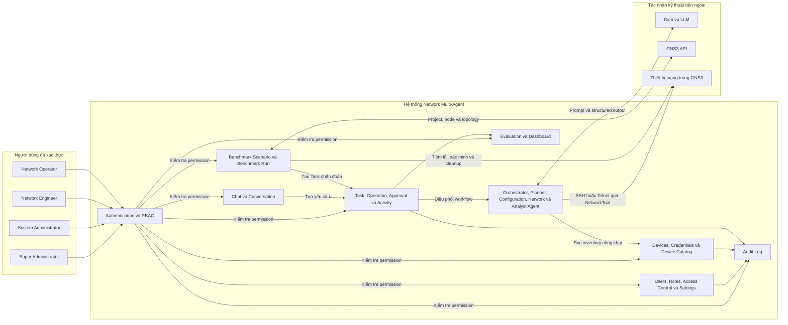
```mermaid
flowchart LR
    subgraph ACTORS[Người dùng đã xác thực]
        SA[Super Administrator]
        SYSA[System Administrator]
        NE[Network Engineer]
        NO[Network Operator]
    end

    subgraph SYSTEM[Hệ thống Network Multi-Agent]
        RBAC[Authentication và RBAC]
        ADMIN[Users, Roles, Access Control và Settings]
        INVENTORY[Devices, Credentials và Device Catalog]
        CHAT[Chat và Conversation]
        TASK[Task, Operation, Approval và Activity]
        MAS[Orchestrator, Planner, Configuration, Network và Analyst Agent]
        BENCH[Benchmark Scenario và Benchmark Run]
        EVAL[Evaluation và Dashboard]
        AUDIT[Audit Log]
    end

    subgraph EXTERNAL[Tác nhân kỹ thuật bên ngoài]
        LLM[Dịch vụ LLM]
        GNS3[GNS3 API]
        DEV[Thiết bị mạng trong GNS3]
    end

    SA --> RBAC
    SYSA --> RBAC
    NE --> RBAC
    NO --> RBAC

    RBAC -->|Kiểm tra permission| ADMIN
    RBAC -->|Kiểm tra permission| INVENTORY
    RBAC -->|Kiểm tra permission| CHAT
    RBAC -->|Kiểm tra permission| TASK
    RBAC -->|Kiểm tra permission| BENCH
    RBAC -->|Kiểm tra permission| EVAL
    RBAC -->|Kiểm tra permission| AUDIT

    CHAT -->|Tạo yêu cầu| TASK
    TASK -->|Điều phối workflow| MAS
    MAS <-->|Prompt và structured output| LLM
    MAS -->|Đọc inventory công khai| INVENTORY
    MAS -->|SSH hoặc Telnet qua NetworkTool| DEV
    BENCH <-->|Project, node và topology| GNS3
    BENCH -->|Tiêm lỗi, xác minh và cleanup| DEV
    BENCH -->|Tạo Task chẩn đoán| TASK
    TASK --> EVAL
    ADMIN --> AUDIT
    INVENTORY --> AUDIT
    TASK --> AUDIT
```

_Hình 3.1. Sơ đồ tác nhân, phạm vi chức năng và các hệ thống bên ngoài theo triển khai thực tế._

### 3.2.2. Yêu cầu chức năng

Yêu cầu chức năng xác định những khả năng hệ thống cung cấp cho người dùng trong phạm vi quyền được cấp. Các yêu cầu được tổ chức theo các nhóm nghiệp vụ đã triển khai trên frontend và backend.

1. **Quản lý danh tính và quyền truy cập (Identity and Access Management)** <br> Hệ thống hỗ trợ đăng nhập, làm mới token, đăng xuất, quản lý session, người dùng, vai trò và ma trận permission. Mỗi permission được xác định theo cặp chức năng–hành động và được gán cho vai trò. Identity Service xác thực access token, kiểm tra session, trạng thái tài khoản và quyền trước khi cho phép thực hiện nghiệp vụ được bảo vệ.

2. **Quản lý thiết bị và thông tin kết nối (Device Inventory and Credential Management)** <br> Hệ thống cho phép quản lý thiết bị, brand, category, Netmiko driver và credential. Credential được lưu ở dạng mã hóa và chỉ được giải mã trong quá trình chuẩn bị kết nối. Inventory cung cấp thông tin thiết bị công khai cho Planner và thông tin kết nối cần thiết cho NetworkTool.

3. **Tương tác với AI Agent (Natural Language Interaction)** <br> Người dùng có thể gửi yêu cầu bằng ngôn ngữ tự nhiên, xem và đổi tên hội thoại, theo dõi Activity Timeline, yêu cầu phê duyệt và phản hồi cuối. Mỗi USER_REQUEST hợp lệ có thể tạo một Task gồm nhiều Operation; frontend nhận Task Activity gần thời gian thực qua Server-Sent Events (SSE), sử dụng REST API để tải dữ liệu chi tiết và chuyển sang polling dự phòng khi stream không khả dụng.

4. **Lập kế hoạch và điều phối tác vụ (Task Planning and Orchestration)** <br> Agent chuyển yêu cầu thành Execution Plan có cấu trúc, gồm các Operation, thông tin thiết bị và quan hệ phụ thuộc. Các quan hệ được tổ chức theo Directed Acyclic Graph (DAG). Kế hoạch phải được kiểm tra tính hợp lệ trước khi lưu trữ và thực thi.

5. **Thực thi tác vụ mạng (Network Task Execution)** <br> Network Agent thực thi các Operation thông qua NetworkTool sử dụng backend Netmiko hoặc Nornir theo cấu hình. Hệ thống phân biệt thao tác READ để thu thập thông tin và WRITE để thay đổi cấu hình. Quá trình thực thi tuân thủ dependency, lưu Execution và Device Action Log, đồng thời cập nhật trạng thái Task, Operation và mapping thiết bị.

6. **Phê duyệt và kiểm soát cấu hình (Approval and Execution Control)** <br> Các thao tác ghi phải được phê duyệt trước khi thực thi. Hệ thống sử dụng Approval Gate để kiểm tra trạng thái phê duyệt, Commands Snapshot và SHA-256 Request Hash nhằm bảo đảm nội dung lệnh không bị thay đổi sau khi được chấp thuận. Hệ thống hỗ trợ xử lý yêu cầu bị từ chối, hết hạn và tiếp tục Task sau khi có quyết định hợp lệ.

7. **Phân tích và chẩn đoán sự cố mạng (Network Diagnosis and Root Cause Analysis)** <br> Analyst Agent phân tích output thực thi, nhận diện bất thường và trả kết luận có cấu trúc gồm trạng thái sự cố, vị trí và loại nguyên nhân. Khi bằng chứng chưa đầy đủ, workflow thực hiện Evidence-Guided Investigation bằng các Operation READ-only trong giới hạn số vòng cấu hình. Evidence Coverage và Causal Evidence Gate được sử dụng để phân biệt root cause đã được xác nhận với suspected cause hoặc trường hợp chưa đủ dữ liệu.

8. **Quản lý lịch sử và nhật ký (Task Tracking and Audit Logging)** <br> Hệ thống lưu trữ thông tin Task, Operation, Execution, Device Action Log và Task Activity Event nhằm theo dõi toàn bộ quá trình xử lý. Bên cạnh đó, Audit Log ghi nhận những hoạt động nghiệp vụ quan trọng để hỗ trợ kiểm tra, tìm kiếm và truy vết.

9. **Quản lý thực nghiệm và đánh giá (Benchmark and Evaluation)** <br> Hệ thống hỗ trợ tạo và cập nhật Benchmark Scenario, chạy Benchmark Run, đóng băng scenario snapshot, kiểm tra precondition, tiêm lỗi, xác minh, liên kết Task, chấm Evaluation và cleanup môi trường. Ground Truth được tách khỏi dữ liệu cung cấp cho Agent. Kết quả được đánh giá bằng Detection, Localization, Fault Type, Structured RCA, Task Success Rate, Latency và Interaction Turns.

10. **Thống kê và trình bày kết quả (Dashboard and Reporting)** <br> Hệ thống tổng hợp dữ liệu thiết bị, Task, trạng thái thực thi và Benchmark Evaluation để hiển thị các chỉ số và biểu đồ trên Dashboard. Người dùng có thể lọc dữ liệu đánh giá theo thời gian, theo dõi Task Outcome và xu hướng thời gian thực thi.

### 3.2.3. Yêu cầu phi chức năng

Yêu cầu phi chức năng xác định các đặc tính chất lượng cần đáp ứng trong quá trình xây dựng và vận hành hệ thống. Đối với hệ thống Multi-Agent hỗ trợ quản trị mạng, các yêu cầu này tập trung vào bảo mật, tính an toàn, độ tin cậy, hiệu năng và khả năng bảo trì.

1. **Bảo mật và kiểm soát truy cập (Security and Access Control)** <br> Hệ thống phải xác thực access token, kiểm tra session và quyền RBAC trước khi thực hiện thao tác được bảo vệ. Mật khẩu người dùng được băm; refresh token được lưu dưới dạng hash và được xoay khi làm mới phiên. Credential thiết bị được mã hóa, còn khóa API và các bí mật cấu hình chỉ được quản lý tại backend, không chuyển xuống frontend hoặc cung cấp trực tiếp cho LLM.

2. **Tính toàn vẹn và nhất quán dữ liệu (Data Integrity and Consistency)** <br> PostgreSQL là nguồn dữ liệu chuẩn cho vòng đời Conversation, Task, Operation, Approval, Execution, Benchmark và Evaluation. Những cập nhật liên quan phải sử dụng transaction và khóa dữ liệu khi cần thiết. Commands Snapshot và Request Hash được kiểm tra để bảo đảm nội dung thực thi không khác nội dung đã được phê duyệt; LangGraph state không thay thế dữ liệu nghiệp vụ đã lưu.

3. **Tính an toàn trong thực thi (Execution Safety)** <br> Hệ thống phải phân biệt rõ thao tác READ và WRITE. Các lệnh WRITE chỉ được thực hiện sau khi vượt qua Approval Gate, trong khi những yêu cầu chưa được duyệt, bị từ chối hoặc hết hạn phải được ngăn thực thi. Các thao tác điều tra bổ sung được giới hạn ở chế độ READ nhằm hạn chế thay đổi ngoài ý muốn.

4. **Độ tin cậy và xử lý lỗi (Reliability and Fault Handling)** <br> Hệ thống phải phát hiện và ghi nhận lỗi gọi LLM, structured output không hợp lệ, lỗi kết nối thiết bị và lỗi CLI. Timeout, retry và schema validation được áp dụng tại các vị trí phù hợp. Khi một Operation thất bại, dependency được xử lý theo điều kiện đã xác định. Benchmark cleanup có retry và bước xác minh để tránh ghi nhận môi trường đã khôi phục khi trạng thái thiết bị chưa đúng.

5. **Hiệu năng (Performance)** <br> Hệ thống cần kiểm soát timeout của LLM và thiết bị, đồng thời tách những thao tác mạng đồng bộ khỏi luồng xử lý bất đồng bộ khi cần thiết. Thời gian hoạt động của AI workflow được ghi nhận riêng với thời gian chờ phê duyệt của người dùng. Dashboard và các bảng dữ liệu sử dụng phân trang hoặc giới hạn phạm vi truy vấn để tránh tải toàn bộ lịch sử trong một lần.

6. **Khả năng quan sát và truy vết (Observability and Traceability)** <br> Các sự kiện quan trọng trong vòng đời Task phải được ghi nhận thông qua Activity Event, Execution, Device Action Log và Audit Log. Benchmark Run phải liên kết được với Scenario snapshot, Conversation, Task và Evaluation. Dữ liệu cần hỗ trợ truy xuất quá trình lập kế hoạch, thực thi, phê duyệt, phân tích và cleanup.

7. **Khả năng bảo trì và mở rộng (Maintainability and Extensibility)** <br> Hệ thống được tổ chức theo các lớp trình bày, API, Core Domain Services, AI và điều phối, tích hợp và lưu trữ. Backend phân chia domain theo module; NetworkTool trừu tượng hóa Netmiko/Nornir; các lớp tích hợp cô lập LLM và GNS3. Cấu trúc này hạn chế phụ thuộc trực tiếp và hỗ trợ thay đổi công nghệ hoặc bổ sung chức năng.

8. **Khả năng sử dụng (Usability)** <br> Giao diện phải được tổ chức thống nhất, hỗ trợ tiếng Việt và tiếng Anh, hiển thị rõ trạng thái Task, tiến trình Agent, yêu cầu phê duyệt và kết quả benchmark. Các biểu mẫu, bộ lọc, phân trang và thông báo lỗi cần giúp người dùng nhận biết trạng thái hiện tại và hành động tiếp theo.

9. **Khả năng kiểm thử và tái lập (Testability and Reproducibility)** <br> Mỗi Benchmark Scenario phải xác định precondition, thao tác tiêm lỗi, điều kiện xác minh, Ground Truth và cleanup. Benchmark Run lưu snapshot của phiên bản Scenario tại thời điểm bắt đầu để tránh thay đổi dữ liệu đánh giá giữa chừng. Mỗi lượt chạy được lưu độc lập và chỉ kết thúc cleanup sau khi trạng thái khôi phục đã được kiểm chứng.

## 3.3. Công nghệ và môi trường triển khai

### 3.3.1. LangGraph

LangGraph được sử dụng làm framework điều phối quy trình xử lý của hệ thống Multi-Agent, hỗ trợ tổ chức và quản lý sự phối hợp giữa các AI Agent. Framework này cung cấp mô hình đồ thị trạng thái (State Graph), trong đó các nút (node) biểu diễn những bước xử lý, còn các cạnh (edge) xác định luồng chuyển tiếp. Cơ chế này cho phép tổ chức quy trình nhiều giai đoạn, hỗ trợ rẽ nhánh có điều kiện và duy trì thông tin trạng thái trong suốt quá trình thực thi.

Trong hệ thống, LangGraph tổ chức các bước xử lý chính, bao gồm kiểm tra môi trường GNS3, phân tích yêu cầu, lập kế hoạch, sinh cấu hình cho Operation WRITE, tương tác với thiết bị mạng và phân tích kết quả thực thi. Các thành phần trao đổi thông tin thông qua trạng thái dùng chung, đồng thời lựa chọn hướng xử lý dựa trên kết quả của những bước trước đó. Đối với nhiệm vụ chẩn đoán sự cố, quy trình có thể chuyển sang bước điều tra bổ sung khi thông tin ban đầu chưa đủ để xác định nguyên nhân. Việc sử dụng LangGraph giúp quản lý luồng xử lý rõ ràng và tạo điều kiện mở rộng các chức năng của hệ thống.

### 3.3.2. Netmiko và Nornir

Netmiko và Nornir được sử dụng để hỗ trợ tương tác và tự động hóa thao tác trên thiết bị mạng. Trong đó, Netmiko đảm nhiệm việc thiết lập kết nối SSH, gửi lệnh và thu thập kết quả thông qua giao diện dòng lệnh (Command-Line Interface – CLI). Nornir cung cấp các thành phần quản lý danh sách thiết bị (Inventory), tổ chức tác vụ và hỗ trợ thực thi trên nhiều thiết bị theo quy trình thống nhất.

Trong kiến trúc backend, hệ thống xây dựng lớp `NetworkTool` nhằm trừu tượng hóa quá trình tương tác với thiết bị mạng. Tùy theo cấu hình, lớp này có thể sử dụng Netmiko trực tiếp hoặc kết hợp Nornir với plugin Netmiko để thực hiện các tác vụ kiểm tra trạng thái và thay đổi cấu hình. `NetworkTool` cung cấp giao diện thực thi thống nhất cho các thành phần xử lý nghiệp vụ và AI Agent, giúp hạn chế sự phụ thuộc vào chi tiết triển khai của từng thư viện.

Việc tách biệt lớp tương tác thiết bị khỏi logic điều phối giúp nâng cao tính mô-đun, thuận tiện cho quá trình bảo trì và mở rộng hệ thống. Đồng thời, cách tổ chức này cho phép thay đổi hoặc bổ sung phương thức kết nối thiết bị mà không cần điều chỉnh đáng kể các thành phần Multi-Agent.

### 3.3.3. GNS3 và môi trường giả lập mạng

GNS3 (Graphical Network Simulator 3) được sử dụng để xây dựng môi trường mạng phục vụ phát triển, kiểm thử và đánh giá hệ thống. Nền tảng này cho phép thiết lập các topology gồm thiết bị định tuyến, chuyển mạch và những liên kết mạng thông qua môi trường ảo hóa, giúp thực hiện các thao tác cấu hình và chẩn đoán mà không ảnh hưởng đến hạ tầng mạng thực tế.

Trong phạm vi đề tài, các topology được thiết kế để mô phỏng những tình huống vận hành và sự cố như sai cấu hình địa chỉ IP, giao diện bị vô hiệu hóa hoặc thông tin định tuyến không chính xác. Mỗi kịch bản thực nghiệm được xác định dựa trên trạng thái ban đầu, nguyên nhân sự cố và kết quả mong đợi. Môi trường GNS3 cho phép tái tạo các điều kiện thử nghiệm, hỗ trợ kiểm tra và đánh giá kết quả xử lý theo những tiêu chí được thiết lập trước.

Backend tích hợp GNS3 Provider để giao tiếp với GNS3 Server, kiểm tra khả năng truy cập và khai thác thông tin topology phục vụ quá trình chẩn đoán. Trong khi GNS3 Provider đảm nhiệm tương tác với môi trường mô phỏng, các thao tác kiểm tra trạng thái và thay đổi cấu hình bên trong thiết bị được thực hiện thông qua lớp `NetworkTool`. Sự phân tách này giúp xác định rõ trách nhiệm của từng thành phần và bảo đảm tính độc lập giữa quản lý môi trường mạng và thực thi lệnh trên thiết bị.

### 3.3.4. Các công nghệ phát triển ứng dụng

Hệ thống được phát triển theo kiến trúc phân tách frontend và backend, kết hợp với cơ sở dữ liệu quan hệ và dịch vụ cung cấp mô hình ngôn ngữ lớn. Các công nghệ được lựa chọn nhằm bảo đảm tính mô-đun, thuận tiện cho quá trình phát triển, kiểm thử, bảo trì và mở rộng hệ thống.

Về phía frontend, ứng dụng sử dụng React kết hợp TypeScript để xây dựng giao diện theo hướng thành phần và hỗ trợ kiểm tra kiểu dữ liệu. Vite được sử dụng để thiết lập môi trường phát triển, React Router đảm nhiệm điều hướng giữa các trang, trong khi Tailwind CSS và shadcn/ui hỗ trợ xây dựng giao diện nhất quán, có khả năng tái sử dụng. Thư viện Axios được tích hợp để thực hiện các yêu cầu HTTP và trao đổi dữ liệu với backend.

Về phía backend, hệ thống được xây dựng bằng Python với framework FastAPI, cung cấp các REST API nghiệp vụ thông qua tiền tố /api/v1. FastAPI đảm nhiệm tiếp nhận yêu cầu, điều phối đến các thành phần xử lý nghiệp vụ và trả về kết quả tương ứng. Thư viện Pydantic được sử dụng để định nghĩa cấu trúc dữ liệu và kiểm tra tính hợp lệ của dữ liệu đầu vào, đầu ra, bảo đảm tính nhất quán trong quá trình giao tiếp giữa các thành phần.

Về cơ sở dữ liệu, PostgreSQL được sử dụng để lưu trữ thông tin thiết bị mạng, nhiệm vụ, trạng thái thực thi, lịch sử hoạt động và kết quả thực nghiệm. Backend tích hợp SQLAlchemy để ánh xạ các mô hình dữ liệu với bảng quan hệ, đồng thời hỗ trợ truy vấn và cập nhật dữ liệu. Cách tổ chức này giúp tách biệt lớp truy cập dữ liệu khỏi logic nghiệp vụ và thuận tiện cho việc bảo trì hệ thống.
Về tích hợp mô hình ngôn ngữ lớn, backend sử dụng LangChain kết hợp NVIDIA AI Endpoint để tương tác với các mô hình LLM đã được huấn luyện sẵn. LangChain hỗ trợ tổ chức thông điệp, gửi yêu cầu và xử lý phản hồi từ mô hình, phục vụ Planner Agent trong lập kế hoạch, Configuration Agent trong sinh CLI WRITE và Analyst Agent trong phân tích kết quả thực thi. Việc sử dụng API cho phép hệ thống khai thác khả năng của LLM mà không cần triển khai mô hình trực tiếp trên hạ tầng cục bộ.

Về môi trường triển khai, Docker Compose được sử dụng để tổ chức các dịch vụ backend, PostgreSQL và pgAdmin trong quá trình phát triển và kiểm thử. Công cụ này hỗ trợ quản lý cấu hình, kết nối và các thành phần phụ thuộc giữa những container. Trong đó, pgAdmin phục vụ việc quản lý và kiểm tra dữ liệu PostgreSQL. Cách triển khai này giúp đơn giản hóa quá trình khởi tạo và bảo đảm tính nhất quán của môi trường kiểm thử.

## 3.4. Thiết kế kiến trúc tổng thể hệ thống

### 3.4.1. Kiến trúc tổng thể

Hệ thống Multi-Agent hỗ trợ cấu hình và xử lý sự cố mạng được xây dựng theo kiến trúc phân lớp. Kiến trúc tổng thể gồm lớp trình bày, lớp API, các dịch vụ nghiệp vụ cốt lõi, thành phần điều phối Multi-Agent, lớp tích hợp và lớp lưu trữ. Cách tổ chức này phân tách trách nhiệm giữa giao diện người dùng, xử lý nghiệp vụ, suy luận bằng LLM, tương tác thiết bị và quản lý dữ liệu.

Người dùng truy cập hệ thống thông qua ứng dụng web React/TypeScript. Phạm vi chức năng của Super Administrator, System Administrator, Network Engineer và Network Operator được xác định bằng RBAC. Frontend giao tiếp với FastAPI qua REST API và SSE trên nền HTTP, không truy cập trực tiếp cơ sở dữ liệu, LLM hoặc thiết bị mạng.

Backend FastAPI cung cấp API cho các dịch vụ cốt lõi đã triển khai, gồm Identity và Access Control, Inventory và Credential, Conversation và Task Execution, Benchmark và Evaluation, Audit Log. Identity Service thực hiện xác thực, quản lý session và kiểm tra quyền. Các dịch vụ nghiệp vụ sử dụng Persistence Layer dựa trên SQLAlchemy để đọc và ghi PostgreSQL.

Thành phần Multi-Agent sử dụng LangGraph và Orchestrator để phối hợp Planner Agent, Configuration Agent, Network Agent và Analyst Agent. Planner, Configuration và Analyst tương tác với NVIDIA AI Endpoint thông qua lớp tích hợp LLM. Workflow kiểm tra GNS3 Server thông qua lớp tích hợp GNS3, trong khi Network Agent sử dụng lớp tích hợp thiết bị dựa trên Netmiko hoặc Nornir để thực thi lệnh. Benchmark Service cũng sử dụng lớp tích hợp thiết bị để kiểm tra baseline, tiêm lỗi, xác minh và cleanup. Các kết nối đến thiết bị được thực hiện qua SSH hoặc Telnet trong phạm vi inventory và credential đã quản lý.

Backend, PostgreSQL và công cụ quản trị cơ sở dữ liệu được tổ chức bằng Docker Compose trong môi trường phát triển và thực nghiệm. Frontend hiện được vận hành như ứng dụng riêng và kết nối đến backend qua REST API và SSE. Redis, Message Queue và WebSocket không được đưa vào kiến trúc vì chưa được sử dụng trong phiên bản hệ thống hiện tại.

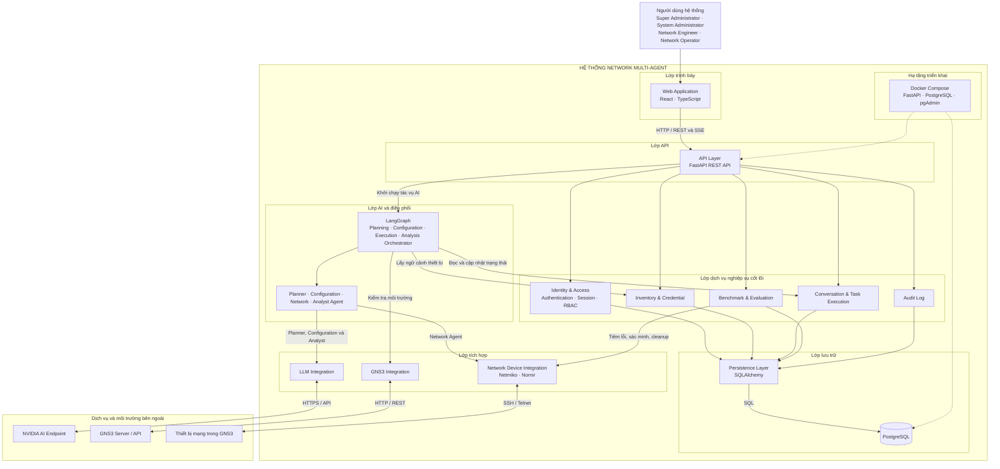
```mermaid
flowchart TB
    ACTOR["Người dùng hệ thống<br/>Super Administrator · System Administrator<br/>Network Engineer · Network Operator"]

    subgraph SYSTEM["HỆ THỐNG NETWORK MULTI-AGENT"]
        subgraph PRESENTATION["Lớp trình bày"]
            FE["Web Application<br/>React · TypeScript"]
        end

        subgraph API_LAYER["Lớp API"]
            API["API Layer<br/>FastAPI REST API"]
        end

        subgraph CORE["Lớp dịch vụ nghiệp vụ cốt lõi"]
            IDENTITY["Identity & Access<br/>Authentication · Session · RBAC"]
            INVENTORY["Inventory & Credential"]
            OPERATIONS["Conversation & Task Execution"]
            BENCHMARK["Benchmark & Evaluation"]
            AUDIT["Audit Log"]
        end

        subgraph AI["Lớp AI và điều phối"]
            ORCHESTRATION["LangGraph<br/>Planning · Configuration · Execution · Analysis Orchestrator"]
            AGENTS["Planner · Configuration · Network · Analyst Agent"]
        end

        subgraph INTEGRATION["Lớp tích hợp"]
            LLMINT["LLM Integration"]
            GNS3INT["GNS3 Integration"]
            NETINT["Network Device Integration<br/>Netmiko · Nornir"]
        end

        subgraph DATA["Lớp lưu trữ"]
            PERSISTENCE["Persistence Layer<br/>SQLAlchemy"]
            DB[("PostgreSQL")]
        end

        subgraph INFRASTRUCTURE["Hạ tầng triển khai"]
            DEPLOY["Docker Compose<br/>FastAPI · PostgreSQL · pgAdmin"]
        end

        FE -->|HTTP / REST và SSE| API
        API --> IDENTITY
        API --> INVENTORY
        API --> OPERATIONS
        API --> BENCHMARK
        API --> AUDIT
        API -->|Khởi chạy tác vụ AI| ORCHESTRATION

        ORCHESTRATION --> AGENTS
        ORCHESTRATION -->|Đọc và cập nhật trạng thái| OPERATIONS
        ORCHESTRATION -->|Lấy ngữ cảnh thiết bị| INVENTORY
        AGENTS -->|Planner, Configuration và Analyst| LLMINT
        ORCHESTRATION -->|Kiểm tra môi trường| GNS3INT
        AGENTS -->|Network Agent| NETINT
        BENCHMARK -->|Tiêm lỗi, xác minh, cleanup| NETINT

        IDENTITY --> PERSISTENCE
        INVENTORY --> PERSISTENCE
        OPERATIONS --> PERSISTENCE
        BENCHMARK --> PERSISTENCE
        AUDIT --> PERSISTENCE
        PERSISTENCE -->|SQL| DB

        DEPLOY -.-> API
        DEPLOY -.-> DB
    end

    subgraph EXTERNAL["Dịch vụ và môi trường bên ngoài"]
        LLM["NVIDIA AI Endpoint"]
        GNS3["GNS3 Server / API"]
        DEV["Thiết bị mạng trong GNS3"]
    end

    ACTOR --> FE
    LLMINT <-->|HTTPS / API| LLM
    GNS3INT <-->|HTTP / REST| GNS3
    NETINT <-->|SSH / Telnet| DEV
```

_Hình 3.2. Sơ đồ kiến trúc tổng thể của hệ thống Network Multi-Agent theo các thành phần đã triển khai._

### 3.4.2. Các thành phần chức năng và mối quan hệ

Kiến trúc hệ thống gồm các thành phần chức năng được tổ chức theo từng lớp như Hình 3.2.

**Lớp trình bày (Presentation Layer).** Web Application được xây dựng bằng React và TypeScript, cung cấp giao diện đăng nhập, Dashboard, hội thoại với AI, theo dõi Task, phê duyệt thay đổi cấu hình, quản lý thiết bị và credential, quản lý Benchmark Scenario và Benchmark Run, xem Evaluation, Audit Log, người dùng và quyền truy cập. Frontend chịu trách nhiệm hiển thị dữ liệu và tiếp nhận thao tác của người dùng, nhưng không trực tiếp thực hiện nghiệp vụ, truy vấn PostgreSQL hoặc kết nối thiết bị mạng.

**Lớp API (API Layer).** FastAPI cung cấp các REST API và endpoint SSE dưới tiền tố `/api/v1`, tiếp nhận yêu cầu HTTP từ frontend, kiểm tra cấu trúc dữ liệu đầu vào và chuyển yêu cầu đến thành phần xử lý phù hợp. API Layer không chứa nghiệp vụ xác thực hoặc phân quyền; các router sử dụng Identity Service để xác thực phiên và kiểm tra permission trước khi gọi Core Domain Services. Đối với yêu cầu hội thoại hoặc tiếp tục Task sau phê duyệt, API Layer đồng thời kích hoạt Multi-Agent Workflow; endpoint SSE phát lại Task Activity đã lưu và truyền sự kiện mới cho frontend.

**Các dịch vụ nghiệp vụ cốt lõi (Core Domain Services).** Các nghiệp vụ của hệ thống được phân chia theo domain:

- **Identity & Access** quản lý người dùng, vai trò, permission, mật khẩu, access token, refresh token và vòng đời session; thực hiện Authentication và RBAC.
- **Inventory & Credential** quản lý thiết bị, brand, category, thông tin kết nối và credential đã mã hóa; cung cấp ngữ cảnh thiết bị cho quá trình lập kế hoạch và thực thi.
- **Conversation & Task Execution** quản lý hội thoại, message, Task, Operation, dependency, ánh xạ thiết bị, Approval, Execution, Activity và Device Action Log.
- **Benchmark & Evaluation** quản lý Scenario, Run, Ground Truth, quá trình tiêm lỗi, xác minh, cleanup và kết quả đánh giá có cấu trúc.
- **Audit Log** cung cấp dữ liệu truy vết các hành động nghiệp vụ quan trọng phục vụ giám sát và kiểm toán.

Domain Service chịu trách nhiệm thực hiện quy tắc nghiệp vụ và phối hợp các Repository trong phạm vi domain. Đây là lớp trung gian giữa API, Multi-Agent Core, lớp tích hợp và cơ sở dữ liệu; frontend và Agent không truy cập Repository trực tiếp.

**Lõi Multi-Agent (Multi-Agent Core).** Thành phần này sử dụng LangGraph và bốn Orchestrator chuyên trách để phối hợp bốn Agent. Planning Orchestrator điều phối việc tạo và lưu kế hoạch; Configuration Orchestrator điều phối quá trình sinh và kiểm tra CLI cho Operation WRITE; Execution Orchestrator kiểm tra dependency, Approval Gate và thực thi; Analysis Orchestrator tổng hợp evidence và quản lý kết luận phân tích. Ở tầng Agent, Planner Agent tạo kế hoạch nghiệp vụ, Configuration Agent chuyển yêu cầu WRITE thành CLI phù hợp, Network Agent thực thi Operation đã được kiểm soát và Analyst Agent tạo kết luận chẩn đoán. LangGraph quản lý thứ tự và nhánh xử lý của workflow, nhưng không thay thế Domain Service trong việc quản lý dữ liệu nghiệp vụ dài hạn.

**Lớp tích hợp (Integration Layer).** Lớp này cô lập hệ thống khỏi chi tiết của những công nghệ và dịch vụ bên ngoài:

- **LLM Integration** sử dụng LangChain và `ChatNVIDIA` để gửi prompt đến NVIDIA AI Endpoint, nhận phản hồi và chuyển kết quả cho Planner, Configuration hoặc Analyst Agent.
- **GNS3 Integration** sử dụng GNS3 Provider để kiểm tra khả năng truy cập GNS3 Server trước khi hệ thống lập kế hoạch hoặc phân tích tác vụ mạng.
- **Network Device Integration** cung cấp `NetworkTool` với backend Netmiko hoặc Nornir, chuẩn bị kết nối từ inventory và credential, thực thi lệnh qua SSH/Telnet và chuẩn hóa kết quả trả về. Thành phần này được Network Agent sử dụng trong workflow; Benchmark Run Service cũng sử dụng nó để kiểm tra baseline, tiêm lỗi, xác minh và cleanup.

**Lớp lưu trữ (Persistence Layer).** Repository và SQLAlchemy đảm nhiệm ánh xạ, truy vấn và cập nhật dữ liệu trong PostgreSQL. Cơ sở dữ liệu lưu người dùng, session, quyền truy cập, inventory, credential, conversation, task, operation, approval, execution, benchmark, evaluation và audit. PostgreSQL là nguồn dữ liệu chuẩn đối với trạng thái nghiệp vụ của hệ thống.

**Hạ tầng triển khai.** Backend, PostgreSQL và pgAdmin được tổ chức bằng Docker Compose trong môi trường phát triển và thực nghiệm. Frontend được vận hành như một ứng dụng riêng và kết nối đến backend qua REST API và SSE. NVIDIA AI Endpoint, GNS3 Server và các thiết bị mạng trong GNS3 nằm ngoài ranh giới ứng dụng nhưng được truy cập thông qua các lớp tích hợp tương ứng.

Mối quan hệ giữa các thành phần được thiết kế theo nguyên tắc giới hạn trách nhiệm. Planner Agent không nhận credential và không chạy CLI; Network Agent không dùng LLM để tự lựa chọn mục tiêu hoặc diễn giải kết quả; Analyst Agent không kết nối và không thay đổi cấu hình thiết bị. Các thao tác WRITE phải được kiểm soát bởi Execution Service và Approval Gate trước khi Network Agent thực thi. Sự phân tách này làm giảm phạm vi ảnh hưởng khi một thành phần tạo kết quả không hợp lệ và hỗ trợ kiểm tra toàn bộ quá trình xử lý.

### 3.4.3. Cơ chế trao đổi và quản lý dữ liệu

Frontend và backend trao đổi dữ liệu bằng REST API và SSE trên nền HTTP. Sau khi đăng nhập, frontend gửi access token trong các yêu cầu đến API, bao gồm yêu cầu mở SSE bằng `fetch` để sử dụng được Bearer token. Router sử dụng Identity Service để kiểm tra tính hợp lệ của access token, trạng thái session, trạng thái tài khoản và permission tương ứng với chức năng được yêu cầu. Chỉ khi các điều kiện này được thỏa mãn, yêu cầu mới được chuyển đến Domain Service. Giao diện nhận Task Activity theo sequence qua SSE, tải lại dữ liệu hội thoại chi tiết sau các sự kiện cần thiết và sử dụng polling làm cơ chế dự phòng khi stream lỗi liên tiếp. Phiên bản hiện tại không sử dụng WebSocket hoặc Message Queue.

Đối với yêu cầu xử lý bằng AI, Conversation Service lưu Conversation và Message trước khi API kích hoạt LangGraph Workflow. Node `plan` sử dụng Planning Orchestrator để lấy tối đa năm Message ngay trước yêu cầu hiện tại từ PostgreSQL, sắp xếp theo thời gian và chuyển chúng cùng yêu cầu mới, inventory công khai và topology context cho Planner Agent. Lịch sử gần chỉ dùng để phân giải các tham chiếu như “thiết bị đó” hoặc “tiếp tục bước trước”; message hiện tại vẫn là yêu cầu điều khiển chính. Structured output được kiểm tra bằng schema rồi lưu tạm trong LangGraph state dưới dạng `PlanningDraft`, chưa tạo Operation. Nếu kế hoạch chỉ có READ, Planning Orchestrator lưu kế hoạch và workflow đi thẳng đến `execute`. Nếu có WRITE, conditional edge chuyển state sang node `configure`; Configuration Orchestrator gọi Configuration Agent, chuẩn hóa CLI và đối chiếu interface với inventory GNS3. Kế hoạch hoàn chỉnh chỉ được chuyển thành Task Operation, Operation Dependency và Operation Device sau khi node phù hợp hoàn tất validation.

Trong quá trình thực thi, Execution Orchestrator đọc lại Task, Operation, dependency, mapping thiết bị và Approval từ Execution Service. Với Operation READ, Network Agent có thể gọi NetworkTool để thu thập trạng thái. Với Operation WRITE, workflow chỉ tiếp tục khi Approval Gate xác nhận nội dung đã được phê duyệt và vẫn khớp với command snapshot. NetworkTool lấy thông tin kết nối thông qua Inventory Service và Device Connection Provider, sau đó gửi lệnh đến thiết bị bằng SSH hoặc Telnet. Output của thiết bị được chuẩn hóa, lưu thành Execution và Device Action Log, rồi chuyển cho Analyst Agent làm bằng chứng phân tích.

Planner Agent, Configuration Agent và Analyst Agent trao đổi với NVIDIA AI Endpoint thông qua lớp tích hợp LLM; API key và cấu hình model được quản lý tại backend, không được gửi xuống frontend. Network Agent không gọi LLM. Analyst nhận output thực thi, thông tin thiết bị và evidence đã thu thập để tạo `AnalysisResult`. Khi evidence chưa đầy đủ, workflow có thể tạo các bước điều tra READ-only bổ sung trong giới hạn số vòng đã cấu hình; kết quả cuối cùng được lưu thành Message và dữ liệu đánh giá có cấu trúc.

GNS3 Provider giao tiếp với GNS3 Server qua HTTP/REST để kiểm tra khả năng truy cập môi trường. Topology và trạng thái các node được quản lý tại GNS3; phiên bản hiện tại chưa đồng bộ toàn bộ graph node–link vào cơ sở dữ liệu của hệ thống. Hoạt động CLI bên trong thiết bị được thực hiện qua NetworkTool dựa trên thông tin kết nối trong Inventory. Đối với benchmark, Benchmark Service đọc Scenario đã lưu, kiểm tra precondition, sử dụng NetworkTool để tiêm lỗi và xác minh trạng thái, tạo yêu cầu chẩn đoán qua workflow, lưu Evaluation, sau đó thực hiện cleanup và kiểm chứng trạng thái khôi phục.

PostgreSQL được sử dụng làm nguồn dữ liệu chuẩn đối với vòng đời Conversation, Task, Operation, Approval, Execution, Benchmark Run và Evaluation. Mọi thay đổi nghiệp vụ dài hạn được thực hiện thông qua Domain Service và Repository. Các cập nhật cần bảo đảm tính nhất quán, chẳng hạn xoay session hoặc xử lý phê duyệt hết hạn, sử dụng transaction và cơ chế khóa dữ liệu phù hợp tại tầng lưu trữ.

LangGraph state chỉ chứa dữ liệu chuyển tiếp cần thiết giữa các node trong một lượt xử lý, chẳng hạn Conversation, Message, `PlanningDraft`, Task, Execution Result, Analysis Result, vòng điều tra và mức độ bao phủ evidence. State này không được sử dụng như nguồn dữ liệu cạnh tranh với PostgreSQL. Trước mỗi giai đoạn quan trọng, Orchestrator đọc lại trạng thái nghiệp vụ đã lưu để hạn chế việc thực thi dựa trên dữ liệu cũ.

Khi một Task WRITE dừng để chờ phê duyệt, hệ thống lưu Task, Operation, Approval và command snapshot trong PostgreSQL rồi kết thúc lượt workflow hiện tại. Sau khi người dùng đưa ra quyết định, API tải lại Task và khởi chạy workflow tiếp tục từ giai đoạn thực thi. Nhờ đó, hệ thống không phải duy trì một tiến trình LangGraph hoặc kết nối HTTP liên tục trong toàn bộ thời gian chờ phê duyệt, đồng thời vẫn bảo đảm tính tuần tự, khả năng truy vết và tính nhất quán của nội dung đã được chấp thuận.

## 3.5. Thiết kế kiến trúc Multi-Agent

| Tác tử/thành phần      | Đầu vào                                                       | Chức năng                                                                         | Đầu ra và giới hạn                                              |
| ---------------------- | ------------------------------------------------------------- | --------------------------------------------------------------------------------- | --------------------------------------------------------------- |
| Planner Agent          | Yêu cầu người dùng, inventory công khai, topology neighbor, diagnostic playbook và JSON Schema | Phân tích ý định; tạo Operation, device mapping, READ/WRITE, dependency và yêu cầu cấu hình | ExecutionPlanCreate; không sinh CLI WRITE, không kết nối thiết bị |
| Configuration Agent    | Kế hoạch, yêu cầu cấu hình, thiết bị và interface hợp lệ       | Chuyển yêu cầu của từng Operation WRITE thành CLI và chuẩn hóa lệnh                 | Kế hoạch có commands WRITE; không kết nối hoặc thực thi trên thiết bị |
| Network Agent          | Operation và danh sách command cho mapping                    | Kiểm tra input và gọi NetworkTool qua adapter                                     | NetworkExecutionResult; không dùng LLM, không tự chọn mạng đích |
| Analyst Agent          | Command outputs, hostname, trạng thái thực thi                | Tóm tắt phát hiện, giả thuyết, khuyến nghị; tạo kết luận RCA dạng JSON            | AnalysisResult; không kết nối hay sửa thiết bị                  |
| Planning Orchestrator  | Message, Conversation, inventory và topology                  | Tạo Task gốc, gọi Planner, kiểm tra device/interface, tạo PlanningDraft và lưu kế hoạch hoàn chỉnh | PlanningDraft hoặc Task/plan đã xác thực |
| Configuration Orchestrator | ExecutionPlanCreate, inventory và interface GNS3          | Xác định WRITE operation, gọi Configuration Agent, kiểm tra command/interface và ghi activity | Kế hoạch có CLI WRITE đã xác thực |
| Execution Orchestrator | Task và graph operation                                       | Kiểm tra dependency, Approval Gate, thực thi và cập nhật trạng thái               | Execution/result/action logs                                    |
| Analysis Orchestrator  | Task, kết quả thực thi, playbook, Evidence Coverage, inventory và topology | Chuẩn hóa evidence, áp dụng Causal Evidence Gate, điều phối vòng điều tra và tạo FINAL_RESPONSE | Message cuối cùng, structured diagnosis và dấu vết evidence |

### 3.5.1. Planner Agent

Planner Agent chịu trách nhiệm **phân tích ý định và đề xuất kế hoạch thực hiện ở mức nghiệp vụ**. Agent chuyển yêu cầu ngôn ngữ tự nhiên thành `ExecutionPlanCreate`, xác định Operation, thiết bị, chế độ READ/WRITE và dependency. Planner tạo lệnh cho bước READ thu thập dữ liệu; với bước WRITE, Planner chỉ mô tả `configuration_requirements` và không tự sinh CLI cấu hình.

Đầu vào của Planner gồm nội dung yêu cầu, danh sách thiết bị được phép sử dụng, thông tin inventory công khai, danh sách interface đã biết, quan hệ topology neighbor, diagnostic playbook phù hợp và JSON Schema của `ExecutionPlanCreate`. Thông tin inventory cung cấp `device_id`, hostname, brand, category, device type, location và interface cần thiết cho quá trình lập kế hoạch, nhưng không chứa username, password, secret hoặc khóa mã hóa credential. Planner chỉ được tham chiếu những thiết bị và interface có trong ngữ cảnh đầu vào, không được tự tạo thiết bị hoặc suy đoán cổng vật lý không tồn tại.

Đối với mỗi yêu cầu, Planner thực hiện các nhiệm vụ sau:

1. Xác định loại Task, chẳng hạn cấu hình, chẩn đoán hoặc tác vụ tổng hợp.
2. Phân rã mục tiêu thành danh sách Operation có thứ tự và `operation_intent` rõ ràng.
3. Tạo `operation_parameters`: Operation READ chứa `command` hoặc `commands`; Operation WRITE chứa `configuration_requirements` mô tả mục tiêu cấu hình.
4. Gán Operation cho thiết bị bằng `device_id`, xác định vai trò SOURCE, TARGET hoặc CONTEXT và lựa chọn `access_mode` READ/WRITE.
5. Thiết lập dependency giữa các Operation bằng `ON_SUCCESS` hoặc `ON_COMPLETION`, chỉ tham chiếu đến bước đứng trước để giữ kế hoạch ở dạng DAG.
6. Tách bước thu thập dữ liệu, thay đổi cấu hình và xác minh kết quả thành các Operation phù hợp.

Với yêu cầu cấu hình, Planner mô tả mục tiêu, tham số và ràng buộc của thay đổi trong `configuration_requirements`. Operation WRITE phải phụ thuộc vào các bước kiểm tra cần thiết và sau khi được Configuration Agent bổ sung CLI, kế hoạch phải vượt qua Approval Gate trước khi Network Agent thực thi.

Với yêu cầu chẩn đoán, Planner ưu tiên tạo các Operation READ nhằm thu thập evidence theo diagnostic playbook. Khi cần quan sát thiết bị lân cận, Agent sử dụng topology neighbor và ánh xạ interface đã được cung cấp, không tự suy đoán quan hệ mạng. Những Operation do vòng điều tra bổ sung tạo ra cũng bị giới hạn ở lệnh READ-only để tránh thay đổi cấu hình trong quá trình thu thập bằng chứng.

Kết quả từ LLM phải là một JSON object phù hợp với `ExecutionPlanCreate`. Planner kiểm tra dữ liệu bằng Pydantic. Nếu phản hồi sai JSON, Operation READ thiếu command, Operation WRITE thiếu yêu cầu cấu hình hoặc vi phạm schema, Agent gửi lại lỗi validation để mô hình sửa trong giới hạn retry và timeout. Planning Orchestrator tiếp tục kiểm tra device ID, thứ tự và dependency rồi tạo `PlanningDraft`. Conditional edge của LangGraph quyết định chuyển draft sang node `configure` khi có WRITE hoặc lưu kế hoạch READ để đi thẳng đến `execute`.

Planner Agent không lưu trực tiếp dữ liệu nghiệp vụ, không giải mã credential, không sinh CLI WRITE, không mở kết nối SSH/Telnet, không phê duyệt cấu hình và không thực thi command. Việc tách lập kế hoạch khỏi sinh cấu hình giúp thu hẹp trách nhiệm của Planner và cho phép kiểm tra riêng từng đầu ra.

### 3.5.2. Configuration Agent

Configuration Agent là tác tử chuyên trách **chuyển yêu cầu cấu hình ở mức nghiệp vụ thành câu lệnh CLI**. Agent được tách khỏi Planner Agent để việc phân rã mục tiêu và việc sinh cú pháp cấu hình có thể được kiểm tra độc lập. Đầu vào của Agent gồm `ExecutionPlanCreate` đã được Planner tạo, inventory công khai của thiết bị và danh sách interface hợp lệ theo từng `device_id`. Inventory chỉ chứa định danh, hostname, `device_type` và interface cần thiết; username, password, secret hoặc dữ liệu giải mã credential không được đưa vào prompt.

Agent chỉ xử lý những Operation có ít nhất một ánh xạ thiết bị mang `access_mode=WRITE`. Các Operation READ được giữ nguyên và không được gửi đến mô hình. Đối với mỗi Operation WRITE, Agent nhận `operation_order`, `operation_intent`, `configuration_requirements`, loại thiết bị và các interface được phép sử dụng. Từ ngữ cảnh này, Agent tạo danh sách command phù hợp với hệ điều hành hoặc driver của thiết bị, nhưng không được thay đổi loại Task, thêm hoặc xóa Operation, sửa dependency, đổi thiết bị hay thay đổi thứ tự kế hoạch.

Quy trình sinh cấu hình của Configuration Agent gồm các bước sau:

1. Duyệt kế hoạch và xác định tập `operation_order` của các Operation WRITE.
2. Tạo inventory tối thiểu gồm `id`, `hostname`, `device_type` và danh sách interface hợp lệ của các thiết bị liên quan.
3. Chỉ đưa các Operation WRITE cùng hợp đồng JSON đầu ra vào prompt dành cho Configuration Agent.
4. Gọi LLM trong giới hạn `timeout_seconds` và nhận structured output dạng `GeneratedConfigurationSet`.
5. Bóc JSON object từ phản hồi, xác thực bằng Pydantic và yêu cầu mô hình tạo lại khi dữ liệu sai cấu trúc trong giới hạn `max_validation_retries`.
6. Ghép command vào đúng Operation WRITE theo `operation_order`, loại `configuration_requirements` đã được biên dịch và trả về một bản kế hoạch mới.

Structured output phải chứa đúng một `GeneratedConfiguration` cho mỗi Operation WRITE. Hệ thống từ chối kết quả có `operation_order` trùng lặp, thiếu cấu hình cho một Operation hoặc chứa cấu hình ngoài tập Operation dự kiến. Mỗi phần tử phải có ít nhất một command. Cơ chế đối chiếu này ngăn mô hình ghép nhầm cấu hình vào Operation khác hoặc âm thầm bỏ sót một thay đổi đã được Planner yêu cầu.

Trước khi được đưa vào kế hoạch, command được chuẩn hóa bằng `normalize_config_commands`. Các lệnh quản lý phiên như `configure terminal`, `end`, `write memory` được loại bỏ vì việc vào chế độ cấu hình, lưu cấu hình và đóng phiên thuộc trách nhiệm của NetworkTool. Sau khi Agent trả kết quả, Configuration Orchestrator tiếp tục đối chiếu các interface xuất hiện trong CLI với inventory GNS3. Kế hoạch tham chiếu interface vật lý không tồn tại bị từ chối trước khi được lưu. Orchestrator đồng thời ghi các activity `CONFIGURATION_STARTED` và `CONFIGURATION_COMPLETED` để giao diện thể hiện đúng trình tự xử lý.

Kết quả cuối của node `configure` vẫn là `ExecutionPlanCreate`, trong đó Operation READ không thay đổi và Operation WRITE đã có trường `commands`. Workflow yêu cầu Planning Orchestrator lưu kế hoạch hoàn chỉnh thành các bản ghi nghiệp vụ trước khi chuyển sang `execute`. Execution Orchestrator tiếp tục kiểm tra dependency; Approval Gate tạo và kiểm tra command snapshot trước khi Network Agent được gọi.

Configuration Agent không kết nối GNS3 hoặc thiết bị mạng, không đọc credential, không quan sát output thực tế, không phê duyệt thay đổi và không tự khắc phục lỗi sau thực thi. Nếu mô hình không trả JSON hợp lệ sau số lần thử cho phép hoặc vượt quá timeout, giai đoạn lập kế hoạch kết thúc với lỗi có cấu trúc thay vì chuyển một cấu hình không xác định xuống thiết bị.

### 3.5.3. Network Agent

Network Agent là tác tử chuyên trách **thực thi câu lệnh trên thiết bị mạng**. Khác với Planner Agent, Configuration Agent và Analyst Agent, thành phần này không sử dụng LLM để suy luận, không tự lựa chọn thiết bị, không xây dựng kế hoạch và không sinh thêm câu lệnh. Đầu vào của Agent phải là Operation cùng `TaskOperationDevice` đã được các Orchestrator kiểm soát và lưu trong cơ sở dữ liệu. Cách thiết kế này làm cho hành vi thực thi có tính xác định: Agent chỉ gửi đúng những command đã có trong Operation đến đúng `device_id` và theo đúng `access_mode` được chỉ định.

Trước khi kết nối thiết bị, Network Agent kiểm tra `operation_id` trong ánh xạ thiết bị có trùng với Operation đang xử lý hay không. Agent tiếp tục trích xuất command từ `operation_parameters`; hệ thống hỗ trợ cả một lệnh trong trường `command` và nhiều lệnh trong trường `commands`, đồng thời loại bỏ chuỗi rỗng. Operation không chứa command hợp lệ bị từ chối trước khi gọi công cụ mạng. Những kiểm tra này ngăn việc dùng nhầm ánh xạ thiết bị hoặc chuyển một kế hoạch chưa hoàn chỉnh xuống tầng thực thi.

Quy trình thực thi của Network Agent gồm các bước chính sau:

1. Nhận Operation và ánh xạ `TaskOperationDevice` từ Execution Orchestrator.
2. Kiểm tra quan hệ giữa Operation và thiết bị, sau đó chuẩn hóa danh sách command đầu vào.
3. Gọi `NetworkTool.execute(device_id, access_mode, commands)` trong một thread riêng để thao tác mạng đồng bộ không chặn event loop của backend.
4. Nhận danh sách `CommandResult` từ NetworkTool và đóng gói thành `NetworkExecutionResult` có trạng thái `SUCCESS`.
5. Khi xảy ra lỗi kết nối, timeout, lỗi công cụ hoặc thiết bị từ chối câu lệnh, chuyển exception thành kết quả `FAILED` có `error_message` thay vì làm gián đoạn toàn bộ workflow.

`NetworkTool` là giao diện trừu tượng giúp Network Agent không phụ thuộc trực tiếp vào Netmiko hoặc Nornir. Với backend Netmiko, công cụ lấy thông tin kết nối và credential thông qua `NetworkService`, mở một phiên riêng cho mỗi lần thực thi và luôn đóng phiên trong khối `finally`. Nhờ đó, credential không đi qua prompt của LLM và một phiên lỗi không bị tái sử dụng cho lần thực thi sau.

Hai chế độ truy cập được xử lý khác nhau. Với `READ`, NetworkTool lần lượt sử dụng `send_command` cho từng câu lệnh và giữ lại output riêng của từng command để làm evidence cho Analyst Agent. Với `WRITE`, công cụ chuẩn hóa danh sách cấu hình rồi sử dụng `send_config_set` để đưa thiết bị vào chế độ cấu hình. Hệ thống kiểm tra output để phát hiện các thông báo CLI như `% Invalid input`, `% Incomplete command`, `% Ambiguous command`, `% Unknown command` hoặc `% Error`. Cấu hình chỉ được lưu bằng `save_config` khi toàn bộ quá trình không phát hiện lỗi. Tuy nhiên, Network Agent không tự quyết định một Operation WRITE có được chạy hay không; Execution Orchestrator và Approval Gate phải xác nhận trạng thái phê duyệt và command snapshot trước khi gọi Agent.

Kết quả của mỗi lần gọi được chuẩn hóa thành `NetworkExecutionResult`, gồm `operation_id`, `operation_device_id`, `device_id`, `access_mode`, trạng thái, danh sách `CommandResult` và thông báo lỗi nếu có. Bao quanh Network Agent, `MappingExecutor` chịu trách nhiệm cập nhật trạng thái mapping, tạo `TaskExecution`, đo `duration_ms`, lưu output, ghi `DeviceActionLog` theo từng command và phát activity `COMMAND_EXECUTED`. Vì vậy, Network Agent chỉ đảm nhiệm ranh giới thực thi kỹ thuật, còn vòng đời nghiệp vụ, audit và khả năng truy vết vẫn thuộc Execution Orchestrator cùng Execution Service.

Phạm vi trách nhiệm trên bảo đảm Network Agent không vượt quyền: Agent không truy cập Ground Truth của benchmark, không phân tích nguyên nhân sự cố, không thay đổi kế hoạch, không bỏ qua dependency và không tự phê duyệt cấu hình. Output của Agent được chuyển cho Analysis Orchestrator và Analyst Agent làm dữ liệu đầu vào cho bước phân tích tiếp theo.

### 3.5.4. Analyst Agent

Analyst Agent là tác tử chuyên trách **diễn giải kết quả thực thi và hình thành kết luận chẩn đoán có cấu trúc**. Agent không kết nối thiết bị và không tự chạy command; đầu vào của nó được Analysis Orchestrator xây dựng từ các `NetworkExecutionResult` đã lưu. Mỗi phần tử đầu vào gồm tên thiết bị dễ đọc, chế độ truy cập, trạng thái thực thi, command, output, lỗi kỹ thuật và `structured_evidence` được parser của backend trích xuất. Khi có thể truy cập GNS3, Orchestrator còn bổ sung thông tin topology lân cận; đối với tác vụ chẩn đoán, trạng thái Evidence Coverage của playbook cũng được đưa vào ngữ cảnh phân tích.

Analyst Agent sử dụng LLM để tổng hợp dữ liệu thành `AnalysisResult`. Kết quả gồm `summary`, `findings`, `likely_causes`, `recommendations`, `requires_more_data`, `confidence`, `evidence_gaps`, `suggested_checks`, `is_anomaly`, `root_causes`, `suspected_causes` và `execution_issues`. Trong đó, `root_causes` sử dụng cấu trúc `PredictedRootCause` để biểu diễn thiết bị, interface có thể rỗng và loại sự cố; `confidence` nằm trong khoảng từ 0 đến 1. Trường `suspected_causes` do Causal Evidence Gate của backend bổ sung sau hậu kiểm, còn `execution_issues` được backend tạo từ các lỗi kết nối hoặc thực thi xác định; hai trường này không phải kết luận tự do do LLM thiết lập. Các danh sách và độ dài chuỗi được giới hạn nhằm giảm nguy cơ phản hồi dài, lặp lại hoặc bị cắt giữa chừng.

Quy trình phân tích của Analyst Agent gồm các bước sau:

1. Nhận danh sách output thực thi đã được Analysis Orchestrator chuẩn hóa và gắn hostname.
2. Tạo prompt gồm execution outputs và JSON Schema của `AnalysisResult`; trường `suspected_causes` không được cho LLM tự thiết lập vì đây là kết quả hậu kiểm của backend.
3. Gọi LLM trong giới hạn `timeout_seconds` áp dụng cho toàn bộ chu kỳ phân tích và retry.
4. Bóc JSON object từ `content`; chỉ sử dụng `reasoning_content` khi nội dung chính thực sự rỗng.
5. Xác thực các trường bắt buộc và toàn bộ payload bằng Pydantic. Khi phản hồi không hợp lệ, gửi lại lỗi cùng giới hạn độ dài để mô hình tạo một JSON mới trong giới hạn `max_validation_retries`.
6. Trả `AnalysisResult` cho Analysis Orchestrator để tiếp tục kiểm tra evidence và quyết định điều tra bổ sung hoặc kết thúc workflow.

Cơ chế parser ưu tiên JSON nghiêm ngặt, đồng thời hỗ trợ sửa một số lỗi hình thức giới hạn thường gặp ở mô hình, chẳng hạn key thuộc schema bị thiếu dấu ngoặc kép hoặc dấu phẩy thừa trước dấu đóng. Việc sửa chỉ tác động đến cấu trúc JSON đã biết, không thay đổi nội dung command hoặc tự tạo thêm kết luận. Payload bắt buộc phải khai báo rõ `is_anomaly`, `root_causes`, `confidence`, `evidence_gaps` và `suggested_checks`; nếu thiếu các trường này, kết quả bị xem là không hợp lệ và được yêu cầu tạo lại.

Các kiểm tra bổ sung trong `suggested_checks` phải là READ-only. Schema chỉ chấp nhận command bắt đầu bằng `show`, `ping` hoặc `traceroute`, mỗi đề xuất phải chỉ rõ thiết bị và lý do, đồng thời số lượng command được giới hạn. Analysis Orchestrator ánh xạ hostname với inventory, loại lệnh đã thực thi và ưu tiên các command còn thiếu từ diagnostic playbook trước khi tạo Operation điều tra mới. Vì vậy, đề xuất của LLM không được chuyển thẳng thành thao tác cấu hình và không thể mở rộng quyền sang WRITE.

Kết luận của Analyst Agent chưa mặc nhiên được coi là nguyên nhân gốc đã xác nhận. Backend parse output thiết bị thành `DiagnosticEvidence`, tính mức độ bao phủ so với `required_evidence` của playbook và sử dụng Causal Evidence Gate để đối chiếu từng candidate với thiết bị, interface và phạm vi topology. Khi evidence đã đầy đủ nhưng Agent chưa tạo `root_causes`, hệ thống cho phép một lần diễn giải lại có kiểm soát. Khi evidence còn thiếu, workflow có thể tạo vòng điều tra READ-only bổ sung; khi đạt `AGENT_MAX_INVESTIGATION_ROUNDS`, hệ thống dừng an toàn và ghi lại lý do cùng evidence còn thiếu.

Nếu LLM timeout hoặc không tạo được `AnalysisResult` hợp lệ sau các lần retry, Analysis Orchestrator tạo phản hồi dự phòng từ trạng thái và số command đã thực thi để cuộc hội thoại không bị treo. Phản hồi này chỉ thông báo rằng dữ liệu chưa thể được chuẩn hóa, đặt `requires_more_data=true` và không tạo `root_causes`; do đó evaluator không xem đây là một kết luận RCA hợp lệ.

Sau khi hoàn tất Evidence Gate, Analysis Orchestrator định dạng kết quả thành phản hồi tiếng Việt dễ đọc, lưu Message loại `FINAL_RESPONSE` và ghi activity tương ứng. Analyst Agent không truy cập Ground Truth của benchmark, không dùng nhãn kỳ vọng để tạo dự đoán, không sửa Task hoặc kế hoạch, không phê duyệt và không thực thi lệnh. Sự phân tách này giúp kết quả benchmark phản ánh năng lực phân tích từ bằng chứng quan sát thay vì rò rỉ đáp án từ bộ đánh giá.

### 3.5.5. Orchestrator và cơ chế điều phối

Hệ thống sử dụng **cơ chế điều phối tập trung** nhằm bảo đảm các Agent chỉ thực hiện đúng nhiệm vụ chuyên môn và không trực tiếp quyết định toàn bộ vòng đời của một yêu cầu. Lớp điều phối gồm Planning Orchestrator, Configuration Orchestrator, Execution Orchestrator và Analysis Orchestrator. Các thành phần này không thay thế Agent trong việc suy luận hoặc thực thi kỹ thuật; chúng chịu trách nhiệm chuẩn bị ngữ cảnh, gọi đúng Agent, kiểm tra đầu ra, áp dụng quy tắc nghiệp vụ, lưu trạng thái và quyết định giai đoạn tiếp theo của workflow.

**Planning Orchestrator** quản lý node `plan`. Thành phần này tạo Task gốc từ Message của người dùng, ghi các activity ban đầu, lấy danh sách thiết bị khả dụng, topology và diagnostic playbook phù hợp, sau đó gọi Planner Agent. Kế hoạch trả về được kiểm tra định danh thiết bị, thứ tự Operation, quan hệ phụ thuộc và interface được tham chiếu. Kết quả của giai đoạn này là `PlanningDraft` gồm Task gốc, `ExecutionPlanCreate`, inventory công khai và ánh xạ interface. Planning Orchestrator chưa lưu Operation WRITE tại thời điểm này. Khi draft chỉ chứa READ, thành phần này lưu ngay kế hoạch hoàn chỉnh; khi có WRITE, conditional edge chuyển draft sang node `configure`. Nếu Planner hoặc bước validation phát sinh lỗi, Task được chuyển sang trạng thái thất bại và nguyên nhân được ghi vào timeline thay vì tiếp tục với kế hoạch chưa hợp lệ.

**Configuration Orchestrator** quản lý nghiệp vụ chính bên trong node LangGraph `configure`, qua đó cô lập quá trình chuyển yêu cầu WRITE thành CLI khỏi node `plan`. Thành phần này nhận `PlanningDraft`, đếm số Operation WRITE, ghi activity `CONFIGURATION_STARTED`, gọi Configuration Agent với kế hoạch, inventory công khai và danh sách interface hợp lệ, sau đó kiểm tra lại CLI được sinh. Các interface vật lý xuất hiện trong command phải tồn tại trong inventory GNS3; command phải được ánh xạ đúng Operation và đã loại các lệnh quản lý phiên không thuộc trách nhiệm của Agent. Chỉ khi toàn bộ kiểm tra thành công, Orchestrator mới ghi `CONFIGURATION_COMPLETED`. Workflow sau đó yêu cầu Planning Orchestrator lưu kế hoạch đã bổ sung CLI thành các bản ghi nghiệp vụ rồi mới chuyển sang node `execute`. Nếu cấu hình hoặc validation thất bại, Task được đánh dấu `FAILED` tại giai đoạn `CONFIGURATION`.

**Execution Orchestrator** quản lý việc thực thi DAG đã được lưu. Trước khi chạy, thành phần này đọc lại Task từ PostgreSQL để ngăn callback phê duyệt đến muộn làm sống lại một Task đã kết thúc. Các Operation được duyệt theo `display_order`; điều kiện dependency được đánh giá trước khi thực thi. Dependency `ON_SUCCESS` yêu cầu Operation trước thành công, trong khi `ON_COMPLETION` chỉ yêu cầu Operation trước đã kết thúc. Operation không thỏa mãn dependency được đánh dấu `SKIPPED`, không được gửi xuống thiết bị.

Đối với mỗi Operation đủ điều kiện, Execution Orchestrator tải các `TaskOperationDevice` và chuyển chúng qua Approval Gate. Mapping READ có thể được thực hiện ngay; mapping WRITE chỉ được phép chạy khi quyết định phê duyệt còn hiệu lực và command hiện tại khớp với snapshot đã được phê duyệt. Nếu còn mapping chờ quyết định, Operation chuyển sang `WAITING_APPROVAL`, activity `APPROVAL_REQUESTED` được ghi lại và lượt workflow hiện tại tạm dừng an toàn. Khi người dùng phê duyệt hoặc từ chối, backend tải lại Task từ cơ sở dữ liệu và khởi chạy nhánh tiếp tục tại giai đoạn `execute`, thay vì giữ một tiến trình LangGraph hoạt động trong toàn bộ thời gian chờ.

Sau khi vượt Approval Gate, Execution Orchestrator sử dụng `MappingExecutor` để gọi Network Agent cho từng ánh xạ thiết bị. `MappingExecutor` tạo `TaskExecution` ở trạng thái `RUNNING`, đo thời gian, lưu output, cập nhật trạng thái mapping và ghi `DeviceActionLog` theo từng command. Trạng thái Operation được tính lại từ toàn bộ mapping; trạng thái Task được tổng hợp từ các Operation thành `SUCCESS`, `PARTIAL_SUCCESS`, `FAILED` hoặc trạng thái kết thúc tương ứng. Nếu một exception ngoài dự kiến xuất hiện, Execution Orchestrator ghi lỗi, kết thúc Task có kiểm soát và không âm thầm tiếp tục các bước phụ thuộc.

Execution Orchestrator còn hỗ trợ các vòng điều tra bổ sung. Kế hoạch điều tra được nối vào Task hiện có nhưng chỉ chứa Operation READ. Thành phần này chỉ thực thi những Operation vừa được bổ sung, tránh chạy lại các Operation trước đó đã hoàn tất. Cơ chế này cho phép Analyst yêu cầu thêm evidence mà vẫn duy trì một lịch sử Task thống nhất và không làm mất dấu mối quan hệ giữa kết quả ban đầu với dữ liệu thu thập sau đó.

**Analysis Orchestrator** quản lý giai đoạn diễn giải kết quả và kiểm soát bằng chứng. Thành phần này chỉ bắt đầu phân tích khi Task không còn ở trạng thái đang chạy hoặc chờ phê duyệt. Output kỹ thuật được gắn hostname, parse thành `DiagnosticEvidence` và kết hợp với topology cùng Evidence Coverage trước khi chuyển cho Analyst Agent. Kết quả `AnalysisResult` sau đó được đưa qua Causal Evidence Gate để phân loại nguyên nhân thành đã xác nhận hoặc còn nghi ngờ. Nếu evidence bắt buộc còn thiếu, Analysis Orchestrator ưu tiên command từ diagnostic playbook, kết hợp các `suggested_checks` hợp lệ của Analyst và tạo kế hoạch điều tra READ-only.

Khi evidence đã đầy đủ nhưng Analyst chưa tạo được root cause mặc dù đã nhận diện bất thường, Analysis Orchestrator có thể yêu cầu diễn giải lại đúng một lần. Khi LLM timeout hoặc trả structured output không hợp lệ, thành phần này tạo phản hồi dự phòng để workflow không bị treo, nhưng không xem phản hồi đó là một kết luận RCA hợp lệ. Sau khi đủ bằng chứng hoặc đạt giới hạn số vòng điều tra, Orchestrator định dạng nội dung dễ đọc, lưu Message `FINAL_RESPONSE` và ghi activity liên kết Message với Task.

Kế hoạch nghiệp vụ được biểu diễn bằng bốn thành phần chính: `Task` mô tả yêu cầu tổng thể; `TaskOperation` mô tả từng bước; `OperationDependency` biểu diễn quan hệ DAG; và `TaskOperationDevice` ánh xạ bước xử lý với thiết bị cùng quyền READ hoặc WRITE. Planner chỉ được tham chiếu Operation đứng trước để hạn chế chu trình. Bên cạnh đó, Approval, TaskExecution, DeviceActionLog và TaskActivityEvent lưu quyết định của người dùng, kết quả kỹ thuật và dấu vết thực thi.

PostgreSQL là nguồn dữ liệu chuẩn đối với toàn bộ trạng thái nghiệp vụ. LangGraph state chỉ vận chuyển dữ liệu cần thiết giữa các node trong một lượt chạy, chẳng hạn `PlanningDraft`, Task hiện tại, execution results, analysis, số vòng điều tra và mức bao phủ evidence. Draft chỉ tồn tại trong giai đoạn `plan → configure`; trước node `execute`, kế hoạch hoàn chỉnh phải được lưu vào PostgreSQL. Trước các giai đoạn quan trọng, Orchestrator đọc lại trạng thái đã lưu thay vì chỉ tin vào state trong bộ nhớ. Cách tổ chức này hỗ trợ tiếp tục sau phê duyệt, tránh thực thi lặp, xử lý callback muộn và phục hồi luồng dựa trên dữ liệu đã tồn tại.

Mọi Orchestrator đều ghi `TaskActivityEvent` để frontend hiển thị tiến trình theo trình tự. Activity chỉ phản ánh sự kiện đã xảy ra hoặc trạng thái đang chờ; dữ liệu thực thi chi tiết vẫn được lưu trong các bảng nghiệp vụ tương ứng. Nhờ đó, cơ chế điều phối vừa hỗ trợ người dùng theo dõi tiến trình xử lý, vừa duy trì khả năng truy vết cần thiết cho Audit Log và Benchmark Evaluation.

Sự phân tách giữa bốn Orchestrator tạo ra các ranh giới kiểm soát rõ ràng: Planning Orchestrator không trực tiếp thực thi CLI; Configuration Orchestrator không kết nối thiết bị; Execution Orchestrator không tự phân tích nguyên nhân sự cố; Analysis Orchestrator không được tạo thao tác WRITE. Các Agent cũng không truy cập Repository trực tiếp. Mọi thay đổi trạng thái dài hạn đều đi qua Domain Service, nhờ đó quy tắc nghiệp vụ, phân quyền, phê duyệt và audit không phụ thuộc vào phản hồi không xác định của LLM.

### 3.5.6. Quy trình thực thi Multi-Agent trên LangGraph

Trong mã nguồn, LangGraph biên dịch một graph thống nhất phục vụ hai chế độ kích hoạt: xử lý Message mới và tiếp tục Task sau phê duyệt. State chứa `entry_mode` với giá trị `message` hoặc `approval`; conditional edge tại `START` dùng giá trị này để chọn điểm xử lý tiếp theo. Các điều kiện được đặt trên cạnh và không được biểu diễn thành node nghiệp vụ riêng.

Khi `entry_mode=message`, yêu cầu đi qua `check_gns3` và `plan`. Khi `entry_mode=approval`, backend đã tải Task được lưu theo mapping phê duyệt và graph đi trực tiếp đến `execute`, không chạy lại bước kiểm tra GNS3, lập kế hoạch hoặc sinh cấu hình. Sau `plan`, conditional edge chuyển kế hoạch có WRITE qua `configure`; kế hoạch chỉ có READ đi thẳng đến `execute`. Node `analyze` tiếp tục sử dụng conditional edge để chọn `investigate` hoặc `finalize`.

Theo ký hiệu lý thuyết đồ thị, workflow được mô tả bởi `G = (V, E)`, trong đó `V = {START, check_gns3, plan, configure, execute, analyze, investigate, finalize, END}`. `START` và `END` là các đỉnh đặc biệt của LangGraph; tập node nghiệp vụ thực sự là `{check_gns3, plan, configure, execute, analyze, investigate, finalize}`. Tập cạnh `E` gồm các chuyển tiếp trực tiếp và có điều kiện được thể hiện trên Hình 3.3.

Các giới hạn vận hành được ngoại hóa qua biến môi trường: retry và timeout của Planner/Analyst, số vòng điều tra, ngưỡng confidence và giới hạn token Analyst. Cách này cho phép hiệu chỉnh thực nghiệm mà không thay đổi mã nguồn; các giới hạn bảo đảm hợp đồng như command READ-only và kích thước schema vẫn được cố định trong code.

Một approval có thể làm quy trình tạm dừng trong khoảng thời gian dài. Để tránh thực thi lại các lệnh đã xong, chế độ `approval` sử dụng Task và mapping đã lưu rồi đi từ `START` đến `execute`. Phần chờ quyết định của con người được ghi thành activity timeline và được loại trừ khỏi cách đo thời gian workflow AI. Cả hai chế độ gọi cùng `_graph`; việc chọn cạnh khởi đầu không làm thay đổi trạng thái nghiệp vụ đã lưu trong PostgreSQL.

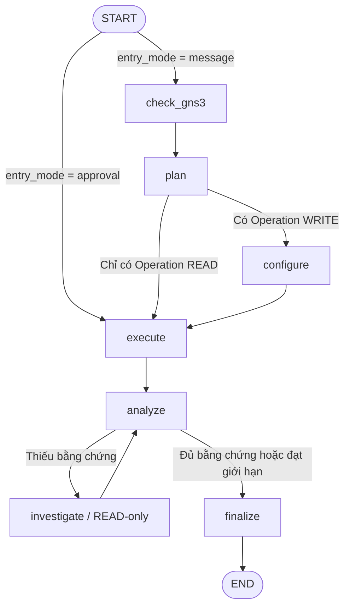
```mermaid
flowchart TD
    START([START]) -->|entry_mode = message| CHECK[check_gns3]
    START -->|entry_mode = approval| EXEC[execute]
    CHECK --> PLAN[plan]
    PLAN -->|Có Operation WRITE| CONFIGURE[configure]
    PLAN -->|Chỉ có Operation READ| EXEC
    CONFIGURE --> EXEC
    EXEC --> ANALYZE[analyze]
    ANALYZE -->|Thiếu bằng chứng| INVESTIGATE[investigate / READ-only]
    INVESTIGATE --> ANALYZE
    ANALYZE -->|Đủ bằng chứng hoặc đạt giới hạn| FINAL[finalize]
    FINAL --> END([END])
```

_Hình 3.3. Đồ thị workflow thống nhất với conditional edge tại START._

| Node LangGraph | Thành phần xử lý chính | Kết quả |
| --- | --- | --- |
| `check_gns3` | GNS3 Provider | Xác nhận GNS3 Server có thể truy cập |
| `plan` | Planning Orchestrator và Planner Agent | `PlanningDraft`; kế hoạch READ đã lưu hoặc kế hoạch WRITE chờ cấu hình |
| `configure` | Configuration Orchestrator và Configuration Agent | Kế hoạch WRITE có CLI đã xác thực và được lưu |
| `execute` | Execution Orchestrator, Approval Gate và Network Agent | Kết quả thực thi hoặc trạng thái chờ phê duyệt |
| `analyze` | Analysis Orchestrator, Analyst Agent và Causal Evidence Gate | `AnalysisResult` cùng Evidence Coverage |
| `investigate` | Analysis Orchestrator và Execution Orchestrator | Operation READ bổ sung và evidence mới |
| `finalize` | Analysis Orchestrator | Message `FINAL_RESPONSE` hoặc phản hồi chờ phê duyệt |

## 3.6. Thiết kế các quy trình xử lý nghiệp vụ

### 3.6.1. Quy trình tiếp nhận và phân tích yêu cầu

Quy trình bắt đầu khi người dùng đã được xác thực gửi một yêu cầu ngôn ngữ tự nhiên từ giao diện Chat. Với yêu cầu đầu tiên, Conversation Service tạo `Conversation` và lưu `Message` loại `USER_REQUEST` trong một transaction ngắn. Với hội thoại đã tồn tại, Service kiểm tra Conversation rồi lưu Message mới. Message phải được ghi thành công trước khi kích hoạt AI workflow để Task luôn có `source_message_id` hợp lệ và lịch sử yêu cầu vẫn được bảo toàn nếu LLM hoặc thiết bị mạng phát sinh lỗi.

API trả Message đã lưu cho frontend ngay sau bước ghi dữ liệu, còn `NetworkAutomationWorkflow.run_message` được đưa vào `BackgroundTasks`. Cách tổ chức này tách thời gian phản hồi HTTP khỏi thời gian Planner, thiết bị mạng và Analyst xử lý. Chỉ Message do người dùng gửi mới kích hoạt workflow; Message của Agent hoặc System chỉ được lưu làm lịch sử và không tạo Task mới, qua đó ngăn vòng lặp hội thoại ngoài ý muốn. Đối với Message đầu tiên, tiêu đề Conversation được sinh sau workflow để tránh gọi đồng thời hai yêu cầu LLM trên cùng một lượt xử lý.

Sau khi gửi Message, frontend mở kết nối SSE theo `source_message_id`. Backend liên kết Message với Task khi Task được tạo, phát lại các `TaskActivityEvent` có sequence lớn hơn cursor của client và tiếp tục gửi sự kiện mới. Cơ chế `Last-Event-ID` hoặc `after_sequence` cho phép tiếp tục từ vị trí đã nhận khi kết nối lại. Frontend tải lại dữ liệu hội thoại sau những activity cần thiết; nếu SSE lỗi liên tiếp, client chuyển sang polling dự phòng. SSE chỉ truyền dấu vết tiến trình đã lưu, không phải nguồn dữ liệu chuẩn thay thế PostgreSQL.

Trong graph xử lý Message mới, node `check_gns3` kiểm tra khả năng truy cập GNS3 Server trước khi tạo kế hoạch. Node `plan` sau đó yêu cầu Planning Orchestrator tạo Task, ghi các activity `MESSAGE_RECEIVED` và `TASK_CREATED`, lấy inventory cùng topology, rồi gọi Planner Agent. Nếu một lỗi xuất hiện trong giai đoạn lập kế hoạch hoặc validation, Task được chuyển sang `FAILED`, activity chứa giai đoạn và thông báo lỗi được lưu để frontend có thể hiển thị nguyên nhân thay vì giữ tiến trình ở trạng thái đang xử lý.

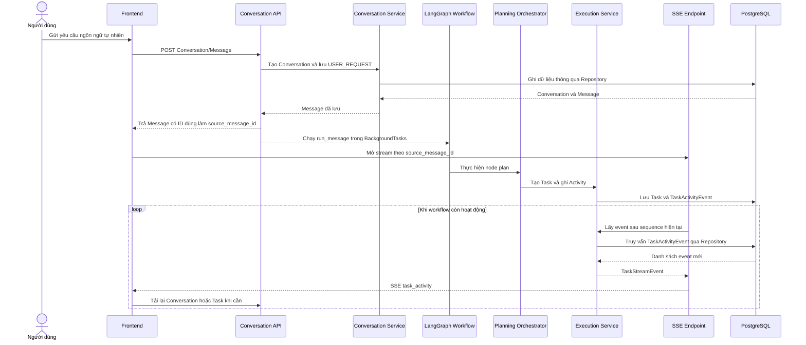
```mermaid
sequenceDiagram
    actor User as Người dùng
    participant FE as Frontend
    participant API as Conversation API
    participant CS as Conversation Service
    participant WF as LangGraph Workflow
    participant PO as Planning Orchestrator
    participant ES as Execution Service
    participant SSE as SSE Endpoint
    participant DB as PostgreSQL

    User->>FE: Gửi yêu cầu ngôn ngữ tự nhiên
    FE->>API: POST Conversation/Message
    API->>CS: Tạo Conversation và lưu USER_REQUEST
    CS->>DB: Ghi dữ liệu thông qua Repository
    DB-->>CS: Conversation và Message
    CS-->>API: Message đã lưu
    API-->>FE: Trả Message có ID dùng làm source_message_id

    API-->>WF: Chạy run_message trong BackgroundTasks
    FE->>SSE: Mở stream theo source_message_id

    WF->>PO: Thực hiện node plan
    PO->>ES: Tạo Task và ghi Activity
    ES->>DB: Lưu Task và TaskActivityEvent

    loop Khi workflow còn hoạt động
        SSE->>ES: Lấy event sau sequence hiện tại
        ES->>DB: Truy vấn TaskActivityEvent qua Repository
        DB-->>ES: Danh sách event mới
        ES-->>SSE: TaskStreamEvent
        SSE-->>FE: SSE task_activity
        FE->>API: Tải lại Conversation hoặc Task khi cần
    end
```

_Hình 3.4. Quy trình tiếp nhận Message, xử lý nền và cập nhật tiến trình qua SSE._

### 3.6.2. Quy trình lập kế hoạch và cấu hình mạng

Planner Agent nhận yêu cầu, inventory công khai, danh sách interface, topology neighbor, diagnostic playbook phù hợp và JSON Schema của `ExecutionPlanCreate`. Agent xác định `task_type`, phân rã mục tiêu thành các Operation, gán thiết bị, chỉ định `access_mode` và thiết lập dependency. Operation READ phải chứa `command` hoặc `commands`; Operation WRITE chỉ chứa `configuration_requirements` mô tả mục tiêu và ràng buộc cấu hình. Planner không nhận credential và không sinh CLI WRITE.

Planning Orchestrator kiểm tra toàn bộ `device_id` có thuộc inventory, kiểm tra interface vật lý được tham chiếu, thứ tự Operation và dependency. Kết quả hợp lệ được giữ dưới dạng `PlanningDraft`, gồm Task gốc, `ExecutionPlanCreate`, inventory và ánh xạ interface. Ở thời điểm này, các Operation chưa được vật hóa vào PostgreSQL để node `configure` có thể bổ sung CLI mà không phải sửa một kế hoạch WRITE đã lưu dở dang.

Conditional edge sau node `plan` kiểm tra thuộc tính `requires_configuration`. Nếu kế hoạch chỉ có READ, Planning Orchestrator lưu ngay Task Operation, Operation Dependency và Task Operation Device rồi chuyển đến `execute`. Nếu có ít nhất một mapping WRITE, state được chuyển sang node `configure`. Configuration Orchestrator ghi `CONFIGURATION_STARTED`, gọi Configuration Agent với phần kế hoạch WRITE và inventory tối thiểu, sau đó kiểm tra structured output `GeneratedConfigurationSet`.

Configuration Agent phải trả đúng một cấu hình cho mỗi Operation WRITE theo `operation_order`; kết quả trùng, thiếu hoặc thừa Operation đều bị từ chối. Các lệnh quản lý phiên như `configure terminal`, `end` và `write memory` được loại khỏi payload vì NetworkTool chịu trách nhiệm quản lý chế độ cấu hình và lưu cấu hình. Configuration Orchestrator tiếp tục đối chiếu interface trong CLI với dữ liệu GNS3. Chỉ sau khi kiểm tra thành công, activity `CONFIGURATION_COMPLETED` được ghi và Planning Orchestrator mới lưu kế hoạch hoàn chỉnh. Nếu Configuration Agent timeout, trả JSON sai schema hoặc sinh interface không tồn tại, Task kết thúc tại giai đoạn `CONFIGURATION` và không có lệnh nào được gửi đến thiết bị.

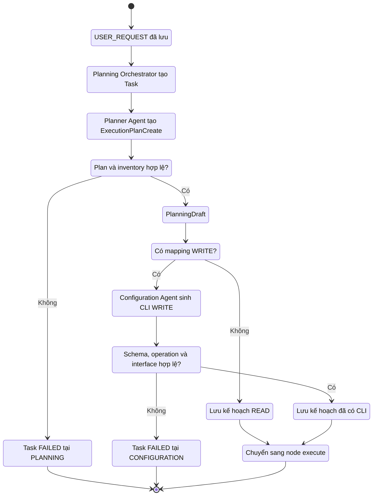
```mermaid
stateDiagram-v2
    state "USER_REQUEST đã lưu" as A
    state "Planning Orchestrator tạo Task" as B
    state "Planner Agent tạo ExecutionPlanCreate" as C
    state "Plan và inventory hợp lệ?" as D
    state D <<choice>>
    state "Task FAILED tại PLANNING" as X
    state "PlanningDraft" as E
    state "Có mapping WRITE?" as F
    state F <<choice>>
    state "Lưu kế hoạch READ" as I
    state "Configuration Agent sinh CLI WRITE" as G
    state "Schema, operation và interface hợp lệ?" as H
    state H <<choice>>
    state "Task FAILED tại CONFIGURATION" as Y
    state "Lưu kế hoạch đã có CLI" as J
    state "Chuyển sang node execute" as K

    [*] --> A
    A --> B
    B --> C
    C --> D
    D --> X: Không
    D --> E: Có
    E --> F
    F --> I: Không
    F --> G: Có
    G --> H
    H --> Y: Không
    H --> J: Có
    I --> K
    J --> K
    X --> [*]
    Y --> [*]
    K --> [*]
```

_Hình 3.5. Quy trình lập kế hoạch và sinh cấu hình có điều kiện._

### 3.6.3. Quy trình thực thi DAG và tổng hợp trạng thái

Node `execute` tải Task đã lưu và chuyển nó sang `RUNNING`. Execution Orchestrator duyệt các Operation theo `display_order`, nhưng chỉ thực thi Operation khi dependency đã thỏa mãn. Với dependency `ON_SUCCESS`, Operation tiền nhiệm phải có trạng thái `SUCCESS`; với `ON_COMPLETION`, Operation tiền nhiệm chỉ cần thuộc một trạng thái kết thúc. Operation không thỏa điều kiện được đánh dấu `SKIPPED`. Cơ chế này cho phép biểu diễn DAG trong cơ sở dữ liệu nhưng thực thi theo một thứ tự xác định và có thể truy vết.

Mỗi Operation được ánh xạ đến một hoặc nhiều `TaskOperationDevice`. Approval Gate lọc các mapping được phép thực thi: mapping READ có thể chuyển trực tiếp đến Network Agent, trong khi mapping WRITE phải có approval hợp lệ. Mapping đã `SUCCESS`, `REJECTED` hoặc `SKIPPED` không được chạy lại. Điều này đặc biệt quan trọng khi workflow được tiếp tục sau phê duyệt hoặc khi callback đến muộn.

Với mỗi mapping đủ điều kiện, `MappingExecutor` tạo `TaskExecution` ở trạng thái `RUNNING`, gọi Network Agent, đo `duration_ms`, lưu output và cập nhật trạng thái mapping. Từng `CommandResult` được ghi thành `DeviceActionLog`; activity `COMMAND_EXECUTED` liên kết Task, Operation, mapping và execution tương ứng. Lỗi kết nối, timeout, lỗi công cụ hoặc lỗi CLI được chuyển thành kết quả `FAILED` có thông báo thay vì làm mất dấu lần thực thi.

Sau khi các mapping kết thúc, trạng thái Operation được tổng hợp theo quy tắc: toàn bộ mapping thành công tạo `SUCCESS`; có cả thành công và thất bại tạo `PARTIAL_SUCCESS`; toàn bộ bị từ chối tạo `REJECTED`; còn lại là `FAILED`. Tương tự, trạng thái Task được tổng hợp từ các Operation thành `SUCCESS`, `PARTIAL_SUCCESS`, `REJECTED` hoặc `FAILED`. Nếu Operation chuyển sang `WAITING_APPROVAL`, lượt workflow hiện tại tạm dừng và không thực thi các Operation phụ thuộc phía sau.

Execution Orchestrator luôn đọc lại trạng thái Task trước các bước quan trọng. Task đã kết thúc không bị khởi động lại bởi callback phê duyệt đến muộn; Operation đã hoàn tất không được thực thi lại khi resume. Đối với vòng điều tra bổ sung, Orchestrator chỉ chạy các Operation READ mới được nối vào Task, giữ nguyên kết quả của kế hoạch ban đầu.

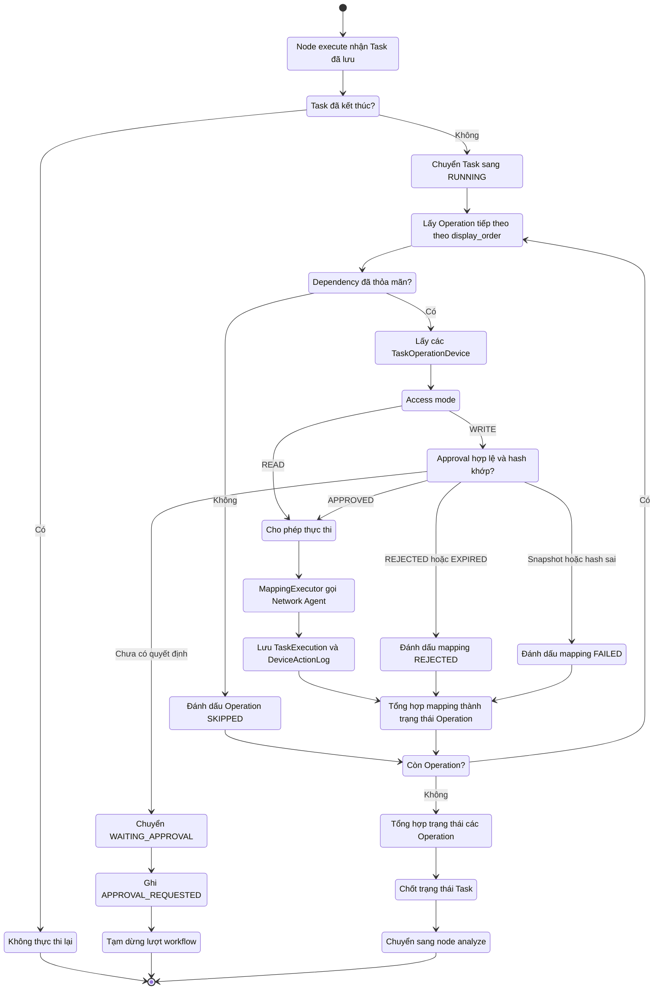
```mermaid
stateDiagram-v2
    state "Node execute nhận Task đã lưu" as A
    state "Task đã kết thúc?" as B
    state B <<choice>>
    state "Không thực thi lại" as Z
    state "Chuyển Task sang RUNNING" as C
    state "Lấy Operation tiếp theo theo display_order" as D
    state "Dependency đã thỏa mãn?" as E
    state E <<choice>>
    state "Đánh dấu Operation SKIPPED" as F
    state "Lấy các TaskOperationDevice" as G
    state "Access mode" as H
    state H <<choice>>
    state "Approval hợp lệ và hash khớp?" as I
    state I <<choice>>
    state "Cho phép thực thi" as J
    state "Chuyển WAITING_APPROVAL" as W
    state "Ghi APPROVAL_REQUESTED" as X
    state "Tạm dừng lượt workflow" as Y
    state "Đánh dấu mapping REJECTED" as R
    state "Đánh dấu mapping FAILED" as S
    state "MappingExecutor gọi Network Agent" as K
    state "Lưu TaskExecution và DeviceActionLog" as L
    state "Tổng hợp mapping thành trạng thái Operation" as M
    state "Còn Operation?" as N
    state N <<choice>>
    state "Tổng hợp trạng thái các Operation" as O
    state "Chốt trạng thái Task" as P
    state "Chuyển sang node analyze" as Q

    [*] --> A
    A --> B
    B --> Z: Có
    B --> C: Không
    C --> D
    D --> E
    E --> F: Không
    F --> N
    E --> G: Có
    G --> H
    H --> J: READ
    H --> I: WRITE
    I --> W: Chưa có quyết định
    W --> X
    X --> Y
    I --> R: REJECTED hoặc EXPIRED
    I --> S: Snapshot hoặc hash sai
    I --> J: APPROVED
    J --> K
    K --> L
    L --> M
    R --> M
    S --> M
    M --> N
    N --> D: Có
    N --> O: Không
    O --> P
    P --> Q
    Z --> [*]
    Y --> [*]
    Q --> [*]
```

_Hình 3.6. Quy trình thực thi DAG, kiểm soát mapping và tổng hợp trạng thái._

### 3.6.4. Quy trình chẩn đoán sự cố và phân tích nguyên nhân gốc

Với Task `DIAGNOSIS` hoặc `COMPOSITE`, Planner ưu tiên tạo Operation READ theo diagnostic playbook nhằm thu thập trạng thái interface, cấu hình đang chạy, route, neighbor hoặc dữ liệu giao thức liên quan. Kết quả từ Network Agent được Analysis Orchestrator gắn hostname, phân tích thành `DiagnosticEvidence` và kết hợp với topology GNS3. Evidence Coverage được tính bằng cách so sánh những loại evidence thực tế với `required_evidence` của các playbook đang áp dụng.

Analyst Agent nhận output đã chuẩn hóa, structured evidence và trạng thái coverage để tạo `AnalysisResult`. Kết quả bao gồm phát hiện, nguyên nhân có khả năng, mức tin cậy, khoảng trống evidence, các phép kiểm tra đề xuất và submission RCA có cấu trúc. Ground Truth của Benchmark Scenario không được đưa vào prompt của Planner hoặc Analyst.

Kết luận của Analyst được chuyển qua Causal Evidence Gate. Gate đối chiếu candidate root cause với bằng chứng trực tiếp, thiết bị, interface và phạm vi topology. Candidate đủ bằng chứng được đưa vào `root_causes`; candidate chưa đủ bằng chứng được chuyển sang `suspected_causes`, đồng thời lý do bị hạ mức được bổ sung vào `evidence_gaps`. Khi playbook đã đủ evidence nhưng Analyst không tạo root cause dù đã phát hiện bất thường, hệ thống cho phép một lần diễn giải lại có kiểm soát trước khi kết luận.

Nếu evidence bắt buộc còn thiếu hoặc Analyst yêu cầu thêm dữ liệu, conditional edge sau node `analyze` có thể chuyển sang `investigate`. Analysis Orchestrator ưu tiên command còn thiếu từ playbook, kết hợp `suggested_checks` hợp lệ và ánh xạ chúng đến thiết bị mục tiêu hoặc láng giềng trong topology. Mọi Operation điều tra đều là READ-only; schema chỉ chấp nhận lệnh bắt đầu bằng `show`, `ping` hoặc `traceroute`. Các lệnh đã chạy được loại bỏ để tránh thu thập lặp lại không cần thiết.

Node `investigate` thực thi kế hoạch bổ sung rồi quay lại `analyze`. Vòng lặp dừng khi evidence hoàn chỉnh, root cause đã được xác nhận, không còn phép kiểm tra mới hoặc đạt `AGENT_MAX_INVESTIGATION_ROUNDS`. Khi dừng, hệ thống ghi Evidence Coverage, evidence còn thiếu và lý do dừng vào activity. Nếu LLM timeout hoặc structured output không hợp lệ sau retry, Analysis Orchestrator tạo phản hồi dự phòng, không tạo root cause giả và đánh dấu cần thêm dữ liệu.

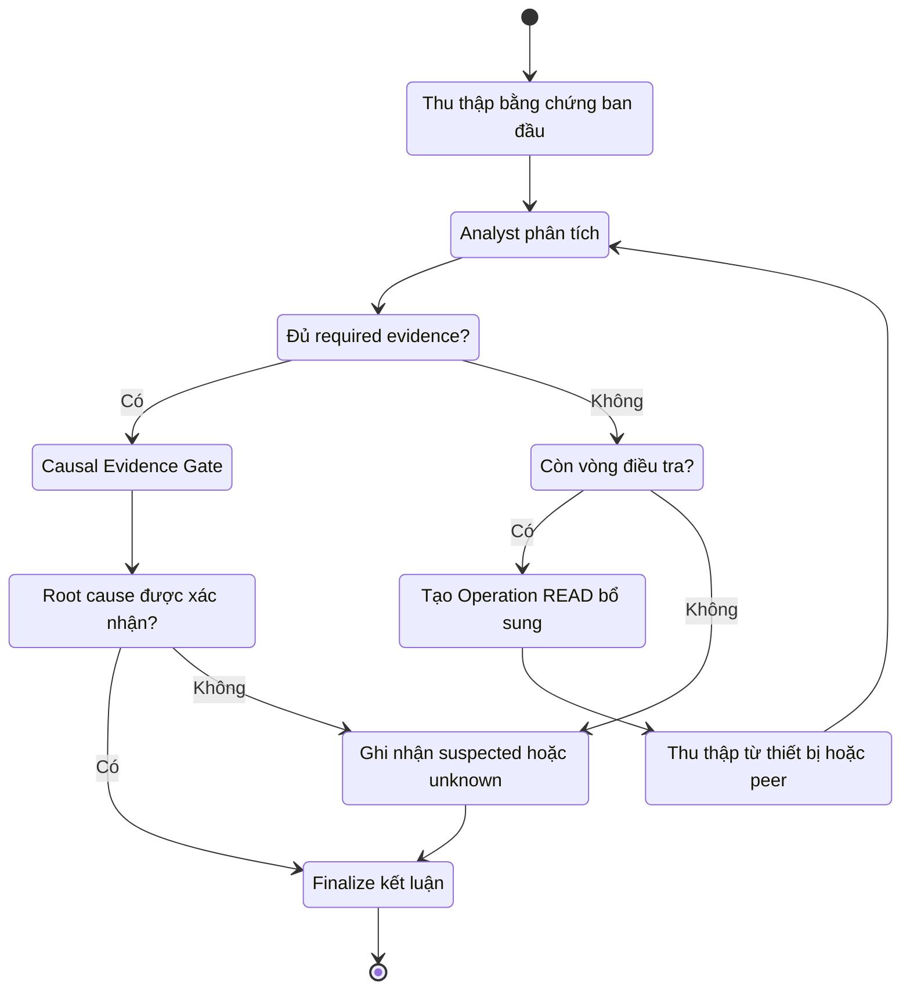
```mermaid
stateDiagram-v2
    state "Thu thập bằng chứng ban đầu" as A
    state "Analyst phân tích" as B
    state "Đủ required evidence?" as C
    state C <<choice>>
    state "Causal Evidence Gate" as D
    state "Root cause được xác nhận?" as E
    state E <<choice>>
    state "Finalize kết luận" as F
    state "Ghi nhận suspected hoặc unknown" as G
    state "Còn vòng điều tra?" as H
    state H <<choice>>
    state "Tạo Operation READ bổ sung" as I
    state "Thu thập từ thiết bị hoặc peer" as J

    [*] --> A
    A --> B
    B --> C
    C --> D: Có
    D --> E
    E --> F: Có
    E --> G: Không
    C --> H: Không
    H --> I: Có
    I --> J
    J --> B
    H --> G: Không
    G --> F
    F --> [*]
```

_Hình 3.7. Quy trình chẩn đoán và thu thập bổ sung bằng chứng._

### 3.6.5. Quy trình phê duyệt và kiểm soát thực thi

Approval Gate phân biệt mapping READ và WRITE. Khi gặp một mapping WRITE chưa có approval, Execution Service tạo yêu cầu phê duyệt gồm danh sách command snapshot, SHA-256 request hash, thời điểm tạo và thời hạn hiệu lực; mapping chuyển sang `WAITING_APPROVAL`. Execution Orchestrator ghi activity `APPROVAL_REQUESTED` rồi kết thúc lượt graph hiện tại. Frontend dừng SSE của lượt xử lý đang chờ và hiển thị thẻ phê duyệt từ dữ liệu đã lưu.

Chỉ người dùng có permission `Task Management/Approve` mới được gửi quyết định. Backend lấy `user_id` từ access token, không nhận danh tính người phê duyệt tùy ý từ payload. Quyết định được lưu một lần và activity `APPROVAL_APPROVED` hoặc `APPROVAL_REJECTED` được ghi kèm approval ID và người quyết định.

Sau mọi quyết định, backend khởi chạy `resume_after_approval` trong BackgroundTasks. Approval graph không lặp lại các node `check_gns3`, `plan` và `configure`; graph tải Task từ PostgreSQL và bắt đầu tại `execute`. Approval Gate tính lại hash từ mapping ID và danh sách command hiện tại. Operation WRITE chỉ được thực thi khi trạng thái là `APPROVED`, approval chưa hết hạn, `commands_snapshot` còn nguyên và request hash khớp. Approval `REJECTED` hoặc `EXPIRED` làm mapping chuyển sang `REJECTED`; snapshot hoặc hash không khớp làm mapping chuyển sang `FAILED`. Trong các trường hợp này, Network Agent không được gọi cho mapping đó.

Nếu Task thuộc Benchmark Run, việc resume chỉ hoàn tất Evaluation khi lượt chạy `entry_mode=approval` đã tạo Message `FINAL_RESPONSE`. Một phản hồi yêu cầu phê duyệt không được xem là kết quả benchmark cuối cùng.

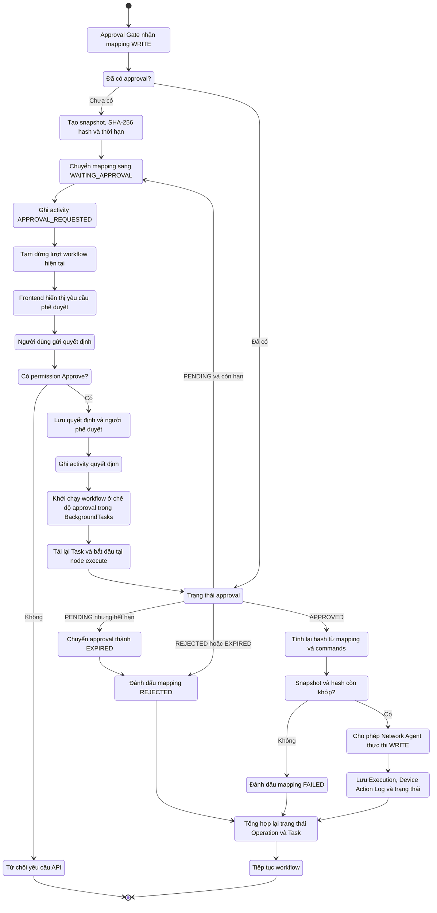
```mermaid
stateDiagram-v2
    state "Approval Gate nhận mapping WRITE" as A
    state "Đã có approval?" as B
    state B <<choice>>
    state "Tạo snapshot, SHA-256 hash và thời hạn" as C
    state "Chuyển mapping sang WAITING_APPROVAL" as D
    state "Ghi activity APPROVAL_REQUESTED" as E
    state "Tạm dừng lượt workflow hiện tại" as F
    state "Frontend hiển thị yêu cầu phê duyệt" as G
    state "Trạng thái approval" as H
    state H <<choice>>
    state "Chuyển approval thành EXPIRED" as I
    state "Đánh dấu mapping REJECTED" as J
    state "Người dùng gửi quyết định" as K
    state "Có permission Approve?" as L
    state L <<choice>>
    state "Từ chối yêu cầu API" as M
    state "Lưu quyết định và người phê duyệt" as N
    state "Ghi activity quyết định" as O
    state "Khởi chạy workflow ở chế độ approval trong BackgroundTasks" as P
    state "Tải lại Task và bắt đầu tại node execute" as Q
    state "Tính lại hash từ mapping và commands" as R
    state "Snapshot và hash còn khớp?" as S
    state S <<choice>>
    state "Đánh dấu mapping FAILED" as T
    state "Cho phép Network Agent thực thi WRITE" as U
    state "Lưu Execution, Device Action Log và trạng thái" as V
    state "Tổng hợp lại trạng thái Operation và Task" as W
    state "Tiếp tục workflow" as X

    [*] --> A
    A --> B
    B --> C: Chưa có
    C --> D
    D --> E
    E --> F
    F --> G
    B --> H: Đã có
    H --> D: PENDING và còn hạn
    H --> I: PENDING nhưng hết hạn
    I --> J
    H --> J: REJECTED hoặc EXPIRED
    G --> K
    K --> L
    L --> M: Không
    L --> N: Có
    N --> O
    O --> P
    P --> Q
    Q --> H
    H --> R: APPROVED
    R --> S
    S --> T: Không
    S --> U: Có
    U --> V
    J --> W
    T --> W
    V --> W
    W --> X
    M --> [*]
    X --> [*]
```

_Hình 3.8. Activity Diagram của quy trình Approval Gate._

### 3.6.6. Quy trình kết luận, phản hồi và ghi nhận nhật ký

Sau node `execute`, node `analyze` chỉ tạo kết luận khi Task không còn ở trạng thái đang thực thi hoặc chờ quyết định. Khi workflow đã đủ điều kiện dừng, node `finalize` ghi Evidence Gate cuối cùng, định dạng `AnalysisResult` thành nội dung tiếng Việt dễ đọc và lưu Message loại `FINAL_RESPONSE`. Activity `FINAL_RESPONSE_CREATED` liên kết phản hồi với Task; SSE đóng stream sau khi phát sự kiện này. Với lỗi ở giai đoạn Planning hoặc Configuration, SSE cũng có thể kết thúc sau activity `TASK_FAILED` tương ứng để giao diện không tiếp tục chờ vô hạn.

Hệ thống sử dụng nhiều nhóm bản ghi có mục đích khác nhau. `task_activity_events` lưu các mốc workflow, actor, trạng thái và sequence phục vụ timeline; `task_executions` lưu từng lần gọi công cụ cùng thời gian và output; `device_action_logs` lưu command thực tế và kết quả theo thiết bị; Approval lưu quyết định của người dùng; `audit_logs` ghi những thao tác quản trị cần kiểm toán ở cấp hệ thống. Các nhật ký này hỗ trợ truy vết nhưng không thay thế việc xác minh trạng thái mạng bằng command READ hoặc điều kiện benchmark.

Structured diagnosis được lưu trong activity `ANALYSIS_COMPLETED` trước khi evaluator đọc kết quả. Dữ liệu bao gồm `is_anomaly`, `root_causes`, `suspected_causes`, Evidence Coverage, lỗi thực thi và thông tin Causal Evidence Gate. Cách lưu này cho phép Benchmark Evaluator chấm submission do Agent tạo ra mà không phải suy diễn root cause từ văn bản phản hồi cuối và không làm rò rỉ Ground Truth vào quá trình chẩn đoán.

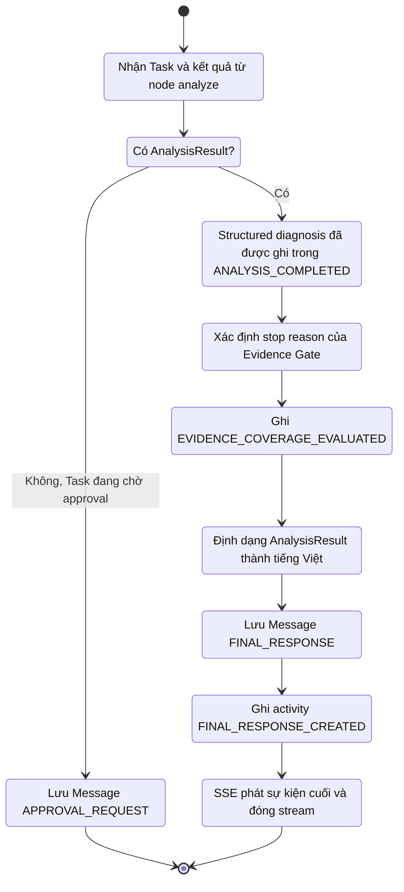
```mermaid
stateDiagram-v2
    state "Nhận Task và kết quả từ node analyze" as A
    state "Có AnalysisResult?" as B
    state B <<choice>>
    state "Lưu Message APPROVAL_REQUEST" as C
    state "Structured diagnosis đã được ghi trong ANALYSIS_COMPLETED" as H
    state "Xác định stop reason của Evidence Gate" as D
    state "Ghi EVIDENCE_COVERAGE_EVALUATED" as E
    state "Định dạng AnalysisResult thành tiếng Việt" as F
    state "Lưu Message FINAL_RESPONSE" as G
    state "Ghi activity FINAL_RESPONSE_CREATED" as I
    state "SSE phát sự kiện cuối và đóng stream" as J

    [*] --> A
    A --> B
    B --> C: Không, Task đang chờ approval
    C --> [*]
    B --> H: Có
    H --> D
    D --> E
    E --> F
    F --> G
    G --> I
    I --> J
    J --> [*]
```

_Hình 3.9. Quy trình tạo phản hồi cuối, lưu kết quả phân tích và kết thúc SSE._

### 3.6.7. Quy trình Benchmark Run và khôi phục môi trường

Benchmark Run là quy trình nghiệp vụ bao quanh workflow chẩn đoán. Khi người dùng bắt đầu một Scenario đang hoạt động, Benchmark Service đóng băng toàn bộ Scenario thành `scenario_snapshot`, tạo Run ở trạng thái `PREPARING` và lưu Run trước khi tác động đến topology. Service lần lượt kiểm tra precondition bằng READ, thực thi injection bằng WRITE và kiểm tra `fault_verification`. Nếu toàn bộ bước chuẩn bị thành công, Run chuyển sang `READY` và `cleanup_required=true`.

Khi người dùng bắt đầu Chat từ Run, Conversation và USER_REQUEST được liên kết với Run; Run chuyển sang `RUNNING`. Workflow Multi-Agent xử lý yêu cầu theo cùng quy trình thông thường. Chỉ khi có `FINAL_RESPONSE`, Benchmark Service mới đọc structured diagnosis và các observation đã lưu, tạo `TaskEvaluation` cùng các metric, liên kết Evaluation và Task với Run rồi chuyển Run sang `COMPLETED`. Nếu workflow dừng để chờ approval, Run tiếp tục ở trạng thái `RUNNING` cho đến khi nhánh resume tạo phản hồi cuối.

Nếu precondition, injection hoặc fault verification thất bại, Run chuyển sang `FAILED`. Khi injection đã bắt đầu, hệ thống ưu tiên cleanup trước khi ghi nhận kết quả lỗi; nếu cleanup cũng thất bại, `cleanup_required` vẫn được giữ để cảnh báo môi trường chưa được khôi phục. Cleanup sử dụng các action trong snapshot, mở kết nối mới cho mỗi lần thử, tạo READ check tương ứng và chỉ đánh dấu `CLEANED` sau khi trạng thái phục hồi được xác minh. Cơ chế retry có giới hạn; khi hết số lần thử, Run không được xem là đã cleanup thành công. Thiết kế chi tiết Scenario, action, Ground Truth và evaluator được trình bày tiếp tại mục 3.9.

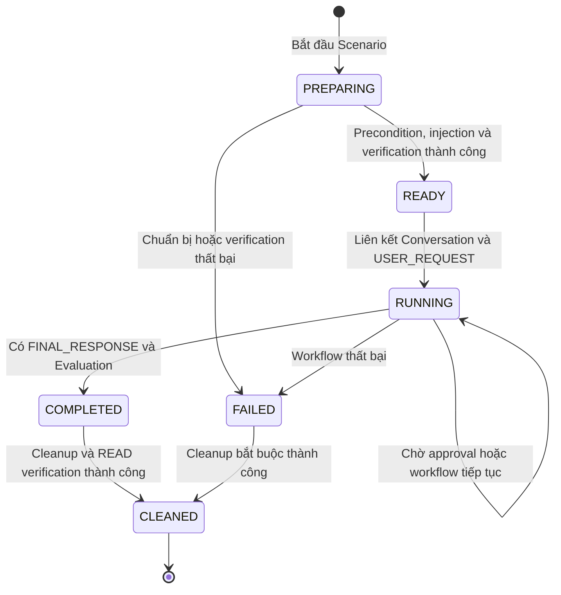
```mermaid
stateDiagram-v2
    [*] --> PREPARING: Bắt đầu Scenario
    PREPARING --> READY: Precondition, injection và verification thành công
    PREPARING --> FAILED: Chuẩn bị hoặc verification thất bại
    READY --> RUNNING: Liên kết Conversation và USER_REQUEST
    RUNNING --> RUNNING: Chờ approval hoặc workflow tiếp tục
    RUNNING --> COMPLETED: Có FINAL_RESPONSE và Evaluation
    RUNNING --> FAILED: Workflow thất bại
    COMPLETED --> CLEANED: Cleanup và READ verification thành công
    FAILED --> CLEANED: Cleanup bắt buộc thành công
    CLEANED --> [*]
```

_Hình 3.10. Vòng đời Benchmark Run và điều kiện khôi phục môi trường._

## 3.7. Thiết kế dữ liệu và cơ sở dữ liệu

### 3.7.1. Mô hình dữ liệu và sơ đồ ERD

PostgreSQL quản lý dữ liệu theo các miền Identity, Inventory, Conversation, Execution, Benchmark, Evaluation và Audit. Các thực thể được liên kết bằng khóa ngoại để truy vết từ yêu cầu người dùng đến Task, kế hoạch, lần thực thi, hành động trên thiết bị và kết quả đánh giá.

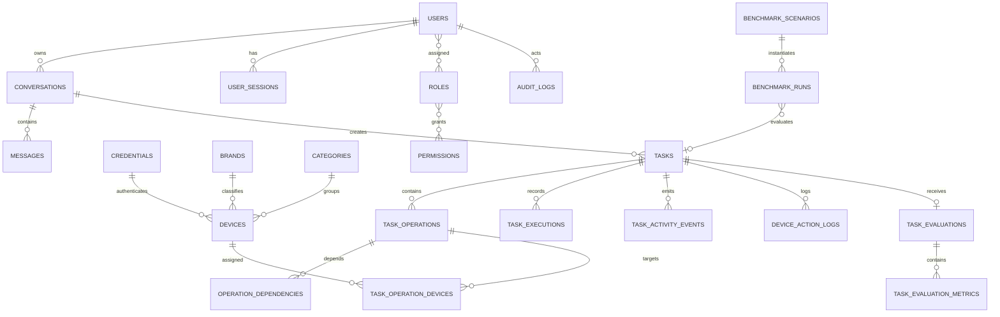
```mermaid
erDiagram
    USERS ||--o{ CONVERSATIONS : owns
    USERS ||--o{ USER_SESSIONS : has
    USERS }o--o{ ROLES : assigned
    ROLES }o--o{ PERMISSIONS : grants
    CREDENTIALS ||--o{ DEVICES : authenticates
    BRANDS ||--o{ DEVICES : classifies
    CATEGORIES ||--o{ DEVICES : groups
    CONVERSATIONS ||--o{ MESSAGES : contains
    CONVERSATIONS ||--o{ TASKS : creates
    TASKS ||--o{ TASK_OPERATIONS : contains
    TASK_OPERATIONS ||--o{ OPERATION_DEPENDENCIES : depends
    TASK_OPERATIONS ||--o{ TASK_OPERATION_DEVICES : targets
    DEVICES ||--o{ TASK_OPERATION_DEVICES : assigned
    TASKS ||--o{ TASK_EXECUTIONS : records
    TASKS ||--o{ TASK_ACTIVITY_EVENTS : emits
    TASKS ||--o{ DEVICE_ACTION_LOGS : logs
    BENCHMARK_SCENARIOS ||--o{ BENCHMARK_RUNS : instantiates
    BENCHMARK_RUNS }o--o| TASKS : evaluates
    TASKS ||--o| TASK_EVALUATIONS : receives
    TASK_EVALUATIONS ||--o{ TASK_EVALUATION_METRICS : contains
    USERS ||--o{ AUDIT_LOGS : acts
```

_Hình 3.11. Sơ đồ quan hệ thực thể rút gọn của hệ thống._

### 3.7.2. Quản lý thiết bị và thông tin kết nối

Inventory được chuẩn hóa thành Brand, Category, Credential và Device. Thiết bị chứa hostname, host/port, driver và liên kết credential. Password và enable secret được mã hóa khi lưu; chỉ lớp kết nối nội bộ được giải mã khi cần. Planner và frontend không nhận plaintext hoặc ciphertext của thông tin xác thực.

### 3.7.3. Quản lý Task, Operation và Execution

Task đại diện cho nhiệm vụ phát sinh từ yêu cầu người dùng. Mỗi Task chứa nhiều Operation; dependency biểu diễn điều kiện thực thi giữa các Operation; bảng ánh xạ Operation–Device quản lý vai trò, access mode và trạng thái trên từng thiết bị. Task Execution lưu từng lần thực thi, Device Action Log ghi lệnh và output, còn Task Activity Event ghi các sự kiện quan trọng trong vòng đời nhiệm vụ.

### 3.7.4. Quản lý kết quả đánh giá và Audit Log

Benchmark Scenario mô tả kịch bản, trạng thái ban đầu, injection, Ground Truth và cleanup; Benchmark Run đại diện cho một lần chạy độc lập. Task Evaluation và Evaluation Metric lưu điểm, giá trị mong đợi, giá trị thực tế và bằng chứng. Audit Log ghi các thao tác nghiệp vụ cần kiểm toán độc lập với phản hồi ngôn ngữ tự nhiên của Agent.

## 3.8. Xây dựng và triển khai hệ thống

### 3.8.1. Xây dựng Backend và API

Backend được phát triển bằng FastAPI và tổ chức theo domain. Router tiếp nhận HTTP request và kiểm tra quyền; Service thực hiện logic nghiệp vụ; Repository truy xuất dữ liệu; Schema và Model định nghĩa hợp đồng dữ liệu. Các Agent không trực tiếp thao tác ORM hoặc cơ sở dữ liệu.

### 3.8.2. Xây dựng giao diện quản trị

Frontend được xây dựng bằng React 19, TypeScript, Vite, Tailwind CSS và hệ component shadcn; sử dụng các thư viện bảng, form, trạng thái và giao tiếp HTTP phù hợp. Các feature hiện có gồm Login/Profile, Dashboard, Chatbot/Conversation, Tasks, Devices, Credentials, Device Catalog, Users, Roles/Access Control, Audit Logs, Benchmark Scenarios, Benchmark Runs và Evaluations. Giao diện chat hỗ trợ danh sách hội thoại, activity timeline, hiển thị yêu cầu approval và mở chi tiết Task; trang Benchmark hỗ trợ nhập action/check/Ground Truth và xem kết quả chạy.

Trang Evaluations hiển thị lịch sử đánh giá, GOAL/RCA, Remediation/Safety, Latency và Interaction Turns, cùng các kết quả có cấu trúc của v4 gồm RCA F1, Precision, Recall, Localization F1, Fault Type F1 và Detection. Trang tổng quan TSR trình bày tỷ lệ, số mẫu hợp lệ và phân loại run. Phiên bản evaluator được hiển thị nhằm phân biệt cách chấm từ khóa cũ với bộ chấm v4.

### 3.8.3. Tích hợp LLM và các công cụ mạng

Planner Agent và Analyst Agent gọi LLM qua NVIDIA AI Endpoint; phản hồi được kiểm tra bằng Pydantic trước khi chuyển sang bước tiếp theo. Network Agent sử dụng `NetworkTool` thay vì gọi LLM, nhờ đó quyền thực thi lệnh được giữ tại tầng ứng dụng. Các thư viện I/O đồng bộ được gọi theo cách không chặn vòng lặp bất đồng bộ của FastAPI.

### 3.8.4. Triển khai và cấu hình môi trường

Backend, PostgreSQL, migration và pgAdmin được tổ chức bằng Docker Compose. Cấu hình kết nối cơ sở dữ liệu, khóa xác thực, LLM provider và network backend được quản lý qua biến môi trường. Frontend chạy bằng Vite trong quá trình phát triển và kết nối REST API bằng access token. GNS3 Server hoạt động như môi trường thực nghiệm bên ngoài các dịch vụ nghiệp vụ.

### 3.8.5. Giao diện các nhóm API

| Nhóm API     | Chức năng chính                                           |
| ------------ | --------------------------------------------------------- |
| Identity     | Đăng nhập, phiên, người dùng, vai trò và quyền truy cập   |
| Inventory    | Thiết bị, danh mục thiết bị và credential kết nối         |
| Conversation | Hội thoại, tin nhắn và yêu cầu xử lý AI                   |
| Execution    | Task, Operation, kết quả thực thi và quyết định phê duyệt |
| Benchmark    | Scenario, Benchmark Run và Cleanup                        |
| Evaluation   | Kết quả đánh giá và các metric                            |
| Audit        | Nhật ký kiểm toán và bộ lọc tra cứu                       |

Các API nghiệp vụ dùng tiền tố `/api/v1`. Frontend không trực tiếp kết nối thiết bị; mọi thao tác được chuyển đến Service và Orchestrator tương ứng. FastAPI cung cấp thêm health endpoint và tài liệu OpenAPI phục vụ phát triển, kiểm thử tích hợp.

## 3.9. Thiết kế hệ thống thực nghiệm và đánh giá

### 3.9.1. Thiết kế Benchmark Scenario và Ground Truth

Benchmark Scenario có `scenario_key`, version, mô tả, topology, initial_message, preconditions, injection, fault_verification, ground_truth, evaluation_required_terms và cleanup. Engine thực hiện kiểm tra điều kiện trước; tiêm lỗi bằng các action có schema; xác minh trạng thái sự cố; sau đó phát hành run sẵn sàng để Chat của Agent giải quyết. Khi bắt đầu Chat, run liên kết tới conversation/source message; khi nhận FINAL_RESPONSE, lưu Evaluation và hoàn tất run. Cleanup được retry có giới hạn bằng kết nối mới và chỉ hoàn tất sau khi READ check suy ra từ action xác nhận thiết bị đã phục hồi; runner dừng nếu không thể xác nhận nhằm bảo toàn tính độc lập giữa các kịch bản. Cơ chế này có thể quản lý scenario, lịch sử và trạng thái chuẩn bị/chạy/hoàn thành/thất bại/cleanup.

### 3.9.2. Quy trình tiêm lỗi, kiểm thử và khôi phục môi trường

Các nhóm injection đã có bộ dựng command bao gồm shutdown/no shutdown interface, điều chỉnh network OSPF, MPLS trên interface, default route, IP/mask, ACL và BGP neighbor shutdown/no shutdown. Có các seed chứa các tình huống interface down, OSPF, MPLS, cấu hình IP, ACL, Loopback0 và BGP. Sự hiện diện của seed/chương trình dựng command **không mặc nhiên xác nhận đã chạy thành công tất cả scenario trong lab**.

Quy trình thực nghiệm gồm kiểm tra precondition, tiêm lỗi, xác minh fault, gửi yêu cầu cho hệ thống Multi-Agent, thu thập kết quả, chấm điểm và cleanup. Nếu không xác minh được trạng thái khôi phục, runner dừng trước kịch bản tiếp theo để tránh làm sai lệch dữ liệu.

### 3.9.3. Cơ chế thu thập và đánh giá kết quả

Ground Truth được lưu ở snapshot của lần chạy để việc cập nhật scenario về sau không thay đổi căn cứ chấm của run cũ. `BenchmarkObservationRepository` đọc kết luận Agent từ Activity Event `ANALYSIS_COMPLETED`, đếm các lần Agent gọi tool và lấy mốc timestamp để tính thời gian. Evaluator v4 xuất dữ liệu từng metric với `expected_value`, `actual_value`, `evidence`; lưu vào các bảng Evaluation và metric, kết quả API chỉ đọc được người có quyền truy cập yêu cầu. TSR được tổng hợp bằng truy vấn SQL từ toàn bộ Benchmark Run, không lấy mẫu chỉ theo các dòng giao diện đã tải.

### 3.9.4. Quy tắc tính toán các chỉ số đánh giá

Tỷ lệ hoàn thành nhiệm vụ được tính trên các lượt có GOAL PASS hoặc GOAL FAIL hợp lệ:

$$
TSR=\frac{N_{pass}}{N_{pass}+N_{fail}}\times100\%
$$

Với RCA, gọi $P$ là tập cặp tài nguyên–loại lỗi dự đoán và $G$ là Ground Truth:

$$
TP=|P\cap G|,\qquad FP=|P-G|,\qquad FN=|G-P|
$$

$$
Precision=\frac{TP}{TP+FP},\qquad Recall=\frac{TP}{TP+FN}
$$

$$
F1=\frac{2\times Precision\times Recall}{Precision+Recall}
$$

Active Latency được tính từ thời điểm tạo Task đến phản hồi cuối, sau khi loại trừ các khoảng chờ phê duyệt hợp lệ:

$$
T_{active}=T_{final}-T_{task}-T_{approval}
$$

Interaction Turns là số lần Agent gọi công cụ trong phạm vi Task, không phải số tin nhắn hoặc số bước suy luận nội bộ. Remediation và Safety chỉ được ghi PASS/FAIL khi có bộ chấm và bằng chứng tương ứng; nếu chưa triển khai đầy đủ, metric phải được phân loại NOT_APPLICABLE.

---

# CHƯƠNG 4. THỰC NGHIỆM VÀ ĐÁNH GIÁ

Chương này trình bày **những phép đánh giá đã được hiện thực** và phân biệt kết quả kiểm thử phần mềm với kết quả thực nghiệm hiệu năng của AI. Thông tin số được đưa vào chỉ khi có bằng chứng: mã nguồn và test tại nhánh develop, nhật ký pytest do nhóm cung cấp, và một ảnh chụp Evaluation phiên bản v4. Các giá trị chưa đo được trên nhiều lần chạy sẽ không được suy diễn hoặc tạo số liệu minh họa như thể là kết quả nghiên cứu.

## 4.1. Mục tiêu và thiết kế thực nghiệm

### 4.1.1. Mục tiêu thực nghiệm

Mục tiêu của quá trình thực nghiệm là đánh giá khả năng hoạt động của hệ thống Multi-Agent trong việc tiếp nhận và xử lý các yêu cầu chẩn đoán sự cố mạng thông qua ngôn ngữ tự nhiên. Các phép thử tập trung kiểm tra khả năng phối hợp giữa những thành phần chuyên trách, bao gồm lập kế hoạch, thu thập thông tin từ thiết bị và phân tích kết quả nhằm xác định nguyên nhân sự cố.
Đối với nhiệm vụ chẩn đoán, nghiên cứu đánh giá khả năng phát hiện bất thường (Anomaly Detection), định vị sự cố (Fault Localization) và phân tích nguyên nhân gốc (Root Cause Analysis – RCA). Kết quả được đối chiếu với dữ liệu chuẩn (Ground Truth) của từng kịch bản thông qua các chỉ số Precision, Recall, F1-score và Exact Match. Bên cạnh đó, thời gian thực thi và số lượt tương tác giữa Agent với công cụ mạng cũng được ghi nhận nhằm xem xét đặc điểm vận hành của hệ thống.
Thông qua quá trình thực nghiệm, đề tài hướng đến việc xác định mức độ đáp ứng của hệ thống đối với những nhiệm vụ chẩn đoán trong môi trường giả lập, đồng thời làm rõ các hạn chế ảnh hưởng đến chất lượng kết quả xử lý.

### 4.1.2. Câu hỏi nghiên cứu và tiêu chí đánh giá

Để đánh giá hệ thống một cách có hệ thống, nghiên cứu xác định ba câu hỏi nghiên cứu tập trung vào khả năng hoàn thành nhiệm vụ, chất lượng chẩn đoán và thời gian thực thi.

Bảng 4.1. Các câu hỏi nghiên cứu và tiêu chí đánh giá

| Mã  | Câu hỏi nghiên cứu                                                                               | Tiêu chí đánh giá                                                                       |
| --- | ------------------------------------------------------------------------------------------------ | --------------------------------------------------------------------------------------- |
| RQ1 | Hệ thống có khả năng hoàn thành các nhiệm vụ chẩn đoán sự cố mạng ở mức độ nào?                  | Task Success Rate (TSR)                                                                 |
| RQ2 | Hệ thống có khả năng phát hiện, định vị và xác định nguyên nhân gốc của sự cố chính xác đến đâu? | Detection Score, Localization Precision/Recall/F1, RCA Precision/Recall/F1, Exact Match |
| RQ3 | Quá trình xử lý nhiệm vụ tiêu tốn bao nhiêu thời gian và số lượt tương tác với công cụ mạng?     | Latency, Interaction Turns                                                              |

Các câu hỏi được đánh giá dựa trên dữ liệu Benchmark Run và Evaluation được ghi nhận trong quá trình thực nghiệm. Đối với RQ1, kết quả hoàn thành nhiệm vụ được xác định thông qua chỉ số GOAL. Đối với RQ2, các kết quả chẩn đoán có cấu trúc được so sánh với Ground Truth nhằm xác định mức độ chính xác ở từng giai đoạn. RQ3 được xem xét thông qua những thông tin về thời gian xử lý và số lần gọi công cụ được hệ thống lưu trữ.

### 4.1.3. Phạm vi và điều kiện thực nghiệm

Phạm vi thực nghiệm được giới hạn trong môi trường mạng giả lập GNS3, sử dụng các thiết bị Cisco IOS và cấu hình mạng được xây dựng theo topology tham chiếu của đề tài. Các kịch bản tập trung vào những sự cố liên quan đến trạng thái giao diện, địa chỉ IP, định tuyến, MPLS, BGP và chính sách kiểm soát lưu lượng.
Mỗi kịch bản được xác định thông qua trạng thái ban đầu, thao tác thiết lập sự cố, yêu cầu chẩn đoán và kết quả mong đợi. Quá trình thực nghiệm được tổ chức theo từng lượt riêng biệt, đồng thời thực hiện khôi phục cấu hình sau khi hoàn thành nhằm hạn chế ảnh hưởng giữa các kịch bản.
Hệ thống sử dụng các mô hình ngôn ngữ lớn đã được phát triển sẵn thông qua NVIDIA API, không tiến hành huấn luyện hoặc tinh chỉnh mô hình. Kết quả nghiên cứu phản ánh khả năng hoạt động của hệ thống trong phạm vi môi trường và tập kịch bản được lựa chọn, chưa đại diện cho toàn bộ những tình huống phát sinh trong mạng thực tế.

## 4.2. Môi trường và cấu hình thực nghiệm

### 4.2.1. Hạ tầng phần cứng và phần mềm

Môi trường thực nghiệm bao gồm ứng dụng Frontend, Backend, cơ sở dữ liệu PostgreSQL và hệ thống mạng giả lập GNS3. Frontend được phát triển bằng React và TypeScript, trong khi Backend sử dụng FastAPI kết hợp LangGraph để tổ chức quy trình xử lý Multi-Agent.

Lớp NetworkTool tích hợp Netmiko và Nornir để thực hiện các thao tác tương tác với thiết bị mạng thông qua giao diện dòng lệnh. PostgreSQL được sử dụng để lưu trữ các thông tin nghiệp vụ, trạng thái tác vụ và kết quả đánh giá. Các thành phần Backend và cơ sở dữ liệu được hỗ trợ triển khai thông qua Docker Compose.

Bảng 4.2. Cấu hình môi trường thực nghiệm

| Thành phần       | Công nghệ và mục đích                                                                |
| ---------------- | ------------------------------------------------------------------------------------ |
| Máy phát triển   | Linux Fedora; môi trường chạy pytest do nhóm cung cấp dùng Python 3.14.8             |
| Backend          | Python, FastAPI, Pydantic, SQLAlchemy; API có prefix /api/v1                         |
| Docker API       | Image xây dựng từ python:3.12-slim; Docker Compose quản lý api và các dịch vụ hỗ trợ |
| Database         | PostgreSQL, extension pgcrypto, schema/migration 0001–0007                           |
| Mô hình ngôn ngữ | Endpoint NVIDIA thông qua langchain-nvidia-ai-endpoints; Planner và Analyst gọi LLM  |
| Điều phối        | LangGraph, application orchestrators và domain services                              |
| Thực thi mạng    | Netmiko hoặc Nornir qua NetworkTool; CLI tới Cisco IOS                               |
| Mô phỏng         | GNS3, topology Cisco đã cấu hình, endpoint console/host                              |
| Frontend         | React 19, TypeScript, Vite và giao diện quản lý Benchmark/Evaluation                 |
| Công cụ kiểm thử | pytest, unit/domain tests và API/manual benchmark                                    |

Các thông số phần cứng và phiên bản phần mềm được xác định từ môi trường thực tế sử dụng trong quá trình thực nghiệm. Việc ghi nhận những thông tin này nhằm hỗ trợ tái lập các phép thử và xác định những yếu tố có thể ảnh hưởng đến hiệu năng hệ thống.

### 4.2.2. Topology mạng thực nghiệm trên GNS3

Môi trường mạng được xây dựng dựa trên cấu trúc mạng lõi MPLS kết hợp các thiết bị Provider (P), Provider Edge (PE), Customer Edge (CE) và các thiết bị chuyển mạch. Theo cấu hình tham chiếu của đề tài, hệ thống bao gồm những thiết bị P1, P2, PE1, PE2, CE-1A, CE-1B, CE-2A, CE-2B và các switch phục vụ kết nối mạng khách hàng.

Các thiết bị trong mạng lõi sử dụng OSPF để trao đổi thông tin định tuyến, kết hợp MPLS để hỗ trợ chuyển tiếp lưu lượng. BGP được sử dụng để trao đổi thông tin định tuyến giữa các thiết bị PE và CE, đồng thời những cấu hình VRF được thiết lập nhằm phân tách các mạng khách hàng.


Hình 4.3. Topology mạng thực nghiệm trên GNS3

Topology trên tạo điều kiện xây dựng những tình huống sự cố tại nhiều vị trí khác nhau, bao gồm gián đoạn liên kết, sai lệch địa chỉ IP, lỗi cấu hình OSPF, MPLS và BGP. Các thiết bị tham gia thực nghiệm được quản lý thông qua Device Inventory, cho phép Network Agent truy cập và thu thập thông tin trạng thái bằng các công cụ kết nối tương ứng.
Trước mỗi lần chạy, trạng thái thiết bị và những điều kiện cần thiết được kiểm tra nhằm bảo đảm môi trường phù hợp với yêu cầu của kịch bản.

### 4.2.3. Mô hình LLM và các tham số thực nghiệm

Hệ thống sử dụng mô hình ngôn ngữ lớn thông qua NVIDIA API để hỗ trợ hoạt động của Planner Agent và Analyst Agent. Planner Agent có nhiệm vụ phân tích yêu cầu và tạo Execution Plan, trong khi Analyst Agent tổng hợp kết quả thực thi nhằm hỗ trợ xác định nguyên nhân sự cố.

Các dữ liệu có cấu trúc do LLM tạo ra được kiểm tra trước khi sử dụng. Bên cạnh đó, Backend thiết lập giới hạn thời gian phản hồi, số lần kiểm tra lại kết quả và số vòng điều tra bổ sung nhằm kiểm soát quá trình xử lý.

Bảng 4.3. Các tham số cấu hình của hệ thống Multi-Agent

| Tham số                        | Giá trị mặc định trong mã nguồn |
| ------------------------------ | ------------------------------- |
| Mô hình LLM                    | Nemotron 3.5 Super              |
| Planner Timeout                | 90 giây                         |
| Analyst Timeout                | 120 giây                        |
| Planner Validation Retries     | 2                               |
| Analyst Validation Retries     | 2                               |
| Analyst Max Completion Tokens  | 4096                            |
| Maximum Investigation Rounds   | 2                               |
| Diagnosis Confidence Threshold | 0,8                             |

Các giá trị trong Bảng 4.3 là tham số mặc định được khai báo tại Backend. Tên mô hình và những thông số thực tế cần được xác nhận từ cấu hình sử dụng khi tiến hành thực nghiệm.

## 4.3. Xây dựng các kịch bản thực nghiệm

Các kịch bản thực nghiệm được xây dựng nhằm đánh giá khả năng chẩn đoán sự cố của hệ thống trong những tình huống mạng xác định trước. Mỗi Benchmark Scenario bao gồm thông tin mô tả, điều kiện ban đầu (Preconditions), thao tác tiêm lỗi (Fault Injection), điều kiện xác minh sự cố (Fault Verification), dữ liệu Ground Truth và các thao tác khôi phục (Cleanup).

Bộ dữ liệu seed trong mã nguồn định nghĩa 33 kịch bản ứng viên, bao gồm 10 kịch bản cơ sở, 17 kịch bản mở rộng và 6 kịch bản liên quan đến BGP. Các kịch bản này được xây dựng cho topology tham chiếu của đề tài và không phải dữ liệu thực nghiệm được nhập trực tiếp từ NIKA [3].

### 4.3.1. Đối tượng và biến quan sát

Đơn vị kiểm thử là một **Benchmark Run** gắn với một phiên bản **Benchmark Scenario** cụ thể. Đầu vào bao gồm trạng thái lab, hành động tiêm lỗi, điều kiện xác nhận sự cố, prompt bắt đầu hội thoại và Ground Truth đã xác định. Đầu ra gồm phản hồi chẩn đoán, submission có cấu trúc từ Analyst, Evaluation theo metric, thời gian và số lần gọi công cụ. Run giữ snapshot scenario để việc chỉnh sửa kịch bản sau này không làm thay đổi đề bài đã dùng tại thời điểm chấm.

Các biến kiểm soát cần giữ ổn định khi lặp thực nghiệm là topology, trạng thái thiết bị trước khi chạy, scenario/version, cấu hình model, prompt của Agent, adapter NetworkTool và phiên bản evaluator. Nếu khác các biến này, không nên so sánh trực tiếp một giá trị phần trăm duy nhất.

### 4.3.2. Cấu trúc một Benchmark Scenario

Một scenario lưu: (1) ID ổn định `scenario_key` và version, (2) tên/mô tả và topology, (3) thông điệp đầu vào cho Agent, (4) danh sách `preconditions`, (5) danh sách action `injection`, (6) `fault_verification`, (7) `ground_truth`, (8) `evaluation_required_terms` phục vụ tương thích dữ liệu cũ, và (9) các action `cleanup`.

`preconditions` và `fault_verification` là các lệnh READ cùng điều kiện kết quả dạng contains/not_contains. `injection` và `cleanup` là tập action cấu hình có schema, được chuyển thành command bởi Benchmark Action Builder. Cơ chế tiêm lỗi không yêu cầu Agent biết đáp án: Agent chỉ nhận initial message và output lệnh thu thập, trong khi Ground Truth thuộc dữ liệu riêng của evaluator.

Luồng trạng thái thực nghiệm:

```text
Chọn scenario/version → PREPARING
    → preconditions → injection → fault_verification
    → READY → bắt đầu Chat → RUNNING
    → Analyst tạo FINAL_RESPONSE → chấm/lưu Evaluation → COMPLETED
    → cleanup theo scenario → CLEANED
```

Khi lỗi xảy ra trong chuẩn bị/chạy, run có thể chuyển FAILED; thao tác dọn môi trường có thể diễn ra tùy cờ cleanup. Trạng thái CLEANED nói rằng bước dọn môi trường đã được ghi nhận, **không có nghĩa GOAL của Agent đã PASS**.

### 4.3.3. Các nhóm sự cố đã có schema hoặc seed

| Nhóm kiểm thử       | Action hoặc loại lỗi có trong mã nguồn/seed                               | Thông tin Ground Truth cần đối chiếu      |
| ------------------- | ------------------------------------------------------------------------- | ----------------------------------------- |
| Interface/Link      | interface_shutdown, interface_no_shutdown; link_down, loopback_admin_down | Thiết bị, interface, loại lỗi             |
| OSPF                | ospf_network_add/remove; ospf_network_missing, ospf_area_mismatch         | Thiết bị, có/không có interface, loại lỗi |
| MPLS                | mpls_enable/disable; mpls_disabled                                        | Thiết bị, interface khi có                |
| Định tuyến mặc định | default_route_add/remove; default_route_missing                           | Thiết bị và loại lỗi                      |
| IP/subnet           | interface_ip_set; wrong_ip_address, wrong_subnet_mask                     | Thiết bị, interface, loại lỗi             |
| ACL                 | acl_block/remove; acl_block, acl_traffic_block                            | Thiết bị, interface, loại lỗi             |
| BGP                 | bgp_neighbor_shutdown/no_shutdown; bgp_neighbor_admin_down                | Thiết bị và loại lỗi cấu hình BGP         |

Bảng liệt kê **khả năng đã hiện thực trong schema/seed**; chưa phải bảng xác nhận tất cả các trường hợp đã vượt qua chạy thực nghiệm thủ công. Đề cương ban đầu giới hạn chủ yếu ở các lỗi tầng Data Link/Network; triển khai hiện có mở rộng thêm các tình huống định tuyến và ACL/BGP trong phòng lab.

### 4.3.4. Điều kiện tái lập và chống lẫn dữ liệu

Run mới luôn lấy snapshot scenario và lưu ID nguồn hội thoại; Evaluation chỉ được tạo khi task thực sự có message `FINAL_RESPONSE`. Khi approval xảy ra, hệ thống lưu mốc tạm dừng và chờ workflow tiếp tục để hoàn tất run. Trước khi đo lượt tiếp theo phải xác nhận cleanup không gây dư ảnh hưởng, thiết bị trở về trạng thái ban đầu và kiểm tra lại preconditions. Không cộng các lần chạy không đồng nhất version hoặc trạng thái đầu vào vào cùng phép so sánh mà không giải thích.

## 4.3. Tiêu chí đánh giá và cơ chế tính

### 4.3.1. Các phiên bản bộ chấm

Hệ thống lưu `evaluator_version` cho từng Evaluation. Ở các bản v1–v3, cách xác định GOAL/RCA dựa chủ yếu trên sự hiện diện của từ khóa bắt buộc trong phản hồi. Phương pháp này dễ triển khai nhưng có nguy cơ chấm PASS khi câu trả lời chỉ _nhắc đến_ đúng thiết bị, giao thức hoặc triệu chứng mà vẫn kết luận sai.

Phiên bản **db-benchmark-v4** sử dụng submission do Analyst phát ra theo cấu trúc gồm `is_anomaly` và `root_causes`. Mỗi nguyên nhân có device, interface (tùy chọn) và fault_type. Evaluator lấy Ground Truth từ snapshot kịch bản rồi so sánh hai tập cặp định danh. Cách tính tham khảo trực tiếp mô hình chấm `score_rca_v2` và tài liệu của **NIKA 0.2** [3], [19]. Đây là việc áp dụng cơ chế chấm, **không phải tái tạo toàn bộ hạ tầng NIKA, tập dữ liệu chuẩn hoặc các agent của công trình đó**.

Phiên bản **db-benchmark-v5** giữ nguyên phép đo tập hợp của v4 nhưng dùng một taxonomy `FaultType` đóng cho cả Analyst và Ground Truth. Các alias tương đương được chuẩn hóa trước khi chấm, chẳng hạn `acl_block` về `acl_traffic_block`; các lỗi cấp thiết bị như BGP neighbor shutdown, missing OSPF network và missing default route được chuẩn hóa về resource node. Thay đổi rubric này ngăn lỗi âm giả do khác tên gọi, vì vậy kết quả v4 và v5 phải được báo cáo riêng.

### 4.3.2. Chuẩn hóa kết luận nguyên nhân

Định danh tài nguyên được quy về:

- Lỗi ở mức interface: `interface/<device>/<interface>`. Ví dụ P1 và Loopback0 trở thành `interface/p1/loopback0`.
- Lỗi ở mức node: `node/<device>`. Ví dụ lỗi cấu hình định tuyến ở P1 có thể biểu diễn `node/p1`.
- Cặp dùng để chấm RCA: `(resource_id, fault_type)`.

Các trường được trim và casefold để tránh khác biệt hoa/thường, nhưng không tìm kiếm chuỗi con và không xem sai interface là đúng. Ví dụ `interface/p1/loopback0` khác `interface/p1/fastethernet0/0`, dù hai tài nguyên cùng thuộc P1.

Đặt G là tập cặp trong Ground Truth, P là tập cặp do Agent dự đoán. Bộ chấm dùng phép giao và hiệu tập hợp:

```text
TP = |P ∩ G|       (dự đoán đúng cả tài nguyên và loại lỗi)
FP = |P - G|       (dự đoán thừa hoặc sai)
FN = |G - P|       (nguyên nhân thực tế bị bỏ sót)
```

```text
Precision = TP / (TP + FP)
Recall    = TP / (TP + FN)
F1        = 2 × Precision × Recall / (Precision + Recall)
```

Khi một mẫu số bằng 0, hàm chấm có quy tắc trả 0, ngoại trừ cả hai tập đều rỗng thì được coi là khớp hoàn toàn. Tuy nhiên các scenario fault-injection hiện yêu cầu ít nhất một Ground Truth, nên trường hợp mạng khỏe không có lỗi **chưa phải tình huống được đánh giá đầy đủ**.

### 4.3.3. Root Cause Analysis (RCA)

- **RCA Precision:** trong các cặp (tài nguyên, loại lỗi) Agent nêu, có bao nhiêu cặp là đúng.
- **RCA Recall:** trong các cặp Ground Truth, có bao nhiêu cặp Agent phát hiện.
- **RCA F1:** trung bình điều hòa cân bằng Precision và Recall.
- **RCA Accuracy:** trong implementation NIKA 0.2 và mã nguồn v4 của đề tài, tên `rca_accuracy` **là alias của Recall** để tương thích, không phải Accuracy bao gồm true negative. Báo cáo phải tránh dùng công thức `(TP+TN)/(TP+TN+FP+FN)` cho nhãn `rca_accuracy` hiện tại.

RCA PASS/FAIL là một quyết định nghiêm ngặt, riêng với F1: **RCA chỉ PASS nếu P = G**, không có FP lẫn FN. Một dự đoán đúng một nguyên nhân nhưng bỏ sót nguyên nhân thứ hai có thể có F1 trên 0, song RCA vẫn FAIL. Nếu thiếu hoặc sai định dạng submission do Agent, evaluator tính điểm 0 thay vì suy ra dự đoán từ từ khóa trong văn bản.

### 4.3.4. Localization và Fault Type

**Localization** trích riêng phần resource ID khỏi các cặp, bỏ qua fault_type. Trên hai tập resource, bộ chấm tính Precision, Recall và F1. Nhờ vậy, trường hợp Agent tìm đúng P1/Loopback0 nhưng nhận diện nhầm lỗi vẫn có thể được ghi Localization F1 = 1 trong khi RCA F1 = 0.

**Fault Type** trích riêng các mã lỗi từ các cặp, không xét vị trí. Bộ chấm tương tự tính Precision, Recall, F1. Trường hợp Agent nêu đúng `link_down` nhưng gán sai thiết bị/interface có thể đạt Fault Type F1 = 1, còn Localization/RCA = 0.

Việc tách hai chỉ số này giúp nhận ra _Agent sai ở đâu_: sai định vị hay sai định danh nguyên nhân. Điều này phù hợp cách thiết kế bộ chấm NIKA 0.2 [19]. Tuy nhiên một chỉ số con đạt 100% không đủ để kết luận Root Cause chính xác nếu các cặp kết hợp không khớp.

### 4.3.5. Detection và GOAL

Các scenario hiện được tạo bằng cách tiêm lỗi có chủ đích, nên Ground Truth `is_anomaly` mặc định được hiểu là **true**. Detection Score bằng 1 nếu Agent submit đúng `is_anomaly=true`, ngược lại bằng 0. Đây là kiểm tra trên các kịch bản có lỗi; **không phải Detection Accuracy của một dataset chứa cả sự cố và mạng khỏe**.

Trong v4, **GOAL PASS** yêu cầu đồng thời: (1) Agent nhận biết có bất thường và (2) tập cặp nguyên nhân dự đoán khớp chính xác Ground Truth. RCA PASS chỉ kiểm tra (2). Vì vậy có thể xảy ra RCA PASS nhưng GOAL FAIL khi nguyên nhân đúng mà cờ phát hiện bất thường sai. Cả hai kết quả đều được lưu với bằng chứng độc lập ở mức metric.

### 4.3.6. Ví dụ số học để diễn giải điểm

**Ví dụ lý thuyết (không phải số liệu từ một lượt chạy thực tế):** Ground Truth có hai nguyên nhân A và B, Agent chỉ dự đoán đúng A. Khi đó TP = 1, FP = 0, FN = 1; Precision = 1, Recall = 0,5 và F1 ≈ 0,6667. RCA PASS = false vì vẫn bỏ sót B.

Nếu Ground Truth chỉ có nguyên nhân A, Agent trả A và một nguyên nhân thừa C, ta có TP = 1, FP = 1, FN = 0; Precision = 0,5, Recall = 1, F1 ≈ 0,6667. Điều này minh họa tại sao chỉ xem Recall = 100% có thể che giấu việc Agent đoán thừa.

Nếu Ground Truth chỉ có một cặp A mà Agent trả đúng A, toàn bộ RCA Precision/Recall/F1 và các chỉ số con Localization/Fault Type đều bằng 1. Với các scenario chỉ có một Ground Truth và một dự đoán, điểm ở cấp một lượt có thể dễ rơi vào 0% hoặc 100%; do đó cần nhiều case và nhiều lần chạy để đánh giá tổng thể.

### 4.3.7. Task Success Rate (TSR)

TSR được tính trên **toàn bộ lịch sử Benchmark Run** bằng truy vấn GROUP BY từ DB và đối chiếu metric GOAL, không đếm số PASS ở bảng chỉ hiển thị 100 kết quả gần nhất.

```text
TSR (%) = 100 × số run đạt GOAL
              / (số run đạt GOAL + số run không đạt)
```

| Phân loại run  | Ý nghĩa và xử lý                                                                                                    |
| -------------- | ------------------------------------------------------------------------------------------------------------------- |
| `passed`       | Run đã hoàn tất/chạy cleanup, Evaluation có GOAL PASS; tính vào tử số và mẫu số                                     |
| `failed`       | GOAL FAIL hoặc lỗi thực thi sau khi Chat Agent đã bắt đầu; tính vào mẫu số                                          |
| `in_progress`  | Agent đang chạy; không đưa vào mẫu số                                                                               |
| `not_started`  | Chưa tới giai đoạn chạy Agent; không đưa vào mẫu số                                                                 |
| `setup_failed` | Lỗi chuẩn bị/tiêm sự cố trước khi bắt đầu Agent; không đưa vào mẫu số                                               |
| `unscored`     | Agent đã chạy nhưng không có GOAL được chấm và không có lỗi thực thi kết luận rõ; tách riêng, không tính vào mẫu số |

Mẫu số là `eligible_runs = passed + failed`. Nếu chưa có mẫu hợp lệ thì trả `success_rate=null`, **không báo 0%**. Việc cleanup thành công không đổi một run từng GOAL FAIL thành PASS. Giao diện hiển thị cả tổng run, số mẫu đủ điều kiện và từng nhóm phân loại để giải thích mẫu số.

**Lưu ý về phiên bản:** TSR toàn lịch sử hiện gom cả các run chấm bằng từ khóa ở v1–v3 lẫn run v4 có nhãn cấu trúc. Đây là một thống kê vận hành có thể xem trên dashboard, **chưa phải kết quả khoa học được chuẩn hóa theo cùng rubric**. Khi báo cáo hiệu quả RCA của phương pháp v4, cần lọc các run có cùng evaluator_version và tập case trước khi tính TSR hoặc các trung bình.

### 4.3.8. Latency: thời gian hoạt động workflow AI

Kể từ v3 và tiếp tục ở v4, metric LATENCY được định nghĩa là **thời gian hoạt động của workflow AI**, không phải thời gian phản hồi end-to-end của người dùng và cũng không phải thời gian suy luận thuần của LLM.

```text
T_active_ms = FINAL_RESPONSE.created_at - Task.created_at
              - tổng độ dài hợp các khoảng chờ phê duyệt
```

Khoảng chờ bắt đầu tại activity `APPROVAL_REQUESTED` và kết thúc tại mốc `EXECUTION_STARTED` tiếphttps://youtu.be/MUusl57Mg0o?t=123 theo khi workflow thực sự tiếp tục. Các khoảng chờ trùng/chéo được hợp nhất, không trừ hai lần. Nếu thiếu mốc tiếp tục hoặc timestamp bất hợp lý, giá trị đo được để thiếu thay vì tự gán 0.

Giá trị `active_duration_ms` bao gồm việc Planner lập kế hoạch, Network Agent sử dụng tool, Analyst phân tích và phần overhead orchestration/database; không cộng thời gian chuẩn bị/tiêm lỗi/cleanup của Benchmark hoặc thời gian người dùng chưa phê duyệt. Các Evaluation v2 trước đây lưu `duration_ms` theo USER*REQUEST đến FINAL_RESPONSE **có tính cả chờ Approval**; frontend giữ nhãn \_Legacy E2E*, không trộn vào trung bình của v3/v4.

### 4.3.9. Interaction Turns

Trong hệ thống, Interaction Turns được định nghĩa cụ thể là **số lần Agent gọi tool** có bản ghi trong `task_executions` và `tool_name IS NOT NULL` cho Task tương ứng. Một tool được gọi lại hai lần vẫn tính là hai lượt. Không tính số message người dùng, lượt trao đổi trong Chat, số token suy luận, thao tác fault injection hay cleanup do Benchmark Engine thực hiện.

Đây là chỉ số hoạt động, không mặc định nhỏ hơn là tốt hơn: quá ít lần gọi tool có thể dẫn đến kết luận thiếu bằng chứng; quá nhiều lượt có thể phản ánh thao tác dư thừa. Để so sánh cần đặt bên cạnh độ chính xác RCA/GOAL và độ phức tạp scenario.

### 4.3.10. Remediation Success Rate và Safety

Hai metric `REMEDIATION` và `SAFETY` có schema, bản ghi và vị trí trên giao diện nhưng phiên bản đánh giá đang dùng đặt `NOT_APPLICABLE`; Remediation có `was_attempted=false` cho các benchmark chẩn đoán. Đề tài chưa xây dựng bộ giám sát độc lập xác nhận cấu hình trước/sau theo mục tiêu của Agent hoặc scorer phát hiện vi phạm chính sách an toàn. Vì vậy **không được công bố Remediation Success Rate hay Safety Score thực nghiệm** từ các nhãn NOT_APPLICABLE.

Approval Gate, mã hóa credential, RBAC và Audit Log là **các cơ chế phòng ngừa đã hiện thực**, khác với kết quả kiểm thử an toàn định lượng. Việc Benchmark cleanup đưa lab về trạng thái trước kiểm thử cũng không phải bằng chứng cho khả năng khắc phục tự động của Agent.

## 4.4. Kết quả thực nghiệm cấu hình mạng

Hệ thống đã triển khai đường đi kỹ thuật tạo operation WRITE, áp dụng RBAC/approval, kiểm tra hash và sử dụng Netmiko/Nornir để gửi lệnh cấu hình. Các chức năng quản lý Task, phê duyệt và ghi command log có unit tests tương ứng. Đây là bằng chứng có thể kiểm tra về **mức độ hoàn thiện đường đi chức năng**.

Tại thời điểm chốt báo cáo, chưa có bảng kết quả chạy độc lập gồm số lần yêu cầu cấu hình, số lần áp dụng đúng, số lần lỗi, trạng thái hậu điều kiện và các biến kiểm soát để tính tỷ lệ cấu hình thành công trên nhiều case. Do vậy, báo cáo không đưa ra một “configuration success rate” chưa được đo. Các hành động injection của Benchmark là công cụ tạo lỗi trong lab, không thay thế bộ test cấu hình tự động do Agent thực hiện.

## 4.5. Kết quả chẩn đoán sự cố

### 4.5.1. Kiểm thử logic evaluator

Nhóm đã chạy bộ lệnh pytest gồm bốn tệp: `test_nika_style_rca.py`, `test_benchmark_observations.py`, `test_benchmark_service.py` và `test_analyst_agent.py`. Kết quả từ nhật ký do nhóm cung cấp: **42 tests collected, 42 passed, 1 warning, thời gian pytest 1,86 giây** trên môi trường host Python 3.14.8. Warning là `PydanticSerializationUnexpectedValue` trong test cập nhật kịch bản default route với dữ liệu fixture dạng dict. Warning không làm ca test thất bại nhưng vẫn cần sửa fixture/validation nếu muốn test suite sạch cảnh báo.

Các trường hợp được kiểm tra trong code gồm: cặp nguyên nhân đúng hoàn toàn; sai device; sai interface; sai fault_type; dự đoán thừa; bỏ sót nguyên nhân; submission thiếu/không hợp lệ; cờ detection sai; phản hồi tiếng Việt nhắc đúng từ khóa nhưng không có kết luận cấu trúc; tính latency có Approval; đếm tool calls; thao tác resume, cleanup và lưu Evaluation. Các test này kiểm tra **logic** của hệ thống và bộ chấm, không chứng minh riêng rằng Agent luôn chẩn đoán đúng trong môi trường mạng ngoài đời.

### 4.5.2. Minh chứng một lượt Benchmark Evaluation v4

Trong ảnh Evaluation được nhóm cung cấp sau khi triển khai, hệ thống hiển thị `db-benchmark-v4`, trạng thái Evaluation COMPLETED, GOAL PASS và RCA PASS. Bảng sau là **số đo quan sát được trên một lượt chạy**:

| Metric                  | Giá trị ghi nhận |
| ----------------------- | ---------------- |
| GOAL                    | PASS             |
| Root Cause Analysis     | PASS             |
| RCA F1                  | 100,0%           |
| RCA Precision           | 100,0%           |
| RCA Recall              | 100,0%           |
| Localization F1         | 100,0%           |
| Fault Type F1           | 100,0%           |
| Detection               | 100,0%           |
| AI workflow active time | 22,40 giây       |
| Interaction Turns       | 4 tool calls     |
| Remediation             | NOT_APPLICABLE   |
| Safety                  | NOT_APPLICABLE   |

Theo quy tắc bộ chấm v4, các điểm 100% hàm ý tập cặp nguyên nhân được đánh giá trùng Ground Truth của **run đó**, không có dự đoán thừa/bỏ sót; cờ `is_anomaly` đồng thời đúng với kịch bản tiêm lỗi. Tuy nhiên ảnh chỉ hiển thị các khối `Expected value`, `Actual value`, `Evidence` đang thu gọn nên **chưa thể trích xuất từ ảnh số lượng TP cụ thể, toàn bộ danh sách cặp nguyên nhân hay chi tiết output thiết bị**. Các nội dung đó có thể đọc qua Evaluation Details/JSONB khi tổng hợp phụ lục kết quả.

**Ý nghĩa và giới hạn:** 100% là điểm cho _một mẫu_, không phải độ chính xác tổng thể của mô hình; 22,40 giây là thời gian workflow của mẫu, không phải latency trung bình; 4 tool calls là số lần gọi công cụ của mẫu, không phải giới hạn cố định. Từ một quan sát chưa thể kết luận sự khác biệt hiệu năng so với NIKA, một model khác hoặc một baseline khác.

### 4.5.3. So sánh sáu đợt chạy ngày logic 27/10–01/11/2026

Sáu đợt được tạo bởi Benchmark Runner với cùng tập 32 scenario active trên topology MPLS GNS3. Khi tổng hợp, mỗi ngày chỉ lấy bản ghi mới nhất của từng `scenario_id`, do đó mỗi cohort có 32 quan sát theo kịch bản. Các ngày trong mục này là **ngày logic được truyền qua `--date` và backfill đồng bộ**, không phải thời điểm commit hoặc thời điểm đồng hồ thực mà tiến trình chạy. Việc dùng ngày logic cho phép hiển thị chuỗi thời gian trên dashboard, nhưng nhật ký triển khai vẫn phải được dùng để xác định phiên bản code tương ứng.

#### a) Cấu hình phần mềm của từng cohort

| Ngày logic | Phiên bản và thay đổi code chính                                                                                                                                                                                                                                                                                                                                                                                                                                                                                                                                                                                                                               |
| ---------- | -------------------------------------------------------------------------------------------------------------------------------------------------------------------------------------------------------------------------------------------------------------------------------------------------------------------------------------------------------------------------------------------------------------------------------------------------------------------------------------------------------------------------------------------------------------------------------------------------------------------------------------------------------------- |
| 27/10/2026 | Baseline dùng `db-benchmark-v4`: Analyst phát `is_anomaly` và tập `root_causes`; evaluator so sánh chính xác cặp `(resource_id, fault_type)`. Runner chạy tuần tự, backfill timestamp và cleanup theo một request. Chưa có vòng LangGraph tự động quay lại thu thập evidence theo confidence.                                                                                                                                                                                                                                                                                                                                                                  |
| 28/10/2026 | Giữ evaluator v4 nhưng bổ sung vòng `analyze → investigate → analyze → finalize`; Analyst trả `confidence`, `evidence_gaps`, `suggested_checks`; Orchestrator chỉ tạo operation READ bổ sung, có thể kiểm tra thiết bị lân cận từ GNS3 topology. Số vòng tối đa và ngưỡng confidence được đưa ra `.env`; Planner/Analyst có validation retry, timeout và giới hạn completion token cấu hình được.                                                                                                                                                                                                                                                              |
| 29/10/2026 | Nâng evaluator lên `db-benchmark-v5`; bổ sung taxonomy `FaultType` đóng, ánh xạ alias tương đương và chuẩn hóa một số lỗi cấp thiết bị về resource node; prompt yêu cầu tập root cause tối thiểu để giảm false positive. Cleanup được retry bằng connection mới, hậu kiểm bằng READ, runner xử lý cleanup treo trước khi chạy và dừng nếu không chứng minh được lab đã phục hồi. Các luồng quan trọng được chú thích theo từng bước để tăng khả năng kiểm toán mã nguồn.                                                                                                                                                                                       |
| 30/10/2026 | Bổ sung package diagnostic playbook và evidence coverage gate: workflow lưu playbook áp dụng, tổng hợp evidence đã quan sát, xác định evidence còn thiếu, tạo READ operation bổ sung và chỉ finalize khi đủ evidence hoặc đạt giới hạn vòng điều tra. Scenario P3 không hợp lệ được chuyển từ `FastEthernet2/0` luôn down/down sang `FastEthernet1/0` có baseline up/up. Parser Planner được mở rộng để bóc JSON từ text, Markdown code fence, content block và dict literal, đồng thời correction prompt nhắc lại schema tối thiểu.                                                                                                                           |
| 31/10/2026 | Bổ sung causal evidence gate cho Analyst: chỉ giữ nguyên nhân có bằng chứng cấu trúc và nằm trong phạm vi thiết bị/interface của yêu cầu; nguyên nhân chưa đủ bằng chứng được phân loại nội bộ là nghi vấn. Workflow retry diễn giải nguyên nhân một lần khi đã đủ evidence nhưng chưa tìm được RCA. Thứ tự parser MPLS/OSPF được ưu tiên trước parser interface tổng quát, đồng thời bổ sung đọc địa chỉ CIDR từ output `show interfaces`.                                                                                                                                                                                                                    |
| 01/11/2026 | Hoàn thiện matcher chuyên biệt cho MPLS và OSPF area mismatch; parser OSPF tách evidence theo interface; playbook có thể tạo candidate RCA giới hạn theo phạm vi khi Analyst bỏ sót. Luồng investigation được sửa để thực thi các READ operation mới ngay cả khi lượt thực thi đầu đã đưa Task về trạng thái terminal. Planner chấp nhận an toàn phản hồi là một operation thiếu lớp bao ngoài. Workflow dừng khi RCA đã vượt causal gate và evidence đầy đủ, tránh vòng sau làm mất kết luận đúng. Scenario P3 area mismatch được sửa statement chi phối từ `/24` sang `/30`; các cổng shutdown nhưng không được gán IP không còn bị coi là link-down hợp lệ. |

##### Nhật ký thay đổi chi tiết theo ngày logic

**Ngày 27/10/2026 – thiết lập baseline đánh giá có cấu trúc.** Hệ thống chuyển trọng tâm từ việc nhận biết từ khóa trong câu trả lời sang submission có cấu trúc gồm `is_anomaly` và danh sách `root_causes`. Evaluator v4 chuẩn hóa mỗi nguyên nhân thành cặp `(resource_id, fault_type)`, đối chiếu tập dự đoán với Ground Truth rồi tính Detection, RCA Precision/Recall/F1, Localization và Fault Type. Benchmark Runner thực hiện tuần tự các bước chuẩn bị, tiêm lỗi, gửi yêu cầu qua Chat, chờ workflow, tạo Evaluation, cleanup và backfill đồng bộ timestamp của Run, Conversation, Task, Execution và Evaluation. Cohort này được dùng làm baseline trước khi bổ sung cơ chế tái điều tra tự động.

Các thành phần chính của ngày 27 gồm:

- schema submission và metric đánh giá có cấu trúc trong `src/app/domains/evaluation/schemas/`;
- bộ chuẩn hóa và chấm tập nguyên nhân trong `src/app/domains/benchmark/utils/structured_rca.py` và `evaluation.py`;
- runner tuần tự và cơ chế backfill trong `scripts/run_benchmark_scenarios.py`;
- lưu liên kết Scenario → Run → Task → Evaluation để truy vết kết quả.

**Ngày 28/10/2026 – bổ sung vòng điều tra thích nghi trong LangGraph.** Workflow được mở rộng từ luồng phân tích một lượt thành `analyze → investigate → analyze → finalize`. Analyst có thêm các trường `confidence`, `evidence_gaps` và `suggested_checks`. Khi kết quả chưa đủ tin cậy, Orchestrator chỉ sinh operation READ để thu thập bổ sung, có thể mở rộng sang thiết bị lân cận dựa trên topology GNS3; operation WRITE không được tự động phát sinh trong vòng điều tra. Số vòng tối đa, ngưỡng confidence, validation retry và timeout được chuyển thành cấu hình môi trường để có thể điều chỉnh mà không sửa mã nguồn.

Các thành phần chính của ngày 28 gồm:

- định tuyến node và state của vòng điều tra trong `src/app/agents/workflow.py`;
- quyết định tiếp tục điều tra hay finalize trong `src/app/agents/orchestrator/analysis.py`;
- schema kết quả Analyst mở rộng trong `src/app/domains/evaluation/schemas/diagnosis.py`;
- tham số giới hạn vòng, confidence, retry và timeout trong `.env.example` và `src/app/core/config/settings.py`;
- thu thập context topology lân cận để Planner/Orchestrator lựa chọn thiết bị READ bổ sung.

**Ngày 29/10/2026 – chuẩn hóa taxonomy và làm cứng vòng đời benchmark.** Evaluator được nâng lên v5 với tập `FaultType` đóng, alias canonical và quy tắc chuẩn hóa phạm vi resource. Mục tiêu là tránh trường hợp Agent mô tả đúng lỗi nhưng bị chấm sai chỉ vì dùng tên đồng nghĩa hoặc biểu diễn node/interface không thống nhất. Prompt Analyst đồng thời yêu cầu tập root cause tối thiểu để hạn chế false positive. Ở tầng vận hành, cleanup mở connection mới cho từng lần thử, có retry giới hạn, chạy lệnh hậu kiểm READ và chỉ đánh dấu CLEANED khi trạng thái đã được xác nhận. Runner xử lý cleanup còn treo trước khi tiêm fault tiếp theo và dừng toàn bộ nếu không chứng minh được lab đã phục hồi.

Các thành phần chính của ngày 29 gồm:

- taxonomy và alias lỗi trong schema/chức năng chuẩn hóa RCA;
- evaluator `db-benchmark-v5` trong `src/app/domains/benchmark/utils/evaluation.py`;
- yêu cầu output tối thiểu trong prompt Analyst;
- retry và verification cleanup trong `src/app/domains/benchmark/services/benchmark_run.py`;
- phục hồi cleanup treo, cooldown và điều kiện dừng an toàn trong `scripts/run_benchmark_scenarios.py`;
- chú thích `# Bước n` cho các luồng quan trọng nhằm tăng khả năng kiểm toán.

**Ngày 30/10/2026 – playbook chẩn đoán và evidence coverage gate.** Một package diagnostic playbook riêng được bổ sung để ánh xạ nhóm sự cố với loại evidence bắt buộc và lệnh READ phù hợp. Workflow lưu playbook đang áp dụng, tổng hợp `EvidenceType` đã quan sát, tính `evidence_coverage`, ghi danh sách evidence còn thiếu và stop reason. Nếu evidence bắt buộc chưa đủ, Orchestrator tạo operation bổ sung từ playbook; workflow chỉ finalize khi đủ evidence hoặc đạt `AGENT_MAX_INVESTIGATION_ROUNDS`. Quyết định coverage được lưu thành Activity Event `EVIDENCE_COVERAGE_EVALUATED` và đưa vào Evaluation evidence để có thể kiểm toán.

Trong cùng đợt ngày 30, scenario P3 `FastEthernet2/0` được xác định sai baseline vì interface luôn down/down trong cả các đợt trước. Scenario được chuyển sang `FastEthernet1/0` up/up, đồng bộ trong database và seed, tăng version lên 1.1 rồi chạy lại cho bốn ngày logic. Parser Planner cũng được mở rộng để đọc JSON thuần, JSON nằm trong Markdown code fence, JSON sau phần dẫn nhập, content block và dict literal an toàn; correction prompt cung cấp lại skeleton `ExecutionPlanCreate` tối thiểu. Thay đổi parser giảm lỗi do hình thức phản hồi nhưng vẫn giữ Pydantic validation, không tự suy đoán field nghiệp vụ bị thiếu.

Các thành phần chính của ngày 30 gồm:

- package playbook và parser evidence trong `src/app/diagnostics/`;
- coverage gate, operation bổ sung và stop condition trong `src/app/agents/orchestrator/analysis.py` và `workflow.py`;
- Activity Event `EVIDENCE_COVERAGE_EVALUATED` và migration enum tương ứng;
- lưu coverage/missing evidence/stop reason trong benchmark Evaluation;
- cập nhật scenario `benc-021126-10000002` trong `docker/postgres/init/02_seed.sql.template`;
- parser và correction prompt trong `src/app/agents/planner/agent.py` cùng regression test Planner.

**Ngày 31/10/2026 – kiểm soát quan hệ nhân quả và phạm vi chẩn đoán.** Analyst được bổ sung causal evidence gate để kiểm tra từng root cause bằng evidence có cấu trúc trước khi phát hành kết luận. Gate đối chiếu thiết bị và interface với phạm vi trong yêu cầu, kiểm tra địa chỉ IP/subnet với interface peer trong topology và không đưa nguyên nhân chưa được chứng minh vào tập RCA chính thức. Khi evidence coverage đã đầy đủ nhưng Analyst chưa tìm được nguyên nhân, workflow cho phép một lượt diễn giải lại có kiểm soát thay vì finalize ngay. Ở tầng thu thập dữ liệu, parser MPLS và OSPF được định tuyến trước parser interface tổng quát; parser interface đồng thời nhận dạng địa chỉ theo dạng `Internet address is X/prefix`.

Các thành phần chính của ngày 31 gồm:

- causal evidence gate và kiểm tra phạm vi trong `src/app/diagnostics/causality.py`;
- tích hợp quyết định causal, retry diễn giải và activity evidence trong `src/app/agents/orchestrator/analysis.py`, `analyst/agent.py` và `workflow.py`;
- sửa thứ tự parser và đọc CIDR trong `src/app/diagnostics/parsers/`;
- regression test cho causal gate, parser và vòng Analyst trong `tests/diagnostics/` và `tests/agents/`.

**Ngày 01/11/2026 – phục hồi recall theo giao thức và ổn định vòng điều tra.** Sau khi causal gate ngày 31 làm giảm false positive nhưng còn bỏ sót nhiều RCA, hệ thống bổ sung matcher âm tính theo đúng resource cho `mpls_disabled`: interface phải up/up, cấu hình thiếu `mpls ip` và bảng MPLS xác nhận interface vắng mặt hoặc không operational. Với OSPF, parser tạo `OSPF_CONFIG` theo từng interface; causal matcher so sánh area của hai đầu topology peer, hỗ trợ phạm vi node khi yêu cầu không nêu interface và đối chiếu network statement giữa node mục tiêu với các peer. Khi topology peer không đáng tin cậy nhưng interface mục tiêu là area outlier, không có adjacency và các routed link còn lại thống nhất area, matcher có thể dùng evidence cục bộ để xác nhận.

Luồng thực thi investigation được sửa để chạy trực tiếp các READ operation mới nối vào Task đã terminal; trước đó các operation này được lưu ở trạng thái `PENDING` nhưng bị terminal guard chặn. Planner được bổ sung bước bọc một operation hợp lệ vào `ExecutionPlanCreate` khi yêu cầu đã khớp diagnostic playbook, không tự tạo command hoặc device. Workflow dừng ngay khi root cause đã được causal gate xác nhận và evidence playbook đầy đủ, tránh kết luận đúng bị thay thế bởi một vòng phân tích sau. Scenario P3 area mismatch được sửa để thay đổi statement `/30` thực sự chi phối `FastEthernet0/0`, thay vì statement `/24` bị IOS ghi đè bởi prefix cụ thể hơn. Bộ lọc link-down cũng loại các interface shutdown, không có địa chỉ IP và không thuộc phạm vi sự cố.

Các thành phần chính của ngày 01 gồm:

- parser OSPF theo interface và causal matcher MPLS/OSPF trong `src/app/diagnostics/`;
- candidate recovery, targeted peer checks và chuẩn hóa phạm vi node/interface trong `src/app/agents/orchestrator/analysis.py`;
- sửa thực thi investigation sau terminal state trong `src/app/agents/orchestrator/execution_runtime/orchestrator.py`;
- quy tắc finalize sớm khi RCA đã xác nhận trong `src/app/agents/workflow.py`;
- chuẩn hóa phản hồi một operation của Planner trong `src/app/agents/planner/agent.py`;
- cập nhật scenario P3 trong `docker/postgres/init/02_seed.sql.template` và các regression test tương ứng.

Các thay đổi trên mô tả mốc phát triển gắn với từng đợt chạy. Tuy nhiên, ngày logic không phải version-control snapshot bất biến: một số scenario lỗi đã được xóa và chạy lại bằng code mới rồi backfill về ngày cũ, vì vậy cohort 27/10 và 28/10 hiện có thể chứa cả Evaluation v4 và v5. Nhật ký run, `scenario_version` và `evaluator_version` phải được dùng khi tái lập phân tích. Các thay đổi không tự chứng minh quan hệ nhân quả với mức tăng/giảm chỉ số; phần kết quả bên dưới chỉ báo cáo quan sát thực nghiệm và giữ riêng các giới hạn do evaluator version, môi trường mạng và tính ngẫu nhiên của LLM.

#### b) Kết quả tổng hợp

| Chỉ số                              |  27/10 (v4/v5) |  28/10 (v4/v5) |     29/10 (v5) |     30/10 (v5) |     31/10 (v5) |         01/11 (v5) |
| ----------------------------------- | -------------: | -------------: | -------------: | -------------: | -------------: | -----------------: |
| Tổng scenario                       |             32 |             32 |             32 |             32 |             32 |                 32 |
| GOAL/RCA PASS                       |             11 |             14 |             14 |             20 |             23 |             **29** |
| GOAL/RCA FAIL                       |             19 |             16 |             17 |             11 |              8 |              **3** |
| Chưa chấm được                      |              2 |              2 |              1 |              1 |              1 |              **0** |
| Run có trạng thái vận hành `FAILED` |              1 |              1 |              0 |              0 |              0 |              **0** |
| Cleanup còn treo sau đợt chạy       |              0 |              0 |              0 |              0 |              0 |                  0 |
| PASS trên toàn bộ 32 scenario       |         34,38% |         43,75% |         43,75% |         62,50% |         71,88% |         **90,63%** |
| PASS trên các run được chấm         | 36,67% (11/30) | 46,67% (14/30) | 45,16% (14/31) | 64,52% (20/31) | 74,19% (23/31) | **90,63% (29/32)** |
| RCA F1 trung bình                   |         0,4444 |         0,5278 |         0,5161 |         0,6828 |         0,7419 |         **0,9063** |
| Localization F1 trung bình          |         0,4444 |         0,5944 |         0,5161 |         0,6828 |         0,7419 |         **0,9063** |
| Fault Type F1 trung bình            |         0,5111 |         0,6333 |         0,5806 |         0,7097 |         0,7419 |         **0,9063** |
| Evidence coverage trung bình        |         1,0000 |         1,0000 |         0,5000 |         0,8871 |         1,0000 |         **1,0000** |
| Active latency trung bình           |     34,89 giây |     38,53 giây |     44,50 giây | **27,44 giây** |     29,47 giây |         42,44 giây |
| Active latency trung vị             |     32,17 giây |     31,79 giây |     36,88 giây |     28,46 giây | **24,37 giây** |         35,49 giây |
| Interaction Turns trung bình        |           6,40 |           6,40 |           6,74 |           4,45 |       **4,19** |               4,38 |

Từ ngày 27 sang 28, số PASS tăng ba trường hợp và tỷ lệ PASS trên mẫu được chấm tăng 10,00 điểm phần trăm. RCA F1 trung bình tăng từ 0,4444 lên 0,5278. Kết quả này phù hợp với mục tiêu của vòng điều tra bổ sung, nhưng chưa đủ để quy toàn bộ mức tăng cho thay đổi code vì mỗi scenario chỉ chạy một lần và đầu ra LLM có tính ngẫu nhiên.

Từ ngày 28 sang 29, tổng PASS giữ nguyên ở 14; tỷ lệ PASS trên mẫu được chấm giảm 1,51 điểm phần trăm và RCA F1 giảm nhẹ từ 0,5278 xuống 0,5161. Run vận hành `FAILED` giảm từ một xuống không và số run chưa chấm giảm từ hai xuống một. Vì v5 thay đổi phép chuẩn hóa nhãn so với phần lớn dữ liệu v4 trước đó, chênh lệch này chỉ nên được diễn giải mô tả, không phải một kiểm định trực tiếp hai evaluator đồng nhất.

Từ ngày 29 sang 30, số PASS tăng từ 14 lên 20, tương ứng tăng 18,75 điểm phần trăm trên toàn bộ cohort và 19,36 điểm phần trăm trên các run được chấm. RCA F1 tăng từ 0,5161 lên 0,6828; evidence coverage tăng từ 0,5000 lên 0,8871. Đồng thời active latency trung bình giảm 38,34% (44,50 xuống 27,44 giây) và Interaction Turns giảm 33,98% (6,74 xuống 4,45). Chín scenario chuyển từ FAIL sang PASS, tập trung ở link-down CE, wrong IP, ACL và missing OSPF backbone; ba scenario chuyển từ PASS sang FAIL. Một scenario trước đó chưa chấm chuyển thành PASS, trong khi P1 Loopback0 chuyển từ PASS sang chưa chấm do Planner JSON sai. Vì chỉ có một lượt chạy cho mỗi scenario, các mức thay đổi này cho thấy tín hiệu cải thiện nhưng chưa phải kiểm định thống kê nhân quả.

Từ ngày 30 sang 31, số PASS tăng từ 20 lên 23, tương ứng tăng 9,38 điểm phần trăm trên toàn bộ cohort và 9,67 điểm phần trăm trên các run được chấm. RCA F1 và Localization F1 cùng tăng từ 0,6828 lên 0,7419; Fault Type F1 tăng từ 0,7097 lên 0,7419; evidence coverage đạt 1,0000. Bốn scenario chuyển từ FAIL sang PASS gồm hai lỗi thiếu OSPF network trên P1/P2, một lỗi sai subnet mask trên P1 và một lỗi link-down trên P3. Một scenario wrong IP trên CE-1B chuyển từ PASS sang FAIL. Active latency trung bình tăng nhẹ 2,03 giây, nhưng trung vị giảm 4,09 giây và Interaction Turns giảm từ 4,45 xuống 4,19. Đây là cohort có độ chính xác cao nhất trong năm cohort đầu, song vẫn chỉ là so sánh mô tả do mỗi scenario mới có một lượt chạy.

Từ ngày 31/10 sang 01/11, số PASS tăng từ 23 lên 29, tương ứng tăng 18,75 điểm phần trăm trên toàn bộ cohort và 16,44 điểm phần trăm trên các run được chấm. Đồng thời, số run chưa chấm giảm từ một xuống không; RCA F1, Localization F1 và Fault Type F1 trung bình cùng tăng từ 0,7419 lên 0,9063. Cải thiện nổi bật nhất nằm ở nhóm `mpls_disabled`, tăng từ 1/5 lên 5/5 PASS, và `ospf_area_mismatch`, tăng từ 0/2 lên 2/2 PASS. Nhóm link-down, BGP, ACL và wrong subnet mask duy trì 100%. Đổi lại, active latency trung bình tăng từ 29,47 lên 42,44 giây và trung vị tăng từ 24,37 lên 35,49 giây do workflow thực sự chạy các operation investigation trước đây bị chặn; Interaction Turns chỉ tăng nhẹ từ 4,19 lên 4,38. Như vậy, mức tăng recall/RCA đi kèm chi phí thời gian thu thập evidence cao hơn.

#### c) Phân tích lỗi và tác động của sửa đổi đợt 30–31/10

Việc sửa scenario P3 đã giải quyết lỗi benchmark mang tính hệ thống: `FastEthernet2/0` vốn down/down được thay bằng `FastEthernet1/0` có baseline up/up; scenario mới vượt precondition, chạy đủ workflow, cleanup thành công và đạt GOAL/RCA PASS ngày 30/10. Đây là cải thiện về tính hợp lệ của phép thử, không phải điều chỉnh Ground Truth để hợp thức hóa dự đoán.

Parser Planner mới giúp các scenario missing OSPF trên P1/P2 đi qua bước lập kế hoạch và tạo Evaluation, nhưng chưa loại bỏ hoàn toàn lỗi schema. Run duy nhất chưa chấm ngày 30/10 là `P1 Loopback0 administratively down`, với lỗi `Planner Agent trả về JSON không đúng ExecutionPlanCreate`. Do hệ thống hiện chỉ lưu thông báo tổng quát, chưa lưu raw response và validation path của lần cuối, chưa thể xác định chính xác field sai. Cần bổ sung telemetry Planner trước khi sửa tiếp theo hướng có bằng chứng.

Trong 11 run FAIL còn lại, vấn đề chủ yếu là không exact-match Ground Truth, gồm bỏ sót nguyên nhân hoặc thêm false positive ở interface lân cận/không sử dụng. Evidence coverage cao không đồng nghĩa RCA đúng: coverage chỉ chứng minh đã thu đủ loại bằng chứng theo playbook, còn Analyst vẫn phải diễn giải đúng quan hệ nhân quả. Không có run nào còn `cleanup_required=true`; tuy nhiên chỉ số này xác nhận trạng thái cuối, không thay thế thống kê số lần retry và lỗi cleanup trung gian.

Ngày 31 còn tám run FAIL và tất cả đều là false negative: dự đoán RCA rỗng trong khi Ground Truth có một nguyên nhân. Bốn trong năm scenario `mpls_disabled` và cả hai scenario `ospf_area_mismatch` chưa được nhận diện; hai scenario `wrong_ip_address` cũng đều FAIL, trong đó CE-1B là một hồi quy so với ngày 30. Kết quả cho thấy causal gate đã giảm kết luận thiếu căn cứ nhưng đang bảo thủ ở các nhóm cần suy luận sự vắng mặt hoặc đối chiếu cấu hình hai phía. Run `P1 Loopback0 administratively down` tiếp tục chưa được chấm vì Planner trả JSON không đúng `ExecutionPlanCreate`; lỗi này độc lập với evaluator và evidence gate.

Ngày 01/11 chỉ còn ba run FAIL. Hai run `CE-1B incorrect uplink IPv4 address` và `CE-2B incorrect uplink IPv4 address` tiếp tục không xác nhận được `wrong_ip_address`: trường hợp CE-1B chỉ còn một nghi vấn link-down ngoài phạm vi, còn CE-2B xác nhận nhầm `default_route_missing`. Run `P1 missing OSPF network diagnosis` có evidence coverage 1,0000 nhưng không phát hành root cause. Ba trường hợp cho thấy coverage theo loại dữ liệu chưa đủ để bảo đảm suy luận đúng nội dung; bước tiếp theo cần matcher `wrong_ip_address` đối chiếu địa chỉ hai đầu cùng topology link và matcher âm tính cho OSPF network statement. Không có run vận hành FAILED, không có run chưa chấm và cả 32 run đều cleanup thành công.

#### d) Nhận xét về hiệu năng và hướng cải thiện

Ngày 01/11 cải thiện mạnh độ chính xác nhờ matcher MPLS/OSPF chuyên biệt, candidate recovery và việc thực thi đúng vòng investigation. Tuy nhiên, latency tăng do thu thập evidence bổ sung và ba lỗi còn lại tập trung ở `wrong_ip_address` cùng `ospf_network_missing`. Bước cải thiện tiếp theo nên: (1) bổ sung matcher đối chiếu địa chỉ IP/subnet của đúng topology peer; (2) xác nhận missing OSPF network bằng quan hệ giữa IP interface, network statement và trạng thái process thay vì chỉ dựa vào neighbor rỗng; (3) tách từng command có khả năng trả output rỗng thành execution độc lập để lỗi Netmiko của một lệnh không làm mất output các lệnh trước trong cùng batch; (4) chạy tối thiểu ba đến năm lần mỗi scenario với cùng model/prompt/evaluator version rồi báo cáo trung bình, độ lệch chuẩn và khoảng tin cậy.

### 4.5.4. Yêu cầu tối thiểu cho thống kê thực nghiệm mở rộng

Để có kết quả khoa học có thể so sánh, cần thực hiện nhiều lần chạy cho từng scenario và nhóm lỗi, ghi đầy đủ run_id, scenario_key/version, evaluator_version, model/prompt/version, GOAL/RCA, RCA/Localization/Fault Type P/R/F1, detection, latency, turns, trạng thái cleanup và nguyên nhân của run thất bại. Chỉ so sánh trung bình/độ phân tán trên các run đồng nhất điều kiện. Đây là **quy trình kiến nghị**, không phải một bộ kết quả đã thu thập.

## 4.6. Kết quả khắc phục sự cố

Benchmark hiện có cơ chế injection/cleanup giúp tạo và hoàn nguyên môi trường thử nghiệm. Agent có thể thực thi operation WRITE nếu có trong plan và được phê duyệt, song phiên bản chấm hiện tại **không có tiêu chí Remediation Success Rate tính từ kiểm tra hậu điều kiện sau một lần Agent sửa lỗi**. Vì vậy chưa có số liệu thực nghiệm về tỷ lệ khắc phục thành công; metric trong ảnh là NOT_APPLICABLE, Attempted: No. Không được chuyển số lượng cleanup thành số ca remediation thành công.

## 4.7. Đánh giá độ an toàn và thời gian thực thi

Về **cơ chế kiểm soát**, hệ thống có RBAC, xác thực phiên, mã hóa credential, giới hạn định danh thiết bị trong Planner, Approval Gate cho WRITE, kiểm tra hash câu lệnh, thời hạn approval, các bản ghi Activity/Device Action/Audit. Unit tests kiểm tra nhiều quy tắc và trạng thái. Tuy nhiên, đây là kiểm tra chức năng và quy tắc cục bộ; báo cáo chưa có thí nghiệm đối kháng định lượng để tính tỷ lệ vi phạm, số cấu hình nguy hiểm bị chặn hay độ an toàn khi thao tác đồng thời nhiều thiết bị.

Về **thời gian**, ảnh v4 cho thấy `22,40 s` với bốn tool calls; sáu cohort đầy đủ có active latency trung bình lần lượt là 34,89 giây, 38,53 giây, 44,50 giây, 27,44 giây, 29,47 giây và 42,44 giây. Cohort 31/10 vẫn có latency trung vị thấp nhất, 24,37 giây, và Interaction Turns trung bình thấp nhất, 4,19; latency trung bình thấp nhất thuộc ngày 30/10 với 27,44 giây. Ngày 01/11 đạt độ chính xác cao nhất nhưng latency trung vị tăng lên 35,49 giây và Interaction Turns trung bình là 4,38, phản ánh chi phí của việc thực thi evidence investigation thực tế. Thời gian này loại bỏ chờ Approval nếu có và không bao gồm tiêm lỗi/cleanup. Báo cáo không diễn giải các giá trị trên là thời gian suy luận LLM thuần túy. Khi đo nhiều mẫu cần đồng thời báo cáo thời gian model, tool/network, orchestration và human-wait nếu muốn phân tích sâu thành phần chi phí; trong phiên bản hiện tại số đo chính thức là _AI workflow lifetime_.

## 4.8. Phân tích các trường hợp thất bại và kiểm tra biên

Bộ test được thiết kế để chứng minh bộ chấm không tự động thưởng cho các sai lệch sau:

| Tình huống                                                          | Kết quả mong đợi                                                       |
| ------------------------------------------------------------------- | ---------------------------------------------------------------------- |
| Agent đúng vị trí, sai loại lỗi                                     | Localization có thể đạt cao, nhưng RCA F1 = 0 cho một cặp và GOAL FAIL |
| Agent đúng loại lỗi, sai device/interface                           | Fault Type có thể đúng, Localization/RCA sai                           |
| Agent dự đoán thêm nguyên nhân ngoài Ground Truth                   | Precision giảm, RCA/GOAL không PASS dù Recall có thể đạt 100%          |
| Agent bỏ sót một nguyên nhân                                        | Recall và F1 giảm; RCA/GOAL FAIL                                       |
| Agent nhắc đúng các từ khóa trong văn bản nhưng không có submission | RCA/GOAL FAIL, không suy diễn nguyên nhân từ câu chữ                   |
| Agent đưa RCA đúng nhưng `is_anomaly=false`                         | RCA PASS có thể xảy ra, GOAL FAIL                                      |
| Approval chưa kết thúc hoặc mốc thời gian không hợp lệ              | Không tự tính latency bằng 0; thiếu số đo nếu evidence không đủ        |
| Lỗi khởi tạo môi trường trước khi Agent chạy                        | `setup_failed`, không ghi thành một thất bại GOAL của Agent            |
| Run cleanup nhưng trước đó GOAL FAIL                                | Giữ phân loại failed; cleanup không sửa kết quả đánh giá               |

Các nhánh kiểm tra giúp hạn chế **sai số do cách chấm**, nhưng vẫn có nguy cơ sai trong Ground Truth scenario, kết luận được model đưa ra không nhất quán, hoặc khác biệt giữa nhãn cố định và hành vi mạng thực tế. Dữ liệu label ở seed phải được người thiết kế scenario kiểm tra độc lập trước khi dùng để đưa ra kết luận nghiên cứu.

## 4.9. Nhận xét và thảo luận kết quả

Kết quả triển khai đã chứng minh hệ thống có thể vận hành một chuỗi end-to-end từ việc tạo benchmark, tiêm sự cố trong môi trường mô phỏng, chạy Agent, lưu báo cáo và đánh giá có cấu trúc. Việc tách Detection, Localization, Fault Type và joint RCA giúp nhận diện lỗi dự đoán mà cách chấm từ khóa trước đây không phân biệt được. Đồng thời, việc lưu expected/actual/evidence và evaluator_version hỗ trợ kiểm toán về sau.

Sáu cohort 27/10–01/11 chứng minh pipeline có thể tạo và lưu ma trận 32 scenario theo ngày logic. Cohort 01/11, sau khi bổ sung matcher MPLS/OSPF, candidate recovery và sửa vòng investigation, đạt 29/32 PASS, tương ứng 90,63%; RCA F1 trung bình đạt 0,9063, toàn bộ run được chấm và cleanup. Đây là kết quả chính xác nhất trong chuỗi quan sát, tăng 56,25 điểm phần trăm PASS trên toàn cohort so với baseline 27/10. Tuy vậy, hai scenario wrong IP và một scenario missing OSPF network vẫn FAIL; latency trung vị tăng lên 35,49 giây. Hạn chế nổi bật là mỗi scenario chỉ có một quan sát trong từng cohort, tất cả cùng một topology và chưa có phép lặp theo nhiều model. Dữ liệu v1–v3 chấm từ khóa, v4 chấm cặp cấu trúc và v5 có chuẩn hóa taxonomy không hoàn toàn tương đương về rubric; vì vậy TSR toàn lịch sử chỉ dùng để quan sát vận hành và mọi phân tích nghiên cứu phải phân tầng theo `evaluator_version`.

So với NIKA [3], [19], đề tài tiếp thu cách **biểu diễn nhãn sự cố và công thức chấm** nhưng giữ nguyên GNS3 và pipeline Multi-Agent riêng. Không có thực nghiệm chứng minh hiệu năng/độ chính xác tốt hơn NIKA. Kết quả hiện tại là tính khả thi của việc tích hợp phương pháp chấm có cấu trúc vào hệ thống quản trị mạng bằng Multi-Agent.

## 4.10. Khả năng tái lập và nguồn bằng chứng

Để đối chiếu thực nghiệm, cần lưu và truy vấn theo chuỗi: Scenario/version → Benchmark Run → source Message/Conversation → Task → Task Activity Event (bao gồm `diagnosis_submission`) → Evaluation → từng Task Evaluation Metric. Bộ mã liên quan:

| Nội dung                                  | Vị trí kiểm chứng                                                 |
| ----------------------------------------- | ----------------------------------------------------------------- |
| Định nghĩa kịch bản, action, Ground Truth | `src/app/domains/benchmark/schemas/`, `docker/postgres/seed/`     |
| Thực thi tiêm lỗi và cleanup              | `src/app/domains/benchmark/services/benchmark_run.py`             |
| Submission của Analyst                    | `src/app/agents/orchestrator/analysis.py`                         |
| Đọc evidence và số đo                     | `src/app/domains/benchmark/repositories/benchmark_observation.py` |
| Bộ chấm theo NIKA                         | `src/app/domains/benchmark/utils/structured_rca.py`               |
| GOAL/RCA và các metric                    | `src/app/domains/benchmark/utils/evaluation.py`                   |
| TSR và phân loại Run                      | `src/app/domains/benchmark/utils/summary.py`                      |
| Latency và Approval                       | `src/app/domains/benchmark/utils/active_runtime.py`               |
| Mô tả kỹ thuật có công thức               | `docs/benchmark-metrics.md`                                       |
| Bài test                                  | `tests/domains/test_nika_style_rca.py` và các bộ test liên quan   |

Các lệnh đã được nhóm sử dụng để kiểm thử trên môi trường phát triển:

```bash
docker compose up -d --build api
pytest tests/domains/test_nika_style_rca.py \
       tests/domains/test_benchmark_observations.py \
       tests/domains/test_benchmark_service.py \
       tests/agents/test_analyst_agent.py
```

Các bài test không yêu cầu đưa dữ liệu credential vào báo cáo. Khi muốn tổng kết thành bảng nghiên cứu chuẩn, chỉ xuất metadata không nhạy cảm và dữ liệu metrics/Evidence đã ẩn các thông tin hệ thống cần bảo mật.

---

# CHƯƠNG 5. KẾT LUẬN VÀ HƯỚNG PHÁT TRIỂN

## 5.1. Kết quả đạt được

### 5.1.1. Kết quả về kiến trúc và chức năng

Đề tài đã hiện thực một nguyên mẫu ứng dụng Multi-Agent trong quản trị mạng. Các thành phần Planner, Network và Analyst có hợp đồng đầu vào/đầu ra riêng; LangGraph cùng Orchestrator điều phối các bước. Dữ liệu nghiệp vụ được duy trì trong PostgreSQL, giúp có thể truy nguyên từ một message của người dùng tới Task, kế hoạch, từng lần thực thi, lệnh gửi tới thiết bị và Evaluation.

Những phần đã có mã nguồn chức năng gồm:

1. **Xác thực và phân quyền:** hệ thống tài khoản, access token/refresh token, user session, vai trò và permission theo chức năng/hành động.
2. **Inventory:** quản lý brand, category, device và credential; mã hóa secret thiết bị, giải mã tại backend theo nhu cầu.
3. **Conversation:** tạo hội thoại khi gửi tin nhắn đầu tiên, lưu message, tạo/đổi title và cung cấp lịch sử cho giao diện chat.
4. **Planner và lưu kế hoạch:** chuyển yêu cầu ngôn ngữ tự nhiên thành Task, operations, quan hệ phụ thuộc và mapping thiết bị có schema.
5. **Network execution:** hỗ trợ READ/WRITE với hai adapter Netmiko/Nornir, kết nối Cisco IOS trên GNS3; ghi nhận output và trạng thái.
6. **Analyst:** tạo báo cáo tiếng Việt từ output và xuất `is_anomaly`, `root_causes` có cấu trúc để đánh giá khách quan hơn.
7. **Human-in-the-loop:** Approval Gate với PENDING/APPROVED/REJECTED/EXPIRED, kiểm tra snapshot và SHA-256 hash trước lệnh WRITE, workflow resume sau quyết định.
8. **Truy vết:** activity event, task execution, device action log và Audit Log có chức năng tra cứu/bộ lọc.
9. **Benchmark Engine:** CRUD scenario, preconditions, fault injection, fault verification, Ground Truth, cleanup, lưu lịch sử và liên kết run với Task/Conversation.
10. **Evaluation:** hệ metric GOAL/RCA/REMEDIATION/SAFETY/LATENCY/INTERACTION_TURNS; v4 sử dụng Precision/Recall/F1 theo tập cặp tài nguyên–loại lỗi dựa trên NIKA 0.2, còn v5 bổ sung taxonomy lỗi đóng, ánh xạ alias và chuẩn hóa phạm vi tài nguyên để việc chấm điểm nhất quán hơn.
11. **Task Success Rate:** tổng hợp có phân loại run đủ điều kiện, chưa bắt đầu, đang chạy, lỗi setup và chưa có điểm.
12. **Frontend:** các trang quản lý người dùng, vai trò, thiết bị, credential, chat, task, audit, benchmark và evaluation; có lịch sử/chi tiết kết quả.

### 5.1.2. Kết quả kiểm tra và thử nghiệm

Theo output nhóm cung cấp ngày 03/11/2026, việc build Docker image API và khởi động container thành công. Bộ pytest được chạy riêng cho bốn tệp kiểm thử Analyst/Benchmark/NIKA-style RCA cho kết quả **42/42 test PASS, 1 cảnh báo Pydantic**. Một lượt Benchmark Evaluation v4 trên giao diện cho thấy GOAL/RCA PASS, RCA F1/Precision/Recall, Localization F1, Fault Type F1 và Detection bằng 100%, thời gian workflow AI **22,40 giây**, Interaction Turns **4 tool calls**; Remediation và Safety đều NOT_APPLICABLE.

Trên sáu cohort benchmark backfill, mỗi cohort gồm **32 scenario**, số lượt PASS lần lượt là **11, 14, 14, 20, 23 và 29** vào các ngày logic 27/10–01/11/2026. Tỷ lệ PASS trên các lượt được chấm lần lượt là **36,67%**, **46,67%**, **45,16%**, **64,52%**, **74,19%** và **90,63%**; RCA F1 trung bình tương ứng là **0,4444**, **0,5278**, **0,5161**, **0,6828**, **0,7419** và **0,9063**. Cohort 01/11 có đủ 32 evaluation, evidence coverage trung bình **1,0000**, active latency trung vị **35,49 giây** và Interaction Turns trung bình **4,38**. Các nhóm MPLS, OSPF area mismatch, link-down, BGP, ACL và wrong subnet đều đạt PASS toàn bộ; ba trường hợp còn FAIL thuộc nhóm wrong IP trên CE-1B/CE-2B và thiếu OSPF network trên P1. Kết quả cho thấy cơ chế thu thập evidence và phục hồi điều tra đã cải thiện đáng kể độ chính xác, nhưng làm tăng thời gian xử lý do các operation READ bổ sung được thực thi thực tế. Do khác biệt evaluator version và tính ngẫu nhiên của LLM, so sánh trên chỉ mang tính mô tả; chưa được xem là phép đối chứng tuyệt đối hoặc bằng chứng nhân quả của riêng một thay đổi code.

Những kết quả này xác nhận logic phần mềm trong phạm vi bộ test và một đường đi thực nghiệm có thể hoàn tất, **không đủ để suy ra độ chính xác trung bình, tỷ lệ thành công chung hoặc khả năng an toàn trên nhiều cấu hình mạng**. Trong ảnh một lượt v4, phần Expected/Actual/Evidence chưa được mở rộng nên không có bằng chứng ảnh để liệt kê chính xác từng cặp TP/FP/FN của lần chạy.

### 5.1.3. Đối chiếu yêu cầu trong đề cương giữa kỳ

| Mục tiêu nghiên cứu                                  | Đánh giá mức hoàn thành                                             |
| ---------------------------------------------------- | ------------------------------------------------------------------- |
| Khảo sát ứng dụng LLM/Multi-Agent/Network Automation | Đã xây dựng nền tảng lý thuyết và tổng quan công trình liên quan    |
| Kiến trúc Orchestrator, Planner, Network, Analyst    | Đã có mã nguồn và luồng thực thi theo module                        |
| Tương tác thiết bị và lab GNS3                       | Đã hỗ trợ qua NetworkTool; chưa đồng bộ graph topology              |
| Cơ chế Human-in-the-loop                             | Đã có Approval Gate, quyết định, timeout và kiểm tra nội dung duyệt |
| Kịch bản có Ground Truth                             | Đã có Benchmark Scenario/Run, injection/verification/cleanup        |
| Đánh giá Task Success Rate                           | Có API tổng hợp và giao diện hiển thị với số mẫu                    |
| Detection, Localization, RCA                         | Có bộ chấm v4 tham khảo NIKA 0.2                                    |
| Latency và Interaction Turns                         | Có số đo lưu vào Evaluation và hiển thị trên UI                     |
| Remediation Success Rate                             | Chưa có scorer kiểm tra kết quả sửa lỗi bởi Agent; NOT_APPLICABLE   |
| Safety score                                         | Chưa có scorer độc lập; NOT_APPLICABLE                              |
| Thực nghiệm quy mô lớn hoặc so sánh nhiều mô hình    | Chưa có bảng kết quả lặp nhiều lần được xác nhận                    |

## 5.2. Hạn chế của đề tài

**Giới hạn tự động hóa.** Phần khắc phục chỉ có thể diễn ra khi operation WRITE được Planner đưa vào kế hoạch và được người dùng phê duyệt. Chưa có vòng Analyst tự lập kế hoạch sửa lại, xác minh hậu điều kiện cho mọi loại cấu hình, rollback đa thiết bị hoặc self-healing thực sự. Approval không thể bảo đảm rằng một command hợp lệ là command an toàn về ngữ nghĩa mạng.

**Giới hạn quan sát.** Analyst được cung cấp topology node–link một hop từ GNS3 và có thể yêu cầu một số vòng kiểm tra READ-only bổ sung, nhưng hệ thống chưa có telemetry liên tục, knowledge graph hoặc khám phá đa hop không giới hạn. Các nhận định RCA vẫn có thể thiếu bằng chứng; Ground Truth của từng scenario cũng phải được người thiết kế lab kiểm tra.

**Giới hạn đánh giá.** V4 chấm sự trùng khớp giữa submission và nhãn nguyên nhân. Đây không phải phương pháp độc lập chứng minh kết luận ngoài môi trường giả lập. Detection hiện được ghi nhận chủ yếu cho các case chủ động tiêm lỗi, chưa kiểm tra đầy đủ mạng khỏe hoặc false positive. Remediation/Safety chưa có số đo định lượng được triển khai.

**Giới hạn thống kê.** TSR toàn lịch sử có thể tổng hợp nhiều evaluator version; không thể dùng một tỷ lệ gộp để so sánh khoa học nếu không phân nhóm theo evaluator. Năm cohort hiện có 32 scenario mỗi ngày nhưng mỗi scenario mới được chạy một lần trong mỗi cấu hình, chưa có phép lặp để ước lượng phương sai, khoảng tin cậy hoặc độ ổn định theo model. Vì vậy mức tăng của ngày 30–31/10 là bằng chứng thực nghiệm mô tả, chưa phải kết luận nhân quả hoặc kiểm định thống kê.

**Giới hạn công nghệ.** GNS3 API mới dùng cho kiểm tra server; công việc xử lý node/link, đảm bảo SLA, chia tải nhiều thiết bị đồng thời và kiểm thử bảo mật chuyên sâu chưa hoàn thiện. Một số frontend feature vẫn có mock/fixture, và bộ test được xác nhận không bao phủ toàn bộ repository.

## 5.3. Hướng phát triển trong tương lai

Những phần dưới đây là **đề xuất**, không được tính là chức năng đã hoàn thành:

1. Tạo tập scenario chuẩn hóa có cả mạng khỏe và mạng lỗi, phân nhóm loại lỗi, lặp nhiều lần và báo cáo phân bố điểm RCA, TSR, Latency, Interaction Turns.
2. Bổ sung Remediation Evaluator dựa trên lệnh kiểm tra trạng thái sau cấu hình, có so sánh trước/sau độc lập với kết quả cleanup của Benchmark Engine.
3. Phát triển Safety Evaluator dựa trên approval/action log và chính sách cấm, thử nghiệm các tình huống vượt quyền hoặc command có nguy cơ cao.
4. Đồng bộ topology từ GNS3 API, thu thập telemetry và phát triển kho tri thức bằng chứng để giảm hallucination.
5. Nghiên cứu luồng Analyst yêu cầu thêm dữ liệu hoặc phát sinh đề xuất khắc phục với giới hạn và cơ chế rollback kiểm chứng được.
6. Hoàn thiện CI, test tích hợp GNS3, xử lý warning Pydantic còn lại và kiểm tra bảo mật/hiệu năng.
7. So sánh nhiều model và chiến lược hoạch định trên cùng bộ scenario, cùng evaluator_version và cùng thông số môi trường; không trộn bộ chấm cũ với v4.

## 5.4. Kết luận

Đề tài đã đạt được mục tiêu xây dựng nguyên mẫu Multi-Agent hỗ trợ cấu hình và chẩn đoán trong môi trường mô phỏng, với các cơ chế kiểm soát thao tác và truy vết. Việc tích hợp Benchmark Engine và bộ chấm RCA có cấu trúc theo công thức NIKA 0.2 giúp đánh giá phân tách đúng vị trí, đúng loại lỗi và đúng toàn bộ nguyên nhân, khắc phục điểm yếu của cách so khớp từ khóa.

Nhóm hiện có bằng chứng kiểm thử phần mềm đạt và một lần chẩn đoán v4 thành công, song **chưa có cơ sở để công bố mức độ thành công tổng thể của Agent hay khẳng định vượt các nghiên cứu trước**. Báo cáo vì vậy tập trung làm rõ kiến trúc, những thành phần đã hiện thực và cách chấm có thể tái lập; các tiêu chí chưa đủ số liệu được trình bày đúng giới hạn.

---

# TÀI LIỆU THAM KHẢO

[1] J. Hong, N. V. Tu, and J. W.-K. Hong, “A Comprehensive Survey on LLM-Based Network Management and Operations,” International Journal of Network Management, vol. 35, 2025.

[2] O. G. Lira, O. M. Caicedo, and N. L. S. da Fonseca, “Large Language Models for Zero Touch Network Configuration Management,” arXiv:2408.13298, 2024.

[3] Z. Wang, A. Cornacchia, A. Sacco, F. Galante, M. Canini, and D. Jiang, “A Network Arena for Benchmarking AI Agents on Network Troubleshooting,” arXiv:2512.16381, 2025.

[4] Y. Zhou et al., “NETARENA: Dynamic Benchmarks for AI Agents in Network Automation,” International Conference on Learning Representations (ICLR), 2026.

[5] C. Liu, X. Xie, X. Chen, and Y. Cui, “NetConfArena: An Executable Benchmark for LLM Agents in Closed-Loop Network Configuration,” arXiv:2608.23179, 2026.

[6] Y. Luo et al., “OpsAgent: An Evolving Multi-agent System for Incident Management in Microservices,” arXiv:2510.24145, 2026.

[7] L. Zhang et al., “A Survey of AIOps in the Era of Large Language Models,” arXiv:2507.12472, 2025.

[8] M. Bajpai, “Automating Troubleshooting Network Issues with AIOps and Machine Learning,” Journal of Artificial Intelligence & Cloud Computing, vol. 3, no. 1, 2024.

[9] W. X. Zhao et al., “A Survey of Large Language Models,” Frontiers of Computer Science, vol. 20, no. 12, Art. no. 2012627, 2026. https://doi.org/10.1007/s11704-026-60308-3

[10] A. Vaswani et al., “Attention Is All You Need,” Advances in Neural Information Processing Systems, vol. 30, pp. 5998–6008, 2017. https://papers.neurips.cc/paper/7181-attention-is-all-you-need

[11] Z. Ji et al., “Survey of Hallucination in Natural Language Generation,” ACM Computing Surveys, vol. 55, no. 12, Art. no. 248, pp. 1–38, 2023. https://doi.org/10.1145/3571730

[12] M. Wooldridge and N. R. Jennings, “Intelligent Agents: Theory and Practice,” The Knowledge Engineering Review, vol. 10, no. 2, pp. 115–152, 1995. https://doi.org/10.1017/S0269888900008122

[13] Z. Xi et al., “The Rise and Potential of Large Language Model Based Agents: A Survey,” Science China Information Sciences, vol. 68, Art. no. 121101, 2025. https://doi.org/10.1007/s11432-024-4222-0

[14] Q. Wu et al., “AutoGen: Enabling Next-Gen LLM Applications via Multi-Agent Conversation,” Proceedings of the Conference on Language Modeling (COLM), 2024. https://arxiv.org/abs/2308.08155

[15] E. Coronado et al., “Zero Touch Management: A Survey of Network Automation Solutions for 5G and 6G Networks,” IEEE Communications Surveys & Tutorials, vol. 24, no. 4, pp. 2535–2578, 2022. https://doi.org/10.1109/COMST.2022.3212586

[16] G. Malewicz et al., “Pregel: A System for Large-Scale Graph Processing,” Proceedings of the 2010 ACM SIGMOD International Conference on Management of Data, pp. 135–146, 2010. https://doi.org/10.1145/1807167.1807184

[17] S. K. S. Sidhu and A. Sharma, “The Evolution of Network Management: From Manual Configurations to Intelligent Automation,” International Journal of Network Management, vol. 36, no. 1, Art. no. e70031, 2026. https://doi.org/10.1002/nem.70031

[18] M. M. Abdellatif, O. Desouki, and M. AbdelRaheem, “Performance Analysis of Network Automation Techniques for Dense IP Networks,” Scientific Reports, vol. 16, Art. no. 9532, 2026. https://doi.org/10.1038/s41598-026-40975-9

[19] SANDS Lab, “NIKA 0.2: Scoring Implementation, RootCause Model and Scoring Tests.” https://github.com/sands-lab/nika/blob/main/src/nika/evaluator/scoring.py ; https://github.com/sands-lab/nika/blob/main/src/nika/problems/rca/models.py ; https://github.com/sands-lab/nika/blob/main/tests/nika/evaluator/test_scoring.py

[20] Netmiko Project, “Netmiko API Documentation.” https://ktbyers.github.io/netmiko/docs/netmiko/

[21] Nornir Project, “Nornir 3.6.0 Documentation — Plugins and Runners.” https://nornir.readthedocs.io/en/v3.6.0/plugins/

[22] GNS3 Project, “GNS3 Architecture Documentation.” https://docs.gns3.com/docs/using-gns3/design/architecture

---

# PHỤ LỤC A. BẢNG ĐỐI CHIẾU MÃ NGUỒN ĐÃ TRIỂN KHAI

| Thành phần             | File/đường dẫn                                                       | Vai trò xác minh                                 |
| ---------------------- | -------------------------------------------------------------------- | ------------------------------------------------ |
| LangGraph              | `src/app/agents/workflow.py`                                         | Graph thống nhất với entry route theo state      |
| Planner Agent          | `src/app/agents/planner/`                                            | Sinh và validate execution plan                  |
| Execution Orchestrator | `src/app/agents/orchestrator/execution.py`, `execution_runtime/`     | Điều phối Task/Operation/Approval                |
| Network Agent          | `src/app/agents/network/`, `src/app/tools/network/`                  | Kết nối và thực thi qua Netmiko/Nornir           |
| Analyst Agent          | `src/app/agents/analyst/`, `src/app/agents/orchestrator/analysis.py` | Diễn giải kết quả, ghi diagnosis_submission      |
| Identity/RBAC          | `src/app/domains/identity/`                                          | User, session, token, roles/permissions          |
| Inventory              | `src/app/domains/inventory/`                                         | Brand, category, device, credential/provider     |
| Conversation           | `src/app/domains/conversation/`                                      | Message, conversation, title                     |
| Execution              | `src/app/domains/execution/`                                         | Task, dependency, approval, activity, action log |
| Audit                  | `src/app/domains/audit/`                                             | Audit Log và bộ lọc                              |
| Benchmark              | `src/app/domains/benchmark/`                                         | Scenario/Run, injection, verification, cleanup   |
| RCA scorer             | `src/app/domains/benchmark/utils/structured_rca.py`                  | Tính precision, recall, F1 theo NIKA 0.2         |
| Evaluation             | `src/app/domains/evaluation/`                                        | Metric, result/evidence và API lịch sử           |
| TSR/Latency            | `src/app/domains/benchmark/utils/summary.py`, `active_runtime.py`    | Tổng hợp run và thời gian workflow               |
| Migration              | `migrations/versions/`, `scripts/migrate.py`                         | Kiểm soát schema theo version                    |
| Frontend               | Repository `network-multi-agent-system-frontend/src/features/`       | UI Chat, Tasks, Devices, Benchmark, Evaluation   |

# PHỤ LỤC B. API VÀ QUY TRÌNH TRUY VẾT

Các endpoint tiêu biểu dùng prefix `/api/v1`:

| Mục đích                      | Đường dẫn                                       |
| ----------------------------- | ----------------------------------------------- |
| Bắt đầu Conversation          | `POST /conversations/messages`                  |
| Xem message trong hội thoại   | `GET /conversations/{conversation_id}/messages` |
| Chi tiết kế hoạch và log Task | `GET /tasks/{task_id}/records`                  |
| Timeline Task                 | `GET /tasks/{task_id}/activity-events`          |
| Scenario management           | `GET/POST /benchmarks/scenarios`                |
| Bắt đầu Benchmark Run         | `POST /benchmarks/runs`                         |
| Thống kê TSR toàn bộ lịch sử  | `GET /benchmarks/runs/summary`                  |
| Cleanup một run               | `POST /benchmarks/runs/{run_id}/cleanup`        |
| Xem Evaluation                | `GET /evaluations`                              |
| Xem metric từng Task          | `GET /evaluations/tasks/{task_id}`              |
| Tra cứu hệ thống Audit Log    | `GET /audit-logs/`                              |

Quan hệ quan trọng khi đọc Evidence:

```text
BenchmarkScenario (version + Ground Truth)
   → BenchmarkRun (scenario_snapshot)
   → Conversation / USER_REQUEST Message
   → Task / TaskActivityEvent (diagnosis_submission)
   → TaskEvaluation (evaluator_version)
   → TaskEvaluationMetric (expected_value / actual_value / evidence)
   → Evaluation UI và TSR summary
```

Trình tự này cho phép đối chiếu dự đoán với nhãn kịch bản và truy xem Agent đã sử dụng lệnh nào. Khi đưa dữ liệu vào báo cáo hoặc phụ lục không xuất password, token, secret, mã khóa hay thông tin xác thực thiết bị.

# PHỤ LỤC C. NHẬT KÝ XÁC NHẬN KẾT QUẢ

**C.1. Kiểm thử được xác nhận (03/11/2026).** Nhóm cung cấp output `pytest` với bốn tệp: `tests/domains/test_nika_style_rca.py`, `tests/domains/test_benchmark_observations.py`, `tests/domains/test_benchmark_service.py`, `tests/agents/test_analyst_agent.py`. Kết quả: **42 collected, 42 passed, 1 warning, 1.86 s**. Đây là bốn bộ test được chọn, không phải toàn bộ test suite.

**C.2. Lượt Benchmark v4.** Giao diện Evaluation nhóm cung cấp hiển thị `db-benchmark-v4`, GOAL/RCA PASS, RCA F1/Precision/Recall và Localization/Fault Type F1/Detection 100%, Latency workflow 22,40 s, Interaction Turns 4. Các mục expected/actual/evidence chưa mở rộng nên không kết luận thêm thông tin không nhìn thấy.

**C.3. Phiên bản và thuật ngữ.** v1–v3 chấm GOAL/RCA từ khóa; v4 chấm nhãn có cấu trúc. v2 Latency đo end-to-end gồm chờ phê duyệt; v3–v4 đo active workflow time. Chỉ số `rca_accuracy` trong triển khai này là alias của Recall. `Interaction Turns` là số lượt Agent gọi tool, không phải số lần người dùng nhắn tin.

**C.4. Trạng thái chưa chấm.** `Remediation` và `Safety` trong v4 = NOT_APPLICABLE. Điều này không đồng nghĩa Agent an toàn tuyệt đối, không đồng nghĩa Agent đã sửa lỗi thành công và cũng không phải giá trị 0%/100%.

---

_Ngày đối chiếu đề cương, mã nguồn và bằng chứng nhóm cung cấp: 03/11/2026._
